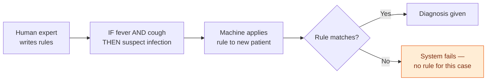
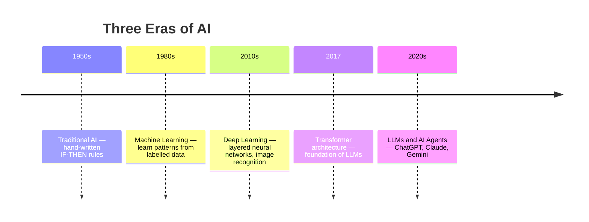
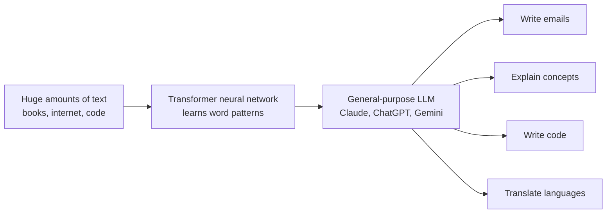
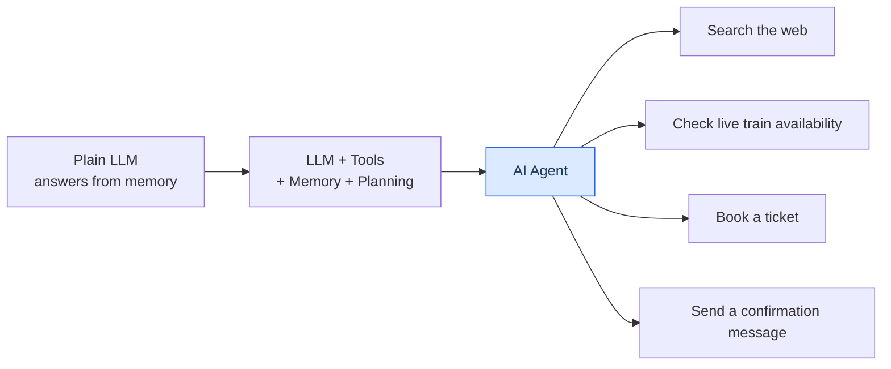
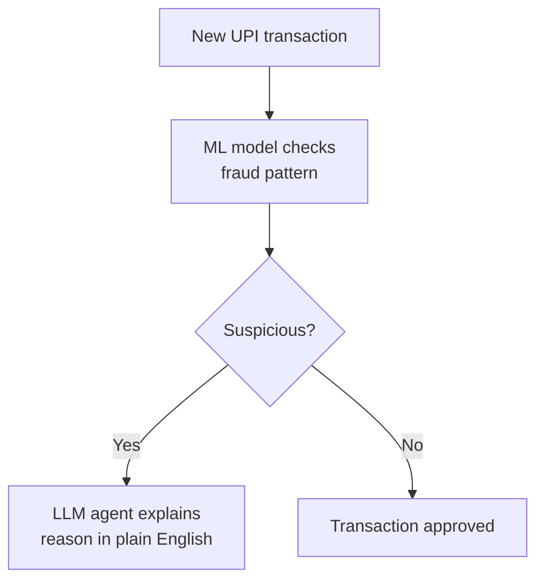

# A Brief History of AI

---

## Learning Objectives

By the end of this topic, you should be able to:

- Explain the three major eras of AI — Traditional AI, machine learning, and deep learning
- Describe what makes a Large Language Model (LLM) different from earlier AI approaches
- Identify the key milestones that led to tools like Claude, ChatGPT, and Gemini
- Tell the difference between an LLM that only answers questions and an AI agent that takes actions
- Explain why the shift from Traditional AI to deep learning changed what AI could realistically do

---

## Overview

AI is not a single invention from one lab in one year. It is the result of roughly 70 years of trial, failure, and breakthrough. To understand why ChatGPT, Claude, and Gemini exist today — and why they behave the way they do — you need to know the three eras that led here.

Think of it like cricket. Test cricket came first (slow, structured, rulebook-heavy). Then One Day Internationals changed the game. Then T20 came along and changed everything again. Each format solved a different problem — and each had its own strengths and limitations. AI history followed the same arc: three different eras, each a response to what the previous one couldn't do.

The three eras:
- **Traditional AI** — teach it every rule by hand
- **Machine Learning** — let it find the rules itself from data
- **Deep Learning** — let it find extremely complex rules using layered networks

---

## Era 1 — Traditional AI (1950s–1980s): Write Every Rule by Hand

Early AI researchers tried to encode human knowledge as explicit IF-THEN rules. For example, a medical diagnosis system might contain:

> IF fever AND cough AND breathlessness THEN suspect respiratory infection

This is called **Traditional AI** — knowledge is written by hand as logical rules, by human experts.

**Why it existed:** At the time, this was the only tool researchers had. It gave us early "expert systems" used in medicine and chemistry — some of which actually worked well for narrow, well-defined problems.

**Why it broke down:** Real-world knowledge is enormous. You cannot hand-write rules for every possible sentence in every human language, every visual pattern in a photo, or every nuance of common sense. Imagine trying to write rules for every possible WhatsApp scam message — new ones appear every week. This limitation was so severe that AI funding nearly dried up twice. Historians call these periods the **"AI winters."**

---

## Era 2 — Machine Learning (1980s–2010s): Let the Computer Find the Rules

Instead of a human writing the rules, **machine learning (ML)** lets the computer discover patterns directly from data. You show it thousands of labelled examples — emails marked "spam" or "not spam" — and it learns the statistical pattern that separates the two, without a human writing an explicit rule.

**Why it worked:** As data became more available — the internet, digitised records, sensors — it became more practical to let algorithms learn from examples than to hand-write rules for every case.

**Real example — Gmail spam filter:**
Nobody at Google sat down and wrote "if email contains 'free lottery winner click now' mark as spam." Instead, Gmail was shown millions of emails already labelled spam or not spam by users, and the machine found the patterns itself. Today it catches spam you've never seen before — because it learned the underlying rule, not specific examples.

**Key insight:** ML systems improve as you give them more good-quality data — a very different mindset from Traditional AI's fixed rulebooks.

---

## Era 3 — Deep Learning (2010s–present): Many Layers, Much More Powerful

**Deep learning** is a more powerful form of machine learning that uses **neural networks** with many stacked layers to learn extremely complex patterns — recognising objects in photos, understanding speech, or predicting the next word in a sentence.

The big breakthrough came around 2012, when deep neural networks dramatically outperformed all older methods on image recognition. This success snowballed into everything we use today.

**Real example — Face ID on your iPhone:**
Face ID doesn't follow rules like "if nose width is between X and Y mm." It uses a deep neural network trained on millions of face photos that learned complex patterns of facial geometry. It works in the dark, with glasses, with a beard — because it learned the deep underlying pattern, not surface rules.

**Example — Tesla Autopilot:**
Tesla's self-driving system uses deep learning trained on billions of miles of real driving data. It learned to recognise pedestrians, read road signs, and predict other drivers' behaviour — none of which could have been hand-coded as rules.

| Term | Simple Meaning |
|---|---|
| **Traditional AI** | AI built from hand-written IF-THEN rules by human experts |
| **Machine Learning** | AI that learns statistical patterns automatically from labelled data |
| **Neural Network** | A model structured in layers of simple nodes, loosely inspired by the brain |
| **Deep Learning** | Machine learning using many-layered neural networks — powers LLMs and image recognition |

---

## The Rise of Large Language Models (LLMs)

A **Large Language Model (LLM)** is a deep learning model trained on enormous amounts of text — books, websites, articles, code — to predict, one token at a time, what text is likely to come next. In doing so, it learns to write, summarise, translate, reason about, and converse in human language.

**Why this is a big deal:**
Earlier AI systems were usually built for one narrow task — a model that recognised cats in photos couldn't also write an email. LLMs, trained on vast and varied text, turned out to be surprisingly **general-purpose**: the same model can draft an email, explain a concept, write code, and translate a sentence — without being separately built for each task.

**The key milestone — the Transformer (2017):**
Researchers discovered that a specific neural network design called the **Transformer** was extremely good at handling language because it could pay attention to relationships between words across an entire sentence or document at once.**This groundbreaking architecture was introduced by Google researchers in their landmark paper "Attention Is All You Need" (2017), marking one of the most significant contributions to modern AI.** Scaling these models up — more data, more computing power — kept producing better results. This "scaling" insight is the main reason LLMs improved so dramatically between 2018 and today.

**Examples of LLMs in action:**
- **ChatGPT** (OpenAI, USA) — first LLM to reach 100 million users in under 2 months, faster than Instagram or TikTok
- **Claude** (Anthropic, USA) — the model you're using right now in this program
- **Gemini** (Google DeepMind) — integrated into Google Search and Google Workspace
- **Llama** (Meta, open-source) — used by developers worldwide to build their own AI tools

---

## The Move to AI Agents

An **AI agent** is an AI system built around an LLM, given the ability to use **tools** (search the web, run code, query a database), **remember** relevant context, and **plan a sequence of steps** to accomplish a goal — rather than just answering a single question.

**Think of it this way:**
A plain LLM is like a brilliant friend who can only talk to you — they can't look anything up, click a button, or check a live database. An **agent** is that same friend, but now handed a phone, a laptop, and permission to actually go do things.

**Real example:**
You say to an AI agent: "Book my usual Friday train to Pune." It reads your calendar, checks IRCTC for availability, picks your preferred seat, and books it — all without you clicking anything. That is an agent. A plain LLM would just tell you how to do it yourself.

**Examples of AI agents:**
- **GitHub Copilot** — an agent that reads your code, understands what you're building, and writes the next function for you
- **Cursor** — an AI coding agent used by developers globally that can edit entire files based on a plain-English instruction
- **Claude** — an AI agent by Anthropic that can reason, write, analyse, and take actions across tasks and tools in natural language
- **Codex** — OpenAI's AI coding agent that can read, write, and execute code autonomously across entire repositories

---

## Real World Applications

**Banking / FinTech**
Fraud detection historically used classical ML (pattern-based scoring). Today, LLM-based agents are layered on top to explain *why* a transaction was flagged — in plain language — to a bank employee. Used globally by companies like Stripe, Razorpay, and Paytm.

---

## How to classify any AI system — ask three questions:
1. Are the rules hand-written by a person, or learned from data? → If hand-written: Traditional AI
2. If learned from data — is it a simple statistical pattern, or a many-layered neural network? → Simple: ML / Many-layered: Deep Learning
3. Does the system only respond, or does it also use tools and take multi-step actions on its own? → If the latter: AI Agent

---

## Key Takeaways

- AI history moved through three broad eras: **Traditional AI** (hand-written rules) → **Machine Learning** (learn patterns from data) → **Deep Learning** (learn very complex patterns using layered networks)
- Traditional AI failed to scale because real-world knowledge is too vast to hand-write as rules — this caused the historical "AI winters"
- **LLMs** are a deep learning breakthrough — general-purpose language models made practical by the **Transformer** architecture (2017) and by scaling up data and compute
- The newest chapter is the move from plain LLMs (answer-only) to **AI agents** (LLM + tools + memory + planning) that can take real multi-step actions
- Many production systems today still use older, simpler ML techniques where they fit better — cheaper, more predictable, easier to audit
- You are entering the field at a moment when agents are actively being redesigned and deployed — some of what you learn here is genuinely current-generation industry practice

> **Interview tip:** Being able to explain *why* deep learning succeeded where Traditional AI failed — data availability, compute power, and neural network design — signals strong foundational understanding. Most freshers can't answer this. You now can.
