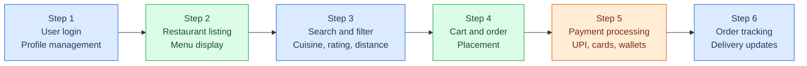
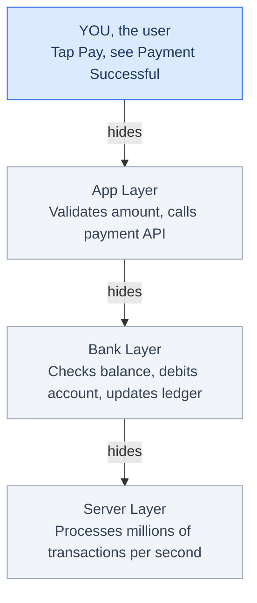
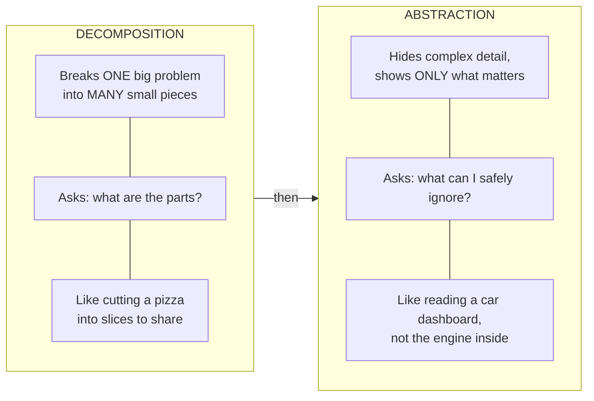

# Problem-Solving Foundations 

## Learning Objectives

_By the end of this topic, you will be able to:_

- Explain what decomposition and abstraction mean.
- Identify the smaller sub-problems hidden inside any large, messy problem.
- Understand why abstraction is necessary when building apps used by millions.
- Tell the difference between decomposition (breaking apart) and abstraction (hiding detail).
- Apply both concepts to a real scenario, step by step.

## Overview

Every big problem feels overwhelming when you look at it all at once. _"Build an app like Swiggy"_ sounds huge and scary. But no engineer - or AI - solves a big problem in one jump. They always **break it down first.**
This topic teaches two foundational skills that every engineer uses every single day. **Decomposition** is the skill of splitting a large problem into smaller, manageable pieces. **Abstraction** is the skill of hiding complexity - showing only what matters to each person.
These two ideas are the starting point of **computational thinking** - the way engineers (and AI systems) approach any problem. Master them here, and every other topic in this programme becomes easier.

## Decomposition - Breaking a Big Problem into Smaller Pieces

**What Is It?**
Decomposition means **splitting one big, complex problem into smaller, self-contained sub-problems** - each of which is easy enough to understand, build, and test on its own.When each of those sub-problems is built as a clean, reusable block, that property is
called modularity.

🍕 **Think of it like this:** You cannot eat an entire pizza in one bite. But cut it
into 8 slices and eat one at a time — easy. Decomposition is cutting the pizza.
Modularity is the fact that each slice is self-contained — you can pick up one slice
without the whole pizza falling apart.

**Example - How Swiggy Was Built**

"Build a food delivery app like Swiggy" sounds overwhelming as one task. Watch what happens when you decompose it:

Six clear sub-problems. Each one is small enough to build and test on its own — and
different engineers can work on different steps at the same time. That is decomposition.

And notice — the payment module built for Swiggy can be picked up and plugged into
Zomato or Blinkit tomorrow without rewriting it from scratch. That reusability is
modularity. The two ideas go hand in hand: decomposition breaks the problem apart,
modularity ensures each piece stands on its own.

**Rules for Good Decomposition**

- Each sub-problem must be **independent enough** - it can be worked on and tested without waiting for the others.
- Each sub-problem must be **small enough to fully understand**, but not so tiny that you end up with hundreds of meaningless fragments.
- Put all the pieces back together - they must **fully solve the original problem.** Nothing from the original request should go missing.

**Common Mistakes**

- Too shallow: Sub-problems are still too big and vague. Example: writing 'handle payments' without specifying what that involves - UPI? Cards? Wallet? Failure cases?
- Too deep: Broken into such tiny fragments you lose sight of the goal. Example: making 'validate the first digit of the phone number' a separate step.
- Incomplete: The sub-problems combined don't cover the whole original request - some part has been forgotten.

## Abstraction - Showing Only What Matters

**What Is It?**
Abstraction means **hiding all the complicated internal details** and showing only what is relevant to the person using the system right now. The hidden complexity does not disappear - it is simply kept out of sight until someone needs it.
**Think of it like this:** When you use an ATM, you press 'Withdraw ₹500' and get your cash. You never see the bank's servers, the account balance check, or the cash-dispensing mechanics. All that complexity is hidden underneath a simple interface. That is abstraction.

**Example - A UPI Payment**

When you tap _'Pay ₹200'_ on Google Pay and see **'Payment Successful ✅'**, a lot is happening that you never see. Here is how the same action looks at each layer:

Each layer hides the one below it. You see only the top layer. The app developer sees the top two. The bank's engineering team sees all four. **Same system, completely different views - that is abstraction.**

**Rules for Good Abstraction**
- Always **decompose first**, then decide what to abstract. You cannot hide detail sensibly until you know what the parts are.
- Match the abstraction to your **audience.** A user needs simplicity. A developer maintaining the system needs more detail visible.
- When giving a task to an AI system, **decide clearly** what the AI needs to know and what it can treat as 'already handled'.

**Common Mistakes**
- Over-abstracting: Hiding details the user actually needs. Example: showing only 'Payment Failed' without saying why - was it the wrong PIN? Expired card? Insufficient balance? The user is stuck.
- Under-abstracting: Showing too much internal detail. Example: displaying a raw database error message ('NullPointerException at line 42') instead of a friendly 'Something went wrong, please try again.'

## Decomposition vs. Abstraction - How They Differ

These two concepts work together, but they answer completely different questions. Here is a clear side-by-side view:

| **Aspect**          | **Decomposition**                                 | **Abstraction**                                       |
| ------------------- | ------------------------------------------------- | ----------------------------------------------------- |
| Core action         | Splits a big problem into smaller pieces          | Hides unnecessary detail from a viewer                |
| Question it answers | "What are the parts of this problem?"             | "What detail can I safely ignore right now?"          |
| Direction           | Breaks a whole apart                              | Simplifies one part for a specific audience           |
| App example         | Breaking Swiggy into: browse → cart → pay → track | Showing 'Order Placed ✅' instead of database logs    |
| When to use         | At the start - before you build anything          | After decomposing - to decide what each audience sees |
| Used together?      | Yes - always decompose first                      | Yes - then abstract each piece for its audience       |

**Quick memory trick:** Decomposition = cutting the pizza into slices. Abstraction = putting each slice in a box so the delivery person does not need to see the whole kitchen.

## Key Takeaway

**Decomposition =** Break one big, overwhelming problem into smaller, independently solvable sub-problems.

**Abstraction =** Hide unnecessary complexity and show only what is relevant to each person at each level.

- **Decomposition answers:** "What are the parts of this problem?"
- **Abstraction answers:** "What detail can I safely ignore right now?"
- Always decompose first - you cannot abstract sensibly until you know what the parts are.
- Good decomposition: sub-problems are independent, sized appropriately, and together cover the whole problem.
- Good abstraction: matches the audience - users need simplicity; developers need enough detail to build and debug.
- Both mistakes - over-abstracting and under-abstracting - make systems harder to use. Find the right level.

**Interview tip:** If you are ever asked to design a system, start by saying: 'Let me first decompose this problem.' Then for each part, describe what you would abstract away from the end user. This immediately demonstrates computational thinking - a skill most freshers do not show.

## References
- [BBC Bitesize: Introduction to Computational Thinking](https://www.bbc.co.uk/bitesize/guides/zp92mp3/revision/1)
- [Google for Education: Exploring Computational Thinking](https://www.google.com/edu/resources/programs/exploring-computational-thinking/)
