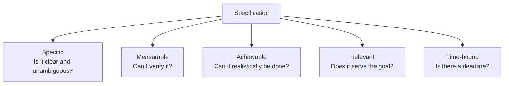
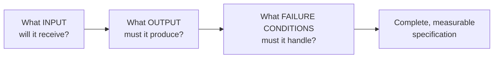
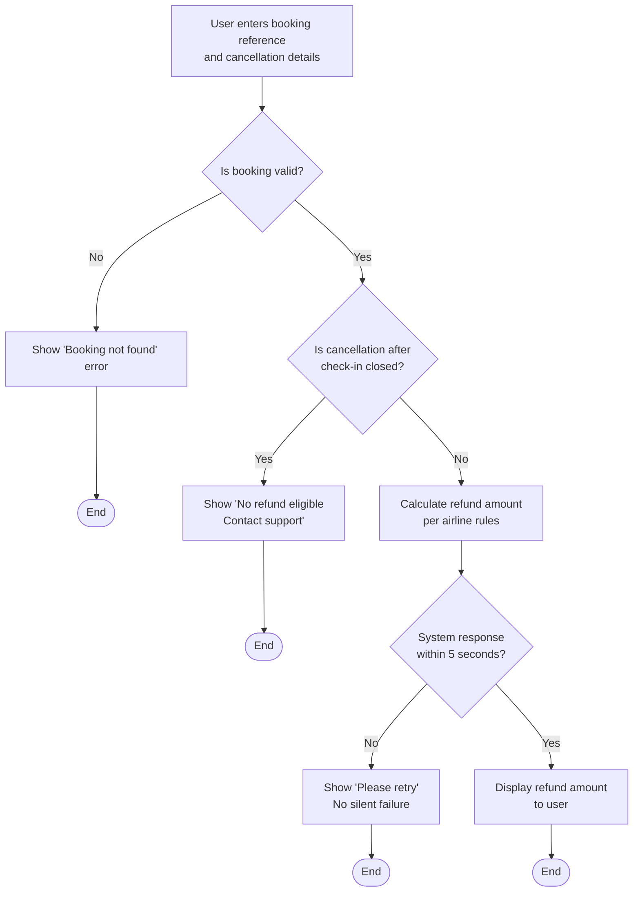

# What Makes a Good Specification

---

## Learning Objectives

By the end of this topic, you should be able to:

- Explain what a specification is and why it is the most important skill for anyone who directs AI to do work
- Identify the five properties of a good specification — Specific, Measurable, Achievable, Relevant, Time-bound (S.M.A.R.T.)
- Tell the difference between a vague, weak specification and a precise, professional one
- Break any task down into its inputs, expected outputs, and failure conditions before asking AI to do it
- Write a well-formed specification for a simple real-world task
- Look at an existing specification and spot what is missing from it

---

## Overview

You already know that AI systems are probabilistic — they generate the most *likely* answer, not a guaranteed one. That single fact leads to the most important skill in this entire program: **if you don't tell an AI system precisely what you want, it will guess — and its guess may not match what you actually needed.**

Think about ordering a ride on an app like Uber. If you just type "get me a car," the app has no idea what to do. But the moment you say "Send a 4-seater car to 123 Main Street, drop me at Central Airport by 8:00 AM" — it knows exactly what to do. That second instruction is a specification.

A **specification** (often called a "spec") is a clear, precise description of what you want a system to do, written *before* you ask the AI to build or do anything. The AI cannot write a good spec for you — only you know what "good" actually means for your problem. Every time an AI does the wrong thing, it almost always traces back to a spec that was incomplete, vague, or unmeasurable.

---

## What Is a Specification?

A specification is a written description of a task that states exactly:
- what input the system will receive
- what output it must produce
- what should happen when something goes wrong

It must be precise enough that two different people — or two different AI systems — reading it would build the *same* thing.

Human language is naturally vague. If you tell a friend "get me something to eat," they might bring you biryani, a sandwich, or biscuits — all technically valid. That looseness is fine between friends, but it fails badly when you're directing a powerful, literal system that acts on your exact words. A specification removes the vagueness *before* the work begins, not after you're disappointed with the result.

---

## The Five Properties of a Good Specification (S.M.A.R.T.)

A specification is only useful if it has all five of these properties. Miss even one and you open the door to a result you didn't want. Memorise them as **S.M.A.R.T.**

**Specific** — the instruction is clear, detailed, and unambiguous, leaving no room for interpretation. Ask yourself: "Does this describe exactly what needs to be done, with no vagueness?"
- Not specific: "make it engaging."
- Specific: "open with a question directed at the reader and use no sentence longer than 20 words."

**Measurable** — you can check, with a clear yes or no, whether the output meets the requirement using concrete criteria. Ask yourself: "Can I measure or count something to verify this was done correctly?"
- Not measurable: "summarise this report."
- Measurable: "summarise this report in five bullets, under 100 words total."

**Achievable** — the task is realistic and within the system's capabilities, given the available inputs and constraints. Ask yourself: "Can the system actually accomplish this with what it has?"
- Not achievable: "predict the exact stock price of Reliance tomorrow."
- Achievable: "analyse the last 30 days of Reliance stock data and list the three most significant price changes with dates."

**Relevant** — the instruction directly serves the actual goal or problem you are trying to solve. Ask yourself: "Does this task actually contribute to what I need?"
- Not relevant: "add a joke to the error message for a banking app."
- Relevant: "show the specific failure reason — insufficient balance, bank server down, or incorrect PIN — so the user knows what to fix."

**Time-bound** — the task has a clear deadline or time constraint that defines when it must be completed or how fast it must respond. Ask yourself: "Does this specify when it must be done or how quickly it must happen?"
- Not time-bound: "send an alert when attendance is low."
- Time-bound: "send an email alert every Friday at 6 PM to any student whose attendance falls below 75%."

**Real-life analogy:** Imagine giving shipping instructions for an online order. "Send it somewhere in New York" is not specific, measurable, achievable, relevant, or time-bound — the courier has no idea if they've succeeded. "Deliver to Apartment 4B, 123 Market Street, New York, NY 10001, by Friday 5:00 PM" gives them everything they need — it's specific (exact address), measurable (you can verify delivery), achievable (it's a valid address), relevant (it's the right destination), and time-bound (by Friday). That is a specification.

**Remember it as S.M.A.R.T.**

Think of it like ordering at a coffee shop:
- **Specific** — "1 large iced caramel latte with oat milk" not just "give me coffee"
- **Measurable** — did you get the exact size, flavor, and milk type requested?
- **Achievable** — the barista actually has those ingredients in stock
- **Relevant** — the drink matches what you actually want to drink
- **Time-bound** — "ready for pickup in 5 minutes" sets a clear deadline

---

## Bad Spec vs Good Spec

This is the most common beginner mistake — writing a wish instead of a specification.

**Bad specification:** *"Make it better."*

This fails all five properties:
- Not specific — "better" in what way exactly?
- Not measurable — "better" according to what measure?
- Not achievable — without clarity, the system cannot determine what to do
- Not relevant — we don't even know if "better" addresses the actual problem
- Not time-bound — no deadline or time constraint is given

**Good specification:** *"Rewrite this paragraph at a Grade 8 reading level, using simple sentences, keeping the meaning unchanged, in no more than 80 words, within 2 minutes."*

This passes all five:
- Specific — "rewrite," "Grade 8 level," "simple sentences," "keep meaning unchanged" are precise instructions
- Measurable — you can run a readability check and count the words
- Achievable — the AI can realistically rewrite a paragraph under these constraints
- Relevant — rewriting for clarity directly serves the goal of making content accessible
- Time-bound — the 2-minute constraint sets a clear completion window

**More real-world examples you'll actually relate to:**

**Bad specs ❌**
- "Make the order confirmation message nicer."
- "Warn students who are missing too much class."
- "Handle failed credit card payments well."

**Good specs ✅**
- "Rewrite the order confirmation SMS to be under 160 characters, include the order ID and expected delivery time, and use a friendly but professional tone."
- "Send an email alert to any student whose attendance falls below 75% in any subject, listing the subject name and current percentage, sent every Friday at 6 PM."
- "If a credit card payment fails, show the user the specific reason — insufficient funds, expired card, or incorrect CVV — within 3 seconds, and offer a Retry button."

---

## Inputs, Expected Outputs, and Failure Conditions

Every good specification, no matter the domain, breaks into three parts. Ask these three questions before specifying any task:

- **Input** — what information does the system start with? For example: a student's marks, a scanned ID card, a customer's order details
- **Expected output** — what exact result must come out the other end? For example: a confirmation SMS, an approval or rejection decision, a formatted report
- **Failure conditions** — what could go wrong, and what should happen in each case? A specification that only describes the "happy path" — when everything goes right — is an incomplete specification. Real systems fail in real ways, and your spec must say what correct failure behaviour looks like too

**Worked breakdown — Airline ticket cancellation:**

- Input: booking reference (PNR), cancellation date, ticket fare, fare type (refundable/non-refundable)
- Expected output: refund amount calculated per airline cancellation rules, displayed to the user within 5 seconds
- Failure conditions: invalid booking reference → show "Booking not found" error; cancellation after check-in closed → show "No refund eligible, contact support"; system timeout → show "Please retry" with no silent failure

### Rules for a Good Specification

- Always write the specification down in text — do not keep it in your head. A written spec can be reviewed, tested, and reused
- Write the failure conditions *before* you ask the AI to build anything — most real-world bugs come from unhandled failure cases, not the happy path
- Keep specifications as short as possible while still being complete — a bloated spec is as hard to verify as a vague one

### Common Beginner Mistakes

- Writing goals instead of specifications — "improve user experience" instead of a concrete, measurable instruction
- Forgetting to define what "done" looks like — without a measurable success criterion, you cannot verify the AI's output
- Specifying only the happy path and being surprised when edge cases produce bad results

---

## Key Takeaways

- A specification is a precise, written description of a task — input, output, and failure conditions — given to an AI system before it starts working
- A good specification is **Specific, Measurable, Achievable, Relevant, and Time-bound** — remember it as **S.M.A.R.T.**
- "Make it better" is a wish, not a specification. "Rewrite at Grade 8 level, max 80 words" is a specification
- Every task specification must cover three parts: **input → expected output → failure conditions**
- Specifying only the happy path and ignoring failure conditions is one of the most common and costly beginner mistakes
- Writing specifications is a 100% human responsibility — the AI cannot write its own requirements
- This skill directly connects to everything you build later in this program — a vague spec guarantees a useless AI output

## References
- [Atlassian: How to write SMART goals (with examples)](https://www.atlassian.com/blog/productivity/how-to-write-smart-goals)
- [MindTools: SMART Goals - How to Make Your Goals Achievable](https://www.mindtools.com/a4wo118/smart-goals)
