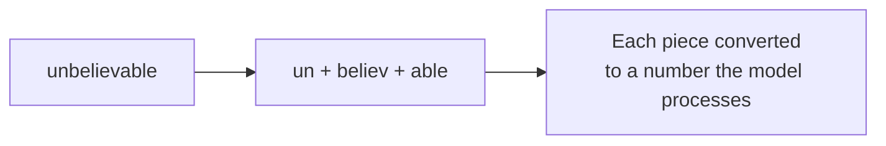
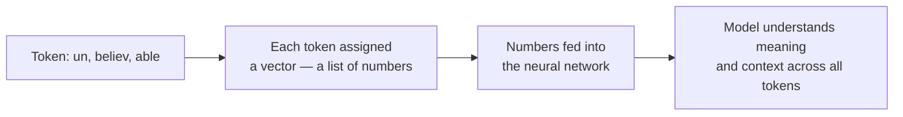
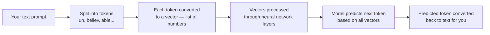
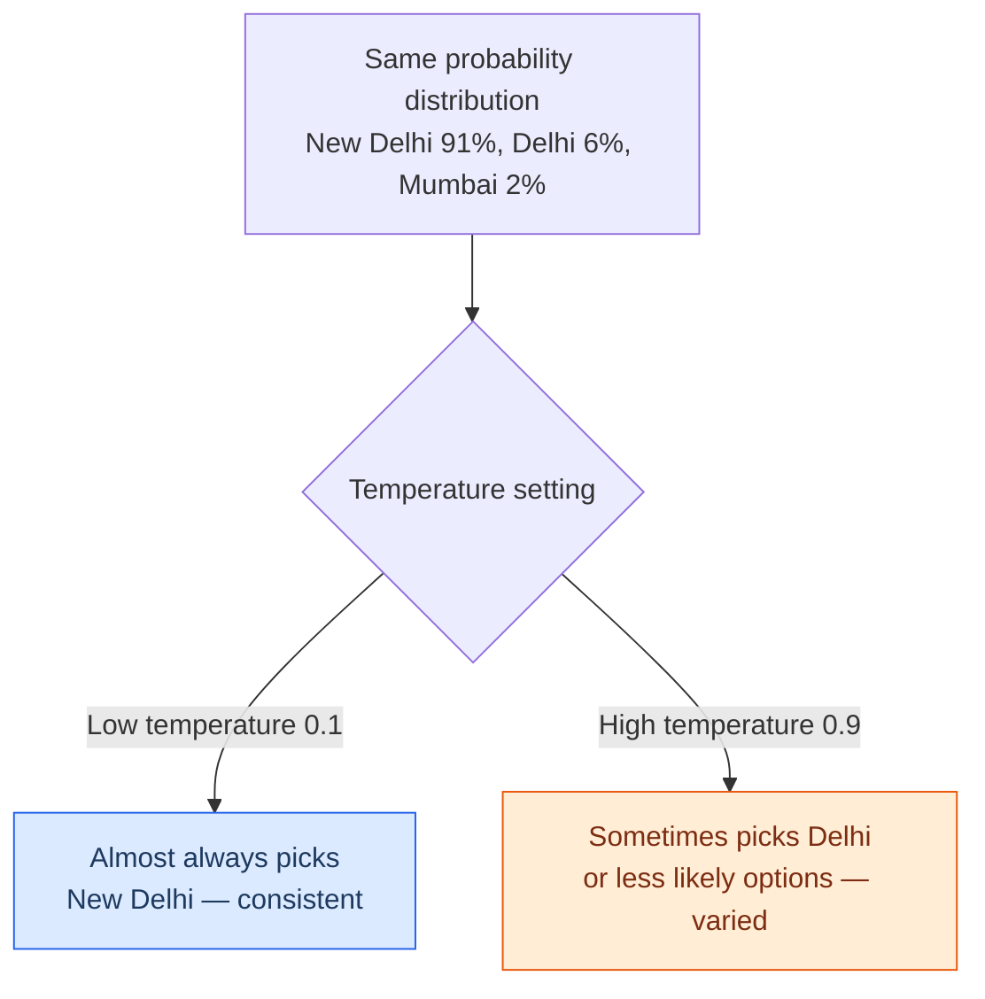

# How LLMs Work


---

## Learning Objectives

By the end of this topic, you should be able to:

- Explain what a token is and why LLMs process text as tokens rather than whole words
- Describe how tokens are converted into vectors and why this allows the AI to understand meaning
- Describe the difference between training and inference in an LLM's lifecycle
- Explain what parameters are and why they matter — but also why they're not everything
- Explain how temperature controls how predictable or varied an LLM's output is
- Decide when to use low vs high temperature for a real task

---

## Overview

You already know that LLMs are probabilistic — they don't look up one fixed answer, they predict the most likely next piece of text. This topic goes one level deeper and explains the actual machinery behind that behaviour.

Think of it like understanding how a car works. You don't need to be a mechanic to drive — but knowing what a gear does, what fuel the engine needs, and what the temperature gauge means makes you a much better driver. Same here. Understanding **tokens, training, parameters, and temperature** makes you a much better AI engineer — you stop treating the model as a magic black box and start making informed decisions about how to use it.

---

## Tokens — How LLMs Actually Read Text
A **token** is the small chunk of text an LLM actually reads and generates. It is not a whole word. It is not a letter. It is something in between — a short word, part of a longer word, a punctuation mark, or even a number fragment.
When you type something to Claude or ChatGPT, the AI doesn't read it the way you do — word by word. It breaks your text into tiny pieces called tokens before processing it.
Think of it like this. When you read the word "unbelievable," your brain reads it as one whole word. But the AI breaks it into smaller chunks — something like "un," "believ," and "able" — and processes each piece separately.



**Why tokens exist:**
This is actually smart design. Because of tokens, the AI can handle words it has never seen before — new slang, spelling mistakes, words from other languages — by combining familiar smaller pieces. Without this, the AI would need a dictionary containing every possible word that could ever exist in any language. That's impossible.

---

### From Tokens to Numbers — How Vectorization Works:

Once your text is broken into tokens, the AI still can't process raw words or letters — computers only understand numbers. This is where **vectorization** comes in.
 
Each token is converted into a **vector** — a list of numbers that represents its meaning. Think of a vector like a GPS coordinate for meaning. Every word gets its own coordinate in a giant mathematical map. Words that are similar in meaning end up close together on that map. Words that are unrelated end up far apart.
 
**A simple example using music taste:**
 
Imagine you describe two people's music taste using numbers — pop score, rock score, classical score:
 
```
Ananya = [9, 5, 1]   — loves pop, likes rock, dislikes classical
Kabir  = [8, 6, 2]   — very similar taste to Ananya
```
 
These two people have vectors that are mathematically close — a music app would confidently recommend the same songs to both. Now add a third person:
 
```
Ravi = [1, 2, 9]    — loves classical, dislikes pop and rock
```
 
Ravi's vector sits far away from Ananya and Kabir. The app would recommend completely different music to Ravi.
 
**LLMs work the same way with words.** The words "king" and "queen" end up with vectors that are very close — because they share similar meaning, context, and usage in text. But "king" and "bicycle" end up far apart. This is what allows the AI to understand *meaning*, not just match exact words.
 

 
**The full journey of your text inside an LLM:**
 

 
It's why when you ask about "a car," the AI also understands you might mean "vehicle" or "automobile" — because their vectors are mathematically close on the meaning map.
 
---

**Why this matters to you practically:**
- **Longer messages cost more.** AI tools charge based on how much text you send and receive — not per message. Think of it exactly like mobile data. Sending a one-line question is like loading a webpage. Sending a 10-page document for AI to read and summarise is like streaming a movie. The more text, the more it costs. This is why apps like ChatGPT have free limits and paid plans — they're literally paying per token behind the scenes.
- **AI has a short-term memory limit.** Imagine you're having a long conversation with someone, but they can only remember the last 20 messages — anything before that is gone from their memory. That's exactly how AI works. Every model has a maximum amount of conversation it can hold in its head at one time. Once that limit is hit, the earlier parts simply disappear from its view. This is why in a very long chat, the AI sometimes seems to "forget" something you told it an hour ago — it's not being careless, it genuinely cannot see that part of the conversation anymore.
- **AI sometimes stops mid-sentence — and that's normal.** There's also a limit on how much the AI can write in one go. If a response is very long, it can hit that limit and just stop — even in the middle of a sentence. It hasn't crashed. It hasn't confused itself. It simply ran out of writing space. The fix is easy — just type "continue" or "keep going" and it will pick up from where it left off.

> **Quick rule of thumb:** 1 token ≈ 0.75 words in English. So 1,000 words ≈ about 1,300 tokens.

---

## Training vs Inference — Learning vs Doing

An LLM has two completely separate phases in its life. Most people confuse them.

**Training** is the one-time, extremely expensive process where the model reads enormous amounts of text and gradually adjusts its internal settings until it gets good at predicting the next token. Think of it like a student going through 4 years of BTech — long, resource-intensive, happens once.

**Inference** is what happens every single time *you* use the model. You send a prompt, the already-trained model uses everything it learned to predict the response, token by token. Think of it like that same student, now fully educated, answering your question in a job interview — fast, using knowledge already built up, without re-studying for your specific question.

| Aspect | Training | Inference |
|---|---|---|
| When it happens | Once per model version | Every time you send a message |
| Cost | Extremely high — massive compute, huge datasets | Much smaller per request |
| What changes | Model's internal parameters are adjusted | Nothing changes — model just uses what it learned |
| Analogy | Student studying for 4 years of BTech | Same student answering in a job interview |

> **Important:** When you chat with Claude or ChatGPT, you are using **inference**. The model is not learning from your conversation in real time. Its underlying knowledge does not change because you talked to it. This is why Claude doesn't "remember" your previous conversations unless you explicitly give it that context.

**Example:** GPT-4 (OpenAI) reportedly cost over $100 million to train. That training happened once. Every time someone uses it — millions of times a day — that is inference, which costs a tiny fraction per request.

---

## Parameters — The Model's Internal Settings

**Parameters** When an AI model learns from data during training, it doesn't store information the way your phone stores photos. Instead, it adjusts billions of tiny internal numbers — called parameters — until it gets good at understanding and generating text. Think of parameters as the AI's "experience," baked in as numbers.

A simple way to picture it: imagine you're learning to ride a bike. Every time you wobble and correct yourself, your brain fine-tunes your balance. Do this thousands of times and it becomes muscle memory — you don't think about it anymore, you just ride. Parameters are the AI's version of that muscle memory, built up over millions of examples during training.

**Why more parameters generally help:**
More parameters give the model more "capacity" to capture subtle, complex patterns — which is part of why larger models tend to perform better on difficult reasoning, coding, and writing tasks.This is why you'll hear people compare AI models by size:

- GPT-3 — 175 billion parameters
- Llama 3 (Meta, open source) — comes in 8B, 70B, and 405B versions
- Claude — Anthropic doesn't publicly share the exact number

Bigger generally means more capable — but only up to a point.

**But bigger is not always better**

Think about two students preparing for the same exam. One has studied for 4 years but used bad notes and never practised properly. The other studied for 2 years but used great material, solved past papers, and got good feedback throughout. The second student will almost certainly do better — even though they "studied less."

AI models work the same way. A smaller model trained on better, more diverse data — and fine-tuned carefully — can easily beat a much larger model that was trained carelessly.

**Real example:**
Meta's Llama 3 with just 8 billion parameters outperformed GPT-3 which had 175 billion parameters on several tests. More parameters, worse result — because the training quality and design mattered more than the size.

**The takeaway:** Parameter count is like a phone's RAM — more generally helps, but it's not the only thing that matters. A phone with less RAM but a better processor and optimised software will outperform a phone with more RAM but poor software every time.

---

## Temperature — The Creativity Dial

**Temperature** is a setting (usually a number between 0 and 1, sometimes higher) that controls how "adventurous" the model is allowed to be when picking the next token.
Every time you ask an AI a question, it doesn't just pick one answer and go with it. Behind the scenes, it calculates the probability of many possible next words and then picks one based on those probabilities.
Think of it like a multiple choice question where the AI assigns a confidence score to each option:

**Prompt: "The capital of India is ___"**

- New Delhi — 91% confident
- Delhi — 6% confident
- Mumbai — 2% confident
- Something else — 1% confident

Now here's the interesting part. Does the AI always pick the option it's most confident about? Not necessarily — and that's where temperature comes in.

**Temperature is simply a dial that controls how strictly the AI sticks to its most confident answer.**



- **Low temperature (closer to 0)** — the model almost always picks the most likely next token. Output is consistent, predictable, near-deterministic. Good for facts, code, structured data.
- **High temperature (closer to 1 or above)** — the model is more willing to pick lower-probability tokens. Output is more varied and "creative" — but also more likely to go off-track.

> Temperature changes **how** the model samples — not **what** it knows. A fact-based question asked at high temperature can still get a correct answer, just possibly phrased differently each time.

| Aspect | Low Temperature | High Temperature |
|---|---|---|
| Predictability | High — near-deterministic | Low — output varies more |
| Best for | Factual Q&A, code generation, data extraction | Creative writing, brainstorming, ad copy variants |
| Risk | Can feel repetitive or rigid | Higher chance of odd or incorrect phrasing |

**Real examples:**
- **GitHub Copilot** (global) — uses low temperature so generated code is consistent and predictable
- **Jasper AI / Copy.ai** (global marketing tools) — use higher temperature to generate varied ad copy options for A/B testing
- **Customer support bots** (Flipkart, Amazon) — low-to-moderate temperature, balancing natural replies with consistent, on-policy answers

You will explore temperature and how to tune it for different tasks later in this program — including the math behind how it works. For now, the one thing to hold onto is this: **an LLM's core behaviour is probabilistic by design, not by accident or flaw.** It is not broken when it gives you two different answers — it is working exactly as intended.

---

## Worked Example — Food Delivery App Feature

**Scenario:** You're building AI features for a Swiggy-style food delivery app. Choose the right temperature for each feature:

| Feature | Recommended Temperature | Why |
|---|---|---|
| Extract delivery address and pin code from a customer's free-text message | Low (0.1–0.2) | Needs precise, consistent structured output — no room for creative variation |
| Generate 5 different "your order is delayed, sorry!" messages for A/B testing | High (0.7–0.9) | Variety across the 5 messages is the actual goal |
| Answer "What is your refund policy?" using the official policy document | Low-to-moderate (0.2–0.3) | Wording can vary slightly, but factual policy content must stay accurate |
| Suggest personalised restaurant recommendations for a returning user | Moderate (0.5–0.6) | Some variety is good — but recommendations should still be relevant |

**How to decide:** Ask two questions — does this task need the same answer every time (→ low temperature), or does it benefit from variety (→ high temperature)? Then check — is factual accuracy critical? If yes, lean lower regardless.

---

## Key Takeaways

- **Tokens** are the small text chunks LLMs actually read and generate — not whole words. AI pricing and limits are measured in tokens, not words
- Each token is converted into a **vector** — a list of numbers that places it on a meaning map where similar words end up close together and unrelated words end up far apart
- This is what allows AI to understand meaning, not just match exact words — "car," "vehicle," and "automobile" all land close together on the meaning map
- **Training** is the one-time, expensive process of learning patterns from data. **Inference** is the fast, repeated process of using the already-trained model on your prompts
- When you chat with Claude, you are doing inference — the model is not learning from your conversation in real time
- **Parameters** are the model's internal learned settings — more generally means more capacity, but data quality and architecture matter just as much
- **Temperature** controls how strictly the model sticks to the most likely next token — low means consistent, high means varied
- Temperature changes *how* the model samples — not *what* it knows

> **Interview tip:** Being able to explain temperature as "same probability distribution, different sampling strictness" — rather than just "temperature = randomness" — shows real understanding of how LLMs work. Most freshers can't explain it this precisely. You now can.
