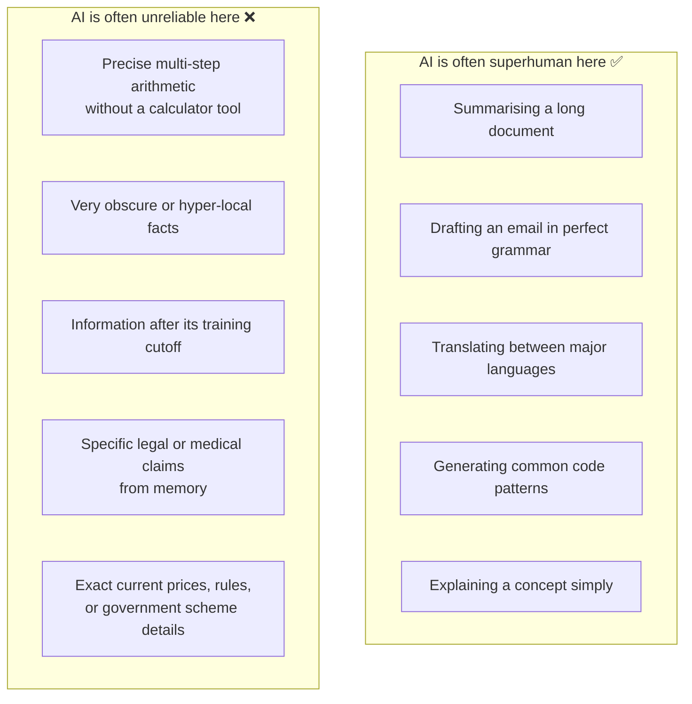

# The Jagged Frontier and Model Families

---

## Learning Objectives

By the end of this topic, you will be able to:

- Explain the "jagged frontier" — why AI can be superhuman at some tasks and surprisingly unreliable at others that seem equally simple
- Identify which types of tasks AI handles reliably and which ones it struggles with
- Explain why the right tools and setup can shift an unreliable task toward reliability
- Name the four major AI model families in use today — Claude, GPT, Gemini, and open-weight models
- Explain what makes each model family different in terms of strengths, use cases, and access model
- Choose the right model family for a given task based on evidence, not habit

---

## Overview

You now understand how LLMs work under the hood — tokens, training, inference, and parameters. This topic tackles the next practical question: **now that you know how AI works, how do you know when to trust it — and which AI to use?**

Two ideas shape your answer:

- **The jagged frontier** — AI is not equally good at everything. It can be superhuman at some tasks and surprisingly bad at others that seem just as simple. The tricky part is that this unevenness is hard to predict just by looking at the task.
- **Model families** — there is not one AI. There are several major families built by different companies, each with different strengths, weaknesses, and best use cases. Choosing the right one for your task is a professional skill.

Master both ideas and you move from someone who "uses AI" to someone who deploys it intelligently.

---

## The Jagged Frontier

AI is not equally good at everything. It can be superhuman at some tasks and shockingly bad at others that seem just as simple — or even simpler. This uneven, unpredictable skill profile is called the **jagged frontier**.

**The analogy:** Think of a classmate who scores 98 in English and 95 in History but somehow fails Basic Maths. You wouldn't have predicted that from the outside. AI has the same kind of uneven ability — just in different areas, and for very different reasons.

**Why this happens:**
An LLM learns from patterns in its training data. If it has seen millions of similar examples, it usually performs well. If a task requires exact arithmetic, uncommon facts, or genuinely new reasoning, it is more likely to make mistakes — because it is predicting likely words, not computing the way a calculator does.

**Three things to know about the jagged frontier:**

- **It doesn't follow human intuitions about easy vs hard.** A task that seems trivial to a person might trip up AI, while a task that seems complex might be handled brilliantly. Always test — never assume.
- **It shifts as AI improves.** A task that one model version struggles with may work perfectly in the next version. Always test on the specific model you are actually using.
- **The right setup changes the outcome.** Giving AI tools like a calculator, a web search, or a relevant document can turn an unreliable task into a reliable one.

**Real example — the calculator problem:**
Ask Claude "what is 1,847 × 293?" and it might get it wrong — not because it is "bad" at maths, but because multi-step precise arithmetic is not suited to next-token prediction. Give the same Claude a calculator tool, and it gets the right answer every time. Same model. Completely different reliability. The only change was the setup.

**Real example — the lawyer hallucination:**
A US lawyer used ChatGPT to research case precedents. ChatGPT invented several court cases that never existed — complete with case names, judges, and rulings. The lawyer submitted them to court and was fined $5,000. This is the jagged frontier in a high-stakes context: GPT is excellent at drafting legal prose, but deeply unreliable at recalling specific case facts from memory.

### Common Beginner Mistakes

- **Assuming similar-sounding tasks have similar reliability.** Just because AI writes excellent legal English does not mean it can accurately recall specific legal clauses. Test each task type separately.
- **Trusting one correct answer as proof of reliability.** If the AI gets a question right once, that does not mean it will always get similar questions right. Test multiple examples before trusting it on a real task.
- **Treating reliability as fixed.** A task that feels unreliable today may be reliable in a newer model version — and vice versa. Always test on the version you are deploying.

---

## Model Families — Who Makes What, and How Are They Different?

By now you know that LLMs are powerful AI systems that can read, write, summarise, and reason. But there is not just one AI. There are several major AI model families, each built by a different company, each with its own strengths, personality, and best use cases.

**The analogy:** Think of it like smartphones. There is not just "a phone" — there is Apple iPhone, Samsung Galaxy, Google Pixel, and OnePlus. They all make calls and run apps, but they have different designs, operating systems, and strengths. You pick the right one for your needs. AI models work the same way.

As of 2026, the four major model families you will encounter in the workplace are:

---

### 1. Claude — Built by Anthropic

**The analogy:** Claude is like a thoughtful, careful senior colleague — someone who reads everything twice before answering, flags risks you didn't notice, and always explains their reasoning.

**What it is:**
Claude is built by Anthropic, a company founded with a specific focus on making AI that is safe, honest, and reliable. It is the AI you are using throughout this programme.

**What it is especially good at:**
- Long, complex documents — Claude can read and reason over very long texts without losing track
- Tasks where careful, nuanced reasoning matters — legal drafts, policy analysis, detailed summaries
- Following precise instructions — if you write a detailed specification, Claude follows it closely
- Honesty about uncertainty — Claude is more likely to say "I'm not sure" than to confidently guess

**Real example:**
A legal tech company in the UK uses Claude to review 200-page contracts and flag clauses that deviate from standard templates — a task that would take a junior lawyer two full days. Claude completes it in minutes, with detailed explanations for every flagged clause.

**Limitation to know:**
Claude's responses can sometimes be longer and more careful than needed for a simple question. For quick, casual tasks, this thoroughness can feel slow.

---

### 2. GPT (ChatGPT) — Built by OpenAI

**The analogy:** GPT is like that popular, confident classmate who always has an answer ready — fast, fluent, and great in conversation. The most widely used AI in the world.

**What it is:**
GPT (Generative Pre-trained Transformer) is built by OpenAI. ChatGPT — the product built on top of GPT — was the tool that introduced most of the world to AI chatbots in 2022. GPT-4 and its successors remain among the most capable and widely deployed models globally.

**What it is especially good at:**
- General-purpose tasks — writing, summarising, explaining, coding, brainstorming
- Plugins and tools — ChatGPT connects to web search, code execution, and image generation
- Wide ecosystem — thousands of apps and businesses are built on the OpenAI API
- Conversational fluency — it feels natural and easy to talk to

**Real example:**
Khan Academy — the global free education platform used by over 150 million students — built an AI tutor called Khanmigo on top of GPT. Students in 190 countries can now ask questions, get step-by-step explanations, and practise problems with a patient AI tutor available 24/7.

**Limitation to know:**
Because GPT is so widely used and confident-sounding, users sometimes over-trust it. It hallucinates facts with the same confident tone it uses when correct — making errors easy to miss.

---

### 3. Gemini — Built by Google DeepMind

**The analogy:** Gemini is like a colleague who is always connected to the internet and the full Google library — excellent at finding current information and understanding images, audio, and text together.

**What it is:**
Gemini is Google's family of AI models, developed by Google DeepMind. It is built into Google Search, Google Docs, Gmail, and Android — meaning billions of people already interact with it daily without realising it.

**What it is especially good at:**
- Multimodal tasks — Gemini can read text, understand images, analyse audio, and process video clips all at once. Most models only handle one at a time.
- Real-time information — deeply integrated with Google Search, it can access up-to-date information rather than relying only on training data
- Google Workspace integration — works seamlessly inside Docs, Sheets, and Gmail

**Real example:**
In Kenya, Google partnered with local health organisations to use Gemini-powered tools to analyse medical images and audio recordings from rural clinics — areas where specialist doctors are hours away. The system can flag potential issues from a photograph of a skin condition or a short voice recording describing symptoms.

**Limitation to know:**
Gemini's quality varies significantly across its different versions — Nano, Pro, and Ultra. Beginners sometimes try the basic version, find it underwhelming, and incorrectly write off the whole family.

---

### 4. Open-Weight Models — Llama, Mistral, and Others

**The analogy:** Open-weight models are like an open-source recipe that anyone can take home, cook in their own kitchen, and adjust however they like — no restaurant required.

**What they are:**
Claude, GPT, and Gemini are all **proprietary** — the companies control them, you access them via a paid API, and you never see or control the model itself. It is like ordering from a restaurant: you get the meal, but the recipe stays in the kitchen.

Open-weight models are different. Companies like Meta (who built **Llama**) and Mistral AI (who built **Mistral**) release the actual model weights publicly — the numbers that define what the model knows and how it thinks — for anyone to download and run.

**What this means in practice:**
- A hospital can run the model entirely on its own servers — patient data never leaves the building
- A startup with no budget can use a powerful model for free instead of paying per API call
- An engineering team can fine-tune the model on their own company data to make it a domain expert

**Real example:**
Mistral AI released the Mistral 7B model openly in 2023. Within weeks, developers worldwide had fine-tuned it for tasks ranging from Bengali-language customer support to legal document review in Portuguese — things the original model was never specifically trained for.

**Limitation to know:**
Running an open-weight model yourself requires technical infrastructure — servers, storage, and engineering time. For a small team just getting started, using a proprietary API is usually faster and cheaper.

---

### Model Families — Side by Side

| | **Claude** | **GPT / ChatGPT** | **Gemini** | **Open-Weight (Llama / Mistral)** |
|---|---|---|---|---|
| **Built by** | Anthropic | OpenAI | Google DeepMind | Meta, Mistral AI, and others |
| **Best known for** | Safety, long-document reasoning, careful instruction-following | General-purpose fluency, wide ecosystem, tools and plugins | Multimodal (text + image + audio), Google integration, real-time search | Free to use, fully customisable, runs on your own servers |
| **Typical use case** | Contract review, policy drafting, detailed analysis | Writing, coding, brainstorming, customer chat | Google Workspace tasks, image + text tasks, real-time information | Private data environments, cost-sensitive projects, domain fine-tuning |
| **Access model** | Paid API — claude.ai / Anthropic API | Paid API — ChatGPT / OpenAI API | Paid API — Google AI Studio / Gemini API | Free download — run it yourself |
| **Data privacy** | Managed by Anthropic | Managed by OpenAI | Managed by Google | Fully under your own control |
| **Global real-world example** | UK legal tech — 200-page contract review | Khan Academy AI tutor — 150M+ students in 190 countries | Kenya rural health — image and audio analysis at remote clinics | Mistral fine-tuned for multilingual customer support |

**Beginner-friendly way to remember:**
- Use **Claude** when you need careful, thorough reasoning on a complex or sensitive task
- Use **GPT** when you need a versatile, widely-supported tool for everyday tasks
- Use **Gemini** when you are working inside Google products or need to process images and text together
- Use **open-weight models** when data privacy is non-negotiable or you need AI without ongoing API costs

---

## Key Takeaways

- The **jagged frontier** means AI reliability does not follow human intuitions about easy vs hard — always test the specific task on the specific model version you are using, never assume
- AI can be superhuman at summarising, drafting, translating, and explaining — and surprisingly unreliable at precise arithmetic, obscure facts, and recent events
- The right setup matters — giving AI tools like a calculator, web search, or relevant documents can turn an unreliable task into a reliable one
- There are **four major model families**: Claude (Anthropic), GPT (OpenAI), Gemini (Google DeepMind), and open-weight models (Llama, Mistral). Each has different strengths — choose based on the task, not habit
- **Claude** excels at long documents and careful reasoning; **GPT** at general fluency and ecosystem breadth; **Gemini** at multimodal tasks and real-time information; **open-weight models** at privacy-sensitive and cost-sensitive deployments
- Choosing an AI model is a professional decision — it should be based on task requirements, data privacy needs, cost, and testing, not on which tool feels most familiar

> **Interview tip:** When asked "which AI model would you use for this project?" — the correct answer is never just a name. Say: "It depends on the task. I would evaluate based on reasoning depth needed, data privacy requirements, cost per token, and whether the task involves multiple modalities." Then name the relevant model. This shows you understand the landscape, not just one tool.

---

## References

- [Anthropic — Claude overview](https://www.anthropic.com/claude)
- [OpenAI — GPT-4 technical report](https://openai.com/research/gpt-4)
- [Google DeepMind — Gemini overview](https://deepmind.google/technologies/gemini/)
- [Meta AI — Llama open-weight models](https://ai.meta.com/llama/)
- [Mistral AI — Open model releases](https://mistral.ai/)
- [Khan Academy — Khanmigo AI tutor](https://www.khanacademy.org/khan-labs)
- [Forbes — Lawyer fined for ChatGPT hallucinated cases](https://www.forbes.com/sites/mollybohannon/2023/06/08/lawyer-used-chatgpt-in-court-and-cited-fake-cases-a-judge-is-considering-sanctions/)
