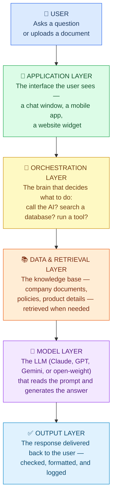
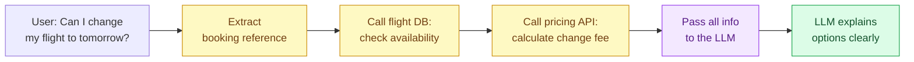
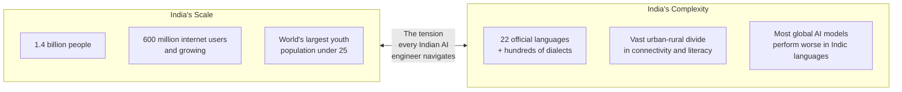

# The 2026 AI Stack and AI in India Today

---

## Learning Objectives

By the end of this topic, you will be able to:

- Describe the five layers of the 2026 AI stack and explain what each one does
- Explain how those layers connect to produce an AI product a user can actually interact with
- Identify which layer an AI engineer spends most of their time building — and why
- Explain why India's linguistic and demographic diversity makes it one of the most important and uniquely challenging AI markets in the world
- Describe how AI is being deployed across healthcare, agriculture, finance, education, and language in India with real examples
- Name the key government programmes — IndiaAI Mission and Bhashini — shaping India's AI landscape in 2026
- Identify homegrown Indian AI companies and research initiatives building India-first solutions
- Explain what the Digital Personal Data Protection (DPDP) Act means for AI engineers working in India

---

## Overview

In the previous topic you saw which AI models exist and how to choose between them — Claude, GPT, Gemini, and open-weight models. This topic answers the next two questions: **how are those models actually assembled into products that real users interact with?** And **what does this AI landscape look like specifically in India?**

The first question is answered by the 2026 AI stack — the five-layer structure that sits beneath every AI product you have ever used. The second is answered by looking at how India is not just consuming AI built abroad, but actively building its own models, deploying AI at national scale, and developing solutions for challenges that are uniquely Indian. As an AI-native engineer working in India, both of these are part of your professional foundation.

---

## The 2026 AI Stack — How Modern AI Products Are Actually Built

When you use an AI product — whether it is a chatbot on a bank's website, an AI tutor in an education app, or a document summariser in a law firm — you are looking at the **tip of the iceberg.** Underneath the surface, there are multiple layers working together. This layered structure is called the **AI stack**.

Understanding the stack matters even if you are not going to write every layer yourself. Just as a building manager doesn't need to lay bricks but does need to understand that the building has foundations, walls, plumbing, and electricity — an AI engineer needs to understand what the layers are, what each one does, and how they connect.

**The everyday analogy — a restaurant:**

Ordering food at a restaurant involves more than just the meal on your plate. There is a supplier who grew the ingredients, a kitchen that cooked them, a waiter who took your order, and a billing system that charged you. Each layer is separate, each has a specific job, and the whole thing only works when all layers connect properly. An AI product works exactly the same way.

---

### Layer 1 — The Model Layer (The Chef)

This is the LLM itself — Claude, GPT, Gemini, or an open-weight model like Llama. It is the layer that actually reads text and generates a response.

**What it does:** Takes a prompt as input, predicts the most likely response token by token, and returns the generated text.

**What it does NOT do:** It does not browse the internet by itself, remember your previous conversations by default, or know about events after its training cutoff — unless other layers provide those capabilities.

**Restaurant analogy:** The chef. Skilled, fast, and knowledgeable — but the chef only works with ingredients that arrive in the kitchen. They cannot go to the market themselves.

---

### Layer 2 — The Data & Retrieval Layer (The Pantry)

This layer stores the specific knowledge the AI needs to answer questions about your domain — your company's product catalogue, HR policies, customer FAQs, or legal contracts.

**What it does:** When a user asks a question, this layer searches the knowledge base and retrieves the most relevant documents. Those documents are then handed to the model as context — so the model answers from real, current, specific information rather than from memory. This is the RAG (Retrieval-Augmented Generation) layer you will study in full in Week 9.

**Restaurant analogy:** The pantry. The chef doesn't know your restaurant's specific recipes from memory — but if the pantry has the recipe cards, the chef can follow them precisely.

**Real example:** A telecom company's AI assistant without a retrieval layer would answer questions about current data plan prices from its training data — which is months out of date. With a retrieval layer connected to a live product database, it always answers with the current price.

---

### Layer 3 — The Orchestration Layer (The Head Waiter)

This is the most important layer for an AI engineer to understand — and the one most beginners don't know exists.

The orchestration layer is the logic that sits between the user and the model. It decides: *what should happen next?* Should we call the LLM? Search the database first? Call an external API like a weather service or a payment system? Ask the user a clarifying question?

**What it does:** Routes requests, manages multi-step workflows, calls tools, handles errors, and assembles the final response.

**Restaurant analogy:** The head waiter. Takes your order, decides which kitchen station handles each dish, coordinates timing, brings everything together at the right moment — you never see any of this, but without it, the meal falls apart.

**Real example:** When you ask an airline's AI assistant "can I change my flight to tomorrow?", here is what the orchestration layer does — invisibly, in under 2 seconds:

The LLM handled step 5 only. The orchestration layer handled everything else. **As an AI engineer, you will spend most of your time building this layer.**

---

### Layer 4 — The Application Layer (The Restaurant Itself)

This is what the user actually sees and touches — the chat window, the mobile app, the website button that says "Ask our AI assistant."

**What it does:** Collects user input, sends it to the orchestration layer, receives the response, and displays it. Also manages login, conversation history, and access controls.

**Restaurant analogy:** The restaurant itself — the tables, the menu, the décor. What the customer experiences. But only possible because of the kitchen, pantry, and head waiter behind the scenes.

---

### Layer 5 — The Output Layer (Quality Control)

Before a response reaches the user, many production AI systems run a final check. Is it safe? On-topic? Does it follow company policy? Formatted correctly?

**What it does:** Filters responses for harmful content, checks the answer actually addresses the question, applies formatting rules, and logs the interaction for review.

**Restaurant analogy:** The final check before the plate leaves the kitchen — the head chef glances at every dish to make sure it meets the standard before it goes out.

---

### The 2026 AI Stack — At a Glance

| Layer | What it does | Who builds it | Example tool |
|---|---|---|---|
| **Model** | Reads prompts and generates responses | AI labs (Anthropic, OpenAI, Google, Meta) | Claude, GPT-4, Gemini, Llama |
| **Data & Retrieval** | Stores and fetches domain-specific knowledge | Engineering team | ChromaDB, Pinecone, FAISS |
| **Orchestration** | Routes requests, manages tools and workflows | Engineering team | LangChain, n8n, custom Python |
| **Application** | The user-facing interface | Product / engineering team | Web app, mobile app, Slack bot |
| **Output** | Filters, formats, and logs the response | Engineering team | Safety filters, logging tools |

**Beginner-friendly way to remember the full flow:**

> You → App → Orchestration → Retrieval → Model → back to you

---

## Why India Is Different From Every Other AI Market

Most global AI tools were designed with a specific user in mind: English-speaking, urban, with a reliable internet connection and a credit card. India's 1.4 billion people are, on average, almost the opposite of that profile.

**Think of it this way:** If you build an AI product that only works fluently in English, you have immediately excluded the majority of India's population. A product that works equally well in Hindi, Tamil, Telugu, Bengali, Marathi, and Kannada is technically much harder to build — but it serves a market that is larger than the United States and European Union combined.

This creates a tension that is specific to India:

**The core insight:** The same features that make India a challenging AI market — linguistic diversity, rural populations, low English penetration — are exactly what make it the world's most important unsolved AI problem. Engineers who understand this will build things that matter.

---

## How AI Is Being Deployed Across India

### Healthcare — Closing the Doctor Gap

India has approximately 1 doctor for every 834 people — well below the World Health Organisation's recommended ratio of 1 per 1,000. In rural areas, the gap is far wider. AI is being used to bring diagnostic capability to communities where no specialist is physically present.

**Wadhwani AI — Tuberculosis Detection:**
India accounts for over 25% of the world's TB cases. Wadhwani Institute for Artificial Intelligence — an Indian non-profit — built an AI system that reads chest X-rays and flags signs of TB with accuracy comparable to a trained radiologist. The system runs at government health clinics across rural India. A health worker takes the X-ray; the AI reads it immediately; the patient gets a result before leaving. No radiologist required on-site.

**iKure — Community Health in West Bengal:**
iKure deploys AI-assisted diagnostic kiosks in rural West Bengal. Community health workers — not qualified doctors — use tablet-based AI tools to screen for anaemia, malnutrition, and hypertension. The AI guides the worker step by step and flags which patients need a doctor's referral. Villages that previously saw a qualified doctor only a few times a year now have consistent, AI-assisted baseline health monitoring.

**Why this matters for you as an engineer:** Both examples involve AI operating in low-connectivity environments, with non-expert users, in local languages. Building for these constraints is different from building a chatbot for an office worker in a city with fast Wi-Fi.

---

### Agriculture — Intelligence for 100 Million Farming Households

India has over 100 million farming households, the vast majority of them smallholders — farmers owning one to two acres who make decisions based on personal experience and inherited knowledge rather than data. Until recently, precision agricultural intelligence was only available to large commercial farms. AI is changing that.

**Agri10x — Hyperlocal Crop Advisory:**
Agri10x delivers AI-generated crop advice that is specific not just to a region but to a particular field — accounting for that field's soil type, local rainfall forecast, pest pressure in surrounding areas, and the farmer's specific crop variety. Crucially, this advice is not delivered through an app. It arrives via WhatsApp voice messages in the farmer's local language, because most smallholder farmers are not comfortable reading long text messages on a screen and do not use agricultural apps.

**CropIn — Satellite Intelligence at Scale:**
CropIn, founded in Bengaluru, combines satellite imagery, weather data, and machine learning to give farm-level crop health predictions to agribusinesses and state governments. State governments use this to identify which districts will face a poor harvest weeks before it happens — allowing them to pre-position food supplies and release relief funds in time. CropIn now operates across 17 million acres in 52 countries, but every design decision was shaped by the realities of Indian agriculture first.

---

### Finance — AI at the Scale of UPI

India's Unified Payments Interface (UPI) processed over **13 billion transactions per month** in 2024 — more digital transactions than Visa and Mastercard handle in India combined. This is possible because AI runs silently underneath every single transaction.

**Real-time Fraud Detection:**
Every UPI payment triggers an invisible AI check that runs in under 200 milliseconds. The model simultaneously evaluates hundreds of signals: the device used, the location, the time of day, the transaction amount, how it compares to the account's history, whether the recipient has been flagged before. If something looks suspicious, the transaction is blocked or flagged before the money moves. This system protects hundreds of millions of users — many of whom made their first-ever digital payment on UPI and have no other financial safety net.

**Account Aggregator — Credit for the Unbanked:**
India's Account Aggregator framework allows financial institutions to access a user's data from multiple banks and government systems simultaneously — with the user's consent — creating a complete financial picture. AI credit-scoring models use this to assess people who have no formal credit history: gig economy workers, street vendors, first-time borrowers from rural areas. Before this system, these users were invisible to formal lending. Now they can access credit based on demonstrable financial behaviour rather than a credit score that never existed.

---

### Education — Personalised Learning at National Scale

India has over 250 million school-age children. The student-to-teacher ratio in government schools averages 26:1 nationally and is far worse in rural districts. No human teacher can personalise instruction for each child in a class that size. AI can.

**BYJU's — Adaptive Learning Paths:**
BYJU's tracks precisely how each student interacts with every piece of content: which questions they skip, where they pause a video, how long they spend on a topic before moving on. The AI uses this data to continuously adjust each student's learning path — spending more time on weak areas, moving faster through mastered topics, and surfacing different explanations when a student is stuck. At its peak, BYJU's served over 150 million registered students across India.

**Pratham — Foundational Literacy for Left-Behind Children:**
Pratham, one of India's largest education NGOs, ran the ASER (Annual Status of Education Report) surveys for years — and the data showed consistently that millions of children in government schools were years behind grade level in basic reading and arithmetic. Pratham has piloted AI tools that assess each child's actual ability level (not their school grade) and provide practice exactly calibrated to where they are — not so easy it's boring, not so hard it's discouraging. The AI does what no single teacher managing a class of 40 can do: pay individual attention to each child.

---

### Language — The Most Important Frontier

Language is where India's AI story is most urgent and most unfinished. The 22 official languages of India represent hundreds of millions of people who, today, receive significantly worse AI assistance than an English speaker asking the same question. This is not a minor inconvenience — it is a structural barrier that determines who benefits from AI and who is left out.

**Bhashini — India's National Translation Platform:**
Bhashini is a government-built, free AI platform that provides real-time translation and voice transcription across all 22 scheduled Indian languages. Any Indian developer or company can access Bhashini's APIs at no cost. A state government can use Bhashini to translate all public health advisories into every regional language simultaneously. A rural e-commerce platform can allow farmers to search for products by speaking in their dialect. A telemedicine app can transcribe a patient's symptoms spoken in Bhojpuri into a medical record in English.

Bhashini is significant not just as a product but as a policy statement: the Indian government has decided that AI's benefits in India should not be gated behind English literacy.

**AI4Bharat — Open Research from IIT Madras:**
AI4Bharat is a research initiative from IIT Madras that builds and freely releases open-source AI tools for Indian languages — language models, automatic speech recognition, transliteration, and machine translation for languages like Odia, Kannada, Marathi, Sindhi, and Dogri. These are languages that global AI companies had largely skipped because the potential market seemed small compared to English or Mandarin. AI4Bharat's work ensures that researchers and startups building for these communities have a foundation to start from rather than beginning from zero.

---

## India's Government AI Programmes

### The IndiaAI Mission

In the 2024 Union Budget, India committed **₹10,000 crore** (approximately $1.2 billion USD) to a national AI programme called the **IndiaAI Mission**. This is not a single project — it is an infrastructure programme across five pillars designed to make India a sovereign AI power rather than permanently dependent on foreign cloud providers and foreign models.

| Pillar | What it builds | Why it matters |
|---|---|---|
| **IndiaAI Compute** | Domestic GPU clusters for AI training and inference | Indian researchers and startups will not need to rent compute from AWS, Azure, or Google Cloud for every experiment |
| **IndiaAI Datasets** | A national data platform with Indian public-sector datasets | Healthcare records, agricultural data, court judgements, satellite imagery — available for AI research under controlled access |
| **IndiaAI Applications** | Funding AI products in priority national sectors | Agriculture, health, education, smart cities — problems where India needs AI solutions built for Indian conditions |
| **IndiaAI Startups** | Grants and support for Indian AI companies | Reducing the advantage that well-funded foreign AI companies have over Indian startups at early stage |
| **IndiaAI FutureSkills** | Training 1 million AI-skilled professionals by 2027 | The programme you are currently enrolled in is part of this national effort |

The FutureSkills pillar is worth pausing on. The Indian government has explicitly identified a shortage of AI-capable engineers as a strategic risk. Every person who completes a programme like this one is part of the government's answer to that risk.

---

## Homegrown Indian AI — Building, Not Just Using

A common misconception is that India only uses AI tools built elsewhere. That is changing rapidly. A new generation of Indian AI companies is building foundation models and AI infrastructure from scratch — for Indian languages, Indian users, and Indian conditions.

| Organisation | Type | What they are building |
|---|---|---|
| **Sarvam AI** | Startup | Foundation models trained from scratch for Hindi and Indic languages — not fine-tuned from English models |
| **Krutrim (by Ola)** | Startup | India's first large language model trained in India, on Indian data, by an Indian company |
| **Wadhwani AI** | Non-profit research | AI for social impact — TB detection, pest management, maternal health — in partnership with the Indian government |
| **AI4Bharat (IIT Madras)** | Academic research | Open-source language models and speech tools for 22 Indian languages, freely available to all |
| **CropIn** | Startup | Agricultural AI for smallholder farmers — operating at scale across India and internationally |
| **Niramai** | Startup | AI-based breast cancer screening that is non-invasive and can be deployed in low-resource settings |

The existence of Sarvam AI and Krutrim is particularly significant. Both are attempting something most countries have not — training a large foundation model from the ground up for their own language and context, rather than adapting a model built for someone else's market. Whether they succeed will shape whether India has a sovereign AI capability or remains permanently dependent on models trained by foreign companies on foreign data.

---

## The Regulatory Context — What AI Engineers in India Must Know

India's AI regulatory environment is actively developing, and engineers working in India need to understand it even at this early stage of their career.

**Digital Personal Data Protection (DPDP) Act, 2023:**
India's landmark data protection law governs how personal data — including data used to train AI models — can be collected, stored, processed, and shared. Key implications for AI engineers:
- You cannot collect personal data without a lawful basis and clear user consent
- Data collected for one purpose (say, processing a payment) cannot be silently reused to train an AI model
- Organisations processing significant volumes of personal data must comply with data localisation and security requirements

**MEITY AI Advisories:**
The Ministry of Electronics and Information Technology issues guidance on responsible AI deployment. India's current approach is advisory rather than binding law — emphasising principles like transparency, fairness, and accountability — while sector-specific regulations (banking, healthcare, insurance) apply their own rules to AI systems in those domains.

**Why this matters now:** Even as a fresher joining an AI team, you may work on systems that collect and process personal data. Understanding that data use has legal boundaries — and that AI training data is not exempt from those boundaries — is foundational professional knowledge.

You will study the DPDP Act and MEITY guidelines in full in Week 12.

---

## Key Takeaways

**The 2026 AI Stack:**
- Every AI product is built on a **five-layer stack**: Model → Data & Retrieval → Orchestration → Application → Output. The LLM is just one layer — not the whole product
- The **orchestration layer** is the "traffic controller" — it routes requests, calls tools, manages multi-step workflows, and assembles the final response. Most beginners don't know it exists, but it is where most real engineering work happens
- The **retrieval layer** (RAG) lets the model answer from current, domain-specific knowledge instead of outdated training memory — you will build this in Week 9
- As an AI engineer, you will mostly build the orchestration, retrieval, and application layers — not the model itself

**AI in India Today:**
- India is an **active builder and deployer of AI**, not just a consumer — with major deployments across healthcare, agriculture, finance, education, and language
- India's **22 official languages** and rural-urban divide create genuine engineering challenges that most global AI tools were not designed for — and a massive opportunity for engineers who solve them
- **Real deployments to know:** Wadhwani AI (TB detection at rural clinics), UPI fraud detection (13 billion transactions/month in under 200ms), Bhashini (free government translation APIs across 22 languages), AI4Bharat (open-source Indic language models from IIT Madras)
- The **IndiaAI Mission** (₹10,000 crore) is building sovereign AI infrastructure across five pillars — compute, datasets, applications, startups, and skills. The FutureSkills pillar includes the programme you are in
- **Homegrown AI companies** — Sarvam AI and Krutrim — are building foundation models from scratch for Indian languages, not just adapting foreign ones
- The **DPDP Act (2023)** governs personal data use in India, including AI training data — every AI engineer in India needs to understand its basic requirements

> **Interview tip:** When asked about the AI stack, mentioning the orchestration layer specifically — and explaining that the LLM is just one of five layers — immediately signals that you understand how AI products are actually engineered. When asked about AI in India, go beyond "chatbots for customer service" — mention UPI fraud detection at 13 billion transactions a month, Bhashini across 22 languages, and the IndiaAI Mission's ₹10,000 crore commitment. Both answers together show a candidate who understands AI end-to-end.

---

## References

- 📎 [IndiaAI Mission — Official portal](https://indiaai.gov.in/)
- 📎 [Bhashini — National Language Translation Platform](https://bhashini.gov.in/)
- 📎 [AI4Bharat — IIT Madras](https://ai4bharat.iitm.ac.in/)
- 📎 [Wadhwani AI](https://www.wadhwaniai.org/)
- 📎 [NPCI — UPI transaction statistics](https://www.npci.org.in/what-we-do/upi/upi-ecosystem-statistics)
- 📎 [Ministry of Electronics and Information Technology — MEITY](https://www.meity.gov.in/)
- 📎 [Digital Personal Data Protection Act, 2023](https://www.meity.gov.in/data-protection-framework)
- 📎 [CropIn](https://www.cropin.com/)
- 📎 [Niramai](https://www.niramai.com/)
