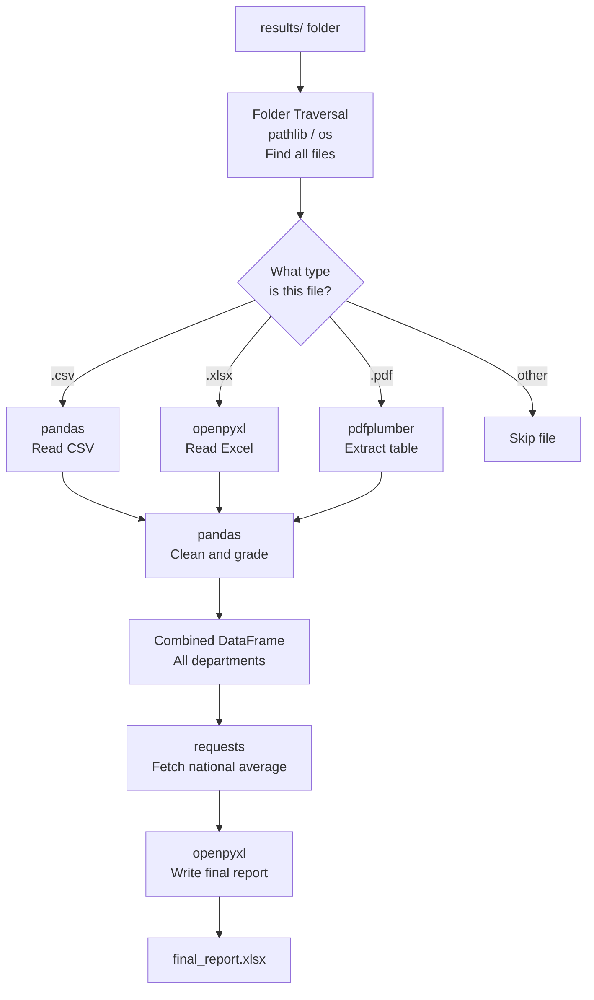

# Python Automation Toolkit

## What is Automation?

Every week, the university's exam office receives result files from three departments. A staff member opens each file, copies the data into a spreadsheet, calculates grades, checks for missing marks, formats the report, and emails it to the head of department. The whole process takes three to four hours. Every semester. The same steps. The same order. The same chance of a copy-paste mistake.

Automation means writing a program that does all of this instead — consistently, instantly, and without mistakes — so the staff member runs one script and gets the finished report in seconds.

This is not about replacing people. It is about freeing them from repetitive, mechanical work so they can focus on decisions that actually need human judgment — like investigating why one department's average dropped by 12 points, or following up with a student whose marks are missing.

**Automation is the right tool when a task is:**
- Repetitive — the same steps run every week or every semester
- Rule-based — the logic does not change between runs
- High volume — too many files, rows, or records to handle manually
- Error-prone — a human doing it by hand introduces mistakes that a program would not

---

## Why Python for Automation?

Python is the dominant language for automation work for three reasons:

**Readable syntax** — automation scripts are read and maintained by different people over time. Python code reads close to plain English, which means a script written today can be understood and modified by someone else next semester.

**Library ecosystem** — pandas, openpyxl, pdfplumber, and requests are all free, open-source, actively maintained, and supported by enormous communities. You do not build any of this from scratch.

**Orchestration** — Python's role in automation is not to compute complex algorithms. It is to be the coordinator — open this file, pass it to this library, take the result, pass it to the next step. Python is the glue that connects tools into a pipeline.

This connects directly to what you learned in the Python foundations module: Python as the orchestration layer. The same idea scales from calling an AI model to automating an entire university's results processing system.

---

## What is the Python Automation Toolkit?

The Python Automation Toolkit is a set of Python libraries that cover the most common automation tasks in real engineering work. Below is the full range of tools available for file handling and automation.
 
| Tool | What it does | Works with |
|---|---|---|
| `os` | Navigate folders, manage files and paths, interact with the operating system | Any file or folder path |
| `pathlib` | Modern object-oriented path handling — cleaner alternative to `os.path` | Any file or folder path |
| `shutil` | Copy, move, rename, and delete files and entire folders | Any file or folder |
| `glob` | Find files matching a name pattern | `*.csv`, `**/*.pdf`, `*.xlsx` |
| `json` | Read and write structured data in JSON format | `.json` |
| `csv` | Read and write tabular data at a low level | `.csv`, `.tsv` |
| `io` | Work with in-memory file-like objects without touching disk | Strings, bytes in memory |
| `zipfile` | Read, write, and extract compressed ZIP archives | `.zip` |
| `tarfile` | Read and write TAR compressed archives | `.tar`, `.tar.gz`, `.tgz` |
| `tempfile` | Create temporary files and folders that clean up automatically | Temporary files and dirs |
| `pandas` | Read, clean, transform, and combine tabular data from multiple sources | `.csv`, `.xlsx`, `.json`, `.sql`, `.parquet` |
| `openpyxl` | Read and write Excel files with precise cell-level control including formatting | `.xlsx`, `.xlsm` |
| `xlrd` / `xlwt` | Read and write older Excel format files not supported by openpyxl | `.xls` |
| `pdfplumber` | Extract text and tables from PDF files with high layout accuracy | `.pdf` |
| `pypdf` | Extract text, split, merge, rotate, and read metadata from PDFs | `.pdf` |
| `python-docx` | Read and write Microsoft Word documents including styles and formatting | `.docx` |
| `requests` | Fetch live data from APIs and web services over the internet | HTTP / HTTPS / REST APIs |
| `httpx` | Modern async HTTP client — supports both sync and async requests | HTTP / HTTPS / REST APIs |
| `beautifulsoup4` | Parse and extract data from HTML and XML documents | `.html`, `.xml` |
| `watchdog` | Monitor a folder for file changes and trigger actions automatically | Any file or folder |
| `schedule` | Run Python functions on a repeating time schedule | Time-based triggers |
 
This series focuses on the tools that together cover the complete input-to-output pipeline for the most common real-world automation task: **pathlib**, **shutil**, **pandas**, **openpyxl**, **pdfplumber**, **pypdf**, and **requests**.
 
```text
Input formats a real system receives:
  CSV files      → pandas
  Excel files    → openpyxl → pandas
  PDF files      → pdfplumber → pandas
  API / internet → requests → pandas
 
Output a real system produces:
  Formatted Excel report → openpyxl
  Summary CSV → pandas
```

---


## The Scenario — Student Result Processing System

Every file in this series uses one running scenario. Understanding it fully before the first file begins makes everything that follows easier to follow.

The university has a `results/` folder. Every semester, three departments drop their result files into it:

```text
results/
├── cs_results.csv              ← CS department, plain CSV
├── management_results.xlsx     ← Management department, Excel with merged title cell
├── external_board_results.pdf  ← External exam board, PDF with a table
└── notes.txt                   ← Ignored — not a results file
```

The automation pipeline must:
1. Open the folder and identify every file
2. Route each file to the right reader based on its type
3. Extract the student data from each file
4. Clean the data — handle missing marks, fix data types
5. Combine all three departments into one DataFrame
6. Calculate grades and percentages
7. Fetch the national average from an external API
8. Write a formatted Excel report with bold headers and highlighted failing students

A staff member triggers this by running one Python script. The output is a formatted Excel report ready to send.

---

## The Full Pipeline — All Five Tools Connected


 
**What is happening at each step:**
 
- The pipeline starts with the `results/` folder — this is where all department files are dropped every semester
- **Folder Traversal** opens the folder and looks at every file inside it
- The diamond shape is a decision point — the program asks "what type is this file?" and takes a different path depending on the answer
- A `.csv` file goes to **pandas** to be read directly
- A `.xlsx` file goes to **openpyxl** first — because the Excel file has a merged title that needs to be skipped before pandas can read it
- A `.pdf` file goes to **pdfplumber** to extract the table — PDFs cannot be read like plain text
- Any other file — like `notes.txt` — is skipped completely
- All three readers pass their data to **pandas**, which combines all departments into one table
- **requests** connects to the internet and fetches the national average from the grading API — this adds context to the marks
- **openpyxl** writes the final formatted report with bold headers and highlighted failing students
- The output is `final_report.xlsx` — ready to send to the head of department
Each file in this series is one step in this pipeline. Understanding where each tool fits before you learn it makes the learning faster — you always know why you are learning something and where it connects.
---

## How to Read This Series

Each file covers one tool. Every file:
- Opens by connecting to the previous file's output
- Introduces the tool and what problem it solves
- Applies every concept to the student result processing scenario
- Ends with a "Where This Fits in the Pipeline" section showing the full flow

**The recommended order is the pipeline order:**

| File | Tool | What you will build |
|---|---|---|
| `Folder_Traversal.md` | os, pathlib, shutil | A script that opens `results/`, finds all files, and routes each to the right reader |
| `Pandas.md` | pandas | A script that reads, cleans, and calculates grades for the CS CSV |
| `Excel_Handling.md` | openpyxl | A script that reads the management Excel file and writes a formatted output |
| `PDF_Extraction.md` | pdfplumber / pypdf | A script that extracts the external board's table from a PDF |
| `HTTP_Requests.md` | requests | A script that fetches the national average and combines all three departments |

By the end of the HTTP Requests file, you will have written every piece of the pipeline. The final section shows all five tools connected into a single working script

## What You Will Be Able to Do After This Series

By the end of this series you will be able to:

- Write a Python script that processes an entire folder of mixed-format files automatically
- Read, clean, and combine data from CSV, Excel, and PDF sources using the right tool for each
- Calculate derived values — grades, percentages, pass rates — programmatically across any number of students
- Fetch live data from an external API and integrate it into a local dataset
- Write a professionally formatted Excel report with bold headers, highlighted rows, and multiple sheets
- Recognise when a task is a good candidate for automation and design the pipeline for it

These are not theoretical skills. Every step in this pipeline is a task that appears in real data engineering, operations automation, and AI-assisted workflows.

---

## Before You Start — Setup

All five tools need to be installed. Run this once before beginning File 5-1:

```bash
pip install pandas openpyxl pdfplumber pypdf requests
```

`os`, `pathlib`, and `shutil` are built into Python — no installation needed.

**Verify the installation:**

```python
import pandas as pd
import openpyxl
import pdfplumber
from pypdf import PdfReader
import requests

print("pandas:", pd.__version__)
print("openpyxl:", openpyxl.__version__)
print("requests:", requests.__version__)
print("All tools ready")
```

**Output**

```text
pandas: 2.2.2
openpyxl: 3.1.2
requests: 2.31.0
All tools ready
```

If any import fails, re-run the `pip install` command for that specific library.

---

## Reference Links

- 📎 [pandas Official Documentation](https://pandas.pydata.org/docs/)
- 📎 [openpyxl Official Documentation](https://openpyxl.readthedocs.io/en/stable/)
- 📎 [pdfplumber GitHub](https://github.com/jsvine/pdfplumber)
- 📎 [pypdf Documentation](https://pypdf.readthedocs.io/en/stable/)
- 📎 [requests Documentation](https://requests.readthedocs.io/en/latest/)
- 📎 [Real Python — Automating Everyday Tasks with Python](https://realpython.com/python-automation/)
