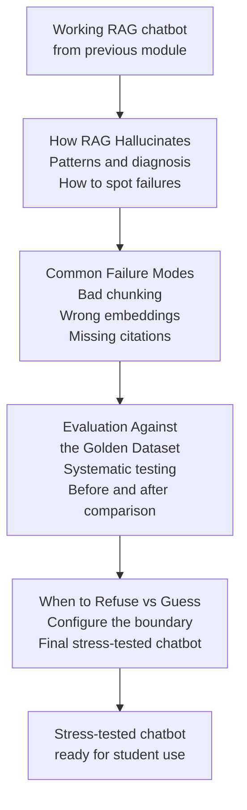

# RAG Failure and Recovery

---

## Learning Objectives

By the end of this topic, you should be able to:

- Explain what stress-testing a RAG pipeline means and why it matters
- Identify the three categories of RAG failure
- Describe what each failure looks like from a student's perspective
- Understand how this module uses Pinecone Assistant to deliberately break and fix the pipeline

---

## Overview

In the previous module you built a working exam prep chatbot in Pinecone Assistant. You uploaded lecture notes, asked questions, and saw cited answers appear. The chatbot refused questions that were not in the notes. Citations pointed to real chunks. The pipeline worked.

A pipeline that works in a demo is not the same as a pipeline that works reliably. The demo used clean, well-structured notes. The questions were straightforward. Everything was set up to succeed.

Real use is messier. Students ask vague questions. Notes are long and cover multiple topics in one document. Someone uploads the wrong file. The system prompt gets changed. A question falls just outside what the notes cover — close enough that the chatbot tries to answer, far enough that the answer is wrong.

**Stress-testing** means deliberately pushing the pipeline into these situations to see where it breaks — before students rely on it for exam preparation. A failure found during testing is a problem you can fix. A failure found during revision the night before an exam is a problem that costs a student marks.

This module covers four things:
- How RAG hallucinates — the specific patterns and how to spot them
- Common failure modes — bad chunking, wrong embeddings, missing citations
- Evaluation against a fixed set of test questions — the golden dataset from the Evaluation module
- When to refuse versus when to guess — how to configure the boundary

By the end you will have deliberately broken your Pinecone chatbot in three ways, diagnosed each failure, and fixed it.

---

## What Stress-Testing Looks Like

Stress-testing a RAG pipeline is not random. Each test targets one specific part of the pipeline and asks: what happens when this part fails?

The pipeline has three stages. Each one can fail independently:

```text
RETRIEVE → AUGMENT → GENERATE

If RETRIEVE fails:
Wrong chunks returned, or no chunks returned at all.
The model generates from irrelevant context — or from nothing.
Result: answer that sounds plausible but is not from the notes.

If AUGMENT fails:
Too many chunks retrieved (context overflow), or chunks in wrong order.
The model cannot process all the context effectively.
Result: answer that misses key information or mixes up sources.

If GENERATE fails:
System prompt too weak, or model ignores the retrieved context.
The model answers from general training instead of the notes.
Result: answer that sounds correct but does not match the course.
```

Each failure mode in this module corresponds to one of these three stages. The diagnosis always starts with the same question: **which stage broke?**

---

## The Three Failure Categories

### Category 1 — Retrieval Failures

The wrong content gets retrieved — or nothing gets retrieved at all.

**What a student sees:** an answer that is vague, off-topic, or clearly about something different from what they asked.

**What causes it:**
- The uploaded document covers too many topics in one file — the embedding vector represents the average of all topics and matches nothing precisely
- The question uses different vocabulary from the notes — semantic search finds a related but not correct chunk
- The document was not processed correctly — corrupted upload, unsupported format

**Example from the exam prep chatbot:**
A student uploads one large file covering all of data science — statistics, machine learning, databases, and ethics — all in one document. They ask "what is gradient descent?" Pinecone retrieves a chunk about database normalisation because both documents were stored as one averaged vector and the similarity scores are low across the board. The answer talks about normalisation forms instead of optimisation.

### Category 2 — Augmentation Failures

The right content is retrieved but it is assembled incorrectly before being sent to Claude.

**What a student sees:** an answer that seems incomplete, contradicts itself, or mixes information from unrelated sections.

**What causes it:**
- Too many chunks retrieved — the context is so long that Claude loses focus on the most relevant parts
- Chunks retrieved in wrong order — less relevant content appears first and gets more attention
- Retrieved content contradicts itself — two chunks from different weeks of notes say different things about the same concept

**Example from the exam prep chatbot:**
A student asks "what is the difference between precision and recall?" Pinecone retrieves five chunks — three about precision and recall in machine learning, one about recall in psychology, and one about precision in manufacturing. The context is large and mixed. Claude produces an answer that blends all three domains because it cannot tell which chunks are relevant.

### Category 3 — Generation Failures

The right content is retrieved and assembled correctly — but Claude does not use it properly.

**What a student sees:** an answer with no citations, or an answer that goes beyond what the notes say, or an answer that ignores the retrieved content entirely.

**What causes it:**
- System prompt is missing or too weak — Claude defaults to general knowledge
- Temperature set too high — Claude generates creative completions instead of sticking to the notes
- Question is phrased in a way that triggers Claude's training rather than retrieval — very common questions like "what is backpropagation" may get answered from training even when notes are present

**Example from the exam prep chatbot:**
The Assistant instructions box is accidentally cleared. A student asks "what is the bias-variance trade-off?" Claude gives a detailed, correct answer — but it is from general training, not the uploaded notes. There are no citations. The answer uses different terminology from the course. The student revises using this answer and finds different notation in the actual exam.

---

## How This Module Uses Pinecone Assistant

Each failure mode is taught as a three-step experiment:

**Step 1 — Set up the failure**
A specific change is made to the Pinecone setup — uploading a different type of document, changing the Assistant instructions, or asking a specific type of question.

**Step 2 — Observe what breaks**
The student asks a test question and compares the answer to what they expect. The failure is visible in the answer itself — wrong content, missing citations, or information not in the notes.

**Step 3 — Diagnose and fix**
The student identifies which stage failed — Retrieve, Augment, or Generate — and makes the specific change that fixes it.

No code is involved at any stage. Every experiment is done by changing settings in Pinecone Assistant, uploading different files, or modifying the Assistant instructions.

---

## The Golden Dataset — Your Test Questions

The Evaluation module introduced the concept of a **golden dataset** — a fixed set of questions with verified correct answers, used to measure whether a system is working correctly.

For this module, you will create a small golden dataset of **10 test questions** from your uploaded lecture notes. These are the questions you will use to test the pipeline throughout the module — before breaking it, after breaking it, and after fixing it.

**What makes a good test question for RAG evaluation:**

| Type | Example | Why it tests RAG |
|---|---|---|
| **Direct concept** | "What is gradient descent?" | Tests whether the right chunk is retrieved |
| **Comparison** | "What is the difference between precision and recall?" | Tests whether multiple relevant chunks are retrieved and combined correctly |
| **Out of scope** | "What is the French Revolution?" | Tests whether the chatbot correctly refuses |
| **Edge case** | "What is the learning rate when set to zero?" | Tests whether the chatbot handles a question the notes may not answer directly |

Write your 10 questions before starting the failure mode experiments. They become your baseline — you ask all 10 before each experiment and compare the answers after.

---

## What You Will Build This Module

By the end of this module you will have:

1. A set of 10 test questions with verified correct answers — your golden dataset
2. A documented record of three deliberate failures — what broke, which stage failed, and what the wrong answer looked like
3. A fixed, stress-tested Pinecone chatbot — with improved Assistant instructions, better document structure, and a clear boundary between what it will and will not answer

---

## How the Four Topics Connect



---

## Best Practices

- Always test with the same set of questions before and after making any change — this is the only way to know whether the change actually helped
- Document every failure — write down what the wrong answer was, not just that it was wrong. The specific failure tells you which stage broke
- Fix one thing at a time — if you change the document structure and the Assistant instructions at the same time, you will not know which change fixed the problem
- Keep the original working setup before starting experiments — Pinecone allows you to create a second assistant, so you can always return to the working version

## Common Beginner Mistakes

- **Testing only with questions the chatbot was designed to handle** — a chatbot that passes every easy question may still fail on edge cases. Always include out-of-scope and comparison questions in the test set
- **Fixing the symptom instead of the cause** — if the answer has no citations, adding a citation instruction may not fix the root problem. The root problem may be that the wrong chunks are being retrieved
- **Not recording the baseline** — if you do not ask all 10 test questions before starting experiments, you have nothing to compare against after fixing things

---

## Key Takeaways

- A RAG pipeline that works in a demo is not the same as one that works reliably — stress-testing finds failures before students rely on the system
- RAG has three stages — Retrieve, Augment, Generate — and each one can fail independently
- Diagnosis always starts with the same question: which stage broke?
- The three failure categories are: retrieval failures (wrong content), augmentation failures (correct content assembled badly), generation failures (correct content ignored)
- A golden dataset of 10 test questions is the tool for systematic evaluation — ask all 10 before and after every change
- Fix one thing at a time — changing multiple things simultaneously makes it impossible to know what worked

> **Interview tip:** If asked "how would you test a RAG pipeline before deploying it?" — describe stress-testing across all three stages. Say you would create a golden dataset of test questions covering direct concepts, comparisons, out-of-scope questions, and edge cases. Then describe running the tests before and after each change. Most candidates say "I would test it with some questions" — describing the three failure categories and a fixed test set shows you think about evaluation systematically.

---

## Reference Links

- 📎 [Pinecone Assistant — Documentation](https://docs.pinecone.io/guides/assistant/quickstart/sdk-quickstart)
- 📎 [Anthropic — Reducing Hallucination](https://docs.anthropic.com/en/docs/test-and-evaluate/strengthen-guardrails/reduce-hallucinations)
- 📎 [Anthropic — RAG Guide](https://docs.anthropic.com/en/docs/build-with-claude/retrieval-augmented-generation)
- 📎 [Pinecone — RAG Evaluation](https://www.pinecone.io/learn/retrieval-augmented-generation/)

---

## Images Needed for This File

Take these screenshots from your Pinecone Assistant session and save them in the `images/` folder:

| Filename | Where to take it | What to show |
|---|---|---|
| `images/w10_01_working_chatbot.png` | Pinecone playground with a correct cited answer | The working chatbot from Week 9 — a question answered with citations and References section visible. This is the **before** baseline. |
| `images/w10_02_retrieval_failure.png` | Pinecone playground after uploading a large mixed-topic document | A question about one specific topic returning an answer about a completely different topic — retrieval failure visible in the answer |
| `images/w10_03_no_citations.png` | Pinecone playground after clearing the Assistant instructions | A question answered without any `[Source N]` citations — generation failure visible |

**How to take each screenshot:**

**w10_01_working_chatbot.png:**
Open your existing exam-prep-chatbot in Pinecone → ask any question from your uploaded notes → take screenshot of the full playground showing the cited answer and References section

**w10_02_retrieval_failure.png:**
Upload a single very large document covering many topics → ask a specific question → take screenshot of the wrong or vague answer

**w10_03_no_citations.png:**
Clear the Assistant instructions box → ask any question → take screenshot of the answer without citations
