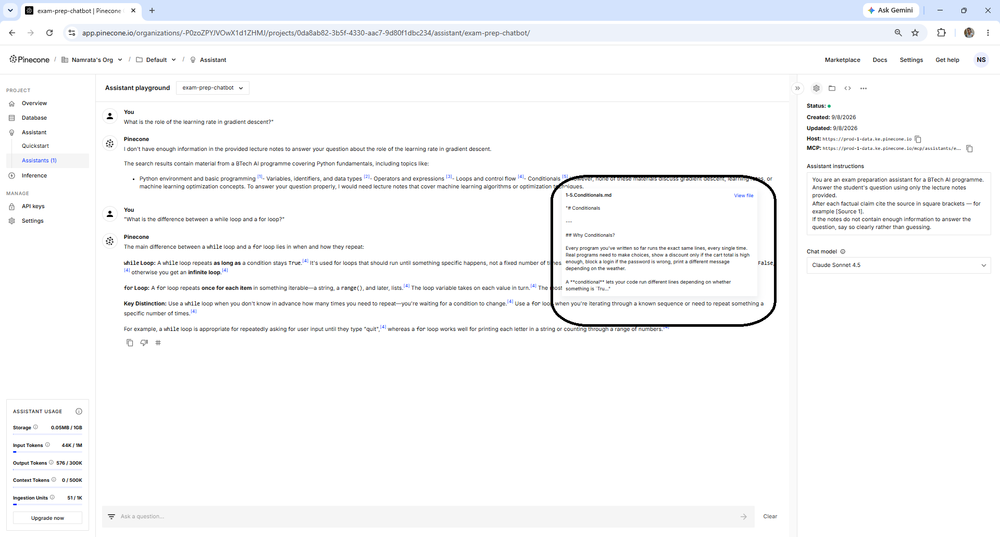

# How RAG Hallucinates — and How to Diagnose It

---

## Learning Objectives

By the end of this topic, you should be able to:

- Explain the difference between a plain LLM hallucination and a RAG hallucination
- Identify the five specific ways a RAG pipeline can produce wrong answers
- Diagnose which type of hallucination occurred from looking at the answer alone
- Apply a simple diagnosis checklist in Pinecone to identify the root cause
- Know the first fix to try for each hallucination type

---

## Overview

The previous topic introduced the three failure categories — Retrieve, Augment, Generate — and showed what each one looks like. This topic goes deeper into the Generate stage specifically: how does a RAG system hallucinate, and how do you know it is happening?

This matters because RAG hallucination is different from plain LLM hallucination. A plain LLM hallucinating gives you a confident wrong answer with no way to check it. A RAG system hallucinating gives you a confident wrong answer with citations — which looks more trustworthy but is actually more dangerous. The student sees `[Source 1]` and assumes the answer is verified. If `[Source 1]` does not actually say what the answer claims, the citation is false reassurance.

By the end of this topic you will be able to look at any answer from your Pinecone chatbot and identify whether it is hallucinating — and if so, which of the five patterns it matches.

---

## RAG Hallucination vs Plain LLM Hallucination

Before the five patterns, it helps to understand exactly what changes when RAG is involved.

**Plain LLM hallucination:**
```text
Student: "What is the learning rate in gradient descent?"

Claude (no RAG): "The learning rate is typically 0.001 for neural networks.
It was introduced by Robbins and Monro in 1951."

Problem: The date and the typical value came from training data —
they may not match the course notes at all. No way to check.
```

**RAG hallucination:**
```text
Student: "What is the learning rate in gradient descent?"

Claude (with RAG): "The learning rate controls step size [Source 1].
A typical value is 0.001 [Source 1]. It was introduced by Robbins
and Monro in 1951 [Source 1]."

Problem: Source 1 says "The learning rate controls step size" —
that is correct and grounded. But the typical value and the date
were added from training. Source 1 never mentioned them.
The citation is real. The claims it supposedly supports are not.
```

This is why RAG hallucination is more dangerous — it wears the appearance of a verified answer.

---

## The Five RAG Hallucination Patterns

### Pattern 1 — The Confident Addition

**What it is:** the answer is mostly correct and grounded, but one or two specific facts are added from general training — a number, a date, a name — that were never in the notes.

**What it looks like in Pinecone:**
The answer flows naturally. Citations appear throughout. But when you click a citation and read the chunk, the specific fact cited is not actually in that chunk.

**Example:**
```text
Notes say: "The learning rate controls the size of each parameter update."

Answer says: "The learning rate controls step size [Source 1].
A common default value is 0.001 [Source 1]."

Click Source 1: the chunk says "controls the size of each parameter update"
— nothing about 0.001. The number was added from training.
```

**How to diagnose in Pinecone:**
Click every citation. Read the chunk. Check whether the specific claim appears word-for-word or close to it. If a claim is cited but the chunk does not say it — Pattern 1.

Here is what clicking a citation looks like in Pinecone — the popup shows the exact chunk text so you can compare it against the claim in the answer:



**First fix:** strengthen the system prompt. Add: *"Do not include any specific numbers, dates, or names unless they appear explicitly in the provided notes."*

---

### Pattern 2 — The Confident Refusal Bypass

**What it is:** the notes do not contain the answer, but instead of refusing, the chatbot answers anyway from general training — sometimes without any citations, sometimes with citations to loosely related chunks.

**What it looks like in Pinecone:**
The answer appears for a question that should have been refused. Citations may point to chunks that are related to the topic but do not actually answer the question.

**Example:**
```text
Notes contain: Python basics — loops, functions, data structures
Question: "What is backpropagation?"

Answer: "Backpropagation is the algorithm used to train neural networks
by propagating gradients backward [Source 2]."

Click Source 2: the chunk is about Python loops — completely unrelated.
The answer came from training. The citation is the nearest chunk
Pinecone could find, not the actual source of the claim.
```

**How to diagnose in Pinecone:**
Click the citation. If the chunk is clearly about a different topic, Pattern 2. Also check: does the answer match the language and terminology of the uploaded notes? If it uses different vocabulary, it came from training.

You already saw Pattern 2 handled correctly in the RAG Failure and Recovery topic — Pinecone correctly refused the gradient descent question because the notes only contained Python basics:


This is the correct behaviour. Pattern 2 hallucination occurs when the chatbot does not refuse — when it answers from training instead. If your chatbot produces an answer for an out-of-scope question, check the citation — it will point to an unrelated chunk.

**First fix:** strengthen the refusal instruction in Assistant instructions. Add: *"If the notes do not contain the answer, respond with: 'This topic is not covered in the provided notes.' Do not attempt to answer from general knowledge."*

---

### Pattern 3 — The Gap Filler

**What it is:** the retrieved chunks contain two related facts, and the model infers a connection between them that is not explicitly stated in the notes. The inference may be reasonable — but it is not grounded.

**What it looks like in Pinecone:**
The answer correctly cites two or more chunks. But a sentence appears between them — a connecting inference — that no chunk actually says.

**Example:**
```text
Chunk A says: "A high learning rate causes overshooting."
Chunk B says: "Overshooting prevents the loss from converging."

Answer says: "A high learning rate causes overshooting [Source 1].
Overshooting prevents convergence [Source 2]. Therefore, a learning
rate above 0.1 will always prevent convergence [Source 1]."

The 0.1 threshold was never stated in either chunk.
The model inferred it from combining the two true statements.
```

**How to diagnose in Pinecone:**
Look for sentences that begin with "therefore", "this means", "as a result", or "consequently". These connecting sentences are often inferences. Click the citation on that sentence and check whether the conclusion is explicitly in the chunk.

**First fix:** add to Assistant instructions: *"Do not draw conclusions or inferences that are not explicitly stated in the notes. Only state what the notes say directly."*

---

### Pattern 4 — The Wrong Citation

**What it is:** the answer content is correct and grounded, but the citation points to the wrong source. The claim came from chunk A but is cited as `[Source 2]` which is chunk B.

**What it looks like in Pinecone:**
The answer looks correct. You click a citation to verify and the chunk shown does not contain the cited claim — but a different chunk in the same session does.

**Example:**
```text
Chunk A (Source 1): "The learning rate controls step size."
Chunk B (Source 2): "Gradient descent minimises the loss function."

Answer says: "The learning rate controls step size [Source 2]."

Click Source 2: shows gradient descent definition — not learning rate.
The fact is correct. The citation is wrong.
```

**How to diagnose in Pinecone:**
The content is right but clicking the citation shows an unrelated chunk. Try clicking other citation numbers in the same answer — the claim may appear in a different source.

**First fix:** this is the hardest pattern to fix through prompting alone. The most reliable approach is to ask a verification follow-up question in Pinecone:

```text
For each claim in your previous answer, confirm which source
it came from by quoting the exact sentence from that source.
```

---

### Pattern 5 — The Confident Uncertainty Mask

**What it is:** the notes contain vague or incomplete information on a topic, but the model generates a precise, confident answer — filling the vagueness with specific details from training.

**What it looks like in Pinecone:**
The answer is more detailed and specific than the notes. The citations are real but the notes only say something general, while the answer gives specific values or steps.

**Example:**
```text
Notes say: "Dropout is a regularisation technique used to prevent
overfitting in neural networks."

Answer says: "Dropout is a regularisation technique [Source 1].
It should be applied with a rate of 0.5 for hidden layers and
0.2 for input layers [Source 1]."

Click Source 1: "Dropout is a regularisation technique used to
prevent overfitting" — no rates mentioned anywhere.
```

**How to diagnose in Pinecone:**
The answer is more specific than you expect given what is in the notes. Click citations and compare — if the chunk is general but the answer is specific, Pattern 5.

**First fix:** add to Assistant instructions: *"If the notes provide only a general description without specific values or steps, reflect that generality in the answer. Do not add specific details that are not in the notes."*

---

## The Diagnosis Checklist

When an answer from Pinecone looks suspicious, work through this checklist:

```text
STEP 1 — Does the answer contain any specific numbers, dates, or names?
→ Click their citations. Are they in the chunk?
→ If not: Pattern 1 — Confident Addition

STEP 2 — Was this question in scope?
→ Are the uploaded notes about this topic?
→ If no but the chatbot answered anyway: Pattern 2 — Refusal Bypass

STEP 3 — Does the answer contain "therefore", "this means", or conclusions?
→ Click the citation on that sentence.
→ Is the conclusion explicitly in the chunk?
→ If not: Pattern 3 — Gap Filler

STEP 4 — Does the cited chunk actually contain the cited claim?
→ Click every citation. Read the chunk.
→ If the content is right but the chunk is wrong: Pattern 4 — Wrong Citation

STEP 5 — Is the answer more specific than you expected?
→ Compare the answer detail level against the notes.
→ If the notes are vague but the answer is precise: Pattern 5 — Uncertainty Mask
```

Work through all five steps for any answer you are not certain about. The pattern tells you exactly which fix to apply.

---

## Where This Fits in the Journey

```text
RAG Failure and Recovery (intro)
Three failure categories identified
Golden dataset created
Baseline recorded
        ↓
How RAG Hallucinates  ←── YOU ARE HERE
Five hallucination patterns identified
Diagnosis checklist applied to Pinecone answers
Each pattern matched to a specific fix
        ↓
Common Failure Modes
Bad chunking, wrong embeddings, missing citations
Each broken deliberately in Pinecone and fixed
        ↓
Evaluation Against the Golden Dataset
All 10 test questions run before and after fixes
        ↓
When to Refuse vs When to Guess
Final boundary configured
```

---

## Best Practices

- Always click at least one citation in every answer — spot-checking is faster than reading every answer fully but still catches most hallucinations
- Pay extra attention to specific numbers, dates, and names — these are the most common additions from general training
- Save suspicious answers with the citation popup visible — having the evidence makes it easier to diagnose the pattern and explain the failure
- Run the diagnosis checklist in order — Pattern 1 is the most common, Pattern 4 is the hardest to catch

## Common Beginner Mistakes

- **Assuming a cited answer is a grounded answer** — citations are generated by the model and can be wrong. Always click through to verify
- **Only checking the first citation** — wrong citations often appear on specific claims in the middle or end of the answer, not on the opening sentence
- **Fixing the system prompt without checking which pattern occurred** — each pattern needs a different fix. Strengthening the refusal instruction does not fix a wrong citation

---

## Key Takeaways

- RAG hallucination is more dangerous than plain LLM hallucination because it comes with citations that look verified
- There are five specific patterns: Confident Addition, Refusal Bypass, Gap Filler, Wrong Citation, and Uncertainty Mask
- Every pattern can be diagnosed by clicking citations in Pinecone and comparing the chunk against the claim
- The diagnosis checklist works through all five patterns in order — the pattern identifies the fix
- Specific numbers, dates, and names are the most common hallucinated additions — always click their citations

> **Interview tip:** If asked "how do you detect hallucination in a RAG system?" — describe clicking citations to verify claims against chunks, and name at least two specific patterns. Most candidates say "check if the answer matches the source" — naming the five patterns and the specific signals for each (connecting words for gap fillers, topic mismatch for refusal bypass, specificity mismatch for uncertainty mask) shows you have diagnosed real RAG failures.

---

## Reference Links

- 📎 [Anthropic — Reducing Hallucination](https://docs.anthropic.com/en/docs/test-and-evaluate/strengthen-guardrails/reduce-hallucinations)
- 📎 [Pinecone — RAG Evaluation](https://www.pinecone.io/learn/retrieval-augmented-generation/)
- 📎 [Anthropic — RAG Guide](https://docs.anthropic.com/en/docs/build-with-claude/retrieval-augmented-generation)
