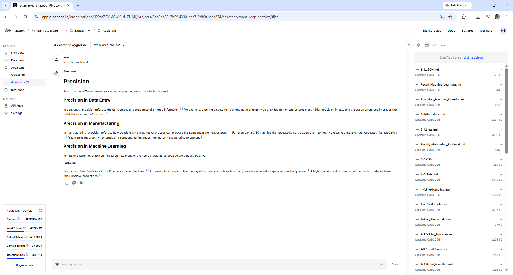
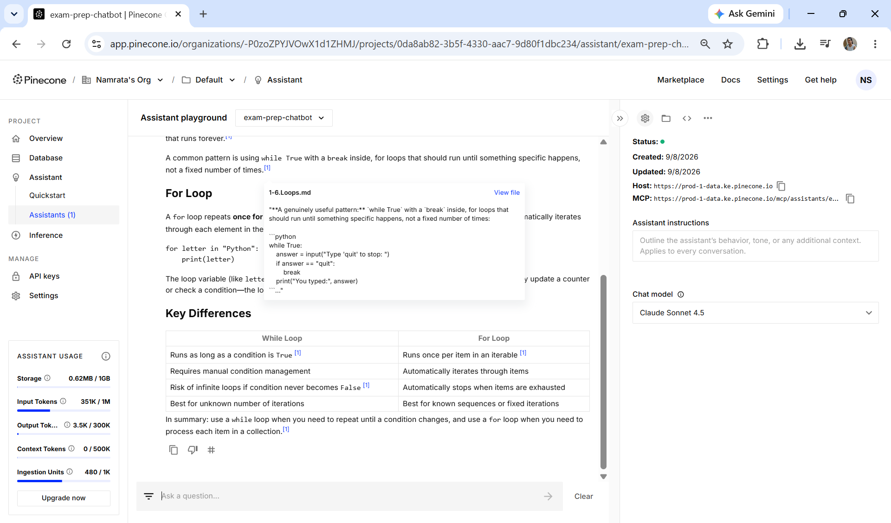

# Common Failure Modes

---

## Learning Objectives

By the end of this topic, you should be able to:

- Identify the four most common RAG failure modes in Pinecone Assistant
- Deliberately reproduce each failure mode as a controlled experiment
- Diagnose which stage of the pipeline caused each failure
- Apply the correct fix for each failure mode in Pinecone
- Connect each experiment result to your golden dataset verified answers

---

## Overview

The How RAG Hallucinates topic showed five specific hallucination patterns and how to diagnose them from the answer alone. This topic is more practical — it covers the four most common failure modes that occur in real RAG pipelines, shows exactly how to reproduce each one in Pinecone, and explains how to fix them.

The four failure modes are:

- **Bad chunking** — documents are split in a way that breaks meaning and returns incomplete or irrelevant content
- **Wrong embeddings** — semantic search returns chunks that are topically related but do not actually answer the question
- **Augmentation overflow** — too many chunks retrieved, context becomes too large and Claude loses focus
- **Missing citations** — answer generated without source references, making it impossible to verify

Each one is a controlled experiment. You set up the failure, observe what breaks, identify which pipeline stage failed, apply the fix, and compare the result against your golden dataset verified answers.

---

## Failure Mode 1 — Bad Chunking

### What It Is

Bad chunking happens when a document is split at the wrong points — cutting a sentence in half, separating a concept from its explanation, or grouping unrelated content into the same chunk. The retrieved chunk contains only part of the answer — or contains so much irrelevant content that the relevant part is buried.

### What the Student Sees

The answer is incomplete, cuts off mid-explanation, or gives a partial definition that leaves the student more confused than before.

### How to Reproduce It in Pinecone

Upload a document that has no clear structure — no headings, no paragraph breaks, just a continuous wall of text covering multiple topics.

**Steps:**
1. Create a text file where all your notes are merged into one paragraph with no line breaks or headings
2. Click the **folder icon** 📁 in the playground

> ⚠️ **Before uploading — delete any previous version of this document first.** Click the three dots `...` next to the old file in the files panel and select **Delete**. If the old version stays, Pinecone searches both files and the bad chunks from the old version will still affect results.

3. Upload the unstructured file
4. Wait for **Available** status
5. Ask a specific question from your golden dataset — for example "What is a while loop?"
6. Observe that the answer may be cut off or start in the middle of a concept

### What the Answer Looks Like

```text
Student: "What is a while loop?"

Expected (from golden dataset):
"A while loop repeats as long as a condition stays True.
It is used when you do not know in advance how many times to repeat."

What bad chunking produces:
"...not a fixed number of times [Source 1]. The condition must
eventually become False otherwise the loop runs forever [Source 1]."

The answer starts mid-sentence. The chunk was cut in the middle
of the explanation — the beginning of the definition is in a
different chunk that was not retrieved.
```

Here is what the Pinecone files panel looks like when multiple well-structured files are uploaded — each file covers one focused topic, producing clean chunks:


Compare this to uploading one large unstructured file — Pinecone has no natural boundaries to split at and cuts arbitrarily.

### Which Stage Failed

**Retrieve stage** — the chunks were created badly during the upload phase. The right document was found but the retrieved chunk does not contain the complete answer.

### How to Fix It in Pinecone

**Fix 1 — Structure the document before uploading**
Add clear headings and paragraph breaks. Pinecone splits at natural boundaries when they are present. One concept per paragraph, one topic per section.

**Fix 2 — Split into smaller files**
Instead of one large file covering ten topics, upload ten smaller files — one per topic. Each file produces focused chunks that cover one idea completely.

> ⚠️ **Always delete the old file before uploading the restructured version.** Click `...` → Delete next to the old file. If both versions exist, Pinecone searches both and bad chunks from the old version will still appear in results.

**Compare against golden dataset:** after fixing, ask the same question from your golden dataset. Compare the new answer against your verified correct answer. If they match — the fix worked.

---

## Failure Mode 2 — Wrong Embeddings

### What It Is

Wrong embeddings happen when semantic search retrieves chunks that are topically related to the question but do not actually contain the answer. The embedding vectors are similar in meaning — both are about the same general topic — but the specific content the student needs is in a different chunk that scored lower.

This is different from bad chunking. The chunks are well-formed. The document is well-structured. The problem is that the question and the answer use different vocabulary.

### What the Student Sees

The answer is about the right general topic but misses the specific point. It explains something adjacent to what was asked rather than answering directly.

### How to Reproduce It in Pinecone

Ask a question using vocabulary that is different from how the notes express the same concept.

**Steps:**
1. Find a concept in your notes that has a technical name — for example "while loop"
2. Ask using casual language — "how do I make code repeat until something stops?"
3. Compare the answer to your golden dataset verified answer for this question

### What the Answer Looks Like

```text
Student: "How do I make code repeat until something stops?"

Notes contain: "A while loop repeats as long as a condition stays True."

Answer retrieved instead: "A for loop iterates over each item in a
sequence [Source 1]. You can loop over a range of numbers using
range() [Source 1]."

The answer is about for loops — related to repetition, but not the
direct answer. The casual phrasing matched for loop chunks higher
than the while loop definition chunk.
```

### Which Stage Failed

**Retrieve stage** — the right document exists in Pinecone but the similarity score between the question vector and the correct chunk vector was lower than for related chunks. The wrong chunk won the similarity comparison.

### How to Fix It in Pinecone

**Fix 1 — Use exact terminology from the notes**
Ask "what is a while loop?" instead of "how do I make code repeat?" The closer the question vocabulary to the notes vocabulary, the higher the similarity score for the right chunk.

**Fix 2 — Add a glossary file**
Upload a small separate file mapping casual language to technical terms — "repeat until something stops = while loop." This gives Pinecone a bridge between natural language and technical notes.

**Fix 3 — Ask a follow-up**
If the first answer is adjacent, ask a follow-up using the technical term from that answer: "explain while loops specifically."

**Compare against golden dataset:** after fixing, ask the same question using the exact technical term and compare against your verified correct answer.

---

## Failure Mode 3 — Augmentation Overflow

### What It Is

Augmentation overflow happens when too many chunks are retrieved and combined into the context. The total content becomes so large that Claude cannot effectively focus on the most relevant parts. Important information gets buried under less relevant content and the answer becomes vague or misses key details.

This was introduced as Category 2 — Augmentation Failure in the RAG Failure and Recovery topic. Here is how to reproduce and fix it specifically.

### What the Student Sees

The answer covers the topic broadly but misses specific details. It reads like a summary of many related concepts rather than a direct answer to the question. The student asked for one thing and got a general overview instead.

### How to Reproduce It in Pinecone

Upload many files covering overlapping topics so that multiple chunks all have similar similarity scores and all get retrieved together.

**Steps:**
1. Upload 10 or more files that all cover related topics — for example all your Python notes together with programming tutorials and documentation
2. Ask a specific question — "what is the difference between a while loop and a for loop?"
3. Pinecone retrieves chunks from multiple files simultaneously
4. The answer covers many loop-related concepts but does not directly compare while vs for

You already saw this in the RAG Failure and Recovery topic — the "What is precision?" question returned answers from data entry, manufacturing, and machine learning all blended together:



### Which Stage Failed

**Augment stage** — retrieval found many related chunks. The assembly stage combined too many of them into the prompt. Claude received a large mixed context and could not identify which parts to focus on.

### How to Fix It in Pinecone

**Fix 1 — Organise files by topic**
Keep files focused — one topic per file. When Pinecone retrieves chunks from one focused file, the context stays coherent.

**Fix 2 — Ask a more specific question**
A vague question retrieves many loosely related chunks. A specific question retrieves fewer, more relevant chunks. "What is precision in machine learning?" retrieves ML-specific chunks rather than all precision-related chunks.

**Fix 3 — Delete unrelated files**
If your Pinecone assistant has files from multiple domains uploaded together, delete the ones not relevant to the current question domain. Use separate assistants for separate subject areas.

**Compare against golden dataset:** after fixing, ask the same question and compare the focused answer against your verified correct answer.

---

## Failure Mode 4 — Missing Citations

### What It Is

Missing citations happen when the answer is generated without `[Source N]` references — or with fewer citations than expected. The student cannot verify where each claim came from. The answer may be correct, partially correct, or hallucinated — but there is no way to check.

### What the Student Sees

A well-formatted answer with no citation numbers. Or an answer where some sentences have citations and others do not — the uncited sentences are the ones to be suspicious of.

### How to Reproduce It in Pinecone

Clear the Assistant instructions box and ask a question.

**Steps:**
1. Open your Pinecone Assistant
2. Select all the text in the **Assistant instructions** box and delete it — leave it completely empty
3. Ask any question from your golden dataset
4. Observe the answer — some citations may still appear (Pinecone adds them automatically) but the explicit per-claim citation format will be inconsistent

### What the Answer Looks Like

```text
With instructions (correct):
"A while loop repeats as long as a condition stays True [Source 1].
It is used when you do not know how many times to repeat [Source 1]."

Without instructions (missing citations):
"A while loop repeats as long as a condition stays True. It is used
when you do not know how many times to repeat. The most common use
case is reading user input until a quit command is entered."

The last sentence has no citation — it came from general training.
Without the citation instruction, the model did not flag its source.
```

You already saw this in the RAG Failure and Recovery topic — the screenshot showed an answer generated with the Assistant instructions box completely empty:



Notice the right panel — the Assistant instructions box shows only the placeholder text. The answer still has some `[1]` citations because Pinecone adds them automatically — but without the explicit instruction, uncited sentences from general training slip through.

### Which Stage Failed

**Generate stage** — retrieval worked correctly, the right chunks were in the context. But without the system prompt instruction to cite every claim, the model generated freely — mixing retrieved content with general training without marking which was which.

### How to Fix It in Pinecone

**Fix — Restore the Assistant instructions**

Paste this back into the Assistant instructions box:

```text
You are an exam preparation assistant for a BTech AI programme.
Answer the student's question using only the lecture notes provided.
After each factual claim cite the source in square brackets — for example [Source 1].
Every sentence that contains a factual claim must end with a citation.
If the notes do not contain enough information to answer the question,
say so clearly rather than guessing.
```

The addition of "Every sentence that contains a factual claim must end with a citation" is stronger than the original instruction — it leaves no ambiguity.

**Compare against golden dataset:** after restoring instructions, ask the same question and verify that every factual sentence now has a citation.

---

## The Four Failure Modes — Side by Side

| Failure Mode | Stage | What breaks | What the student sees | Fix |
|---|---|---|---|---|
| **Bad chunking** | Retrieve | Chunks cut mid-sentence | Incomplete or cut-off answers | Structure document with headings; split into smaller files |
| **Wrong embeddings** | Retrieve | Related but incorrect chunks retrieved | Adjacent topic answered instead | Use exact terminology from the notes |
| **Augmentation overflow** | Augment | Too many chunks from mixed topics | Vague general overview instead of direct answer | One topic per file; ask more specific question |
| **Missing citations** | Generate | No source references in answer | Answer cannot be verified | Restore Assistant instructions with citation requirement |

---

## The Experiment — Breaking and Fixing All Four

Work through each failure mode as a controlled experiment using your golden dataset questions. Record the results in this table:

| Experiment | Golden dataset question | Expected answer | What broke | Which stage | Fix applied | Answer after fix | Match? |
|---|---|---|---|---|---|---|---|
| Bad chunking | | | | Retrieve | | | |
| Wrong embeddings | | | | Retrieve | | | |
| Augmentation overflow | | | | Augment | | | |
| Missing citations | | | | Generate | | | |

**How to fill the table:**
- **Expected answer** — copy from your golden dataset verified answers created in File 1
- **What broke** — describe the specific problem in the answer you received
- **Fix applied** — what you changed in Pinecone
- **Answer after fix** — what the chatbot said after fixing
- **Match?** — does the fixed answer match your golden dataset verified answer? Yes or No

This table is your lab record. It is what you submit as evidence that you deliberately broke and fixed the pipeline.

---

## Where This Fits in the Journey

```text
RAG Failure and Recovery (intro)
Three failure categories, golden dataset created
        ↓
How RAG Hallucinates
Five hallucination patterns and diagnosis checklist
        ↓
Common Failure Modes  ←── YOU ARE HERE
Bad chunking — Retrieve stage
Wrong embeddings — Retrieve stage
Augmentation overflow — Augment stage
Missing citations — Generate stage
Each broken deliberately, fixed, compared to golden dataset
        ↓
Evaluation Against the Golden Dataset
All 10 test questions run before and after all fixes
Full before and after comparison documented
        ↓
When to Refuse vs When to Guess
Final boundary configured
```

---

## Best Practices

- Always delete the old file before uploading a restructured version — if both versions exist, Pinecone searches both and bad chunks from the old version will still appear
- Compare every fix against your golden dataset verified answers — the golden dataset is the only objective measure of whether the fix actually worked
- Run your full golden dataset after each fix, not just the question that failed — a fix for one failure mode sometimes introduces a different one
- Fix one thing at a time — changing multiple settings simultaneously makes it impossible to know which change fixed the problem
- Keep a second Pinecone assistant as your backup — create a clean copy before starting experiments so you can always return to the working version

## Common Beginner Mistakes

- **Confusing bad chunking with wrong embeddings** — both produce wrong content in the answer but for different reasons. Bad chunking: the chunk itself is incomplete. Wrong embeddings: the chunk is complete but it is the wrong chunk. Check the citation popup — if the chunk is cut off, bad chunking. If the chunk is complete but about a different aspect, wrong embeddings.
- **Not deleting the old file before uploading the restructured version** — Pinecone searches all uploaded files. The old unstructured version still produces bad chunks even after the new one is uploaded.
- **Declaring the fix worked without checking the golden dataset** — an answer that looks better is not the same as an answer that matches the verified correct answer. Always compare against the golden dataset.
- **Restoring instructions but not checking all questions** — citations may reappear for simple questions but still be missing for complex multi-part questions. Run the full golden dataset.

---

## Key Takeaways

- The four most common RAG failure modes are bad chunking, wrong embeddings, augmentation overflow, and missing citations
- Bad chunking and wrong embeddings are both Retrieve stage failures — but with different causes and different fixes
- Augmentation overflow is an Augment stage failure — too many chunks retrieved from too many overlapping files
- Missing citations is a Generate stage failure — caused by a missing or weak system prompt
- The golden dataset is the tool that tells you objectively whether a fix worked — compare every fixed answer against the verified correct answer
- Always delete old files before uploading restructured versions — Pinecone searches everything that is uploaded

> **Interview tip:** If asked "what are common RAG failure modes and how would you fix them?" — name all four, identify which pipeline stage each belongs to, and describe one specific fix for each. Most candidates name hallucination as the only failure mode. Distinguishing bad chunking from wrong embeddings — both Retrieve stage failures with different causes — and naming augmentation overflow as a separate Augment stage failure shows you understand the full pipeline at a diagnostic level.

---

## Reference Links

- 📎 [Pinecone — Chunking Strategies](https://www.pinecone.io/learn/chunking-strategies/)
- 📎 [Anthropic — Reducing Hallucination](https://docs.anthropic.com/en/docs/test-and-evaluate/strengthen-guardrails/reduce-hallucinations)
- 📎 [Pinecone Assistant — Documentation](https://docs.pinecone.io/guides/assistant/quickstart/sdk-quickstart)
- 📎 [Anthropic — RAG Guide](https://docs.anthropic.com/en/docs/build-with-claude/retrieval-augmented-generation)
