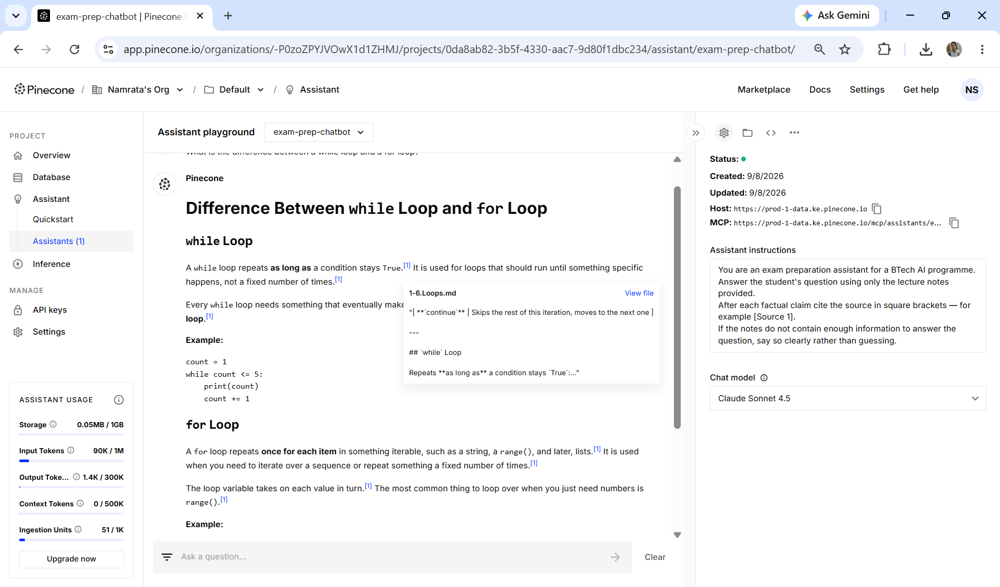
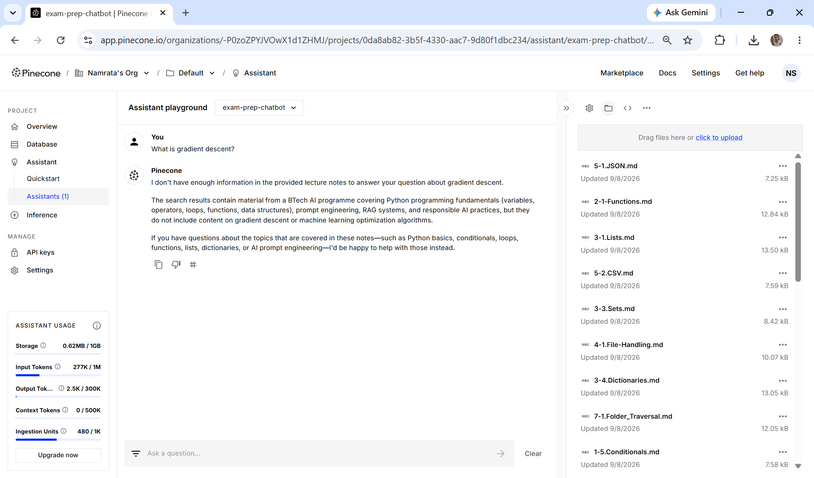

# Evaluation Against the Golden Dataset

---

## Learning Objectives

By the end of this topic, you should be able to:

- Explain what a golden dataset is and why it is the most reliable evaluation tool for RAG
- Build a 10-question golden dataset covering all four question types
- Run a systematic before-and-after evaluation of your Pinecone chatbot
- Interpret evaluation results to identify which failure modes are still present
- Document findings in a structured evaluation table for the lab submission

---

## Overview

The golden dataset concept was introduced in the Evaluation module — a fixed set of inputs with verified correct outputs used to measure whether an AI system is working correctly. The Evaluation module used it to score AI-generated product descriptions against a rubric. This topic applies that same approach to the RAG pipeline: instead of product descriptions, the inputs are student questions; instead of copywriting quality, what is measured is whether the right chunks are retrieved and the right answer is generated.

The previous three topics covered how RAG hallucinates, the four common failure modes, and how to reproduce and fix each one. Each fix was tested by asking the same question again and checking whether the answer improved.

But "improved" is subjective. One person may think a vaguer answer is better. Another may think an answer with more detail is better even if it goes beyond the notes. Without a fixed reference to compare against, evaluation is guesswork.

A **golden dataset** removes the subjectivity. It is a fixed set of questions with verified correct answers that you write yourself — before running the chatbot — based on reading the notes directly. Every chatbot answer is then compared against the verified answer. Either it matches — pass — or it does not — fail. No guesswork.

The golden dataset was introduced in the RAG Failure and Recovery intro topic. This topic shows how to build it properly and how to use it to run a complete before-and-after evaluation of the pipeline.

---

## What a Golden Dataset Is

A golden dataset has three parts for each question:

**The question** — what the student would type into the chatbot.

**The verified correct answer** — what the correct answer should be, written by you based on reading the uploaded notes directly. This is not what you think the answer should be from general knowledge. It is what the notes actually say.

**The expected source** — which uploaded file the answer should come from. This tells you not just whether the answer is correct, but whether the right chunk was retrieved.

```text
Example golden dataset entry:

Question: "What is the difference between a while loop and a for loop?"

Verified correct answer:
"A while loop repeats as long as a condition stays True. It is used
when you do not know in advance how many times to repeat. A for loop
repeats once for each item in a sequence. It is used when iterating
over a known collection of items."

Expected source: 1-6.Loops.md
```

The verified correct answer must come from the notes — not from your memory and not from general knowledge. Open the file, read it, and write the answer based on what it says.

---

## Building Your Golden Dataset — 10 Questions

Your golden dataset needs 10 questions covering all four types. This ensures the evaluation tests every aspect of the pipeline.

### Type 1 — Direct Concept (4 questions)

A direct concept question asks for a definition or explanation of one specific topic in the notes.

**Why it tests RAG:** checks whether the right chunk is retrieved for a straightforward question. The easiest type to answer correctly — if the chatbot fails here, the pipeline has a fundamental problem.

**Examples using the Python notes:**
- "What is a while loop?"
- "What is the difference between `if` and `elif`?"
- "What is a function in Python?"
- "What is exception handling?"

### Type 2 — Comparison (2 questions)

A comparison question asks about the difference or relationship between two concepts.

**Why it tests RAG:** checks whether multiple relevant chunks are retrieved and combined correctly. Harder than direct concept — requires the chatbot to find content about both items and synthesise them.

**Examples:**
- "What is the difference between a while loop and a for loop?"
- "What is the difference between a list and a dictionary?"

### Type 3 — Out of Scope (2 questions)

An out-of-scope question asks about something that is definitely not in the uploaded notes.

**Why it tests RAG:** checks whether the chatbot correctly refuses rather than hallucinating. The verified correct answer for this type is always a refusal — "This topic is not covered in the provided notes."

**Examples:**
- "What is gradient descent?"
- "What is the French Revolution?"

### Type 4 — Edge Case (2 questions)

An edge case question asks about something that is partially in the notes or where the notes give limited information.

**Why it tests RAG:** checks whether the chatbot handles incomplete information correctly — does it answer from the limited notes, admit what is missing, or hallucinate to fill the gap?

**Examples:**
- "What happens if you forget to update the counter in a while loop?"
- "Can a function return more than one value in Python?"

---

## Your Golden Dataset Template

Fill this in before running any chatbot evaluation. Write the verified correct answer by reading the uploaded notes directly — not from memory.

| # | Type | Question | Verified correct answer | Expected source file |
|---|---|---|---|---|
| 1 | Direct concept | | | |
| 2 | Direct concept | | | |
| 3 | Direct concept | | | |
| 4 | Direct concept | | | |
| 5 | Comparison | | | |
| 6 | Comparison | | | |
| 7 | Out of scope | | | |
| 8 | Out of scope | | | |
| 9 | Edge case | | | |
| 10 | Edge case | | | |

**Rule:** complete this table in full before asking the chatbot a single question. Once the golden dataset is written, do not change it — it must be fixed before evaluation begins. Changing the verified answers after seeing the chatbot's output defeats the purpose.

---

## Running the Evaluation — Before and After

The evaluation runs twice — once before applying fixes, and once after. The before evaluation captures the baseline state of the pipeline. The after evaluation shows whether the fixes worked.

### Before Evaluation — Baseline

**Steps:**
1. Open your Pinecone Assistant with the original setup — the files uploaded during the previous module, the original Assistant instructions
2. Ask each of your 10 golden dataset questions one by one
3. For each answer, record:
   - The exact answer the chatbot gave
   - Which sources were cited
   - Whether the cited source matches the expected source
   - Pass or Fail against the verified correct answer

**Scoring:**
- **Pass** — the chatbot answer matches the verified correct answer and the cited source matches the expected source
- **Partial** — the content is mostly correct but the source is wrong, or the answer is incomplete
- **Fail** — the answer is wrong, off-topic, or the chatbot answered when it should have refused

Here is what a passing answer looks like — the question is answered with citations, the source file matches the expected source, and every claim traces back to the uploaded notes:



### After Evaluation — Post-Fix

**Steps:**
1. Apply all the fixes from the Common Failure Modes topic — restructured documents, restored instructions, focused file organisation
2. Ask the same 10 questions again in the same order
3. Record the same information for each answer
4. Compare the before and after results

---

## The Evaluation Table

Fill this table during and after the evaluation. One row per question, two answer columns — before fix and after fix.

| # | Question | Verified answer | Expected source | Answer before fix | Source cited before | Pass/Fail before | Answer after fix | Source cited after | Pass/Fail after |
|---|---|---|---|---|---|---|---|---|---|
| 1 | | | | | | | | | |
| 2 | | | | | | | | | |
| 3 | | | | | | | | | |
| 4 | | | | | | | | | |
| 5 | | | | | | | | | |
| 6 | | | | | | | | | |
| 7 | | | | | | | | | |
| 8 | | | | | | | | | |
| 9 | | | | | | | | | |
| 10 | | | | | | | | | |
| **Score** | | | | | | **/10** | | | **/10** |

**The score is the number of Pass results out of 10.** A score of 7 or above after fixes means the pipeline is reliable enough for student use. Below 7 means more investigation is needed.

---

## How to Interpret the Results

### If out-of-scope questions fail (Type 3)

The chatbot answered when it should have refused. This is a Generate stage failure. A correct out-of-scope response looks like this — the chatbot says it does not have enough information and explains what the notes do cover instead:



If your chatbot does not refuse like this and instead answers from general knowledge, fix by strengthening the refusal instruction in Assistant instructions:

```text
If the notes do not contain the answer to the question, respond with:
"This topic is not covered in the provided notes."
Do not attempt to answer from general knowledge under any circumstances.
```

### If comparison questions fail (Type 2)

The chatbot gave a partial answer or confused the two items. This is either a Retrieve stage failure (the right chunks were not retrieved) or an Augmentation overflow (too many chunks retrieved from different topics).

Fix: ask the question using the exact terminology from the notes. If still failing, split the notes into smaller files — one topic per file.

### If direct concept questions fail (Type 1)

The most serious failure. If the chatbot cannot answer a straightforward definition question from the notes, check:
- Is the file uploaded and showing Available status?
- Is the question using the same vocabulary as the notes?
- Is the chunk for this concept complete — or was it cut mid-sentence?

### If edge case questions fail (Type 4)

Expected — edge cases are designed to be harder. The chatbot should give a partial answer and acknowledge what the notes do not cover. If it halluccinates instead, strengthen the uncertainty instruction:

```text
If the notes provide only partial information, state what they do say
and explicitly note: "The provided notes do not cover this in detail."
```

### If the source cited is wrong but the content is correct

Pattern 4 — Wrong Citation from the How RAG Hallucinates topic. The answer is grounded but the attribution is inaccurate. Add the verification follow-up question:

```text
For each claim in your previous answer, quote the exact sentence
from the source that supports it.
```

---

## Reading the Before/After Comparison

The comparison between before and after scores tells you whether the fixes had the intended effect.

**Score improved significantly (e.g. 4/10 → 8/10):**
The fixes worked. The specific questions that moved from Fail to Pass tell you which failure mode was most impactful.

**Score improved slightly (e.g. 6/10 → 7/10):**
Partial improvement. Review the remaining failures — they likely belong to a different failure mode that was not addressed by the fixes applied.

**Score did not improve (e.g. 5/10 → 5/10):**
The fix did not address the root cause. Go back to the diagnosis checklist from the How RAG Hallucinates topic and re-examine the failing questions.

**Score decreased (e.g. 7/10 → 5/10):**
A fix introduced a new failure. Most likely caused by changing multiple things at once. Restore one change at a time and re-test after each change.

---

## Where This Fits in the Journey

```text
RAG Failure and Recovery (intro)
Three failure categories, golden dataset introduced
        ↓
How RAG Hallucinates
Five patterns, diagnosis checklist
        ↓
Common Failure Modes
Four failure modes broken and fixed
        ↓
Evaluation Against the Golden Dataset  ←── YOU ARE HERE
10-question golden dataset built
Before and after evaluation run
Results interpreted and documented
        ↓
When to Refuse vs When to Guess
Final boundary configured
Stress-tested chatbot ready
```

---

## Best Practices

- Write the verified correct answer by reading the notes, not from memory — the golden dataset is only reliable if the answers come from the actual source
- Never change the golden dataset after seeing the chatbot's output — the value comes from fixing the answers before evaluation, not adjusting them to match
- Run the full 10 questions for every evaluation — spot-checking 3 questions is not enough to know whether the pipeline is reliable
- Record the exact chatbot answer, not a summary — exact wording matters when comparing before and after
- Keep the before evaluation results even if they are bad — the improvement from before to after is what demonstrates the fixes worked

## Common Beginner Mistakes

- **Writing the verified answer from memory rather than from the notes** — if the notes explain something differently from general convention, the chatbot should match the notes. The golden dataset must reflect what the notes say, not what is generally true.
- **Changing the golden dataset after seeing the chatbot answers** — this invalidates the evaluation. The dataset must be fixed before evaluation begins.
- **Only evaluating after fixes without a before baseline** — without the before score, there is no way to demonstrate that the fixes actually improved anything. Always run before first.
- **Counting a wrong citation as a pass** — if the content is correct but the source is wrong, that is a Partial at best. The citation is the verification mechanism — a wrong citation means the student cannot verify the claim.

---

## Key Takeaways

- A golden dataset is a fixed set of 10 questions with verified correct answers written before running the chatbot — it removes subjectivity from evaluation
- The four question types — direct concept, comparison, out of scope, edge case — ensure every part of the pipeline is tested
- Evaluation runs twice — before fixes to capture the baseline, and after fixes to measure improvement
- The score tells you how reliable the pipeline is — 7 or above out of 10 means reliable enough for student use
- A wrong citation is not a pass — citation accuracy is part of what the golden dataset evaluates
- The comparison between before and after scores is the evidence that the fixes worked

> **Interview tip:** If asked "how would you evaluate a RAG pipeline?" — describe the golden dataset approach: fixed questions written before running the system, covering four types (direct concept, comparison, out of scope, edge case), verified answers from the source documents, before and after comparison. Most candidates say "I would test it with some questions." Describing a systematic evaluation framework with before/after comparison and specific scoring criteria shows you think about AI system quality rigorously.

---

## Reference Links

- 📎 [Anthropic — Evaluating AI Systems](https://docs.anthropic.com/en/docs/test-and-evaluate/eval-intro)
- 📎 [Pinecone — RAG Evaluation](https://www.pinecone.io/learn/retrieval-augmented-generation/)
- 📎 [Anthropic — RAG Guide](https://docs.anthropic.com/en/docs/build-with-claude/retrieval-augmented-generation)
- 📎 [Pinecone Assistant — Documentation](https://docs.pinecone.io/guides/assistant/quickstart/sdk-quickstart)
