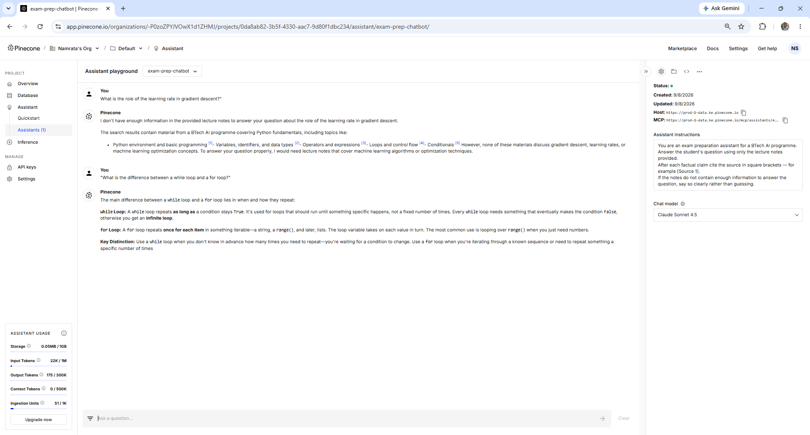
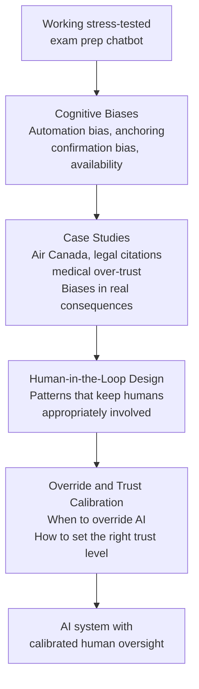

# Human Cognition and AI Oversight

---

## Learning Objectives

By the end of this topic, you should be able to:

- Explain what AI oversight means and why a technically correct AI system still needs it
- Describe the four cognitive biases that most commonly affect how people interact with AI
- Explain why human cognition is the missing piece after a RAG pipeline is built and stress-tested
- Identify where each cognitive bias appears in the exam prep chatbot scenario
- Explain what the trust calibration problem is and why it matters

---

## Overview

In the previous two modules you built an exam prep chatbot and stress-tested it. The pipeline retrieves the right chunks, generates cited answers, correctly refuses out-of-scope questions, and has been evaluated against a golden dataset. The system works.

But here is a question the previous modules never asked: **what happens after the answer appears on screen?**

A student reads the answer. They see `[Source 1]` next to every claim. The answer is fluent, well-structured, and directly addresses their question. They close the chatbot and start revising based on what it said.

Did they click on `[Source 1]` to verify the claim? Probably not. Did they notice that one sentence had no citation? Almost certainly not. Did they question whether the chatbot's explanation matches how their specific lecturer teaches the concept? Very unlikely.

The chatbot did its job correctly. The student still ended up with unverified information. The failure was not in the system — it was in how the human interacted with it.

This is what this module is about. **AI oversight** is not about fixing the AI — it is about understanding how humans interact with AI outputs, what cognitive patterns lead to over-trust or under-trust, and how to design systems that keep humans appropriately engaged.

The four theory topics cover:
- **Cognitive biases** — the four mental shortcuts that most commonly cause people to trust AI incorrectly
- **Case studies** — three real-world examples where cognitive bias led to serious harm
- **Human-in-the-loop design** — patterns for keeping humans appropriately involved in AI decisions
- **Override protocols and trust calibration** — when humans should override AI, and how to set the right level of trust

---

## What AI Oversight Actually Means

AI oversight is commonly misunderstood. It does not mean:
- Checking every AI output manually
- Distrusting AI by default
- Requiring a human to approve every decision the AI makes

It means **keeping humans appropriately involved** — engaged at the right moments, checking the right things, with the right level of trust for the specific task.

Think of it like a spell-checker. You do not read every word the spell-checker highlights and independently verify each suggestion against a dictionary. But you also do not accept every change blindly. You have calibrated your trust — you accept obvious corrections automatically and read carefully when the suggestion seems wrong. That calibrated engagement is what AI oversight looks like in practice.

For the exam prep chatbot, appropriate oversight means:
- Clicking citations on claims that will directly influence revision decisions
- Noticing when an answer is unusually confident about something the notes cover briefly
- Asking a follow-up question when the answer uses different terminology from the course
- Recognising when a question is on the edge of what the notes cover and treating the answer with more caution

None of these require checking every word. They require the student to stay engaged with the output rather than accepting it passively.

---

## Why Human Cognition Matters

The problem is that human brains are not designed for critical evaluation of fluent, well-formatted text. Several million years of evolution have equipped humans to:
- Trust sources that look authoritative
- Accept information that is presented confidently
- Reduce cognitive effort when processing familiar formats
- Remember conclusions more easily than the reasoning behind them

AI systems produce text that triggers all four of these shortcuts simultaneously. The output looks authoritative. It is presented confidently. It uses a familiar format (question followed by structured answer). And the conclusion — "gradient descent minimises the loss function by adjusting parameters" — is easy to remember and easy to act on, while the source verification step is cognitive effort that the brain naturally skips.

This is not a character flaw. It is how human cognition works. Understanding it is what allows you to design systems — and personal habits — that work with human cognition rather than against it.

---

## The Four Cognitive Biases in This Module

### Automation Bias

**What it is:** the tendency to trust automated system outputs more than human judgments — and to reduce personal effort in checking them because the system "already did that."

**In the exam prep chatbot:**
A student asks "what is the role of the learning rate in gradient descent?" The chatbot responds with a detailed, cited answer. The student reads the answer and moves on without clicking `[Source 1]`. They trust it because it came from an AI system that has been set up to cite sources — the citation format itself creates the impression that verification has already happened.

The citation format is designed to make verification easy. Automation bias causes the student to interpret the citation as evidence that verification has already been done — by the system.

Here is what the cited answer looks like in Pinecone:



The `[1]` markers appear throughout the answer. A student experiencing automation bias sees these and concludes the answer is verified — without clicking a single one.

**Real-world stakes:** in the Air Canada chatbot case, the customer trusted the chatbot's answer about bereavement fares because it came from an official airline system. The automated source created the impression of verified information. The customer never independently checked the airline's published policy.

---

### Anchoring

**What it is:** the tendency for the first piece of information received on a topic to disproportionately influence all subsequent thinking about that topic — even when later information contradicts it.

**In the exam prep chatbot:**
A student asks about gradient descent early in their revision session. The chatbot gives an answer that slightly mischaracterises the role of the learning rate — perhaps saying "the learning rate determines how quickly the model learns" instead of "the learning rate controls the size of each parameter update step." The student's understanding is now anchored to this characterisation.

Later, when they read the actual lecture notes that say "controls the size of each parameter update step" — they unconsciously interpret this through the lens of "how quickly the model learns." Two subtly different framings, one of which is from the notes and one of which is from the chatbot — but the chatbot's framing, because it came first, shapes how the student reads the notes.

**Real-world stakes:** in medical contexts, a doctor who receives an AI-generated diagnosis first anchors to that diagnosis. Subsequent information — test results, patient history, physical examination findings — gets interpreted through the lens of the initial AI suggestion. Diagnoses that contradict the AI output are more likely to be questioned or dismissed.

---

### Confirmation Bias

**What it is:** the tendency to search for, interpret, and remember information in a way that confirms what you already believe — and to discount information that contradicts it.

**In the exam prep chatbot:**
A student believes they understand backpropagation correctly. They ask the chatbot: "can you confirm that backpropagation works by propagating errors backward through the network?" The question is framed as a confirmation request. The chatbot, following the system prompt to answer from the notes, finds the relevant chunk and confirms the student's understanding.

But the student's understanding had a subtle error — they thought "errors" were propagated, when technically "gradients" are propagated. The chatbot found content that was close enough to confirm, and the student's existing belief was reinforced rather than corrected.

The framing of the question shaped the answer. And the student remembered the confirmation, not the nuance they missed.

**Real-world stakes:** legal researchers using AI tools to find supporting case law are more likely to enter search queries that confirm their existing legal theory — and less likely to search for contradicting precedents. The AI surfaces what was asked for. Confirmation bias means contradicting evidence is never requested.

---

### Availability Heuristic

**What it is:** the tendency to judge how likely or reliable something is based on how easily an example comes to mind — usually the most recent or vivid example.

**In the exam prep chatbot:**
A student uses the chatbot for a week. Most answers are correct and helpful. One day, the chatbot gives an impressive answer about a complex topic that the student had been struggling with for days — the answer is clear, well-structured, and exactly what they needed. This vivid positive experience becomes the mental reference point for "what this chatbot does."

Later, when the chatbot gives a subtly wrong answer about a different topic, the student's mind defaults to the vivid positive memory. The chatbot was so good that time — it must be right this time too. The availability heuristic causes them to overestimate reliability based on the most memorable experience rather than the actual track record.

**Real-world stakes:** pilots using autopilot systems report higher trust in autopilot after a sequence of successful flights — even when the base reliability rate has not changed. A single vivid success makes the system feel more reliable than the statistics justify.

---

## The Trust Calibration Problem

The four cognitive biases all produce the same underlying problem: **miscalibrated trust**.

Trust that is too high — automation bias, availability heuristic — causes humans to accept AI outputs without appropriate scrutiny. The harm is undetected errors acting as if they were verified facts.

Trust that is too low — over-reaction to a single failure, general AI scepticism — causes humans to ignore useful AI output and miss the genuine value the system provides.

**Calibrated trust** means trusting AI proportionally to its demonstrated reliability on the specific task being asked of it.

```text
The exam prep chatbot has a track record:
- Direct concept questions from the notes: highly reliable
- Comparison questions requiring multiple chunks: mostly reliable
- Edge cases at the boundary of the notes: less reliable
- Out-of-scope questions: should refuse — check if it does

Calibrated trust means:
- Direct concept answer: read, spot-check one citation
- Comparison answer: read carefully, click citations on key claims
- Edge case answer: read very carefully, verify against notes directly
- Out-of-scope answer: should not have appeared — if it did, do not use it
```

This is not uniform distrust. It is proportional scrutiny — more checking where the system is less reliable, less checking where it is more reliable.

The remaining topics in this module cover how to design systems that help humans achieve calibrated trust — rather than leaving it entirely to the individual's willpower to overcome cognitive bias.

---

## How the Four Topics Connect



Each topic builds on the previous one. Cognitive biases explain the problem. Case studies show the real consequences. Human-in-the-loop design provides the structural solutions. Override protocols and trust calibration provide the personal and organisational practices.

---

## Best Practices

- Treat fluent, well-formatted AI output with the same scrutiny you would apply to any other information source — fluency is not evidence of accuracy
- Develop a consistent verification habit for the specific task you are using AI for — not checking everything, but checking the right things proportionally
- When asking an AI system a question, notice whether the question is framed as a confirmation request — if it is, ask the question neutrally instead
- Remember that your most vivid positive experience with an AI system is not representative of its overall reliability — check the actual track record

## Common Beginner Mistakes

- **Treating the citation format as evidence of verification** — citations are generated by the model and can be wrong. The format signals that a source exists, not that the claim is correct
- **Using AI output as the starting point for understanding a new topic** — anchoring bias is strongest when you have no prior knowledge. For genuinely new topics, read the source material first, then use AI to clarify
- **Asking confirmation questions** — "can you confirm that X is true?" is a confirmation-biased question. Ask "what do the notes say about X?" instead
- **Generalising from the most memorable experience** — track the actual pass rate from your golden dataset evaluation, not your subjective sense of how good the system is

---

## Key Takeaways

- A technically correct AI system still requires human oversight — the failure point after the system works correctly is how humans interact with the output
- **AI oversight** means keeping humans appropriately involved — engaged at the right moments, checking the right things, with calibrated trust
- The four cognitive biases most relevant to AI use are: automation bias, anchoring, confirmation bias, and availability heuristic
- Each bias produces miscalibrated trust — either too high (accepting outputs without scrutiny) or too low (ignoring useful output)
- **Trust calibration** means trusting AI proportionally to its demonstrated reliability on the specific task — more scrutiny where the system is less reliable, less where it is more reliable
- The remaining topics cover the design patterns and protocols that help humans achieve calibrated trust systematically

> **Interview tip:** If asked "how do you ensure humans appropriately oversee AI systems?" — describe trust calibration rather than uniform checking. Explain that different tasks within the same system have different reliability profiles and should receive proportional scrutiny. Name automation bias and confirmation bias as the two most common failure modes in human-AI interaction. Most candidates say "humans should always check AI outputs" — describing calibrated, proportional scrutiny shows you understand both the value and the limits of human oversight.

---

## Reference Links

- 📎 [Anthropic — Human Oversight of AI Systems](https://www.anthropic.com/research/building-trustworthy-ai)
- 📎 [Air Canada Chatbot Ruling — CBC News](https://www.cbc.ca/news/canada/british-columbia/air-canada-chatbot-ruling-1.7116416)
- 📎 [Automation Bias in AI-Assisted Decision Making](https://www.sciencedirect.com/science/article/pii/S0747563220302521)
- 📎 [Anthropic — Responsible AI Development](https://www.anthropic.com/responsible-scaling-policy)
