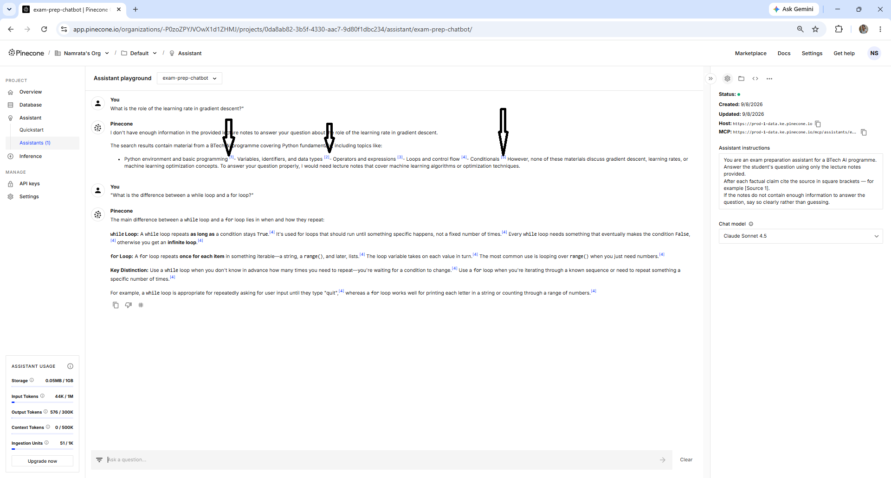

# Human-in-the-Loop Design

---

## Learning Objectives

By the end of this topic, you should be able to:

- Explain what human-in-the-loop means and why it is a design decision, not an afterthought
- Describe the three models of human involvement and when each is appropriate
- Identify where human checkpoints should be placed in an AI pipeline
- Explain the automation paradox and why high AI reliability can reduce human vigilance
- Apply human-in-the-loop thinking to the exam prep chatbot scenario

---

## Overview

The case studies showed three situations where AI oversight failed — not because the humans involved were careless, but because the systems were not designed to keep humans appropriately involved at the right moments. The Air Canada customer was not given a clear signal that the chatbot was the wrong source for policy decisions. The lawyer was not prompted to verify the citations. The physicians were not shown uncertainty indicators that would have triggered more scrutiny.

In each case, the oversight failure was a design failure. The system did not create the conditions for humans to engage at the right moment with the right information.

**Human-in-the-loop** (HITL) is the design approach that addresses this. It is not about having a human review every AI output — that eliminates the efficiency gain that made the AI worth building. It is about designing the system so humans are involved at the specific moments where human judgement is most valuable and AI reliability is most limited.

---

## What Human-in-the-Loop Actually Means

Think of it like a flight crew and autopilot. A modern aircraft spends the majority of a flight on autopilot — the system handles altitude, heading, and speed without continuous human input. But the pilots do not leave the cockpit. They monitor instruments, respond to alerts, make decisions at critical moments — takeoff, landing, turbulence, system warnings — where autopilot either cannot act or should not act alone.

Human-in-the-loop is the same principle. The AI handles the routine. Humans engage at the critical moments. The design question is: which moments are critical?

For the exam prep chatbot, the routine is: student asks a question, Pinecone retrieves relevant chunks, Claude generates a cited answer. The AI handles all of this automatically. The critical moments — where human engagement matters — are:

- When the answer will influence a revision decision for an important exam topic
- When the cited chunk does not clearly support the claim made
- When the question is at the edge of what the notes cover
- When the answer uses different terminology from the course

At these moments, the student needs to engage — not passively read and move on.

---

## The Three Models of Human Involvement

Not all AI systems need the same level of human involvement. The right model depends on two factors: the stakes of a wrong decision, and the AI system's demonstrated reliability on that specific task.

### Model 1 — Human Always Approves

The AI generates a recommendation or output. A human reviews it and explicitly approves or rejects before anything happens.

**When it is appropriate:**
- High stakes — a wrong decision causes significant harm
- Low AI reliability — the system is new, untested, or known to fail on this task type
- Irreversible decisions — once taken, the action cannot be undone

**Real-world examples:**
- A medical AI recommends a drug dosage — the doctor must review and prescribe, not the AI
- A loan approval AI recommends rejection — a human reviews the application before the decision is communicated
- An AI generates a legal document — a lawyer reviews and signs off before it is filed

**Exam prep chatbot equivalent:**
The student reads the chatbot's answer, clicks every citation, verifies each claim against the chunk, and only then adds the information to their revision notes.



 The chatbot output does not go directly into revision material without human review.

**The cost:** this model slows things down. Every output waits for human review. For low-stakes, high-volume tasks this cost is not justified. For high-stakes decisions it is essential.

---

### Model 2 — Human Reviews Exceptions

The AI operates automatically on the majority of cases. A human reviews only the cases that fall outside defined thresholds — low confidence, unusual inputs, edge cases.

**When it is appropriate:**
- Mixed stakes — most decisions are routine, some are consequential
- Demonstrated AI reliability — the system has a known, measured track record
- Defined exception criteria — you know in advance what makes a case exceptional

**Real-world examples:**
- A content moderation AI automatically approves most posts and flags a small percentage for human review
- A fraud detection AI automatically clears most transactions and holds a small percentage for analyst review
- An email triage AI automatically categorises most emails and routes uncertain ones to a human

**Exam prep chatbot equivalent:**
The student uses the chatbot's answers directly for routine clarification questions — "what does this syntax mean?", "give me an example of this concept." They apply full verification only for questions that will influence their understanding of an exam-critical topic.

**The cost:** this model requires defined exception criteria. Without them, the "exceptions" either expand to cover everything (back to Model 1) or shrink to nothing (effectively no oversight). The criteria must be set before the system is used — not decided case by case.

---

### Model 3 — Human Audits Periodically

The AI operates automatically. A human reviews a sample of outputs on a regular schedule — not every output, not only exceptions, but a random sample at defined intervals.

**When it is appropriate:**
- Lower stakes — individual wrong outputs have limited impact
- High AI reliability — the system has a strong, measured track record on this task
- High volume — reviewing every output is impractical

**Real-world examples:**
- A spell-checker runs automatically; a human editor reviews documents periodically for systematic errors
- An automated report generation system runs daily; a human reviews a sample of reports monthly
- A chatbot handles thousands of customer queries; a human reviews a random sample weekly to check for quality drift

**Exam prep chatbot equivalent:**
After a week of using the chatbot, the student reviews ten random answers they acted on — checking the cited sources against the actual chunks — to see if any errors slipped through. This is not checking every answer. It is periodic auditing to catch systematic problems before they accumulate.

**The cost:** this model can miss individual errors — only systematic errors show up in periodic auditing. If the AI makes one wrong answer in a hundred, a weekly audit sample of ten may not find it. This is acceptable when individual wrong answers have limited consequences.

---

## Choosing the Right Model

The choice between the three models is not a matter of preference. It follows from the stakes and the demonstrated reliability of the system on the specific task.

```text
                    HIGH STAKES
                         │
                         │
        Model 1          │          Model 1
   (human always         │     (human always
      approves)          │        approves)
                         │
LOW RELIABILITY ─────────┼───────── HIGH RELIABILITY
                         │
        Model 1          │          Model 2
   or Model 2            │     (human reviews
  (depends on            │       exceptions)
   reversibility)        │
                         │
                    LOW STAKES
                         │
                    Model 2 or 3
```

**The exam prep chatbot maps to Model 2 for most use.** The stakes are moderate — a wrong answer during revision can waste time and cause confusion, but the consequences are limited compared to a medical or legal error. The reliability is demonstrated for in-scope questions and verified as poor for out-of-scope questions. The exception criteria are clear: apply full verification when the answer influences understanding of an exam-critical topic.

---

## The Automation Paradox

The automation paradox is a documented phenomenon in human factors research: **the more reliable an automated system becomes, the less vigilant human monitors become — until the moment the system fails, when maximum vigilance is needed but minimum vigilance exists.**

Air France Flight 447 in 2009 is the most studied example. The autopilot disconnected suddenly during cruise flight due to sensor failure. The pilots, who had been largely passive monitors for hours of automated flight, had to manually fly the aircraft in high-altitude turbulence with minimal warning. Their response was confused and delayed. The aircraft entered an aerodynamic stall and crashed.

The paradox applies directly to AI oversight. The better the AI performs over time:
- The more the human reduces verification effort
- The more the human's verification skills atrophy from disuse
- The less alert the human is when an unusual case arrives
- The more consequential the human's failure to catch the error becomes — because by now the human has started acting on AI outputs without checking

**For the exam prep chatbot:** if the chatbot performs well for two weeks, a student will naturally reduce their citation-clicking habit. This is the automation paradox in action. The student who does not click citations in week three is at higher risk than the student who never clicked them — because in week three, the student believes the chatbot is reliable, which reduces scrutiny at exactly the moment when a failure would be most trusted.

**The countermeasure:** maintain the verification habit regardless of how well the system has been performing. Build the habit as a fixed process, not a response to perceived risk. The habit should not vary with the system's recent track record.

---

## Designing Human Checkpoints for the Exam Prep Chatbot

Applying human-in-the-loop design to the exam prep chatbot means deciding in advance — before each session — which model applies to which type of question.

**Before the session — set the checkpoint criteria:**

```text
Type of question                    → Oversight model
───────────────────────────────────────────────────────────────
"What does this syntax mean?"       → Model 3 (periodic audit)
"Give me an example of X"          → Model 3 (periodic audit)
"Explain this concept I'm stuck on" → Model 2 (verify if exam-critical)
"What is the difference between X   → Model 2 (verify citations)
 and Y?"
"Is my understanding of X correct?" → Model 1 (verify before acting)
"What will come up in the exam?"    → Model 1 (verify before acting)
```

**During the session — apply the model:**
- Model 3 questions: read the answer, use it, flag for next week's audit
- Model 2 questions: read the answer, click citations on exam-critical claims
- Model 1 questions: read the answer, click all citations, verify against notes before revising

**After the session — run the periodic audit:**
Once a week, pick five answers from your Model 3 and Model 2 interactions at random. Click the citations. Check the claims. If more than one in five has a problem, raise the oversight model for that question type.

---

## Where This Fits in the Module

```text
Human Cognition and AI Oversight (intro)
Four biases, trust calibration
        ↓
Cognitive Biases in AI Use
Each bias in practice, biases in training data
        ↓
Case Studies
Three real failures, three missing oversight mechanisms
        ↓
Human-in-the-Loop Design  ←── YOU ARE HERE
Three models of human involvement
Automation paradox
Checkpoint design for the exam prep chatbot
        ↓
Override Protocols and Trust Calibration
When to override AI, how to set the right trust level
```

---

## Best Practices

- Decide which oversight model applies to each question type before the session begins — do not decide case by case in the moment
- Set exception criteria in advance for Model 2 — "exam-critical topic" or "will influence revision notes" are clear criteria; "feels important" is not
- Maintain verification habits regardless of recent system performance — the automation paradox means high reliability is the moment most likely to reduce the vigilance that finds the next failure
- Run a weekly audit of a random sample of answers — even five answers per week provides a systematic check that catches quality drift before it accumulates
- When the AI performs unusually well on a complex question, note it — but do not let it raise your general oversight threshold

## Common Beginner Mistakes

- **Choosing the oversight model based on how the AI feels rather than what is at stake** — "this chatbot seems reliable" is not an oversight model. Reliability must be measured, not felt
- **Applying Model 1 to everything** — this eliminates the efficiency benefit of the AI and creates review fatigue. Save Model 1 for genuinely high-stakes decisions
- **Not setting exception criteria before starting** — without pre-defined criteria, Model 2 gradually becomes no oversight as the human decides fewer and fewer cases are exceptions
- **Reducing verification after a run of correct answers** — this is the automation paradox. Correct answers do not reduce the probability of the next answer being wrong

---

## Key Takeaways

- Human-in-the-loop is a design decision about which moments require human engagement — not a requirement to review every AI output
- The three models: Model 1 (human always approves) for high-stakes decisions, Model 2 (human reviews exceptions) for mixed-stakes with defined criteria, Model 3 (human audits periodically) for low-stakes high-volume tasks
- The right model follows from the stakes of a wrong decision and the demonstrated reliability of the system on that specific task
- The automation paradox: the more reliable the AI becomes, the less vigilant the human becomes — until the moment the AI fails, when maximum vigilance is needed but minimum vigilance exists
- For the exam prep chatbot: Model 2 applies to most use, with Model 1 for questions that will directly influence exam-critical revision
- Maintain verification habits regardless of recent system performance — the habit should be a fixed process, not a response to perceived risk

> **Interview tip:** If asked "how would you design human oversight into an AI system?" — describe the three models, explain how the choice between them depends on stakes and demonstrated reliability, and name the automation paradox as the reason that high reliability requires maintained vigilance rather than reduced vigilance. Most candidates say "have a human review the outputs." Describing three different models with different appropriate use cases — and naming the automation paradox — shows you understand oversight as an engineering problem with measurable trade-offs.

---

## Reference Links

- 📎 [Anthropic — Human Oversight of AI](https://www.anthropic.com/research/building-trustworthy-ai)
- 📎 [Air France 447 — BEA Official Report](https://www.bea.aero/en/investigation-reports/notified-accidents/2009/f-cp090601/f-cp090601.html)
- 📎 [Automation Bias in Clinical Decision Support — JAMIA](https://doi.org/10.1136/amiajnl-2011-000089)
- 📎 [Human Factors in Automation — FAA](https://www.faa.gov/data_research/research/med_humanfacs/oamtechreports/1990s/media/AM96AI-22.pdf)
