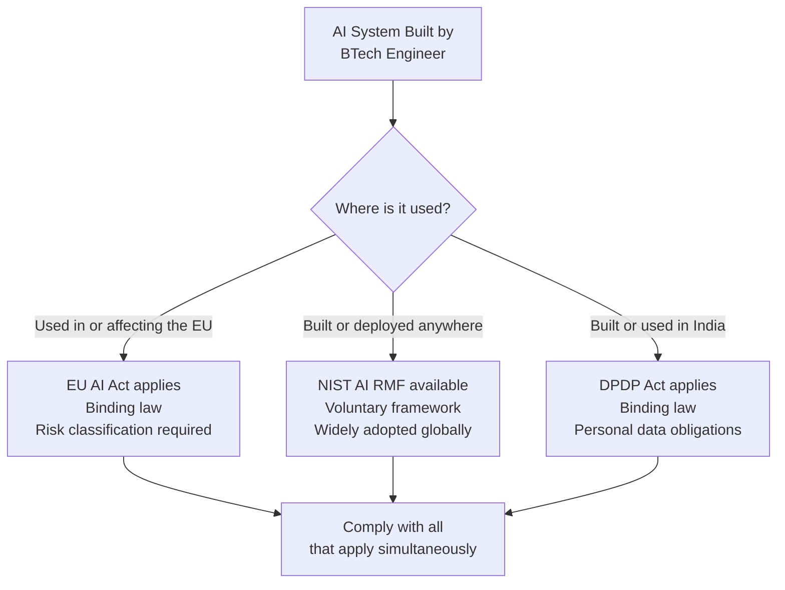
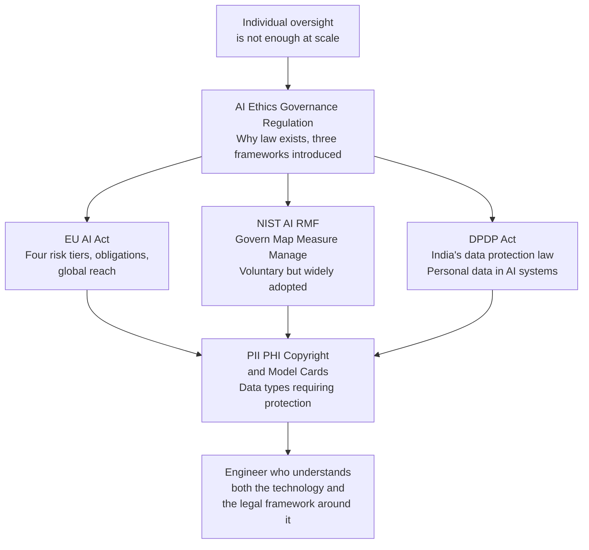

# AI Ethics, Governance and Regulation

---

## Learning Objectives

By the end of this topic, you should be able to:

- Explain the difference between AI ethics, AI governance, and AI regulation
- Describe why individual oversight alone is insufficient at scale and why law is needed
- Identify the three regulatory frameworks covered in this module and where each applies
- Place the exam prep chatbot within each framework at a high level
- Explain why a BTech engineer building AI in India needs to understand all three frameworks simultaneously

---

## Overview

The previous module covered how humans interact with AI — the cognitive biases that cause over-trust, the design patterns that keep humans appropriately involved, and the protocols for overriding AI recommendations. All of that was about what individuals and teams can do to use AI responsibly.

But there is a limit to what individual responsibility can achieve.

When one student uses the exam prep chatbot and trusts an unchecked answer, the cost is personal — a revision mistake. When a hospital deploys an AI diagnostic tool used by 500 doctors across 50,000 patients, individual trust calibration cannot catch every failure. When a company uses AI to screen job applications from 100,000 candidates, no individual oversight model covers every decision. When a government uses AI to allocate social benefits, individual good intentions do not create legal accountability for the people who are harmed.

At scale, voluntary good practice is not enough. This is why AI regulation exists.

This module covers the legal and governance frameworks that make AI oversight enforceable — not just recommended. Three frameworks are covered:

- **EU AI Act** — binding law in the European Union, with global reach
- **NIST AI Risk Management Framework** — voluntary framework, widely adopted in the US and internationally
- **DPDP Act** — India's binding data protection law, directly relevant to AI systems built and deployed in India

By the end of this module you will be able to classify an AI system under each framework, identify the obligations that apply, and understand what data types require special protection.

---

## Ethics vs Governance vs Regulation — Three Different Things

These three terms appear constantly in AI discussions and are frequently confused. They are not the same.

### AI Ethics

**Ethics** is about values — what ought to be done, what principles should guide decisions, what kind of AI systems are good or harmful.

Ethics is voluntary. An organisation can publish an AI ethics policy committing to fairness, transparency, and accountability. Nothing forces them to follow it. No external authority enforces it. No victim can take legal action when the policy is violated.

**Examples of AI ethics documents:**
- Anthropic's responsible scaling policy
- Google's AI principles
- The EU's Ethics Guidelines for Trustworthy AI (2019) — a non-binding document that preceded the binding EU AI Act

Ethics is the starting point — it defines the values that governance and regulation then make operational and enforceable.

### AI Governance

**Governance** is about how decisions are made and who is accountable for them — inside an organisation. It translates ethics principles into internal structures, processes, and accountability mechanisms.

Governance is internal. An AI governance framework tells a company: who approves AI deployments, what review process a new AI system must go through, who is responsible when an AI system causes harm, what documentation must be produced and maintained.

**Examples of AI governance structures:**
- An AI review board that must approve all new AI deployments
- A required bias testing process before any AI system goes to production
- A named AI ethics officer responsible for monitoring deployed systems

Governance is more concrete than ethics but still internal. A company with strong governance is harder to regulate because its internal processes already catch many problems. But governance without regulation means there is still no external enforcement when governance fails.

### AI Regulation

**Regulation** is law — externally enforceable obligations that apply regardless of what an organisation's internal ethics or governance says.

Regulation is mandatory. An organisation cannot opt out. Violation carries legal consequences — fines, injunctions, criminal liability. Victims have legal recourse through courts and tribunals.

**The Air Canada case illustrates the difference:**
- Air Canada may have had an AI ethics policy committing to accurate information
- Air Canada may have had AI governance processes for reviewing chatbot deployments
- But the customer could only recover compensation because a legal tribunal had jurisdiction — regulation, not ethics or governance, created the enforcement mechanism

```text
ETHICS          GOVERNANCE          REGULATION
(Values)        (Internal process)  (External law)

What should     How decisions       What must
be done         are made and        be done —
                who is              enforceable,
                accountable         with penalties
                internally

Voluntary       Internal to         Binding on
                organisation        all
```

---

## Why Individual Oversight Is Not Enough at Scale

The previous module's framework — calibrate trust, apply the right oversight model, override when justified — works well for an individual student using one chatbot. It breaks down in three specific ways as scale increases.

### Breakdown 1 — Volume

A single student can apply Model 2 oversight (verify citations on exam-critical claims) to 20 chatbot answers per session. A hospital using AI for diagnostic support processes 10,000 cases per day. Individual oversight applied to every case would require more human reviewers than the AI was supposed to replace. The efficiency gain disappears.

Regulation solves this by requiring the AI system itself to be designed in a way that makes failures less likely — not by requiring humans to catch every failure after the fact.

### Breakdown 2 — Consistency

Individual oversight quality varies. One student diligently clicks every citation. Another never does. One doctor applies appropriate scepticism to AI diagnostic suggestions. Another follows them without question. Individual variability in oversight quality means that an AI system's harm potential depends on who happens to be using it at any given moment.

Regulation solves this by requiring minimum oversight standards that apply regardless of individual behaviour — technical documentation, conformity assessments, mandatory human review checkpoints for high-risk decisions.

### Breakdown 3 — Accountability

When individual oversight fails and harm results, who is responsible? The user who did not check? The organisation that deployed the system? The developer who built it? Without regulation, accountability is unclear and legal recourse is uncertain.

Regulation solves this by assigning explicit responsibility — providers, deployers, and operators each have defined obligations and face defined consequences for non-compliance.

---

## The Three Frameworks — Where Each Applies



### EU AI Act — Binding Law With Global Reach

The EU AI Act came into force on 1 August 2024. It applies to any AI system that is placed on the market in the EU or whose output affects people in the EU — regardless of where the system was built or where the company is based.

A BTech student in Chennai building an AI system used by students in Germany must comply with the EU AI Act. The law follows the user, not the developer's location.

**What it does:** classifies AI systems into four risk tiers and assigns obligations based on risk. The higher the risk, the stricter the requirements.

### NIST AI Risk Management Framework — Voluntary but Influential

The US National Institute of Standards and Technology published the AI Risk Management Framework in 2023. It is not law — no penalty for non-compliance. But it is widely adopted by organisations as a structured approach to AI governance.

Many companies require their suppliers to comply with NIST AI RMF even when it is not legally required. Many government contracts reference it. It is the closest thing to a universal AI governance standard currently available.

**What it does:** provides a structured process for identifying, measuring, and managing AI risk across four functions — Govern, Map, Measure, Manage.

### DPDP Act — India's Data Protection Law

The Digital Personal Data Protection Act 2023 is India's primary data protection law. It governs how personal data is collected, stored, processed, and used — including in AI systems. It is directly relevant to any AI system built in India that processes data about Indian citizens.

**What it does:** defines obligations for data fiduciaries (organisations that collect and use personal data), sets consent requirements, establishes data principal rights (the rights of individuals whose data is used), and imposes penalties for violations.

---

## Where the Exam Prep Chatbot Sits — A Quick Classification

Before the detail of each framework, here is how the exam prep chatbot would be classified under each — enough to give you a concrete anchor.

| Framework | Classification | Key obligation |
|---|---|---|
| **EU AI Act** | Limited risk — it is a chatbot interacting with users | Must tell users they are interacting with AI. Claude (the underlying model) is a GPAI model with transparency obligations. |
| **NIST AI RMF** | Not legally required — but the four functions apply | Map the risks, measure reliability, manage failures, govern the deployment |
| **DPDP Act** | Applies if student data is processed | Student names, email addresses, and uploaded notes may constitute personal data requiring consent and protection |

The exam prep chatbot is relatively low risk under all three frameworks — but it is not risk-free. The student's uploaded notes may contain personal information. If the chatbot is deployed at a university, the university becomes a data fiduciary. If the chatbot is made available to students in the EU, EU AI Act transparency obligations apply immediately.

---

## How the Five Topics Connect



Each topic builds on the previous. The EU AI Act, NIST, and DPDP are covered in parallel — not as alternatives but as overlapping obligations that apply simultaneously to real systems.

---

## Best Practices

- Do not confuse an AI ethics statement with legal compliance — ethics is voluntary, regulation is not
- Do not assume the DPDP Act does not apply because your users are Indian — if any personal data is processed, DPDP obligations apply
- Do not assume the EU AI Act does not apply because you are in India — if your system affects EU users, EU law applies
- Read the model card before deploying any pre-trained model — it documents the model's known limitations, training data, and intended use cases
- Build governance structures before they are legally required — retrofitting governance onto an already-deployed system is significantly harder than building it in from the start

## Common Beginner Mistakes

- **Treating AI ethics as compliance** — publishing an ethics document does not constitute legal compliance. Ethics and regulation are separate
- **Assuming the law only applies to large companies** — the EU AI Act applies to any system affecting EU users, regardless of the size of the developer
- **Ignoring DPDP because "we are not a data company"** — any system that collects a user's name, email, or uploaded files is processing personal data under DPDP
- **Skipping model cards** — deploying a model without reading its model card is like using a medication without reading the label

---

## Key Takeaways

- **Ethics** is voluntary values, **governance** is internal process, **regulation** is external law — each is necessary but none is sufficient alone
- Individual oversight fails at scale in three ways: volume (too many decisions to check), consistency (individuals vary in scrutiny), and accountability (unclear responsibility when harm occurs)
- The **EU AI Act** is binding law applying globally to any system affecting EU users — four risk tiers, obligations scaled to risk
- The **NIST AI RMF** is a voluntary framework providing structured risk management — widely adopted, referenced in contracts and procurement
- The **DPDP Act** is India's binding data protection law — applies to any AI system processing personal data of Indian citizens
- A BTech engineer building AI in India for use in Europe must comply with both DPDP and the EU AI Act simultaneously
- The exam prep chatbot is limited risk under the EU AI Act, must comply with DPDP if student data is processed, and benefits from NIST RMF as a governance structure

This is the final technical module of the course. The modules that follow bring everything together — the automation toolkit, the RAG pipeline, the oversight framework, and the regulatory knowledge — into a complete picture of what it means to build AI systems responsibly. The journey from "what is a variable" to "what law governs this system and what does compliance look like" is the journey from a programmer to an AI engineer.

> **Interview tip:** If asked "what do you know about AI regulation?" — distinguish between ethics, governance, and regulation. Name all three frameworks, state where each applies and whether it is voluntary or binding. Explain that a system can be subject to multiple frameworks simultaneously. Most candidates name one framework vaguely. Naming all three with their geographic scope and binding status — and explaining that they overlap — shows you understand the regulatory landscape as a practising engineer must.

---

## Reference Links

- 📎 [EU AI Act — Full Text](https://artificialintelligenceact.eu/)
- 📎 [NIST AI Risk Management Framework](https://www.nist.gov/itl/ai-risk-management-framework)
- 📎 [DPDP Act 2023 — India](https://www.meity.gov.in/data-protection-framework)
- 📎 [Anthropic — Responsible Scaling Policy](https://www.anthropic.com/responsible-scaling-policy)
- 📎 [EU AI Act — High Level Summary](https://artificialintelligenceact.eu/high-level-summary/)
