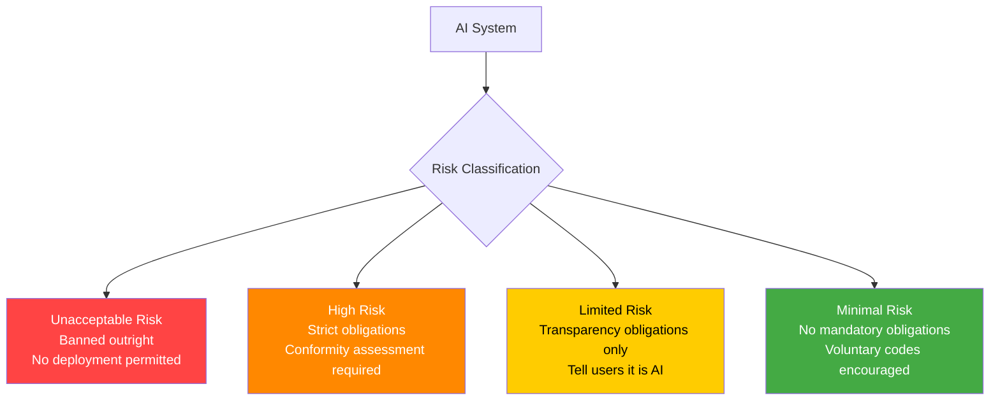

# The EU AI Act — Risk Categories and Obligations

---

## Learning Objectives

By the end of this topic, you should be able to:

- Describe the four risk tiers of the EU AI Act and give one example for each
- Identify which AI practices are banned under the Act and explain why
- Classify the exam prep chatbot and Claude under the Act
- Explain what obligations apply to limited-risk and high-risk AI systems
- Understand why the EU AI Act applies to systems built outside the EU

---

## Overview

The intro topic explained why regulation exists — individual oversight fails at scale and law creates enforceable accountability. The EU AI Act is the world's first comprehensive binding law specifically for AI systems. It came into force on 1 August 2024 and is being phased in through 2027.

It matters to every AI engineer — not just those working in Europe. The Act applies to any AI system that affects people in the EU, regardless of where the system was built or where the company is based. A BTech engineer in Bangalore building a chatbot used by students in Germany must comply with the EU AI Act.

This topic covers the four risk tiers, what is banned, what obligations apply at each tier, and where the exam prep chatbot sits.

---

## The Four Risk Tiers

The EU AI Act classifies every AI system into one of four tiers. Obligations are determined entirely by the tier — the higher the risk, the stricter the requirements.



---

### Tier 1 — Unacceptable Risk (Banned)

These AI practices are prohibited entirely. They represent threats to fundamental rights severe enough that no business justification can outweigh them.

**Banned since February 2025:**

| Banned practice | Why it is banned |
|---|---|
| Social scoring by public authorities | Using AI to score citizens on behaviour and restrict their access to services — the kind of system used in some countries to restrict travel or financial access based on government-assigned scores |
| Manipulative or deceptive AI that causes harm | AI that exploits psychological vulnerabilities, emotions, or weaknesses to change behaviour in ways that harm the person |
| Exploiting vulnerabilities of specific groups | AI that targets people based on age, disability, or socioeconomic status to manipulate their decisions |
| Untargeted facial image scraping | Building facial recognition databases by scraping images from the internet or CCTV without consent |
| Emotion recognition in workplaces and schools | Monitoring employees' or students' emotional states through AI — with narrow exceptions for safety |
| Real-time biometric identification in public spaces | Live facial recognition in public spaces by law enforcement — with narrow national security exceptions |

**For the exam prep chatbot:** none of these apply. The chatbot does not collect biometric data, does not score students, and does not manipulate behaviour.

---

### Tier 2 — High Risk

High-risk AI systems can be deployed — but only with strict obligations including conformity assessments, technical documentation, human oversight mechanisms, and registration in the EU database.

**High-risk domains include:**

| Domain | Example |
|---|---|
| Biometric identification | Facial recognition for building access |
| Critical infrastructure | AI managing power grids or water systems |
| Education and training | AI that determines access to educational institutions |
| Employment | AI used in hiring, promotion, or termination decisions |
| Essential services | AI used for credit scoring, insurance, or social benefits |
| Law enforcement | AI used for risk assessment in criminal justice |
| Migration and border control | AI used to process visa applications |
| Administration of justice | AI assisting court decisions |

**Key obligation — conformity assessment:** before a high-risk AI system can be deployed, it must go through a conformity assessment — a formal evaluation confirming it meets the Act's requirements for risk management, data governance, transparency, human oversight, accuracy, and robustness.

**Current deadline:** high-risk Annex III systems (standalone AI applications like hiring tools) must complete conformity assessments by December 2027 following the Digital Omnibus deferral.

**For the exam prep chatbot:** if the chatbot were used to determine whether students pass or fail a course — to make educational decisions with significant consequences — it would likely be classified as high-risk under the education domain. As currently designed (a revision aid, not a decision maker), it is not high-risk.

---

### Tier 3 — Limited Risk

Limited-risk AI systems have one primary obligation: **transparency**. Users must be told they are interacting with an AI system.

**What falls here:**
- Chatbots and conversational AI — users must know they are talking to a machine
- AI-generated content — deepfakes and synthetic media must be labelled as AI-generated
- Emotion recognition and biometric categorisation systems — users must be informed when these are operating

**What this means in practice:**
A chatbot that does not tell the user it is an AI is non-compliant with the EU AI Act from August 2026. The disclosure requirement applies even when the chatbot is highly capable and the interaction feels natural. The user's right to know they are not talking to a human is non-negotiable.

**For the exam prep chatbot:** this is the relevant tier. The chatbot must:
- Display a clear notice that the user is interacting with an AI assistant
- Not pretend to be human if a user sincerely asks whether they are talking to a person

This is a light obligation — one disclosure notice — but it is legally required and non-optional.

---

### Tier 4 — Minimal Risk

The vast majority of AI falls here. Spam filters, recommendation engines, AI in video games, predictive text — all minimal risk. No mandatory obligations apply. Voluntary codes of conduct are encouraged but not required.

---

## General Purpose AI Models — Claude's Classification

The EU AI Act has a separate framework for General Purpose AI (GPAI) models — large foundation models like Claude, GPT, and Gemini that can be adapted for many different tasks.

**GPAI obligations applied from August 2025:**

| Obligation | What it means |
|---|---|
| Technical documentation | The model provider must publish documentation on training data, capabilities, and limitations |
| Copyright compliance summary | Providers must publish a summary of training data used, respecting copyright law |
| Transparency to downstream deployers | Providers must give downstream users enough information to comply with their own obligations |

**For the exam prep chatbot:** Claude is the underlying GPAI model. Anthropic — as the model provider — has GPAI obligations. The student or institution deploying the chatbot is a downstream deployer. They can rely on Anthropic's documentation to understand Claude's capabilities and limitations. They then have their own Limited Risk obligations (the transparency disclosure).

**GPAI models with systemic risk:** models with very high capabilities (above a compute threshold of 10^25 FLOPs) have additional obligations including adversarial testing and incident reporting. Claude falls in this category. Anthropic's responsible scaling policy is part of how it addresses these obligations.

---

## What Compliance Looks Like for the Exam Prep Chatbot

The exam prep chatbot, deployed at a university and used by EU students, has these specific obligations under the EU AI Act:

**Obligation 1 — Transparency disclosure (Article 50, from August 2026)**
The chatbot interface must clearly state that the user is interacting with an AI system. A banner or opening message like: *"This is an AI-powered exam preparation assistant. You are interacting with an AI, not a human tutor."*

**Obligation 2 — Data governance (if personal data is processed)**
If the chatbot stores student names, email addresses, or uploaded notes — it is processing personal data. This intersects with DPDP obligations (covered in the DPDP topic) and EU GDPR requirements.

**Obligation 3 — No prohibited practices**
The chatbot must not use manipulative techniques to keep students engaged, must not score students in ways that affect their academic standing without appropriate process, and must not collect biometric data.

**What is NOT required for the exam prep chatbot:**
- A conformity assessment (only required for high-risk systems)
- Registration in the EU AI database (only required for high-risk systems)
- A formal risk management system (only required for high-risk systems)

---

## Why the EU AI Act Applies Outside the EU

This is one of the most commonly misunderstood aspects of the Act. It applies based on where the AI output affects people — not where the system is built or where the company is registered.

```text
Developer in Bangalore → builds chatbot → used by students in Berlin
        ↓
EU AI Act applies to the chatbot
The developer must ensure compliance with EU obligations
```

This is the same principle as GDPR (the EU's data protection law) — European law follows European users, not European organisations. The EU AI Act creates the same extraterritorial reach for AI systems.

**Practical implication for BTech engineers:** if you build any AI system that could be accessed by users in the EU — even if you never intend to market it there — EU AI Act obligations apply from the moment a EU user interacts with it.

---

## Key Deadlines — Current Status

| Obligation | Status |
|---|---|
| Prohibited practices (Tier 1 bans) | In force since February 2025 |
| GPAI model obligations | In force since August 2025 |
| Limited risk transparency (Article 50) | In force from August 2026 |
| High-risk Annex III systems (standalone) | Deferred to December 2027 |
| High-risk Annex I systems (product-embedded) | Deferred to August 2028 |

---

## Where This Fits in the Module

```text
AI Ethics Governance Regulation (intro)
Why regulation exists, three frameworks introduced
        ↓
EU AI Act  ←── YOU ARE HERE
Four risk tiers, obligations, global reach
Exam prep chatbot classified as Limited Risk
Claude classified as GPAI with systemic risk obligations
        ↓
NIST AI RMF
Voluntary framework, Govern Map Measure Manage
        ↓
DPDP Act
India's data protection law
        ↓
PII PHI Copyright and Model Cards
Data types and model documentation
```

---

## Best Practices

- Classify your AI system before building it — retrofitting compliance after deployment is harder and more expensive than building it in
- Read the model card of any pre-trained model you use — the provider's GPAI documentation tells you what the model was designed for and what it was not
- Add the transparency disclosure from day one — it is legally required for limited-risk systems from August 2026 and costs nothing to implement early
- Do not assume low risk means no obligations — even minimal-risk systems must not engage in banned practices

## Common Beginner Mistakes

- **Assuming the Act only applies to large companies** — it applies to any system affecting EU users, regardless of developer size
- **Confusing limited risk with no risk** — limited risk has a real obligation: the transparency disclosure. It is not the same as minimal risk
- **Assuming the GPAI obligations are someone else's problem** — if you deploy a system built on Claude or GPT, you are a downstream deployer with your own obligations. The model provider's compliance does not cover your deployment
- **Not checking whether educational AI is high-risk** — if an AI system makes or significantly contributes to decisions about student assessment, admission, or progression, it may be high-risk under the education domain

---

## Key Takeaways

- The EU AI Act classifies all AI into four tiers: Unacceptable (banned), High Risk (strict obligations), Limited Risk (transparency only), Minimal Risk (no mandatory obligations)
- Eight specific AI practices are banned outright since February 2025 — social scoring, manipulative AI, real-time biometric surveillance in public spaces, and others
- The exam prep chatbot is **Limited Risk** — the primary obligation is a transparency disclosure telling users they are interacting with AI
- Claude is a **GPAI model with systemic risk** obligations — Anthropic as provider must publish technical documentation, copyright summaries, and support downstream deployers
- The Act applies globally — any system affecting EU users must comply, regardless of where it was built
- High-risk AI in education (systems making decisions about student outcomes) faces conformity assessment requirements deferred to December 2027

> **Interview tip:** If asked about the EU AI Act — name the four tiers, give one example for each, explain that the Act applies extraterritorially based on where the output affects people, and classify the system you are discussing. Most candidates say "there are different risk levels." Naming all four tiers with examples, explaining extraterritorial reach, and classifying a specific system shows you can apply the framework, not just describe it.

---

## Reference Links

- 📎 [EU AI Act — Full Text and Summary](https://artificialintelligenceact.eu/high-level-summary/)
- 📎 [EU AI Act — Risk Categories Explained](https://governancedocs.com/eu-ai-act-risk-categories/)
- 📎 [EU AI Act — GPAI Model Obligations](https://artificialintelligenceact.eu/high-level-summary/)
- 📎 [Anthropic — Responsible Scaling Policy](https://www.anthropic.com/responsible-scaling-policy)
- 📎 [EU AI Act Compliance Deadlines 2026](https://decodethefuture.org/en/eu-ai-act-explained/)
