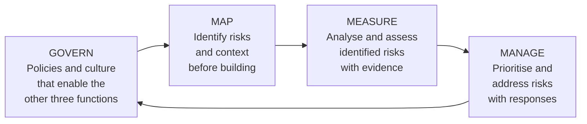

# NIST AI Risk Management Framework

---

## Learning Objectives

By the end of this topic, you should be able to:

- Explain what the NIST AI RMF is and how it differs from the EU AI Act
- Describe the four core functions — Govern, Map, Measure, Manage — and what each covers
- Apply the four functions to the exam prep chatbot
- Explain why a voluntary framework matters even when it is not legally required
- Identify where NIST AI RMF and the EU AI Act overlap and where they complement each other

---

## Overview

The EU AI Act is law — binding, enforceable, with penalties for non-compliance. The NIST AI Risk Management Framework is not law — it is a voluntary guidance document published by the US National Institute of Standards and Technology in January 2023.

So why does it matter?

Three reasons. First, it is widely adopted. Many large organisations — companies, government agencies, universities — require their AI systems and their suppliers to follow NIST AI RMF even when there is no legal obligation. Second, it provides the practical how — the EU AI Act tells you what you must achieve, NIST AI RMF tells you how to structure the process of getting there. Third, it is internationally recognised — India, Japan, Singapore, and the UK all reference NIST AI RMF in their own AI governance guidance.

For a BTech engineer, understanding NIST AI RMF is as important as understanding the EU AI Act — not because it is law, but because it will appear in contracts, procurement requirements, and job specifications.

---

## What NIST AI RMF Is

The NIST AI Risk Management Framework is a structured process for identifying, assessing, and managing risks from AI systems throughout their lifecycle — from design through deployment through monitoring and decommissioning.

It is built around four core functions. Each function covers a different phase of AI risk management. Together they form a continuous cycle — not a one-time compliance checklist.



The arrow from Manage back to Govern shows that this is a cycle — risks discovered during Manage feed back into updated governance policies.

---

## Function 1 — GOVERN

Govern is the foundation. Before any AI system is built or deployed, an organisation needs the policies, culture, accountability structures, and processes that make responsible AI possible.

**What Govern covers:**
- Organisational policies for AI development and deployment
- Defined roles and responsibilities — who is accountable for AI risk
- A culture that allows risk to be raised and addressed without blame
- Processes for escalating AI risks to decision-makers
- Documentation and record-keeping requirements

**Why it comes first:** without Govern, the other three functions have no structure to operate within. Map identifies risks — but who decides what to do about them? Measure produces evidence — but who reviews it? Manage implements responses — but who authorises them? Govern answers all of these questions.

**For the exam prep chatbot:**

A university deploying the exam prep chatbot needs to answer these Govern questions before deployment:

```text
Who owns the chatbot? → The module coordinator
Who approves changes to the knowledge base? → The module coordinator
                                               with sign-off from IT
Who is responsible if the chatbot gives wrong information
and a student acts on it? → Named accountability required
What is the process for a student to report a wrong answer? → Defined
What documentation must be maintained? → Deployment records,
                                         evaluation results,
                                         student feedback
```

Without these answers in writing before deployment, the chatbot has no governance. It operates on individual goodwill — which the previous module showed is insufficient at scale.

---

## Function 2 — MAP

Map is about understanding the context before measuring or managing anything. Before you can assess risk, you need to understand what the system is, who it affects, in what context, and what could go wrong.

**What Map covers:**
- Defining the AI system's intended purpose and use context
- Identifying who the affected populations are — direct users and indirect stakeholders
- Understanding the operational environment — where and how the system will be used
- Identifying foreseeable misuse scenarios
- Mapping the supply chain — which components, models, and data sources does the system depend on?

**Why Map before Measure:** measuring without mapping is measuring the wrong things. If you do not know who the affected populations are, you cannot measure whether the system harms them. If you do not know the operational environment, you cannot anticipate how the system will actually behave in use.

**For the exam prep chatbot:**

```text
MAPPING THE EXAM PREP CHATBOT

Intended purpose:
Help students revise from their own uploaded course notes

Affected populations:
Direct: students using the chatbot
Indirect: lecturers whose course material is uploaded,
          examiners whose papers inform the revision questions

Operational environment:
University setting, exam preparation context,
high-stress period before assessments,
students may be sleep-deprived and less critical of answers

Foreseeable misuse:
Students uploading copyrighted textbooks rather than personal notes
Students asking the chatbot to write assignments (academic integrity)
Students in other courses uploading materials the chatbot was not
designed for, receiving unreliable answers

Supply chain:
Claude (Anthropic) — GPAI model provider
Pinecone — vector database provider
University IT infrastructure — hosting and access control
```

The operational environment point is important — students using the chatbot at 2am before an exam are less likely to click citations and verify answers than students using it at 9am with time to spare. The Map function surfaces this, and Measure and Manage can then address it.

---

## Function 3 — MEASURE

Measure is about gathering evidence — quantitative and qualitative — about the risks identified during Map. It moves from "we think this might be a risk" to "we have evidence of how likely this risk is and how severe it would be."

**What Measure covers:**
- Evaluating AI system performance against defined metrics
- Assessing fairness and bias — does the system perform differently for different groups?
- Measuring reliability — how often is the system correct, and under what conditions?
- Assessing transparency — can the system explain its outputs?
- Evaluating human oversight effectiveness — do the oversight mechanisms actually work?

**The connection to the golden dataset:** the evaluation approach covered in the RAG Failure and Recovery module — building a 10-question golden dataset, running before-and-after evaluations, calculating reliability scores per question type — is a Measure function activity. NIST AI RMF provides the framework that makes that evaluation a systematic governance process rather than an individual exercise.

**For the exam prep chatbot:**

```text
MEASURING THE EXAM PREP CHATBOT

Performance metrics:
- Direct concept questions: X% correct out of Y tested
- Comparison questions: X% correct out of Y tested
- Out-of-scope questions: X% correctly refused out of Y tested
- Citation accuracy: X% of citations pointing to the correct chunk

Bias assessment:
- Does the chatbot perform equally well for all subjects uploaded?
- Does it handle different writing styles in uploaded notes equally?

Reliability conditions:
- Performance on well-structured documents vs unstructured uploads
- Performance on topics covered in depth vs topics covered briefly

Transparency assessment:
- Can a student trace every claim to a specific chunk?
- Are there systematic cases where citations are wrong?
```

---

## Function 4 — MANAGE

Manage is about doing something with the evidence from Measure. It covers prioritising which risks to address, implementing responses, monitoring effectiveness, and updating responses as conditions change.

**What Manage covers:**
- Prioritising risks based on likelihood and severity
- Implementing risk responses — mitigations, controls, process changes
- Monitoring deployed systems for new or changing risks
- Responding to incidents when harm occurs
- Decommissioning systems that can no longer be adequately managed

**For the exam prep chatbot:**

```text
MANAGING THE EXAM PREP CHATBOT

Risk prioritisation:
High priority: out-of-scope questions answered incorrectly
              (student acts on wrong information before exam)
Medium priority: citations pointing to wrong chunks
              (student cannot verify the answer)
Low priority: answer style different from lecturer's style
              (confusion but not harmful misinformation)

Risk responses:
High priority → strengthen refusal instructions,
                run golden dataset evaluation weekly
Medium priority → add citation verification step to
                  student onboarding instructions
Low priority → note in chatbot disclaimer,
               monitor for frequency

Monitoring:
Weekly: run 10-question golden dataset
Monthly: review student feedback for systematic errors
Semester: full re-evaluation when new notes are uploaded

Incident response:
If a student reports acting on incorrect information:
→ Document the question and the wrong answer
→ Identify which failure mode occurred
→ Apply the relevant fix from the Common Failure Modes topic
→ Notify students who may have seen the same wrong answer
```

---

## How NIST AI RMF and EU AI Act Relate

The two frameworks are complementary — not alternatives.

| | EU AI Act | NIST AI RMF |
|---|---|---|
| **Type** | Binding law | Voluntary framework |
| **Enforced by** | National market surveillance authorities | No external enforcement |
| **Penalties** | Up to €35M or 7% of global turnover | None |
| **Geographic scope** | EU users globally | Global, voluntary adoption |
| **Focus** | Classification and compliance obligations | Risk management process |
| **Tells you** | What you must achieve | How to structure the process |
| **When applied** | At deployment and throughout lifecycle | Throughout design, build, deploy, monitor |

**The practical relationship:** NIST AI RMF is what you use to build the governance process that satisfies EU AI Act obligations. The EU AI Act says "you must have human oversight mechanisms for high-risk systems." NIST AI RMF's Govern and Manage functions show you how to design, implement, and monitor those mechanisms.

For the exam prep chatbot: the EU AI Act requires a transparency disclosure (Limited Risk obligation). NIST AI RMF's Govern function prompts you to ask who is responsible for maintaining that disclosure, what the process is for updating it when the system changes, and who reviews it. The Act sets the obligation; NIST structures the process.

---

## Where This Fits in the Module

```text
AI Ethics Governance Regulation (intro)
Why regulation exists, three frameworks introduced
        ↓
EU AI Act
Four risk tiers, obligations, global reach
        ↓
NIST AI RMF  ←── YOU ARE HERE
Govern Map Measure Manage
Voluntary but widely adopted
How it complements the EU AI Act
        ↓
DPDP Act
India's data protection law
        ↓
PII PHI Copyright and Model Cards
Data types and model documentation
```

---

## Best Practices

- Treat NIST AI RMF as the process framework even when only the EU AI Act is legally required — the four functions provide the structure that makes compliance sustainable rather than a one-time exercise
- Complete Map before Measure — understanding who is affected and in what context determines what you need to measure
- Make Govern concrete — named roles, written processes, documented accountability. A governance policy that says "someone will be responsible" is not governance
- Connect the golden dataset evaluation to Measure — systematic evaluation with defined metrics is what NIST AI RMF means by measuring AI risk

## Common Beginner Mistakes

- **Treating voluntary as optional** — NIST AI RMF may appear in contracts, procurement requirements, and client expectations even when it is not legally required. "Voluntary" does not mean "irrelevant"
- **Starting with Measure and skipping Map** — measuring system performance without understanding the operational context and affected populations produces metrics that miss the most important risks
- **Treating Manage as a one-time fix** — risks change as systems are updated, knowledge bases change, and use patterns evolve. Manage is a continuous process, not a deployment checklist
- **Confusing Govern with having a policy document** — governance requires named people, defined processes, and active monitoring. A policy document that no one reads is not governance

---

## Key Takeaways

- NIST AI RMF is a voluntary framework — not law — but widely adopted and referenced in contracts, procurement, and international AI governance guidance
- The four functions are **Govern** (policies and accountability), **Map** (context and risk identification), **Measure** (evidence gathering), **Manage** (risk responses and monitoring)
- The functions form a continuous cycle — Manage feeds back into updated Govern policies
- NIST AI RMF tells you how to build the process; the EU AI Act tells you what the process must achieve — they are complementary, not alternatives
- The golden dataset evaluation approach is a Measure function activity — NIST AI RMF provides the governance structure that makes it systematic
- For the exam prep chatbot: Govern defines accountability, Map identifies the high-stress operational context, Measure tracks reliability per question type, Manage prioritises and addresses specific failure modes

> **Interview tip:** If asked "are you familiar with NIST AI RMF?" — name all four functions, explain the cycle, and distinguish it from the EU AI Act (voluntary vs binding, process vs obligation). Then apply it to the system you are discussing — Map it, name one Measure metric, and name one Manage response. Most candidates name NIST as a framework they have heard of. Applying all four functions to a specific system shows you understand it as a practical tool, not just a name.

---

## Reference Links

- 📎 [NIST AI Risk Management Framework — Official](https://www.nist.gov/itl/ai-risk-management-framework)
- 📎 [NIST AI RMF Playbook](https://airc.nist.gov/Docs/1)
- 📎 [NIST AI RMF and EU AI Act — Comparison](https://www.nist.gov/system/files/documents/2024/07/26/NIST.AI.100-4.ipd.pdf)
- 📎 [Anthropic — Responsible Scaling Policy](https://www.anthropic.com/responsible-scaling-policy)
