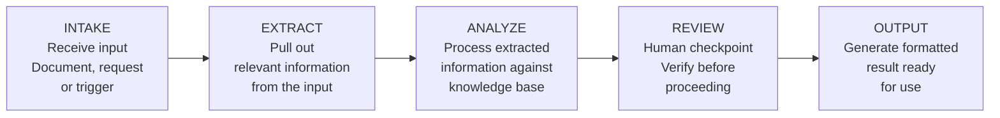

# AI Workflows and Agents

---

## Learning Objectives

By the end of this topic, you should be able to:

- Explain why a single-step chatbot is insufficient for professional workflows
- Describe the five stages of a multi-step AI pipeline
- Distinguish between a fixed pipeline and a tool-using agent
- Identify where human-in-the-loop checkpoints belong in a multi-step workflow
- Understand what this module builds and why the build order matters

---

## Overview

In the previous module you built a domain-specific RAG chatbot — a system that answers one question from one knowledge base and returns one cited answer. That is genuinely useful. But it is one step.

Consider what a civil engineer actually does when they receive a project brief:

```text
Step 1 — INTAKE
Receive the project specification document.
Read it. Understand what is being asked.

Step 2 — EXTRACT
Pull out the specific structural requirements.
"Foundation depth minimum 1.5m. Column spacing maximum 6m.
Seismic zone III. Live load 5 kN/m²."

Step 3 — ANALYZE
For each requirement, check the relevant IS code.
"IS 1893 applies to seismic zone III. Clause 7.3 specifies..."
"IS 456 Clause 34.1 specifies foundation depth for..."

Step 4 — REVIEW
A licensed engineer reviews the IS code matches.
Checks whether the analysis is correct and complete.
Flags any requirements that need further investigation.

Step 5 — OUTPUT
Generate a formatted compliance checklist.
"Requirement 1: Foundation depth — IS 456 Clause 34.1 — COMPLIANT
 Requirement 2: Seismic design — IS 1893 Clause 7.3 — REVIEW NEEDED"
```

A single chatbot cannot do this. It answers one question. Steps 1-5 are five different operations — document reading, information extraction, code lookup, human review, and report generation — that need to happen in sequence, passing output from one step to the next.

This is what a **multi-step pipeline** does. And this is what Week 14 covers.

---

## From Chatbot to Pipeline to Agent

There are three levels of AI system complexity. Understanding where each one is appropriate is the core skill this module builds.

### Level 1 — Single-Step Chatbot

The student types a question. The chatbot retrieves relevant chunks and generates a cited answer. One input, one output, one step.

```text
Input: "What is the minimum cover for a column in moderate exposure?"
         ↓
    RAG chatbot (Pinecone)
         ↓
Output: "40mm per IS 456 Table 16 [Source 1]"
```

**When it is the right tool:** answering specific questions from a known knowledge base. The exam prep chatbot. The civil engineering code reference assistant.

**When it is not enough:** when the task requires multiple steps in sequence, where the output of one step is the input to the next.

---

### Level 2 — Fixed Pipeline

A defined sequence of steps that always runs in the same order. Each step takes input from the previous step and produces output for the next. The sequence does not change based on what is found.

```text
Project brief document
         ↓
    Step 1: Extract requirements (AI reads the document)
         ↓
    Step 2: Look up IS codes for each requirement (Pinecone query)
         ↓
    Step 3: Human review checkpoint (engineer verifies)
         ↓
    Step 4: Generate compliance report (AI formats the output)
         ↓
Formatted compliance checklist
```

**When it is the right tool:** when the steps are known in advance, the sequence does not change, and the process must be auditable — every step can be inspected and verified.

**Key property:** predictable. The same input always produces the same sequence of steps. This is what makes it safe for professional, high-stakes use.

---

### Level 3 — Tool-Using Agent

An AI that decides what steps to take based on what it finds. It has access to a set of tools — document reading, web search, Pinecone query, calculator, API calls — and chooses which to use and in what order based on the task.

```text
Task: "Check this project brief against all relevant IS codes"
         ↓
    Agent receives the task
         ↓
    Agent decides: "I need to read the brief first"
    → uses document reading tool
         ↓
    Agent decides: "I found seismic zone III — I need IS 1893"
    → uses Pinecone query tool
         ↓
    Agent decides: "IS 1893 references IS 456 for foundation design"
    → uses Pinecone query tool again (not planned in advance)
         ↓
    Agent decides: "I have enough information"
    → produces output
```

**When it is the right tool:** when the steps are not known in advance and the task requires flexibility to follow wherever the analysis leads.

**Key property:** flexible but less predictable. The agent may take different paths for different inputs. This makes it powerful — and harder to audit.

---

## The Five-Stage Pipeline Flow

The curriculum names five stages for a professional AI-assisted workflow. These apply to fixed pipelines and form the backbone of what agents do when they work well.



**INTAKE** — something triggers the pipeline. A document is uploaded, a form is submitted, a scheduled trigger fires, a user submits a request.

**EXTRACT** — relevant information is pulled from the intake. For a project brief: structural requirements, site conditions, load specifications. For a medical referral: patient details, symptoms, required investigation.

**ANALYZE** — the extracted information is processed against the knowledge base. IS codes for civil. Drug formulary for pharma. Contract terms for legal.

**REVIEW** — a human verifies the analysis before the output is produced. This is the HITL checkpoint. The engineer, clinician, or lawyer reviews what the AI found before it becomes an output.

**OUTPUT** — the verified analysis is formatted as a usable result. A compliance checklist. A drug interaction summary. A contract clause comparison table.

---

## Human-in-the-Loop in Multi-Step Workflows

Single-step chatbots have one oversight decision — does the student click the citation? Multi-step pipelines have a HITL decision at every stage.

```text
INTAKE — human or automated?
Does a human trigger the pipeline, or does it trigger automatically
(scheduled, file upload, API event)?
For high-stakes professional workflows — human trigger.
For routine, repeatable, low-stakes workflows — automated trigger acceptable.

EXTRACT — verified or trusted?
Does a human verify what was extracted before it goes to Analyze?
For complex documents with ambiguous language — human verification.
For structured, standardised documents — automated extraction acceptable.

ANALYZE — reviewed before output?
Does a human review the IS code matches before they go into the report?
For design decisions with structural safety implications — always human review.
For reference-only output — periodic audit may be sufficient.

REVIEW — this is the formal HITL checkpoint.
Always human. Always before output for high-stakes domains.

OUTPUT — approved before delivery?
Does a human approve the final output before it is delivered?
For professional reports — human sign-off required.
For internal drafts — automated delivery acceptable.
```

The pattern is consistent: the higher the stakes, the more HITL checkpoints. A civil engineering compliance report needs checkpoints at Extract and Review. A student exam prep summary needs a checkpoint only at the citation level.

---

## What This Module Builds

Each file in this module produces something students can see and test:

| File | What you build | What you learn |
|---|---|---|
| **File 01** — This file | Mental model | Pipeline vs agent distinction |
| **File 02** — Multi-Step Pipelines | A fixed 3-step pipeline in n8n | How each stage passes output to the next, where HITL sits |
| **File 03** — Tool-Using Agents | An AI Agent node in n8n | How an agent chooses tools, agent failure modes |
| **File 04** — Agent vs Fixed Pipeline | Analysis of what was built | Decision framework: when to use each |
| **File 05** — No-Code Workflow Tools | Extended n8n workflow + Zapier overview | Professional workflow patterns, tool comparison |

**The build order matters:** File 02 builds the fixed pipeline. File 03 adds the agent on top of it. File 04 compares both — which only makes sense after building both. File 05 extends and generalises.

---

## Why No-Code Tools Are the Right Approach Here

The previous modules used Pinecone Assistant — a no-code tool — because the complexity of the RAG pipeline was in the concepts, not the code. The same principle applies here.

Building a multi-step pipeline in Python requires: orchestration libraries, async handling, error management, retry logic, state management between steps. These are real engineering challenges — but learning them before understanding what a pipeline is and why it exists would obscure the concepts with implementation details.

**n8n** is a visual workflow builder where each step is a node on a canvas. Students connect nodes with lines. They can see the data flowing from one node to the next. The pipeline structure is visible — not hidden in code.

After this module, students who want to implement these patterns in Python have the conceptual foundation to understand what they are building. The no-code tool makes the concept visible first.

---

## Where This Fits in the Course

```text
M1–M4: Python foundations, automation toolkit
        ↓
M5–M6: APIs, embeddings, semantic search
        ↓
M7: RAG — Retrieve, Augment, Generate
        ↓
M8: RAG failure, evaluation, trust calibration
        ↓
M9: Human cognition, oversight, HITL design
        ↓
M10: EU AI Act, NIST, DPDP, PII/PHI/copyright
        ↓
M11 (Week 13): Domain-specific application — one chatbot
        ↓
M12 (Week 14): AI Workflows and Agents  ←── YOU ARE HERE
Single chatbot becomes one stage in a multi-step pipeline
Fixed pipelines and tool-using agents
n8n for no-code workflow building
```

---

## Best Practices

- Understand the distinction between pipeline and agent before building either — the choice between them has safety and auditability implications
- Always design the HITL checkpoint before building the pipeline — adding human review after the fact is harder than building it in from the start
- Start with a fixed pipeline before adding agent capabilities — a pipeline that works reliably is more valuable than an agent that works unpredictably
- For high-stakes professional domains — fixed pipeline with human review checkpoints is almost always the right choice over an autonomous agent

## Common Beginner Mistakes

- **Assuming agents are always better than pipelines** — agents are more flexible but less predictable and harder to audit. For professional use, fixed pipelines with human checkpoints are often safer and more appropriate
- **Forgetting HITL in multi-step workflows** — adding more AI steps without adding human checkpoints increases the risk that errors accumulate across steps undetected
- **Building before designing** — opening n8n before deciding what the pipeline does and where the HITL sits produces a workflow that works technically but does not serve the actual professional need

---

## Key Takeaways

- A single-step chatbot answers one question. A professional workflow has multiple steps — intake, extract, analyze, review, output — where the output of each step is the input to the next
- A **fixed pipeline** runs the same sequence of steps every time — predictable, auditable, safe for high-stakes use
- A **tool-using agent** decides what steps to take based on what it finds — flexible, powerful, less predictable
- The five-stage flow is: **Intake → Extract → Analyze → Review → Output**
- **Review** is the formal HITL checkpoint — always human, always before output in high-stakes domains
- n8n makes pipelines and agents visual — each step is a node, data flows along connecting lines, the structure is visible without code

> **Interview tip:** If asked "what is the difference between a pipeline and an agent?" — describe a fixed pipeline as a defined sequence of steps where the order never changes and every step can be audited, and an agent as an AI that decides what steps to take based on what it finds. Say when you would use each: fixed pipeline for professional high-stakes workflows requiring auditability; agent for exploratory tasks where the steps cannot be defined in advance. Most candidates say "an agent is more advanced." Describing the auditability trade-off and naming when each is appropriate shows you understand the choice as an engineering decision, not a capability ranking.

---

## Reference Links

- 📎 [n8n — Official Documentation](https://docs.n8n.io/)
- 📎 [n8n — AI Agent Node](https://docs.n8n.io/integrations/builtin/cluster-nodes/root-nodes/n8n-nodes-langchain.agent/)
- 📎 [Zapier — Getting Started](https://zapier.com/learn/getting-started-guide/)
- 📎 [Anthropic — Tool Use Guide](https://docs.anthropic.com/en/docs/build-with-claude/tool-use)
- 📎 [LangChain — Agents Conceptual Guide](https://python.langchain.com/docs/concepts/agents/)
