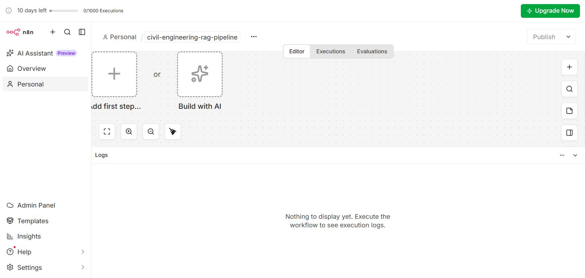
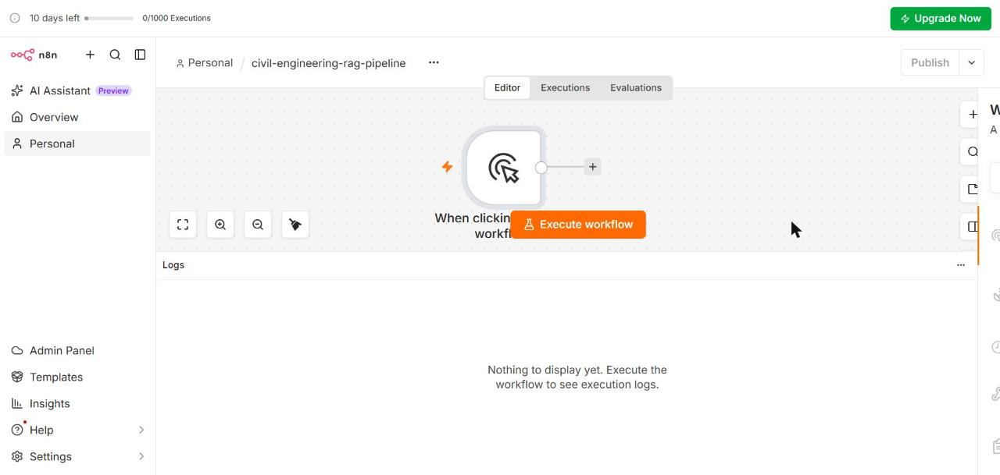
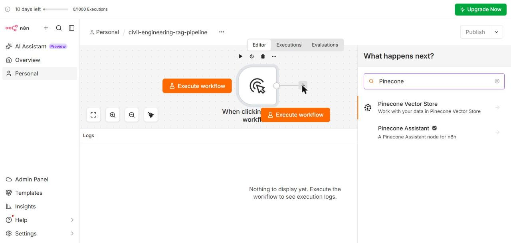
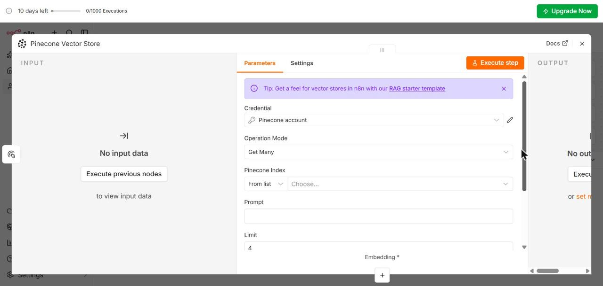
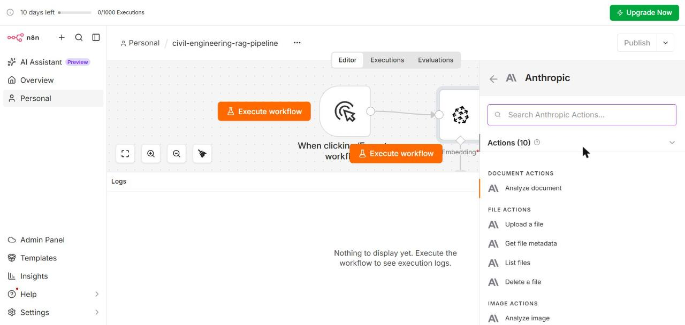
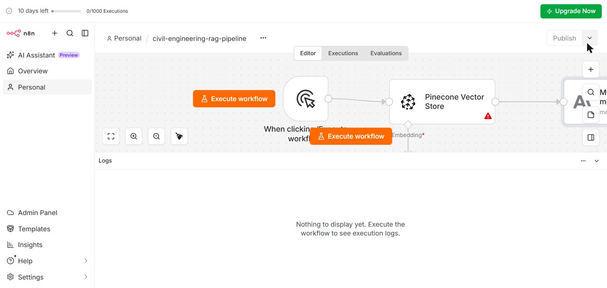
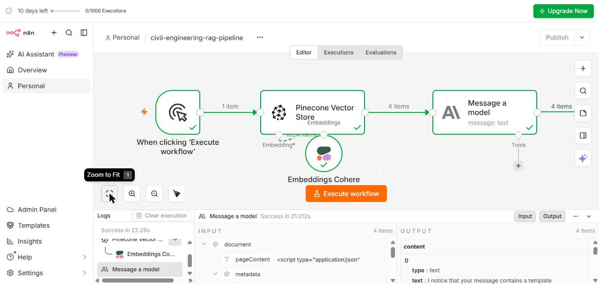

# Multi-Step Pipelines

---

## Learning Objectives

By the end of this topic, you should be able to:

- Explain what a fixed pipeline is and how it differs from a single-step chatbot
- Describe what happens at each of the five pipeline stages for a professional workflow
- Identify where the human-in-the-loop checkpoint sits in a multi-step pipeline
- Build a three-step fixed pipeline in n8n connecting a trigger, a Pinecone query, and a Claude output
- Verify that data passes correctly between pipeline stages

---

## Overview

The previous topic introduced the distinction between a single-step chatbot, a fixed pipeline, and a tool-using agent. This topic builds the fixed pipeline.

A fixed pipeline is a defined sequence of steps where the output of each step becomes the input to the next. The sequence does not change based on what is found — it always runs in the same order. This predictability is what makes it auditable and safe for professional use.

By the end of this topic you will have a working three-step pipeline in n8n that takes a civil engineering question, queries Pinecone for relevant IS code chunks, and outputs a formatted cited answer. This is the same RAG pipeline you built in Pinecone Assistant — now made visible as individual connected steps.

---

## What n8n Is

n8n is a visual workflow builder. Each step in a workflow is a **node** — a box on a canvas. Nodes are connected by lines. Data flows along those lines from one node to the next.

You already have n8n available — it is connected to your account at `revaturechennai.app.n8n.cloud`.

---

## The Civil Engineering Pipeline — What We Are Building

Before touching n8n, here is the complete pipeline:

```text
STEP 1 — TRIGGER (Manual)
A civil engineer clicks "Execute workflow" to start the pipeline.
Input: a structural design question.
Output: the question passed to Step 2.

STEP 2 — PINECONE QUERY (Retrieve)
The question is sent to Pinecone Vector Store.
Pinecone retrieves the top matching IS code chunks.
Input: the question from Step 1.
Output: retrieved chunks passed to Step 3.

STEP 3 — ANTHROPIC / CLAUDE (Generate)
The retrieved chunks and question are sent to Claude.
Claude generates a cited answer using only the chunks.
Input: chunks + question from Step 2.
Output: formatted answer with IS code citations.
```

---

## Building the Pipeline in n8n

### Step 1 — Open n8n and Create a New Workflow

1. Go to **revaturechennai.app.n8n.cloud**
2. On the Overview page click **Create workflow** (orange button, top right)
3. A blank canvas opens with "Add first step..." and "Build with AI" options



4. Click the workflow name at the top — it says "My workflow 2"
5. Type: `civil-engineering-rag-pipeline` and press Enter

---

### Step 2 — Add the Manual Trigger Node

1. Click **Add first step...** on the canvas
2. The trigger selector opens on the right — select **Trigger manually**
3. The Manual Trigger node appears on the canvas with an "Execute workflow" button below it



This node starts the pipeline when you click "Execute workflow". No configuration needed.

---

### Step 3 — Add the Pinecone Vector Store Node

1. Click the **+** button on the right side of the Manual Trigger node
2. The "What happens next?" panel opens
3. Type **Pinecone** in the search box



4. Click **Pinecone Vector Store**
5. From the actions list select **Get ranked documents from vector store**

The Pinecone node configuration panel opens:



Configure:
- **Credential:** select your Pinecone account credential
- **Operation Mode:** Get Many (already set)
- **Pinecone Index:** select your index containing IS code documents
- **Prompt:** click the expression editor `=` and type `{{ $json.query }}`
- **Limit:** set to `3`

---

### Step 4 — Add the Anthropic Node

1. Click the **+** button on the right side of the Pinecone node
2. Type **Claude** in the search box
3. Click **Anthropic** → search for **message** → click **Message a model**

The Anthropic node configuration panel opens:



Configure:
- **Credential:** Gateway credits (already connected)
- **Model:** select `claude-sonnet-4-5` from the dropdown
- **Messages → Values 1 → Prompt:** paste the civil engineering system prompt:

```text
You are a civil engineering standards reference assistant.
Answer questions using only the uploaded IS codes and course notes.
For every value or clause, cite the source — for example [IS 456, Clause 26.4].
Do not perform calculations. Do not use international standards.
If the relevant standard is not in the context, say so clearly.

Context from IS codes:
{{ $json.pageContent }}

Question: {{ $('When clicking').item.json.query }}
```

---

### Step 5 — The Complete Pipeline

Your canvas shows four nodes — the Pinecone Vector Store requires an **Embeddings sub-node** underneath it:

```text
[Manual Trigger] → [Pinecone Vector Store] → [Message a model]
                          ↑
                   [Embeddings Cohere]
```

To add the Embeddings Cohere sub-node:
1. Click the **+** below the Pinecone node (the `Embedding*` connector)
2. Search for **Cohere** → select **Embeddings Cohere**
3. It connects to your existing Cohere credential automatically



Click **Execute workflow** — when the pipeline completes successfully all nodes show green checkmarks:



---

## Where the HITL Checkpoint Sits

The three-node pipeline runs automatically — question in, answer out. For professional use, add a **Human Review** step between Claude and the final output:

```text
[Manual Trigger] → [Pinecone] → [Claude] → [HUMAN REVIEW] → [Output]
```

In n8n this is a **Wait** node — it pauses the pipeline and notifies the engineer via email or Slack before the answer is delivered. The pipeline continues only when the engineer approves.

**For the civil engineering pipeline:** the engineer verifies the IS code citation before using the value in a design calculation.

---

## The Five Stages — Mapped to This Pipeline

| Pipeline stage | n8n node | What happens |
|---|---|---|
| **Intake** | Manual Trigger | Engineer starts the pipeline with a question |
| **Extract** | *(implicit in question)* | The question already contains the requirement |
| **Analyze** | Pinecone + Claude | IS code chunks retrieved, cited answer generated |
| **Review** | *(add a Wait node)* | Engineer verifies the IS code citation |
| **Output** | Claude output | Formatted cited answer delivered |

---

## Three Verification Tests

Run these before moving to File 3:

**Test 1 — Direct clause question (should pass):**
```
What is the minimum clear cover for a column in moderate exposure?
Expected: 40mm, IS 456 Table 16 cited
```

**Test 2 — Out-of-scope question (should refuse):**
```
What does Eurocode 2 say about concrete cover?
Expected: Refusal — Eurocode not in uploaded documents
```

**Test 3 — Calculation question (should provide formula, not calculate):**
```
Calculate the moment capacity of a 300x500mm beam with 4-16mm bars
Expected: Formula provided, calculation declined
```

---

## Where This Fits in the Module

```text
AI Workflows and Agents (intro)
Pipeline vs agent distinction, five-stage flow
        ↓
Multi-Step Pipelines  ←── YOU ARE HERE
Fixed three-step pipeline built in n8n
Trigger → Pinecone → Claude
HITL checkpoint identified
        ↓
Tool-Using Agents
AI Agent node added
Agent chooses tools, failure modes observed
        ↓
Agent vs Fixed Pipeline
Decision framework applied
        ↓
No-Code Workflow Tools
n8n extended, Zapier compared
```

---

## Best Practices

- Name your workflow clearly before building
- Test each node individually before running the full pipeline — click **Execute step** on each node
- Save after every successful test — n8n does not auto-save
- Add the HITL checkpoint before output for high-stakes domain questions

## Common Beginner Mistakes

- **Connecting nodes in wrong order** — Pinecone must come before Claude
- **Forgetting credentials** — both Pinecone and Claude nodes need API keys
- **Not testing individual nodes** — run each node separately before the full pipeline
- **Skipping the HITL checkpoint** — not appropriate for professional high-stakes use without human review

---

## Key Takeaways

- A fixed pipeline in n8n is three connected nodes: Manual Trigger → Pinecone Vector Store → Anthropic
- The same RAG pipeline from Pinecone Assistant is now visible as individual connected steps
- The HITL checkpoint sits between Claude and the final output — implemented as a Wait node
- Three verification tests confirm the pipeline works: direct clause, out-of-scope refusal, calculation refusal

> **Interview tip:** If asked "how would you build a multi-step AI pipeline?" — describe the nodes and sequence, name the data passing between each node, identify where the HITL checkpoint sits, and name one failure mode tested. Most candidates describe the concept without the implementation. Naming the specific nodes, data flow, and HITL checkpoint shows you have actually built one.

---

## Reference Links

- 📎 [n8n — Official Documentation](https://docs.n8n.io/)
- 📎 [n8n — Pinecone Vector Store Node](https://docs.n8n.io/integrations/builtin/cluster-nodes/root-nodes/n8n-nodes-langchain.vectorstorepinecone/)
- 📎 [n8n — Anthropic Node](https://docs.n8n.io/integrations/builtin/app-nodes/n8n-nodes-base.anthropic/)
- 📎 [Pinecone — API Documentation](https://docs.pinecone.io/reference/api/introduction)
