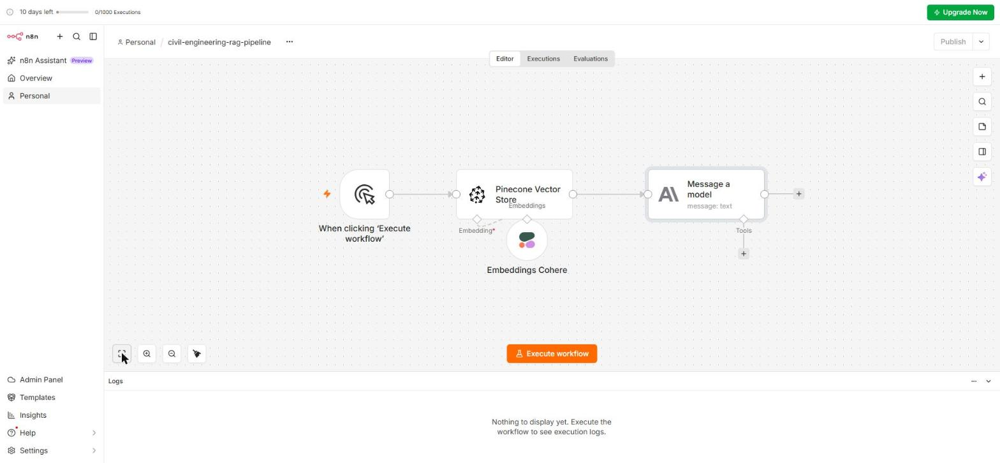

# No-Code Workflow Tools

---

## Learning Objectives

By the end of this topic, you should be able to:

- Explain what n8n offers beyond what you built in Files 2 and 3
- Describe what Zapier is and how it compares to n8n
- Identify three professional workflow patterns that go beyond a single RAG pipeline
- Explain when to use n8n vs Zapier vs building in Python
- Extend the civil engineering pipeline with a notification step

---

## Overview

The previous three topics built a fixed pipeline and a tool-using agent in n8n, then compared them. This topic steps back and looks at n8n and Zapier as platforms — what else they can do, how they compare, and when each is the right tool.

It also completes the lab for this module: extending the civil engineering pipeline from File 2 with a notification step — so the engineer receives an alert when the pipeline produces an output. This is the simplest version of a professional workflow pattern where AI output triggers a downstream action.

---

## What Else n8n Can Do

The pipeline built in File 2 used three of n8n's capabilities: triggering a workflow manually, querying a vector store, and calling a language model. n8n has significantly more:

### Triggers Beyond Manual

The pipeline was triggered by clicking Execute workflow. In a professional context, workflows are triggered automatically:

| Trigger type | Example |
|---|---|
| **Schedule** | Run the compliance check every Monday at 9am |
| **Webhook** | A form submission triggers the pipeline automatically |
| **File upload** | A new project brief uploaded to a folder triggers analysis |
| **Email received** | An engineer emails a question and receives a cited answer |
| **App event** | A new row in a spreadsheet triggers a document generation |

### Nodes Beyond Pinecone and Claude

The pipeline used two AI nodes. n8n has hundreds of integrations:

| Node category | What it does | Civil engineering example |
|---|---|---|
| **Email** | Send emails | Engineer receives IS code answer by email |
| **Slack** | Send Slack messages | Team receives compliance alert in Slack channel |
| **Google Sheets** | Read and write spreadsheet data | Pipeline reads project requirements from a sheet |
| **HTTP Request** | Call any API | Pipeline calls BIS website to check latest IS code version |
| **Code** | Run JavaScript or Python | Custom calculation or data transformation |
| **PDF** | Generate PDF documents | Compliance report generated as a PDF |
| **If / Switch** | Branch the workflow | Different IS codes retrieved for different project types |

### Branching and Conditional Logic

The fixed pipeline always runs the same path. n8n's **If** node lets the workflow branch — different steps for different inputs:

```text
Project brief uploaded
        ↓
Extract project type (residential / commercial / infrastructure)
        ↓
    IF residential → retrieve IS 456 + NBC residential clauses
    IF commercial  → retrieve IS 456 + IS 800 + NBC commercial clauses
    IF infrastructure → retrieve IS 456 + IRC codes
        ↓
Generate compliance report with relevant codes
```

This is still a fixed pipeline — the steps are defined in advance. But the path through the steps depends on the input.

---

## Extending the Civil Engineering Pipeline

### Adding a Notification Step

The pipeline from File 2 generates a cited answer from IS codes. In a professional context, the engineer needs to know the answer is ready — especially if the pipeline runs automatically on a schedule rather than manually.

Here is the current civil engineering pipeline — the + button on the right of "Message a model" is where the notification node connects:



**Steps to add an email notification in n8n:**

1. Open the `civil-engineering-rag-pipeline` workflow
2. Click the **+** on the right side of the Claude (Message a model) node
3. Search for **Gmail** or **Send Email**
4. Add the email node and configure:
   - **To:** engineer's email address
   - **Subject:** `IS Code Query Result — {{ $now }}`
   - **Body:** `{{ $json.text }}`  (this pulls the Claude output)
5. Click **Execute workflow**

The pipeline now runs three steps automatically — query, generate, notify — and the engineer receives the IS code answer by email without having to watch the n8n canvas.

This is a complete professional workflow: trigger → retrieve → generate → notify. The same pattern applies to any domain — medical protocol assistant sending results to a doctor, legal research assistant emailing a lawyer, exam prep chatbot texting a student.

---

## What Zapier Is

Zapier is a cloud-based workflow automation platform — similar to n8n but with different strengths and trade-offs.

**What Zapier does:** connects apps. A trigger in one app (a form submission, a new email, a calendar event) automatically triggers an action in another app (send a Slack message, create a spreadsheet row, generate a document).

**How Zapier is structured:**
- **Zap** — a workflow consisting of one trigger and one or more actions
- **Trigger** — the event that starts the Zap
- **Action** — what happens in response

**Zapier's AI capabilities:** Zapier has an AI action that can send a prompt to ChatGPT or Claude and use the response in a subsequent action. This is a simpler version of what n8n does — one AI call, not a configurable pipeline with custom nodes.

---

## n8n vs Zapier — Direct Comparison

| | n8n | Zapier |
|---|---|---|
| **Best for** | Complex AI pipelines, custom logic, technical workflows | Simple app-to-app automations, non-technical users |
| **AI capabilities** | Full AI pipeline with vector stores, agents, custom models | Single AI call (ChatGPT or Claude) via a pre-built action |
| **Pinecone integration** | Native Pinecone Vector Store node | No native Pinecone integration |
| **Customisation** | High — JavaScript and Python code nodes available | Low — limited to pre-built app connectors |
| **Pricing** | Free self-hosted; cloud plan from $20/month | Free tier (100 tasks/month); paid from $19.99/month |
| **Setup complexity** | Medium — more configuration required | Low — designed for non-technical users |
| **Number of integrations** | 400+ | 6,000+ |
| **Best use case in this course** | Building RAG pipelines, AI agents, custom workflows | Sending notifications, connecting standard apps |

**When to use Zapier instead of n8n:**
- The task is connecting two standard apps without AI (send a Slack message when a form is submitted)
- The user is non-technical and needs a simple drag-and-drop interface
- The workflow needs an app that n8n does not have a node for — Zapier's 6,000+ integrations cover more apps

**When to use n8n instead of Zapier:**
- The workflow involves a RAG pipeline or AI agent
- Custom logic or calculations are needed
- Pinecone, ChromaDB, or other vector stores are involved
- The workflow needs to be self-hosted for data privacy reasons

**When to use Python instead of either:**
- The workflow requires complex data processing not possible in a visual tool
- Performance is critical — Python is faster than visual workflow runners for high-volume tasks
- The workflow needs to run inside an existing codebase
- Custom ML models or libraries need to be called

---

## Three Professional Workflow Patterns

These three patterns show how the concepts from this module apply to real professional contexts. Each is built on the same foundation as the civil engineering pipeline — trigger, retrieve, generate, output — with different configurations.

### Pattern 1 — The Daily Digest

**What it does:** every morning, the pipeline retrieves the most recent updates to a knowledge base (new IS code amendments, new research papers, new regulations), summarises them, and sends a digest to the engineering team.

```text
TRIGGER: Schedule — every weekday at 8:00am
        ↓
RETRIEVE: Search Pinecone for documents added in the last 24 hours
        ↓
GENERATE: Claude summarises each new document in 3 sentences
        ↓
OUTPUT: Email digest sent to engineering team distribution list
```

**Built in n8n:** Schedule Trigger → Pinecone query with date filter → Claude → Gmail

### Pattern 2 — The Brief Analyser

**What it does:** when a project brief is uploaded to a shared folder, the pipeline automatically extracts the structural requirements, checks them against the relevant IS codes, and produces a compliance checklist.

```text
TRIGGER: New file uploaded to Google Drive folder
        ↓
EXTRACT: Claude reads the brief and pulls out structural requirements
        ↓
RETRIEVE: Pinecone searches IS codes for each requirement
        ↓
GENERATE: Claude produces a compliance checklist with cited clauses
        ↓
OUTPUT: Checklist saved back to Google Drive + Slack notification sent
```

**Built in n8n:** Google Drive Trigger → Claude (extract) → Pinecone → Claude (generate) → Google Drive + Slack

### Pattern 3 — The Question Router

**What it does:** engineers submit questions via a web form. The pipeline checks whether the question is about IS codes (route to Pinecone) or about project management (route to a different knowledge base). The answer is returned to the engineer via email.

```text
TRIGGER: Form submitted with question and topic
        ↓
ROUTE: If topic = "IS codes" → Pinecone IS code index
        If topic = "project management" → Pinecone project index
        ↓
RETRIEVE: Relevant chunks from the selected index
        ↓
GENERATE: Cited answer from Claude
        ↓
OUTPUT: Email sent to submitter with the cited answer
```

**Built in n8n:** Webhook Trigger → If node → Pinecone (IS codes or project) → Claude → Gmail

---

## Where This Fits in the Module

```text
AI Workflows and Agents (intro)
Pipeline vs agent concept, five-stage flow
        ↓
Multi-Step Pipelines
Fixed three-step pipeline built in n8n
        ↓
Tool-Using Agents
AI Agent node, four failure modes
        ↓
Agent vs Fixed Pipeline
Decision framework, trust calibration
        ↓
No-Code Workflow Tools  ←── YOU ARE HERE
n8n extended with notification step
Zapier compared to n8n
Three professional workflow patterns
When to use each tool
```

---

## Best Practices

- Extend pipelines one step at a time — add the notification step, test it, then add the next step
- Use Zapier for connecting standard apps, n8n for AI pipelines — do not force one tool to do the other's job
- Keep the HITL checkpoint before any irreversible action — a notification email is low-stakes; an automated design approval is not
- Name workflows clearly — `civil-engineering-rag-pipeline` is better than `My workflow 2`; `daily-IS-code-digest` is better than `Schedule workflow`

## Common Beginner Mistakes

- **Building everything in one workflow** — large complex workflows are hard to debug. Build and test each stage separately, then connect them
- **Not considering data privacy when choosing between n8n cloud and self-hosted** — if the workflow processes personal data or confidential project information, self-hosted n8n keeps data off cloud servers
- **Using Zapier for AI pipeline tasks** — Zapier's single AI action cannot replicate a RAG pipeline with a vector store. Use n8n for anything involving Pinecone or custom AI logic
- **Skipping notifications in professional workflows** — an automated workflow that produces output but does not notify anyone is an automated workflow no one knows about

---

## Key Takeaways

- n8n supports triggers beyond manual (schedule, webhook, email, file upload), hundreds of integration nodes, and branching logic — the civil engineering pipeline is a minimal example of what it can do
- Adding a notification step — Gmail, Slack — turns the pipeline into a complete professional workflow: trigger → retrieve → generate → notify
- **Zapier** is better for simple app-to-app connections with 6,000+ integrations and a non-technical interface; **n8n** is better for complex AI pipelines with Pinecone, custom logic, and self-hosting
- **Python** is better when performance matters, custom ML libraries are needed, or the workflow runs inside an existing codebase
- Three professional patterns: Daily Digest (scheduled summary), Brief Analyser (document trigger → compliance checklist), Question Router (form trigger → routed answer by topic)

> **Interview tip:** If asked "how would you automate a professional AI workflow?" — describe one of the three patterns, name the trigger, the retrieval step, the generation step, and the output step. Then say which tool you would use (n8n for AI pipeline tasks, Zapier for standard app connections) and why. Most candidates describe the AI part without the trigger or output. Naming the full five-stage flow — intake, extract, analyze, review, output — and mapping it to specific nodes shows you understand workflow automation as an end-to-end engineering problem.

---

## Reference Links

- 📎 [n8n — Official Documentation](https://docs.n8n.io/)
- 📎 [n8n — Gmail Node](https://docs.n8n.io/integrations/builtin/app-nodes/n8n-nodes-base.gmail/)
- 📎 [n8n — Schedule Trigger](https://docs.n8n.io/integrations/builtin/core-nodes/n8n-nodes-base.scheduletrigger/)
- 📎 [Zapier — Getting Started](https://zapier.com/learn/getting-started-guide/)
- 📎 [Zapier — AI Actions](https://zapier.com/ai)
