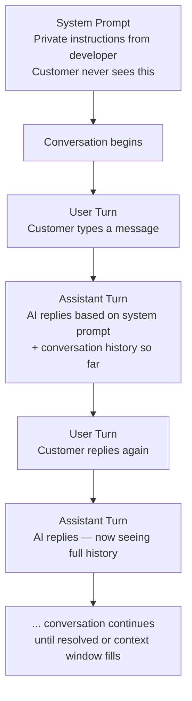

# System Prompts, Conversation Turns, Reasoning Models and Output Shaping

---

## Learning Objectives

By the end of this topic, you should be able to:

- Explain the difference between a system prompt, a user turn, and an assistant turn — and why each one exists
- Write a clear, effective system prompt for a real AI-powered feature
- Describe the difference between a standard model and a reasoning model — and when to use each
- Apply output shaping techniques to control the format, structure, and length of an AI response

---

## Why This Matters

In the previous topic, you learned about tokens, context windows, and temperature — the controls that shape *how* a model generates text. This topic gives you the controls that shape *what the model thinks its job is* and *how it should present its answer*.

Most production AI systems do not work the way a casual Claude conversation works. When you open a customer support chatbot on a shopping website, that chatbot has been given a detailed set of private instructions before you typed a single word. It knows its name, its role, what it can and cannot help with, what tone to use, and what to do when a question is outside its scope.

Those private instructions are the **system prompt**. Understanding how system prompts, user turns, and assistant turns work together is the foundation of building any real AI-powered product.

We will use one scenario throughout: you are building a customer support chatbot for an online electronics store called **ShopTech**. The chatbot helps customers with order tracking, returns, product questions, and warranty claims.

---

## System vs User vs Assistant Turns

Every conversation with an LLM is structured as a sequence of turns. Each turn has a role — and the model treats each role differently.

### The System Prompt — The Private Briefing

The **system prompt** is a set of instructions written by the developer that the model receives before the conversation starts. The end user never sees it. It defines:

- Who the AI is and what its role is
- What it should and should not help with
- What tone and style to use
- How to handle situations it cannot resolve

**Think of it like a briefing a manager gives a new employee before their first customer call.** The employee (the AI) walks into every conversation already knowing: "My name is Aria, I work at ShopTech customer support, I can help with orders and returns, I cannot process refunds directly, and I should always be polite even if the customer is frustrated."

The customer never hears this briefing. But it shapes every single reply the employee gives.

**For ShopTech, the system prompt might look like:**

```
You are Aria, the customer support assistant for ShopTech — an online electronics store.

Your role:
- Help customers track orders, understand return policies, and answer product questions
- For warranty claims, collect the order number and product name, then tell the customer a specialist will follow up within 24 hours
- You cannot process refunds or access payment information directly

Tone: Professional, friendly, and concise. Never use technical jargon the customer might not understand.

If a customer asks something outside your scope — like asking you to recommend a competitor's product — politely decline and redirect them to what you can help with.
```

This system prompt runs invisibly before every customer conversation. It is the same for every customer. It is what makes the chatbot behave consistently.

### The User Turn — What the Customer Says

The **user turn** is the customer's message. Each time the customer types something, it becomes a new user turn in the conversation.

**In our ShopTech scenario:**
```
User: "Hi, I ordered a pair of wireless headphones 5 days ago and 
       they still haven't arrived. My order number is #78341."
```

The model sees this user turn in the context of the system prompt it already received. It knows it is Aria from ShopTech, so it knows how to respond appropriately.

### The Assistant Turn — What the AI Says

The **assistant turn** is the AI's reply. Every response the model generates becomes an assistant turn — and gets added to the conversation history for the next exchange.

**The AI's reply:**
```
Assistant: "Hi there! I'm sorry to hear your order hasn't arrived yet. 
            Let me look into that for you. 

            Order #78341 is showing as dispatched and currently in transit 
            with the courier. The estimated delivery date is tomorrow by 6pm. 

            If it hasn't arrived by then, please reach back out and we'll 
            raise a trace with the courier right away."
```

### How All Three Work Together



**The key insight:** The system prompt is written once by the developer and runs for every conversation. The user and assistant turns accumulate over the conversation — and all of them together are what the model "sees" when generating each new reply.

---

## Writing an Effective System Prompt

A poorly written system prompt is one of the most common reasons AI products behave inconsistently or off-brand. Here are the four things every system prompt must include:

**1. Role and identity**
Who is the AI? What is it called? What organisation does it represent?

> *"You are Aria, the customer support assistant for ShopTech."*

**2. Scope — what it can and cannot do**
What is the AI allowed to help with? What is explicitly outside its scope?

> *"You can help with order tracking, returns, and product questions. You cannot process refunds or access payment details."*

**3. Tone and style**
How should it communicate? Formal or casual? Long answers or short? Technical or plain language?

> *"Be professional and friendly. Keep answers concise. Avoid technical jargon."*

**4. Fallback behaviour**
What should it do when a request is outside its scope, or when it does not know the answer?

> *"If a customer's question is outside your scope, politely acknowledge it and redirect them to what you can help with."*

**Common beginner mistake:** Writing a system prompt that tells the AI what to be, but not what to do when it cannot help. Without a fallback instruction, the model will improvise — and improvisation is unpredictable.

---

Now that you understand how a conversation is structured — system prompt setting the rules, user turns asking questions, assistant turns replying — the next question is: what happens inside the model when it generates that assistant turn?

For most questions Aria handles at ShopTech, the answer is straightforward. A customer asks where their order is, the model reads the context and produces a reply in one pass. But some questions are genuinely complex — "Am I eligible for a warranty or a return, and which is better for me given my situation?" requires reasoning through multiple policies, comparing two paths, and making a recommendation. The same model architecture does not handle both equally well.

This is where the choice of **standard model vs reasoning model** comes in.

## Reasoning Models vs Standard Models

**Standard models** work this way — fast, efficient, and excellent for most tasks.

**Reasoning models** work differently. Before writing their final answer, they generate a chain of internal thinking steps — working through the problem step by step, almost like showing their work — and only then produce the final response.

**Think of the difference like this:**

You ask a student a maths question in an exam.

- A **standard model** is like a student who writes the answer immediately from memory or intuition. Fast. Usually right. Occasionally wrong on tricky problems.
- A **reasoning model** is like a student who writes out every step — "first I'll find the area, then I'll subtract the overlap, then I'll check my units" — before writing the final answer. Slower. More reliable on complex multi-step problems.

**For ShopTech:**

| Task | Better model type | Why |
|---|---|---|
| "Track my order #78341" | Standard model | Simple lookup — no complex reasoning needed |
| "My headphones arrived damaged. Am I eligible for a warranty claim or a return, and which is better for me?" | Reasoning model | Requires understanding both policies, comparing them, and making a recommendation specific to the customer's situation |
| "Write a polite reply to this angry customer review" | Standard model | Creative writing — no multi-step logic needed |
| "I ordered three items. Two arrived but one didn't. The missing item was on a promotion. Can I return the two that arrived and still keep the discount?" | Reasoning model | Multi-step policy reasoning across several interacting conditions |

**Available reasoning models (as of mid-2026):**
- OpenAI o3, o4-mini
- Anthropic Claude with extended thinking
- Google Gemini 2.0 Flash Thinking

**When to use a reasoning model:**
- Multi-step problems with several interacting conditions
- Legal, financial, or medical document analysis
- Complex debugging or code review
- Any task where showing the reasoning matters as much as the answer

**When to stick with a standard model:**
- Straightforward factual lookups
- Creative writing and content generation
- Simple classification or categorisation tasks
- Real-time applications where speed matters more than deep reasoning

**The trade-off:** Reasoning models are significantly slower and more expensive per call than standard models. Use them only when the task genuinely needs it — not as a default.

---

So far you have controlled who the AI is (system prompt), how the conversation flows (turns), and how deeply it thinks (model choice). But there is one more layer: **how the answer looks when it comes out**.

At ShopTech, Aria's replies go to very different places. Some go directly to the customer as a chat message. Some feed into the app's order status card as structured data. Some appear in the help centre as formatted articles. The same answer written as flowing prose cannot serve all three. This is where **output shaping** comes in — giving the model explicit instructions about the format, length, and structure of its response.

This is where **output shaping** comes in — giving the model explicit instructions about the format, length, and structure of its response.

## Output Shaping — Controlling How the Answer Looks

Without it, the model uses its own judgment about format. Sometimes that is fine. But in production systems you need consistency — because the output feeds into other code, a user interface, or a database. "Sometimes fine" is not enough.

**For ShopTech, three common output shaping needs:**

### Controlling Length

**Without shaping:** The model might write a three-paragraph explanation when the customer just needs a one-sentence answer.

**With shaping:** Add to the system prompt:
> *"Keep all replies under 3 sentences unless the customer explicitly asks for more detail."*

**Result:**
```
Customer: "When does my order arrive?"
Aria: "Your order #78341 is estimated to arrive tomorrow by 6pm."
```

Instead of three paragraphs about the courier network and tracking process.

### Controlling Structure with JSON

When the AI's response feeds directly into another piece of software — like updating a database or displaying a structured card in an app — you need the output in a machine-readable format, not conversational prose.

**System prompt instruction:**
> *"When a customer provides an order number for tracking, respond only with a JSON object in this exact format:*
> ```json
> {
>   "order_id": "",
>   "status": "",
>   "estimated_delivery": "",
>   "message_to_customer": ""
> }
> ```

**Result:**
```json
{
  "order_id": "78341",
  "status": "In transit",
  "estimated_delivery": "Tomorrow by 6pm",
  "message_to_customer": "Your order is on its way and should arrive tomorrow by 6pm."
}
```

Your application code can now read `estimated_delivery` directly without parsing a sentence.

### Controlling Structure with Markdown

For responses displayed in a user interface that renders markdown — like a help centre article or a detailed product comparison — you can instruct the model to use headers and bullet points.

**System prompt instruction:**
> *"When explaining a return policy, use markdown formatting with a bold header and bullet points for each condition."*

**Result:**
```markdown
**ShopTech Return Policy**

- Items can be returned within 30 days of delivery
- The item must be in original packaging and unused condition
- Electronics must include all accessories and manuals
- Refunds are processed within 5–7 business days after we receive the item
```

### The XML Tags Technique

For complex outputs where you need to extract only one part of the model's response — like just the decision, or just the summary — XML tags give you a reliable way to mark exactly where each part starts and ends.

**System prompt instruction:**
> *"When assessing a warranty claim, structure your response like this:*
> ```
> <assessment>eligible or not eligible</assessment>
> <reason>one sentence explanation</reason>
> <next_steps>what the customer should do</next_steps>
> ```

**Result:**
```
<assessment>eligible</assessment>
<reason>The item is within the 12-month warranty period and the damage described is covered under manufacturing defects.</reason>
<next_steps>Please provide photos of the damage and your order number, and a specialist will contact you within 24 hours.</next_steps>
```

Your code can now extract the `<assessment>` tag directly — `eligible` — without parsing the full sentence.

---

## Putting It All Together — The ShopTech System

Here is how system prompts, turns, reasoning models, and output shaping combine in a real production design:

**The system prompt:** Defines Aria's role, scope, tone, and fallback behaviour. Instructs Aria to respond in JSON for order lookups and in markdown for policy explanations.

**Standard model for:** Order tracking, simple product questions, tone-matched replies to reviews.

**Reasoning model for:** Complex eligibility decisions — "Am I eligible for a warranty or a return, and which is better?" — where the AI needs to reason through multiple policy conditions before recommending one path.

**Output shaping for:** Order tracking responses → JSON (feeds the app's order status card). Policy explanations → markdown (renders in the help centre). Warranty assessments → XML tags (feeds the eligibility decision engine).

The result is a system that is consistent, reliable, and engineered — not a chatbot that improvises every reply.

---

## Best Practices

- Always include fallback behaviour in your system prompt — what should the AI do when it cannot help?
- Test your system prompt against edge cases before deploying — what happens if the customer asks something completely off-topic?
- Use reasoning models only for tasks that genuinely require multi-step reasoning — they are slower and more expensive than standard models
- When output feeds into code or a database, always specify the exact format with an example in the system prompt — never rely on the model to guess
- Keep your system prompt as specific as possible — vague instructions produce inconsistent behaviour

## Common Beginner Mistakes

- **Writing a role but no scope** — "You are a helpful assistant" tells the model nothing about what it should and should not do
- **Using a reasoning model for everything** — reasoning models are powerful but significantly slower and more expensive; use standard models for tasks that don't need multi-step logic
- **Forgetting output format instructions** — if your code expects JSON and the model writes a friendly paragraph, your pipeline breaks
- **Never testing the system prompt adversarially** — always test what happens when a user tries something unexpected, like asking the chatbot to do something outside its scope

---

## Key Takeaways

- The **system prompt** is the developer's private briefing to the AI — it sets role, scope, tone, and fallback behaviour before any user interaction begins
- Every conversation is structured as alternating **user turns** (customer messages) and **assistant turns** (AI replies), all of which accumulate in the context window
- A good system prompt always specifies: role, scope, tone, and fallback behaviour
- **Standard models** generate answers directly — fast and efficient for most tasks
- **Reasoning models** think step by step before answering — more reliable for complex multi-step problems, but slower and more expensive
- **Output shaping** controls the format of the response — length limits, JSON, markdown, XML tags — to make AI output reliably usable by downstream code
- In production, these three tools work together: the system prompt defines what the AI does, the model choice determines how it thinks, and output shaping controls how it presents its answer

> **Interview tip:** If asked "how would you build a customer support chatbot?" — walk through all three layers: a system prompt that defines role and scope, a standard model for simple queries and a reasoning model for complex policy decisions, and output shaping that formats responses for the UI and backend database. This shows you think about AI systems as engineered products, not just prompt experiments.

---

## Reference Links

- 📎 [Anthropic Documentation — System Prompts](https://docs.anthropic.com/en/docs/build-with-claude/prompt-engineering/system-prompts) — official guidance on writing effective system prompts for Claude
- 📎 [OpenAI — Reasoning Models Overview](https://platform.openai.com/docs/guides/reasoning) — official documentation on when and how to use reasoning models
- 📎 [Anthropic Prompt Engineering Guide](https://docs.anthropic.com/en/docs/build-with-claude/prompt-engineering/overview) — comprehensive guide to output shaping, XML tags, and structured outputs
