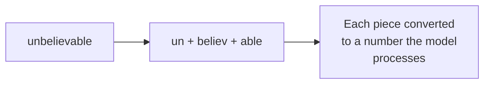
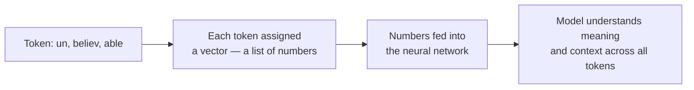
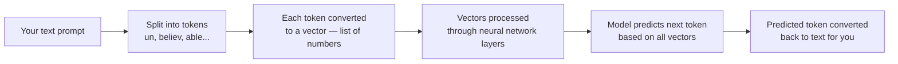
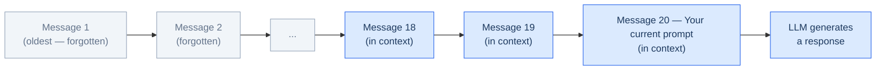
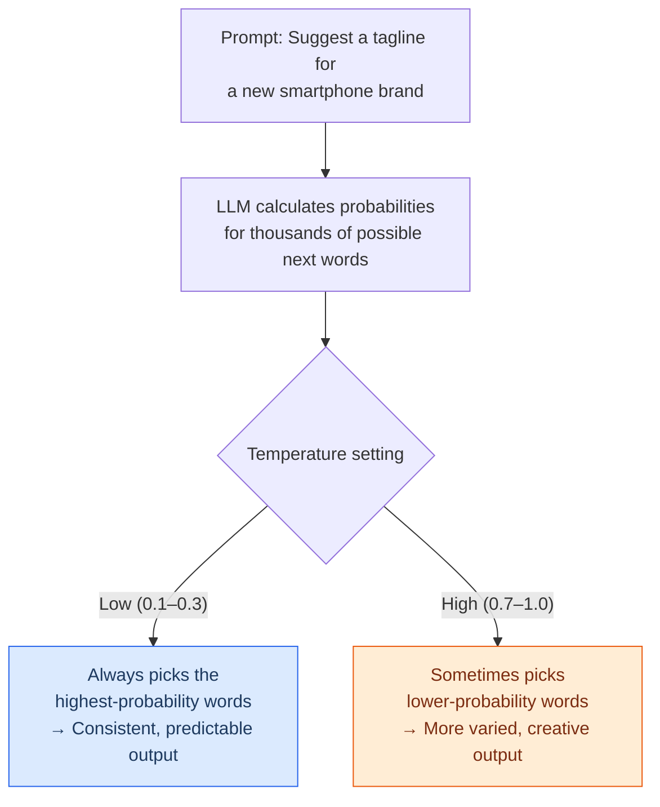
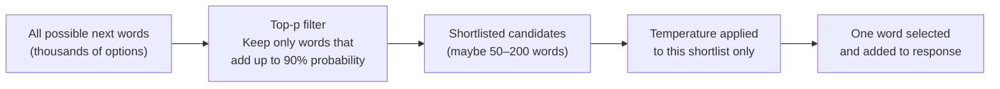

# Tokens, Context Windows, Temperature and Top-p

---

## Learning Objectives

By the end of this topic, you will be able to:

- Explain what a token is and why LLMs read text as tokens rather than whole words
- Describe what a context window is and what happens when a conversation exceeds it
- Explain what temperature is and choose the right temperature setting for a given task
- Explain what top-p is and how it works alongside temperature
- Explain why the same prompt can give different answers each time — and why that is not a bug

---

## Overview

You already know that LLMs predict the most likely next word rather than looking up a fixed answer. This topic gives you three practical controls that directly shape that behaviour — and you will use all three every time you work with any AI model.

**Tokens** are the small chunks of text an LLM reads and writes — not whole words, not single letters, but something in between. Think of tokens like SMS character limits. When you write a long message, your phone counts characters and warns you when you are about to send a second message. LLMs count tokens the same way — and once you hit the limit, it simply cannot see or write any more.

**Context window** is the total number of tokens the model can hold in its memory at one time — everything you have written, everything it has replied, all at once. Think of it like a whiteboard. You can write on it freely, but once it fills up, you have to erase something to make room. When a long conversation makes the AI seem to "forget" what you said earlier — that is the context window filling up.

**Temperature and top-p** are the two settings that control how predictable or creative the AI's output is. Think of temperature like the confidence dial on a quiz show contestant. Set it low and the contestant always answers with their most confident guess — safe and consistent. Set it high and they sometimes take a risk on a less obvious answer — more interesting, occasionally surprising, occasionally wrong. Top-p works similarly but limits the pool of words the model even considers at each step.

Knowing what these three controls do — and when to adjust them — is what separates someone who just uses AI from someone who engineers with it deliberately.

---

## Tokens — How LLMs Actually Read Text

When you type something to Claude or ChatGPT, the AI doesn't read it the way you do — word by word. It first breaks your text into small pieces called **tokens**, and processes each token separately.

A **token** is not a whole word. It is not a single letter. It is something in between — a short word, part of a longer word, a punctuation mark, or a number fragment.

**Real example:**
The word "unbelievable" is not one token. The AI breaks it into smaller pieces — something like "un", "believ", and "able" — and processes each piece separately.



**Why does this exist?**

It is actually smart design. Because of tokens, the AI can handle words it has never seen before — new slang, spelling mistakes, technical jargon, words from other languages — by combining familiar smaller pieces. Without this, the AI would need a dictionary containing every possible word in every language. That is impossible.

**A simple rule of thumb:** 1 token ≈ 0.75 words in English. So 1,000 words ≈ about 1,300 tokens.

---
### From Tokens to Numbers — How Vectorization Works:

Once your text is broken into tokens, the AI still can't process raw words or letters — computers only understand numbers. This is where **vectorization** comes in.
 
Each token is converted into a **vector** — a list of numbers that represents its meaning. Think of a vector like a GPS coordinate for meaning. Every word gets its own coordinate in a giant mathematical map. Words that are similar in meaning end up close together on that map. Words that are unrelated end up far apart.
 
**A simple example using music taste:**
 
Imagine you describe two people's music taste using numbers — pop score, rock score, classical score:
 
```
Ananya = [9, 5, 1]   — loves pop, likes rock, dislikes classical
Kabir  = [8, 6, 2]   — very similar taste to Ananya
```
 
These two people have vectors that are mathematically close — a music app would confidently recommend the same songs to both. Now add a third person:
 
```
Ravi = [1, 2, 9]    — loves classical, dislikes pop and rock
```
 
Ravi's vector sits far away from Ananya and Kabir. The app would recommend completely different music to Ravi.
 
**LLMs work the same way with words.** The words "king" and "queen" end up with vectors that are very close — because they share similar meaning, context, and usage in text. But "king" and "bicycle" end up far apart. This is what allows the AI to understand *meaning*, not just match exact words.
 

 
**The full journey of your text inside an LLM:**
 

 
It's why when you ask about "a car," the AI also understands you might mean "vehicle" or "automobile" — because their vectors are mathematically close on the meaning map.
 
---
### Why Tokens Matter to You Practically

**Cost is measured in tokens, not messages.**
AI tools charge based on how much text you send and receive — not per message. Think of it like mobile data. Sending a one-line question is like loading a small webpage. Sending a 20-page document for AI to read and summarise is like streaming a film. The more text, the more it costs. This is why apps like ChatGPT have free limits and paid plans — they are literally paying per token behind the scenes.

**Longer context = more expensive.**
If you paste a 50-page report into a prompt, you are sending tens of thousands of tokens. A professional AI engineer thinks carefully about what context is strictly necessary — and cuts what is not.

**Different languages use different numbers of tokens.**
English is very token-efficient. Other languages — Hindi, Tamil, Arabic, Japanese — often use more tokens to say the same thing. This means AI is often more expensive and slower to run in non-English languages. This is one reason why the cost of AI in India, for Indian-language tasks, is a real engineering consideration.

---

## Context Windows — The AI's Short-Term Memory

Every LLM has a maximum amount of text it can hold in its "attention" at any one time. This limit is called the **context window**.

**The analogy:** Imagine you are having a long conversation with a colleague who can only remember the last 30 pages of conversation. Everything before that is completely gone from their memory — they cannot refer back to it, even if you mentioned something important there an hour ago. That is exactly how an LLM's context window works.



**What happens when you exceed the context window?**

The earliest parts of the conversation simply disappear from the AI's view. It is not being careless. It genuinely cannot see that part of the conversation anymore. This is why in a very long chat, the AI sometimes seems to "forget" something you told it much earlier.

**Real example — customer support chatbot:**
An airline's AI assistant is helping a customer rebook a flight. Early in the conversation, the customer mentioned they have dietary restrictions and need a vegetarian meal. If that detail falls outside the context window by the time the booking is confirmed, the AI will not include it — not because it ignored the customer, but because it literally cannot see that part of the conversation anymore.

**Practical rule:**
For any important context — a person's name, a specific requirement, a constraint — either keep your conversations short enough to stay within the window, or re-state the important detail near the end of your prompt. Do not assume the AI "remembers" something from much earlier.

**Context window sizes vary significantly across models:**

| Model | Approximate Context Window |
|---|---|
| Claude 3 Haiku | 200,000 tokens (~150,000 words) |
| GPT-4 Turbo | 128,000 tokens (~96,000 words) |
| Gemini 1.5 Pro | 1,000,000 tokens (~750,000 words) |
| Llama 3 (8B) | 8,000 tokens (~6,000 words) |

A larger context window means the model can read longer documents in one go — but it also costs more per request.

---

## Temperature — The Creativity Dial

Every time you send a prompt, the LLM does not just pick one fixed answer. It calculates the probability of many possible next words — and then picks one based on those probabilities. **Temperature** is the setting that controls how adventurous or conservative that picking process is.

**The best analogy — a spice-level dial at a restaurant:**

At a restaurant, you can ask for your food mild, medium, or extra hot. Mild — you always get the same safe, predictable dish. Extra hot — you might get something excitingly different, or something completely inedible. Temperature works exactly the same way for an LLM's word choices.



**Low temperature (0 – 0.3):**
The model almost always picks its most confident, highest-probability next word. Output is consistent and predictable — ask the same question three times and you get very similar answers. Good for tasks where you need accuracy and repeatability.

**High temperature (0.7 – 1.0+):**
The model is more willing to pick less likely words. Output is more varied and "creative" — ask the same question three times and you may get meaningfully different answers. Good for creative tasks where variety is the point.

**Real-world examples:**

| Product | Temperature used | Why |
|---|---|---|
| GitHub Copilot (global) | Very low | Code must be consistent and syntactically correct — creative code suggestions would be useless |
| DeepL / Google Translate | Very low | A translation must be stable and accurate — a "creative" translation is just a wrong one |
| Jasper AI / Copy.ai (marketing) | High | The whole point is to generate 10 different ad taglines — you want variety |
| Customer support bots (Amazon, Flipkart) | Low-to-moderate | Consistent, on-policy answers across thousands of customers |
| Swiggy / Zomato "delayed order" messages | Moderate | Some variety sounds natural, but facts (time, amount) must be accurate |

**The single most important rule about temperature:**

> Temperature changes *how* the model samples — not *what* it knows. Setting a high temperature does not make the model more intelligent. Setting a low temperature does not make wrong information more true. It only controls the sampling.

**How to choose:**

Ask yourself two questions:
1. Does this task need the **same answer every time**? → Use low temperature
2. Does this task **benefit from variety**? → Use higher temperature
3. Are **specific facts critical**? → Always lean lower, regardless of task type

---

## Top-p — Another Way to Control Sampling

**Top-p** (also called nucleus sampling) is a second setting that controls which words the model is even allowed to choose from before temperature is applied.

**The analogy — shortlisting candidates before an interview:**

Imagine you receive 500 job applications. Before you even interview anyone, you shortlist the top candidates whose combined score covers 90% of the total quality. You throw out the bottom 10% completely — they are too weak to even consider. Then from that shortlist, you choose who to interview.

Top-p works the same way. If top-p is set to 0.9, the model only considers the words that together account for 90% of the probability mass. The very low-probability, very unlikely words are excluded entirely — before temperature even comes into play.



**Temperature vs Top-p — what is the difference?**

| Setting | What it controls | Simple way to remember |
|---|---|---|
| **Temperature** | How strictly the model favours its top choice | The spice dial — mild picks the safe option, hot takes risks |
| **Top-p** | Which words are even on the menu | The shortlist — cut the very unlikely candidates before choosing |

In practice, most systems set **top-p to 0.9 or 0.95** and leave it there — this removes the truly nonsensical low-probability options. Then **temperature** is the setting you actively adjust for different tasks.

**You rarely need to tune both at the same time.** Most engineers pick one or the other. Temperature is the more intuitive and widely used setting — start there.

---

## Worked Example — Building Features for a Food Delivery App

**Scenario:** You are building AI features for a Swiggy-style food delivery app. Choose the right settings for each feature:

| Feature | Temperature | Top-p | Why |
|---|---|---|---|
| Extract the exact delivery address and pin code from a customer's free-text message | 0.1 | 0.9 | Needs precise, consistent output — no room for creative variation |
| Generate 5 different "your order is delayed, sorry!" messages for A/B testing | 0.8 | 0.95 | Variety across the 5 messages is the entire goal |
| Answer "What is your refund policy?" using the official policy document | 0.2 | 0.9 | Wording can vary slightly, but policy content must stay accurate |
| Suggest personalised restaurant recommendations for a returning user | 0.5 | 0.9 | Some variety is good — but suggestions must still be relevant |

---

## Key Takeaways

- **Tokens** are the small text chunks LLMs actually read and generate — not whole words. Pricing, context limits, and speed are all measured in tokens
- **1 token ≈ 0.75 words** in English. Non-English languages often use more tokens for the same content
- The **context window** is the AI's short-term memory — the maximum text it can see at once. Text that falls outside it is genuinely invisible to the model
- For important details in a long conversation — re-state them near the current prompt, do not assume the AI remembers them from earlier
- **Temperature** controls how adventurous the model is when sampling its next word — low means consistent and predictable, high means varied and creative
- **Top-p** controls which words are even considered — it removes very low-probability options before temperature is applied
- Temperature changes *how* the model samples — not *what* it knows. It does not make wrong information more true

> **Interview tip:** Most freshers say "temperature = randomness." A better answer is: "Temperature controls how strictly the model samples from its own probability distribution. Low temperature makes the top-probability token dominant. High temperature flattens the distribution so lower-probability tokens get a real chance of being picked." This precision shows you understand the mechanism, not just the effect.

---

## References

- 📎 [Anthropic — Messages API parameters (temperature, top-p)](https://docs.anthropic.com/en/api/messages)
- 📎 [OpenAI — What is temperature?](https://platform.openai.com/docs/guides/text-generation)
- 📎 [Cohere — Temperature and top-p explained](https://docs.cohere.com/docs/temperature)
