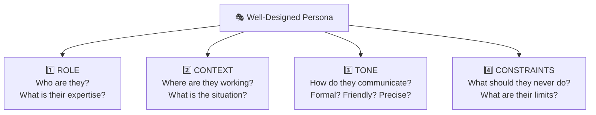
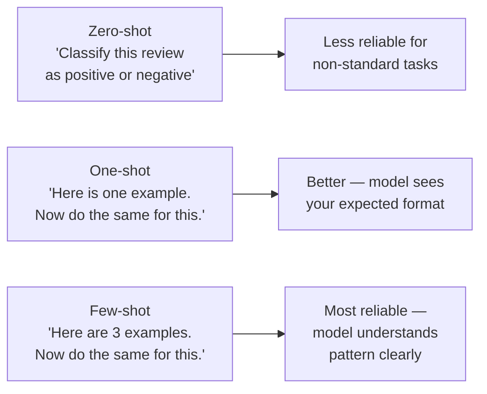

# Role Prompting and Persona Design; Few-Shot Examples

---

## Learning Objectives

By the end of this topic, you will be able to:

- Write a role prompt that gives the AI a specific persona and explain why this improves output quality
- Design a persona using the four key elements — role, context, tone, and constraints
- Explain what a few-shot example is and why it produces more reliable outputs than instructions alone
- Write effective few-shot prompts for a real domain task
- Choose between zero-shot, one-shot, and few-shot prompting for a given situation

---

## Overview

You now know how to structure a conversation — system, user, and assistant roles — and how to shape output format. This topic gives you two of the most powerful techniques for improving the *quality* of that output:

- **Role prompting** — giving the AI a specific persona so it responds from the right perspective, in the right voice, with the right expertise
- **Few-shot examples** — showing the AI exactly what a good output looks like, rather than just describing it in words

Together, these two techniques are what separate a prompt that technically "works" from a prompt that consistently produces professional-quality output.

---

## Role Prompting and Persona Design

### What Is Role Prompting?

**Role prompting** means telling the AI to take on a specific role or persona before answering. Instead of asking the AI to answer as "a generic helpful assistant," you tell it to answer as a specific type of expert with a specific perspective.

**The analogy — asking a colleague vs asking a specialist:**

Imagine you have a legal question about a contract clause. You could ask any colleague and get a vague, general answer. Or you could ask the company's legal counsel — someone who thinks in terms of risk, precedent, and enforceability — and get a precise, expert answer. The question is the same. The persona of the person answering makes all the difference.

Role prompting does exactly this. You do not change the model's underlying knowledge — you change the lens through which it applies that knowledge.

**Without role prompting:**
> Prompt: "Explain what this contract clause means."
> Output: A general, surface-level explanation that could have come from anyone.

**With role prompting:**
> Prompt: "You are a senior commercial lawyer with 15 years of experience reviewing vendor contracts for Indian technology companies. Explain what this contract clause means, flag any risks it creates for the buyer, and suggest how it should be re-worded."
> Output: A specific, risk-aware, actionable explanation written from a legal expert's perspective.

The model did not suddenly become a lawyer. But the persona shaped which knowledge it drew on, what it prioritised, and how it framed the response.

---

### The Four Elements of a Good Persona

A well-designed persona has four parts:



**Element 1 — Role:** Define who the AI is and what their expertise covers.
- Weak: "You are a helpful assistant."
- Strong: "You are a paediatric nurse with 10 years of experience in a public hospital in Maharashtra."

**Element 2 — Context:** Tell the AI where it is and who it is talking to.
- Weak: (no context given)
- Strong: "You are responding to questions from parents of young children in a rural health clinic. Many of them have limited health literacy and are asking about their child's fever."

**Element 3 — Tone:** Tell the AI how to communicate.
- Weak: (no tone instruction — the AI guesses)
- Strong: "Use simple, reassuring language. Avoid medical jargon. If you use a technical term, immediately explain it in plain words."

**Element 4 — Constraints:** Tell the AI what not to do.
- Weak: (no constraints — the AI may go off-brief)
- Strong: "Do not prescribe specific medications or dosages. If a parent describes symptoms that could indicate a serious condition, always recommend they visit the clinic immediately rather than treating at home."

**A complete persona — put together:**
> "You are a paediatric nurse with 10 years of experience in a public hospital in Maharashtra. You are answering questions from parents of young children who visit a rural health clinic. Use simple, reassuring language — avoid medical jargon, and if you use a technical term, immediately explain it in plain words. Do not prescribe specific medications or dosages. If symptoms could indicate a serious condition, always recommend an immediate clinic visit."

---

### Real-World Examples of Role Prompting

**Example 1 — Khan Academy's AI tutor (Khanmigo):**
Khan Academy — the global free education platform used by 150 million students — designed their AI tutor with a very specific persona: "You are a patient, encouraging Socratic tutor. When a student gets an answer wrong, do not give them the correct answer immediately. Instead, ask a guiding question that helps them discover the mistake themselves."

This persona constraint — "do not just give the answer" — is what makes the AI a tutor rather than a calculator. Without it, students would just ask the AI for answers rather than learning.

**Example 2 — A legal research assistant in India:**
> "You are a legal research assistant trained in Indian company law. You help in-house lawyers at Indian technology companies understand complex regulatory filings. Always cite the relevant section of the relevant Act. If you are uncertain about a recent regulatory change, say so explicitly and recommend verifying with official MCA filings."

The "say so explicitly if uncertain" constraint is critical — it prevents the AI from confidently inventing a legal citation, which could lead to a compliance failure.

**Example 3 — A customer service agent for a Southeast Asian e-commerce platform:**
> "You are Maya, a customer service representative for Lazada. You help customers in Malaysia and Singapore with order tracking, returns, and payment issues. Always greet the customer by name. Respond in the same language the customer uses — Bahasa Malaysia, English, or Mandarin. Never promise a specific refund timeline — instead say 'our team will process this within the standard timeline and you will receive an email update.'"

---

### Common Beginner Mistakes in Role Prompting

- **Too vague:** "You are an expert" — an expert in what? For what audience? In what context?
- **No constraints:** Without telling the AI what NOT to do, it will often go off-brief in ways that create problems
- **Conflicting instructions:** "Be brief but also give a comprehensive analysis" — the AI cannot do both simultaneously. Choose one.
- **Forgetting the audience:** The best persona is designed for the specific user, not just the specific expert. A doctor explaining something to a patient sounds very different from a doctor explaining the same thing to a colleague.

---

## Few-Shot Examples — Showing Rather Than Telling

### What Is a Few-Shot Example?

A **few-shot example** is when you show the AI one or more examples of a completed task — an input and its ideal output — before giving it the real task you want done.

**The analogy — training a new employee:**

Imagine you are training a new customer service representative. You could hand them a rulebook and say "write replies that are empathetic, brief, and offer a solution." Or you could show them five real examples of excellent replies and say "write replies that look like these." Which approach produces better results faster? Almost always the examples.

Few-shot prompting works the same way. An example communicates nuance, tone, format, and quality that instructions alone struggle to capture.

---

### Zero-Shot vs One-Shot vs Few-Shot

| Type | What it means | When to use it |
|---|---|---|
| **Zero-shot** | No examples — just instructions | Simple, clear tasks the model handles reliably |
| **One-shot** | One example before the real task | When you want to demonstrate a specific format or tone |
| **Few-shot** | Two to five examples before the real task | When the task has a specific style or structure that is hard to describe in words |



---

### How to Write an Effective Few-Shot Prompt

A few-shot prompt has three parts:

1. **A brief instruction** — what the task is
2. **Two to five examples** — each one showing an input and its ideal output
3. **The real task** — the input you actually want processed

**Example — classifying customer support tickets for an Indian e-commerce platform:**

```
You classify customer support tickets into one of three categories:
DELIVERY — issues with shipping, tracking, or delivery time
PAYMENT — issues with charges, refunds, or payment failures  
PRODUCT — issues with the item itself — wrong item, damaged, defective

Examples:

Ticket: "My package was supposed to arrive yesterday but the tracking shows it's still at the warehouse in Pune."
Category: DELIVERY

Ticket: "I was charged twice for the same order. My bank shows two debits of ₹1,299."
Category: PAYMENT

Ticket: "I received a blue kurta but I ordered the red one. The label says red but the item is clearly blue."
Category: PRODUCT

Ticket: "I've been waiting 8 days for my order and the app just says 'out for delivery' since Monday."
Category: DELIVERY

Now classify this ticket:
Ticket: "The screen on my new phone developed a crack after 2 days of normal use. I haven't dropped it."
Category:
```

The model will almost always output: `PRODUCT` — and in the exact format of the examples (just one word, on its own line, in capitals).

Without the examples, you would need to describe the classification rules in detail — and you would still likely get inconsistent formatting, varying levels of explanation, and occasional misclassifications on ambiguous cases.

---

### Why Few-Shot Works So Well

**It communicates what words cannot easily say.**

Suppose you want the AI to write customer replies that are "warm but professional." What does that actually mean? You could try to describe it — "use a friendly tone, but avoid slang, and don't be too casual." Or you could show three examples. The examples immediately demonstrate the exact balance you mean, in a way that no instruction can fully capture.

**It anchors the format.**

If every example ends with "Please let us know if there is anything else we can help you with!", the model will add that closing line to the real task — without you having to specify it.

**It reduces inconsistency.**

A zero-shot prompt might produce slightly different output formats each run. A few-shot prompt with clear examples produces reliably consistent output — because the model is pattern-matching to your examples, not interpreting vague instructions differently each time.

---

### Real-World Examples of Few-Shot Prompting

**Example 1 — BBC News headline generation:**
Major global news organisations use few-shot prompting to generate article headlines in their house style. They provide 5–10 examples of existing headlines before asking the model to generate a new one. The examples teach the model the exact vocabulary level, punctuation style, and character-count constraint that defines the publication's voice — without the engineers having to write a 20-page style guide.

**Example 2 — Duolingo's AI language exercises:**
Duolingo — the language-learning app with 500 million users globally — uses few-shot prompting to generate language exercises that follow their specific pedagogical structure. They show the model examples of well-formed exercises at a specific difficulty level, then ask it to generate new ones. The examples ensure the grammar complexity, vocabulary level, and exercise format stay consistent — something that instructions alone cannot reliably enforce.

**Example 3 — Legal document clause extraction:**
A legal tech firm in Singapore uses few-shot prompting to extract key clauses from contracts. They show the model 3–4 examples of contracts with highlighted clauses and the correct extraction — then run thousands of new contracts through the same prompt. The examples define exactly what counts as a "liability clause" in their specific domain — a definition that varies between legal traditions and cannot be captured by a simple keyword rule.

---

### How Many Examples Is Enough?

- **1–2 examples:** Enough to demonstrate a specific format or output structure
- **3–5 examples:** Enough to teach a nuanced style, classification pattern, or tone
- **More than 5:** Usually not necessary — and adds cost (more tokens). If 5 examples are not enough, the task may be too complex for prompting alone and may need fine-tuning

**The quality of examples matters more than the quantity.** Three perfect examples always beat ten mediocre ones.

---

## Worked Example — Building a Complaint Summarisation Tool

**Scenario:** You are building a tool that reads customer complaints submitted to a consumer goods company in India and generates a brief summary for the customer service team.

**Step 1 — Design the persona:**
> "You are a customer service analyst for a consumer goods company. You read raw customer complaints and write concise summaries for the customer service team to action. Write in third person. Be neutral and factual — do not include emotional language from the complaint. Focus only on what the customer wants resolved."

**Step 2 — Write the few-shot examples:**
```
Complaint: "I am absolutely furious!! I ordered your Prestige pressure cooker 3 weeks ago and it STILL hasn't arrived. I've called your helpline 4 times and no one can tell me anything. This is completely unacceptable. I need this resolved TODAY or I'm filing a consumer complaint."
Summary: Customer has not received a Prestige pressure cooker ordered 3 weeks ago. Multiple calls to helpline have not resolved the issue. Customer is requesting immediate delivery confirmation or escalation.

Complaint: "Hi, I bought your hair oil last month from Amazon and when I opened it the bottle was only 60% full even though it was sealed. I paid for 200ml and clearly got much less. I'd like a replacement or a refund please."
Summary: Customer received a Prestige hair oil bottle that appeared sealed but was only 60% full. Customer is requesting either a replacement unit or a refund for the shortfall.
```

**Step 3 — The real task:**
```
Complaint: "Your delivery agent came to my address yesterday but I was on a work call and couldn't come to the door in time. Now the app says the item was returned to the warehouse and I have to wait 7 more days for redelivery. I had bought this as a birthday gift and the birthday is tomorrow. Can someone please arrange an urgent delivery today?"
Summary:
```

**Expected output:**
> Customer missed a delivery due to being unavailable. Item has been returned to the warehouse with a 7-day redelivery window. Customer purchased the item as a time-sensitive gift and is requesting urgent same-day redelivery.

---

## Key Takeaways

- **Role prompting** gives the AI a specific persona — role, context, tone, and constraints — that shapes which knowledge it draws on and how it frames the response. The same question answered by a "generic assistant" vs a "senior commercial lawyer" produces very different quality outputs
- A good persona has four elements: **role** (who they are), **context** (where and for whom), **tone** (how they communicate), and **constraints** (what they must never do)
- **Few-shot examples** show the AI a completed input-output pair before giving it the real task. They communicate nuance, format, and quality that instructions alone cannot reliably convey
- **Zero-shot** works for simple clear tasks. **One-shot** helps with format. **Few-shot (2–5 examples)** is most reliable for complex or style-specific tasks
- Quality of examples matters more than quantity — three perfect examples beat ten mediocre ones
- Few-shot prompting reduces inconsistency — the model pattern-matches to your examples, not to its own interpretation of vague instructions

> **Interview tip:** When asked "how do you improve AI output quality?", most freshers say "write a better prompt." A stronger answer is: "I design a specific persona using role, context, tone, and constraints — and I use few-shot examples to show the model the exact format and quality I expect, rather than trying to describe it in words." This shows you understand that telling and showing produce very different results.

---

## References

- 📎 [Anthropic — Prompt engineering guide](https://docs.anthropic.com/en/docs/build-with-claude/prompt-engineering/overview)
- 📎 [OpenAI — Few-shot prompting examples](https://platform.openai.com/docs/guides/prompt-engineering)
- 📎 [Google — Prompting guide (few-shot)](https://ai.google.dev/gemini-api/docs/prompting-strategies)
