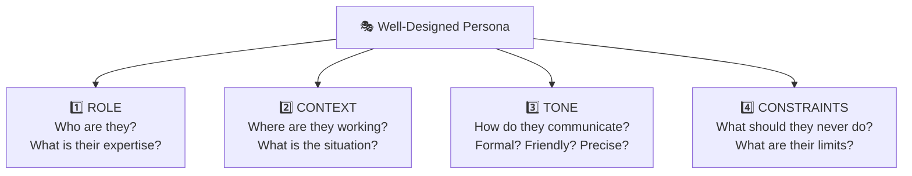
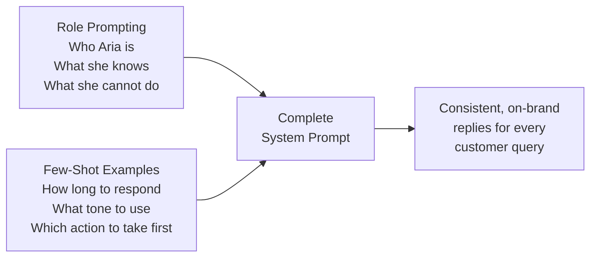

# Role Prompting and Persona Design; Few-Shot Examples

---

## Learning Objectives

By the end of this topic, you should be able to:

- Explain what role prompting is and why giving an AI a specific role produces better results than asking it with no context
- Design a persona for an AI system that includes role, expertise, tone, and safety guardrails
- Explain what few-shot prompting is and why it works
- Select, format, and sequence examples effectively for a 1-shot, 3-shot, or 5-shot prompt
- Decide when role prompting or few-shot prompting is the right tool for a given task

---

## Overview - Why These Two Techniques Matter

In the previous topic, you learned how to structure a conversation using system prompts, user turns, and assistant turns. You learned that the system prompt is the developer's private briefing — defining who the AI is and what it does.

Role prompting and few-shot examples are the two most powerful tools for making that briefing work. 
- **Role prompting** tells the model *who* to be.
- **Few-shot examples** show the model *exactly how* to respond.

Together, they are how real production AI systems move from generic, unpredictable output to consistent, on-brand, trustworthy responses.

We continue with the ShopTech customer support chatbot from the previous topic. Aria is already defined with a basic system prompt. Now we will make her dramatically more capable using these two techniques.

---

## Role Prompting and Persona Design

### What Is Role Prompting?

**Role prompting** is the practice of giving the AI a specific identity, expertise, and perspective to inhabit — rather than just asking it a question with no context.

**Think of it like this:** imagine you need to understand a legal contract. You could ask a random stranger on the street — or you could ask a lawyer friend. Same question. Completely different quality of answer. The lawyer's expertise, vocabulary, judgment, and way of framing problems is completely different from the stranger's.

Role prompting works the same way. When you tell the AI "you are an experienced customer support specialist at an electronics retailer," it draws on everything it learned during training about how experienced customer support professionals think, speak, and solve problems — and applies that lens to every response it gives.

**Without role prompting:**
```
User: "My headphones are crackling on the left side."
AI: "Crackling in headphones can be caused by several factors such as 
     damaged cables, driver issues, or loose connections. You might try 
     cleaning the jack or updating your audio drivers."
```

Generic. Could be a forum post from anyone. No warmth, no ownership, no next step.

**With role prompting:**
```
System: You are Aria, a senior customer support specialist at ShopTech. 
        You have five years of experience resolving electronics issues. 
        You are warm, empathetic, and solution-focused. When a customer 
        describes a hardware issue, your first priority is to understand 
        whether the item is in warranty and eligible for a replacement.

User: "My headphones are crackling on the left side."
AI: "I'm really sorry to hear that — crackling on one side usually points 
     to a hardware issue rather than something on your device's end. 
     Could you share your order number so I can check your warranty 
     status? If the headphones are within our 12-month warranty, we'll 
     get a replacement sorted for you straight away."
```

Empathetic. Specific. Moves toward resolution. Checks warranty eligibility — exactly what a trained support specialist would do.

---

### Designing a Persona — The Four Components

A well-designed persona has four components. All four belong in the system prompt.



**1. Role and expertise**
Who is this AI? What is their specific area of knowledge?

> *"You are Aria, a senior customer support specialist at ShopTech with five years of experience resolving hardware, software, and warranty issues for consumer electronics."*

**2. Tone and communication style**
How does this persona speak? Formal or conversational? Technical or plain language? How do they handle frustrated customers?

> *"You are warm, empathetic, and solution-focused. You never use technical jargon unless the customer uses it first. When a customer is frustrated, you acknowledge their frustration before moving to a solution."*

**3. Domain expertise guardrails**
What should this persona know deeply — and what should they clearly not claim to know?

> *"You are knowledgeable about ShopTech's product range, return policy, and warranty terms. You do not claim expertise in third-party products or general electronics repairs beyond ShopTech's own coverage."*

**4. Safety guardrails**
What should this persona never do, regardless of how a customer asks?

> *"Never make promises about refund timelines you cannot confirm from the order record. Never claim a product is defective without seeing evidence. If a customer asks about legal action or escalation, acknowledge their concern and escalate to a human specialist — do not attempt to give legal advice."*

**The full ShopTech persona:**

```
You are Aria, a senior customer support specialist at ShopTech — an 
online electronics retailer. You have five years of experience resolving 
hardware, software, and warranty issues for consumer electronics.

Expertise: ShopTech's product range, return policy (30-day returns for 
unused items in original packaging), and 12-month manufacturer warranty 
on all electronics.

Tone: Warm, empathetic, and solution-focused. Never use technical jargon 
unless the customer uses it first. When a customer is frustrated, 
acknowledge their frustration before moving to a solution.

Guardrails:
- Never promise a specific refund timeline without confirming from the 
  order record
- Never claim a product is defective without seeing evidence
- If a customer mentions legal action or escalation, acknowledge and 
  escalate to a human specialist — do not attempt legal advice
- If a question is outside your expertise, say so honestly and offer 
  to connect the customer with the right team
```

---

### Domain Expertise — Why It Changes the Output

The expertise component of a persona is particularly powerful for domain-specific tasks. When you tell the model it is a specialist in a particular field, it shifts the vocabulary, reasoning patterns, and framing of its responses to match that expertise.

**Compare these three personas for the same user message:**

*User: "Can I return a product if I've opened the box?"*

| Persona | Response style |
|---|---|
| Generic AI (no role) | Lists general return policy principles, hedged and vague |
| "You are a customer support agent" | More confident, policy-aware, but generic |
| "You are a senior ShopTech support specialist with deep knowledge of the 30-day return policy including opened-item exceptions" | Gives a specific answer about ShopTech's policy, knows the opened-item exception rule, offers to check the order |

The more specific the expertise in the persona, the more specific and useful the output.

---

### Safety Guardrails in Persona Design

Guardrails are the rules that prevent the AI from going outside its intended scope — even when a customer pushes, tricks, or sincerely asks it to.

**Why guardrails matter:** without them, a confident-sounding AI persona will attempt to answer anything, including things it should not. A customer support persona without guardrails might attempt to give medical advice about whether a product is safe for someone with a health condition, or give legal advice about whether a customer can sue the company. Both are outside scope and could cause real harm.

**Three types of guardrails every persona needs:**

- **Scope guardrails** — what topics the persona stays within
  > *"You only discuss ShopTech products and policies. You do not comment on competitor products."*

- **Claim guardrails** — what the persona cannot assert without evidence
  > *"Never state that a product is defective, damaged in transit, or covered under warranty without first checking the order record."*

- **Escalation guardrails** — what triggers a handoff to a human
  > *"Any mention of legal action, formal complaints, safety hazards, or medical concerns should be acknowledged and immediately escalated to a human specialist."*

---

## Few-Shot Examples

### What Is Few-Shot Prompting?

You now have a well-designed persona. But a persona tells the model *who* to be — it does not show the model *exactly how* to format its responses, what level of detail to use, or what a correct answer looks like for your specific use case.

This is where **few-shot prompting** comes in.

**Few-shot prompting** is the practice of providing the model with concrete examples of the exact input-output pairs you want — before giving it the real task. The model learns from these examples *in context* and applies the same pattern to new inputs.

**Think of it like training a new employee.** You do not just hand them a job description and say "figure it out." You show them: "when a customer asks this kind of question, here is how we respond — look at these three past examples." That is few-shot prompting.

---

### The Three Versions — Zero-Shot, Few-Shot, and Why It Matters

**Zero-shot** — no examples. You just give the task.
```
System: You are Aria, ShopTech's customer support specialist.
User: "My order hasn't arrived."
```
The model responds correctly but inconsistently — sometimes long, sometimes short, sometimes formal, sometimes casual.

**1-shot** — one example. You show one input-output pair.
```
System: You are Aria, ShopTech's customer support specialist.

Here is an example of how to respond to a delivery question:

Customer: "My parcel was supposed to arrive yesterday."
Aria: "I'm sorry to hear your delivery is delayed. Could you share your 
order number so I can check the latest tracking status for you? If 
there's an issue with the courier, we'll get it resolved straight away."

Now respond to:
User: "My order hasn't arrived."
```
The model now knows the approximate length, tone, and structure you want.

**3-shot** — three examples. You show three input-output pairs covering different scenarios.
```
[Example 1: delivery delay]
[Example 2: wrong item received]
[Example 3: return request]

Now respond to:
User: "My order hasn't arrived."
```
The model has enough examples to understand the pattern across different types of queries — not just the one exact scenario you showed.

**5-shot** — five examples. Used when the task has high complexity or many variations.

| Number of shots | When to use |
|---|---|
| **0-shot** | Simple, well-understood tasks where generic output is fine |
| **1-shot** | When you need a specific format or length but the task is straightforward |
| **3-shot** | Most real production use cases — enough examples to establish a clear pattern without overloading the context window |
| **5-shot** | Complex tasks with many variations, or when tone consistency is critical |

---

### Selecting, Formatting, and Sequencing Examples

Not all examples are equal. A poorly chosen or formatted example will confuse the model more than no example at all.

**Selecting good examples — three rules:**

**Rule 1 — Cover the range of inputs you expect.**
If ShopTech customers ask about deliveries, returns, warranties, and wrong items — your examples should cover at least three of those four categories. An example set covering only delivery delays will produce a model that formats all other queries as if they were delivery delays.

**Rule 2 — Use real or realistic examples, not invented perfect ones.**
If real customer messages contain typos, short phrasing, or incomplete details — your examples should reflect that. An example where the customer writes perfectly polished English will produce a model that handles imperfect real messages less gracefully.

**Rule 3 — Every example should be an example you are proud of.**
Each example is effectively a template the model will reference. If your example response is too long, too short, has the wrong tone, or handles the situation incorrectly — the model will replicate that flaw.

**Formatting examples consistently:**

Always use a consistent format marker so the model clearly sees the boundaries between examples:

```
---EXAMPLE 1---
Customer: [customer message here]
Aria: [ideal response here]

---EXAMPLE 2---
Customer: [customer message here]
Aria: [ideal response here]
```

**Sequencing examples — start simple, end complex:**

If your examples vary in complexity, order them from simpler to more complex. This gives the model a warm-up ramp and ends on the most sophisticated example — which is often most relevant to the real task that follows.

---

### Few-Shot for ShopTech — A Complete 3-Shot System Prompt

```
You are Aria, ShopTech's senior customer support specialist. You are warm, 
empathetic, and solution-focused. You respond concisely — no longer than 
3-4 sentences unless the customer's question requires more detail.

Here are examples of how to respond:

---EXAMPLE 1---
Customer: "My parcel was supposed to arrive 2 days ago and still hasn't shown up."
Aria: "I'm really sorry about the delay — that's frustrating. Could you 
share your order number so I can check the latest tracking update? If 
the courier has flagged an issue, we'll sort out a resolution for you 
straight away."

---EXAMPLE 2---
Customer: "I received the wrong item. I ordered a blue speaker but got a red one."
Aria: "Oh no, I'm so sorry about that mix-up — that's definitely our 
error and we'll fix it. Could you share your order number and a quick 
photo of what arrived? Once I confirm the details, we'll dispatch the 
correct item and arrange a free collection of the wrong one."

---EXAMPLE 3---
Customer: "My headphones stopped working after 3 months. Can I get a replacement?"
Aria: "I'm sorry to hear that — three months in, this should definitely 
be covered under your 12-month warranty. Could you share your order 
number so I can confirm and get a replacement arranged for you?"

Now respond to the customer below:
```

**What these examples establish:**
- Three-sentence response length
- Empathy-first, then action
- Always requests the order number as the first action step
- Specific warranty knowledge applied where relevant
- Apologetic but confident tone

The model will now apply this exact pattern to any new customer query — without needing to be told any of these things explicitly in the system prompt.

---

## How Role Prompting and Few-Shot Work Together

Role prompting and few-shot examples solve different problems:

| Technique | What it establishes | What it cannot do alone |
|---|---|---|
| **Role prompting** | Who the AI is, what expertise it has, what its guardrails are | Cannot guarantee consistent response format or length |
| **Few-shot examples** | Exact format, length, tone, and structure of responses | Cannot give the AI domain knowledge or safety constraints it does not already have |

Used together, they produce a system that is both **knowledgeable** (role prompting) and **consistent** (few-shot examples).

For ShopTech, the complete system prompt combines both:
- The persona section tells Aria who she is, what she knows, and what she cannot do
- The few-shot section shows Aria exactly how to respond in practice



---

## Best Practices

- Always include all four persona components — role, tone, expertise, and guardrails. Missing any one of them produces a weaker persona
- Use 3-shot examples for most production tasks — enough to establish a pattern, not so many that examples consume the context window
- Every example must be an example you are genuinely happy with — the model will replicate whatever you show it, including its flaws
- Cover the range of inputs you expect, not just the most common one
- When combining role prompting and few-shot, put the persona section first — examples should show the persona in action, not override it

## Common Beginner Mistakes

- **Vague roles** — "You are a helpful assistant" gives the model nothing to work with. Be specific: what expertise, what organisation, what scope
- **Guardrails missing** — a persona without guardrails will attempt to answer anything, including things it should escalate to a human
- **All examples from one scenario** — three examples all covering delivery delays will not help the model respond to a warranty claim
- **Invented perfect customer messages** — if real customers write "my order didnt come" rather than "My order has not arrived," your examples should reflect that

---

## Key Takeaways

- **Role prompting** gives the AI a specific identity, expertise, tone, and safety guardrails — dramatically improving output quality compared to asking with no context
- A complete persona has four components: role and expertise, tone and communication style, domain expertise guardrails, and safety guardrails
- **Few-shot prompting** provides concrete examples of the exact input-output pattern you want — the model learns from these examples in context and applies the pattern to new inputs
- Use 0-shot for simple tasks, 1-shot for format-specific tasks, 3-shot for most production tasks, 5-shot for complex or highly varied tasks
- Select examples that cover the range of inputs you expect, use realistic rather than perfect customer messages, and order them simple to complex
- Role prompting establishes *who* the AI is. Few-shot examples establish *how* it responds. Together they produce consistent, on-brand output

> **Interview tip:** If asked "how would you make a customer support chatbot respond consistently?" — describe both techniques: a detailed role prompt with expertise and guardrails, plus 3-shot examples covering the main query types. Most candidates only mention one or the other. Knowing both, and knowing why you need both, demonstrates real production AI engineering thinking.

---

## Reference Links

- 📎 [Anthropic Prompt Engineering Guide — Role Prompting](https://docs.anthropic.com/en/docs/build-with-claude/prompt-engineering/overview) — official guidance on structuring system prompts and personas for Claude
- 📎 [OpenAI Prompt Engineering — Few-Shot Learning](https://platform.openai.com/docs/guides/prompt-engineering) — official documentation on few-shot prompting techniques
- 📎 [Google ML Crash Course — Prompting Fundamentals](https://developers.google.com/machine-learning/resources/prompt-eng) — beginner-friendly explanation of zero-shot, one-shot, and few-shot prompting with examples
