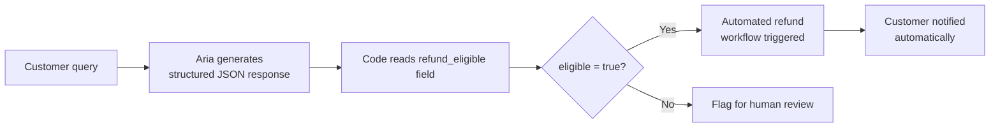

# Chain-of-Thought Reasoning and Structured Outputs

---

## Learning Objectives

By the end of this topic, you should be able to:

- Explain what Chain-of-Thought prompting is and why it produces better results on complex tasks
- Apply zero-shot CoT using the "think step by step" trigger phrase
- Identify which tasks benefit from CoT and which do not need it
- Request structured outputs in JSON, XML, and Markdown table formats
- Explain why structured outputs matter when AI responses feed into downstream code or systems

---

## Why These Two Techniques Matter

You have now built Aria — ShopTech's customer support persona — with a well-designed role prompt and few-shot examples. Aria handles straightforward queries well. A customer asks about a delayed delivery, Aria checks the order number and responds warmly.

But what happens when the query is genuinely complex? A customer writes: *"I ordered three items. Two arrived damaged and one never came. I paid with a voucher and part cash. Can I get a full refund and will the voucher credit come back separately?"*

This is not a simple lookup. It requires Aria to reason through multiple conditions in sequence — damaged items, missing item, split payment, refund policy, voucher reinstatement rules — before arriving at a correct answer. If she jumps straight to an answer without working through each part, she will almost certainly get something wrong.

**Chain-of-Thought prompting** is how you make the AI work through complex problems step by step before answering. **Structured outputs** are how you make the AI's answer usable by the rest of your system — not just readable by a human. Together, these two techniques complete the toolkit for building production-grade AI features.

---

## Chain-of-Thought Reasoning

### What Is Chain-of-Thought Prompting?

**Chain-of-Thought (CoT) prompting** is the practice of instructing the AI to show its reasoning step by step before giving its final answer — rather than jumping directly to a conclusion.

**Think of it like a maths exam.** A student who writes only the final answer — "the answer is $47" — cannot be given partial credit if it is wrong, and the teacher cannot see where the student's thinking went off track. A student who writes out every step — "first I calculated the discount, then added tax, then checked the shipping cost" — gets partial credit even if the final number is slightly wrong, and the teacher can catch exactly where the error crept in.

CoT prompting does the same thing for AI. By asking the model to write out its reasoning before concluding, you get:
- More accurate answers on multi-step problems
- A visible chain of logic you can check
- A way to catch where the reasoning went wrong if the answer is incorrect

**Without CoT — Aria jumping straight to an answer:**

```
Customer: "I ordered three items. Two arrived damaged and one never came. 
I paid with a voucher and part cash. Can I get a full refund?"

Aria: "Yes, you are eligible for a full refund. We will process it 
within 5-7 business days."
```

This sounds confident — but Aria never checked: are damaged items handled differently from missing items? Does the voucher get reinstated separately from the cash refund? She skipped the reasoning and gave a generic answer that might be partially wrong.

**With CoT — Aria reasoning through each step:**

```
Customer: "I ordered three items. Two arrived damaged and one never came. 
I paid with a voucher and part cash. Can I get a full refund?"

Aria thinks through:
Step 1 — Damaged items: Both are eligible for a replacement or refund 
under the 30-day damaged goods policy. Customer has a choice.
Step 2 — Missing item: This is a courier issue — needs a trace first. 
If unresolved within 48 hours, a refund or re-dispatch is issued.
Step 3 — Payment split: Cash portion refunds to the original payment 
method. Voucher portion reinstates as store credit, not cash — this 
is ShopTech policy.
Step 4 — Customer answer: Full refund is eligible, but the voucher 
amount returns as store credit, not cash. Missing item needs a 48-hour 
trace before refund is confirmed.

Aria responds: "Absolutely — you are covered for all three items. 
For the two damaged items, we can offer a replacement or a refund — 
let me know which you prefer. For the missing item, we need to raise 
a courier trace first, which takes up to 48 hours before we can confirm 
a refund or re-dispatch. One thing to note: the portion you paid by 
voucher will be reinstated as store credit rather than cash, in line 
with our policy. The cash portion refunds to your original payment 
method. Shall I raise all of this now?"
```

The second answer is accurate, specific, and trustworthy — because Aria worked through every condition before answering.

---

### Zero-Shot CoT — The "Think Step by Step" Trigger

You do not always need to provide step-by-step examples to get CoT reasoning. The simplest and most reliable way to trigger it is to add one phrase to your prompt:

> **"Think step by step."** or **"Reason through this carefully before answering."**

This is called **zero-shot CoT** — zero examples needed, just the instruction.

**For ShopTech, in the system prompt:**

```
When a customer query involves multiple conditions — damaged items, 
missing items, split payments, warranty eligibility, or refund 
calculations — think step by step through each condition before 
giving your final response. Show your reasoning clearly so it can 
be reviewed.
```

**Why it works:** when the model is told to reason step by step, it generates each intermediate step as a token — and because LLMs predict the next token based on everything that came before, each reasoning step makes the next step more accurate. The model is essentially using its own intermediate output as evidence for the next conclusion. This is significantly more reliable than generating the final answer in one shot with no intermediate reasoning.

---

### When CoT Measurably Improves Accuracy — and When It Does Not

CoT is not needed for every query. Using it on simple tasks wastes tokens and slows responses.

| Task type | Use CoT? | Why |
|---|---|---|
| "Where is my order?" | No | Simple lookup — no multi-step reasoning needed |
| "Am I eligible for a refund?" | Yes | Requires checking damaged/missing/payment type conditions |
| "What is your return policy?" | No | Single factual recall — no reasoning chain needed |
| "I paid partly by voucher and partly by card — how will my refund be split?" | Yes | Multi-step calculation across two payment types |
| "Write a polite apology for a delayed order" | No | Creative generation — reasoning chain adds nothing |
| "My order has three items with different warranty periods — which ones can I claim?" | Yes | Requires checking each item individually and applying separate rules |

**The test:** does answering correctly require holding multiple conditions in mind at the same time and applying them in sequence? If yes — CoT. If no — skip it.

---

## Structured Outputs

### Why Structure the AI's Response?

At ShopTech, Aria's replies do not always end as a chat message on a screen. Some of them:
- Feed into a ticketing system that needs to extract the order number and issue type
- Trigger an automated refund workflow that needs a specific refund amount and payment method
- Populate a dashboard card showing order status in a specific format
- Get logged in a customer relationship database that expects JSON

A reply like *"I'm sorry about the delay! Your order should arrive by Friday"* is great for a human to read. But if a system needs to extract the delivery date and log it — it cannot reliably parse a natural language sentence. It needs a structured, predictable format.

**Structured outputs** are how you tell the AI to format its response in a machine-readable way — so the rest of your system can use it without human intervention.

---

### JSON — For Machine-Readable Data

**JSON (JavaScript Object Notation)** is the most common structured format for data exchange between systems. It organises information as key-value pairs inside curly braces.

**For ShopTech, when Aria identifies a refund scenario:**

**System prompt instruction:**
```
When a customer is eligible for a refund, respond ONLY with a JSON 
object in this exact format. Do not add any other text.

{
  "order_id": "",
  "refund_eligible": true or false,
  "refund_type": "full" or "partial",
  "cash_refund_amount": 0.00,
  "voucher_credit_amount": 0.00,
  "missing_item_trace_required": true or false,
  "customer_message": ""
}
```

**Aria's output for the complex query above:**
```json
{
  "order_id": "78341",
  "refund_eligible": true,
  "refund_type": "partial",
  "cash_refund_amount": 62.00,
  "voucher_credit_amount": 27.00,
  "missing_item_trace_required": true,
  "customer_message": "You are covered for all three items. The cash portion 
  refunds to your original payment method and the voucher portion reinstates 
  as store credit. We need to raise a 48-hour courier trace for the missing 
  item before confirming that refund."
}
```

Your backend code can now read `cash_refund_amount` directly, trigger the refund workflow, log the `order_id`, and display the `customer_message` to the customer — all without a human parsing a sentence.

**Why JSON specifically?**
Every programming language can read and write JSON natively. It is the universal language between software systems — when your AI feeds data into a database, a ticketing system, or another API, JSON is almost always what they expect.

---

### XML — For Document and Data Exchange Systems

**XML (Extensible Markup Language)** uses named tags — similar to HTML — to wrap each piece of data. It is more verbose than JSON but is preferred in certain enterprise systems, healthcare, and financial data exchange.

**For ShopTech, when Aria assesses a warranty claim:**

**System prompt instruction:**
```
When assessing a warranty claim, respond ONLY in this XML format:

<warranty_assessment>
  <order_id></order_id>
  <eligible>yes or no</eligible>
  <reason></reason>
  <action_required></action_required>
  <escalate_to_human>yes or no</escalate_to_human>
</warranty_assessment>
```

**Aria's output:**
```xml
<warranty_assessment>
  <order_id>78341</order_id>
  <eligible>yes</eligible>
  <reason>Item is within the 12-month manufacturer warranty period 
  and the reported fault is consistent with a manufacturing defect.</reason>
  <action_required>Dispatch replacement unit and arrange free 
  collection of faulty item.</action_required>
  <escalate_to_human>no</escalate_to_human>
</warranty_assessment>
```

Your backend code reads `<eligible>` to decide whether to proceed automatically, checks `<escalate_to_human>` to decide whether a human needs to review, and logs `<reason>` for the customer record.

---

### Markdown Tables — For Human-Readable Structured Display

Sometimes the output needs to be structured — but the audience is a human, not a machine. A customer service supervisor reviewing multiple claims, or a weekly report on refund categories, needs information organised in a way that is easy to scan.

**Markdown tables** give you structure that renders visually in interfaces that support markdown — help centres, dashboards, internal tools.

**For ShopTech, when generating a weekly refund summary:**

**System prompt instruction:**
```
When summarising multiple refund cases, format the output as a 
Markdown table with columns: Order ID, Issue Type, Refund Amount, 
Payment Method, Status.
```

**Aria's output:**
```markdown
| Order ID | Issue Type | Refund Amount | Payment Method | Status |
|---|---|---|---|---|
| 78341 | Damaged item | $62.00 | Card | Processed |
| 78342 | Missing item | $45.00 | Voucher credit | Trace pending |
| 78343 | Wrong item | $89.00 | Card | Replacement dispatched |
```

A supervisor can scan this in seconds. The same data in plain prose would take minutes to read and would be harder to check for errors.

---

### Schema Enforcement — Making the Format Stick

A common problem with structured outputs: the model sometimes breaks the format. It might add a friendly greeting before the JSON object, or use a slightly different key name than you specified.

**Schema enforcement** means specifying the exact format so precisely — and testing it — that the model reliably produces it every time.

**Three techniques for enforcing schema:**

**1 — Explicit instruction with "ONLY":**
> *"Respond ONLY with a JSON object. Do not add any text before or after it."*

**2 — Show the exact schema as a template:**
Providing the exact structure with empty values tells the model exactly what the output must look like — not just a description of it.

**3 — Few-shot examples of correctly formatted output:**
Show one or two examples of the exact JSON or XML you want, then ask for a new one. This is role prompting and few-shot applied to structured outputs — the most reliable combination.

**For ShopTech:**
```
Here is an example of a correctly formatted refund assessment:

Customer query: "My speaker arrived with a crack in the casing."

{
  "order_id": "77891",
  "refund_eligible": true,
  "refund_type": "full",
  "cash_refund_amount": 79.00,
  "voucher_credit_amount": 0.00,
  "missing_item_trace_required": false,
  "customer_message": "I'm sorry about the damaged speaker. You are 
  eligible for a full refund of $79.00 to your original payment method."
}

Now assess this customer query and respond in the same format:
Customer: "I received a keyboard with three broken keys."
```

---

### Why Structure Aids Downstream Processing

The deeper reason structured outputs matter is not just convenience — it is reliability at scale.

At ShopTech, Aria handles hundreds of customer queries per day. If each response is unstructured natural language, a human has to read every single one before any automated action can happen. That defeats the purpose of having AI at all.

With structured outputs:



No human needs to read and interpret Aria's response before the system acts. The AI output feeds directly into the next step of the pipeline — because it is in a format the system can read.

This is the difference between AI as a chat interface and AI as a production engineering component.

---

## Putting It All Together — CoT and Structured Output Combined

The most powerful combination for complex production tasks is CoT reasoning feeding into a structured output. The model thinks through the problem step by step, then formats its conclusion in a machine-readable structure.

**For the complex ShopTech query — CoT + JSON:**

**System prompt:**
```
You are Aria, ShopTech's senior customer support specialist.

When a customer query involves multiple conditions, think step by step 
through each condition before concluding.

Then respond ONLY with a JSON object in this format:
{
  "order_id": "",
  "refund_eligible": true or false,
  "refund_type": "full" or "partial",
  "cash_refund_amount": 0.00,
  "voucher_credit_amount": 0.00,
  "missing_item_trace_required": true or false,
  "customer_message": ""
}
```

The model reasons through the problem (CoT) and then outputs a clean, machine-readable result (structured output). The reasoning is used internally. The JSON is what your system receives and acts on.

---

## Best Practices

- Add "think step by step" to any query involving multiple conditions, calculations, or policy comparisons — it consistently improves accuracy with no downside except a slightly longer response
- Use CoT in the system prompt as a conditional instruction: "when a query involves X, think step by step" — not as a blanket instruction for every response
- Always provide the exact schema when requesting structured output — never describe it in words alone
- Use "ONLY respond with..." to prevent the model adding extra text before or after the structured block
- Combine few-shot examples with structured output requests for the highest format reliability
- Test structured output prompts with 10-20 varied inputs before deploying — format breaks often happen on edge cases

## Common Beginner Mistakes

- **Applying CoT to simple tasks** — asking the model to "think step by step" about "what is your return policy?" wastes tokens and adds no accuracy benefit
- **Describing the format instead of showing it** — saying "respond in JSON with fields for order ID, refund amount, and status" is less reliable than providing the exact empty JSON template
- **Not testing format compliance** — a prompt that produces correct JSON 90% of the time will break 10% of production queries. Always test across varied inputs
- **Mixing CoT reasoning and structured output without separating them** — if you want only JSON in the output, the CoT reasoning must happen internally, not appear in the response. Add: "do not include your reasoning in the response — only the final JSON"

---

## Key Takeaways

- **Chain-of-Thought prompting** instructs the model to reason step by step before answering — producing significantly more accurate results on multi-step problems
- **Zero-shot CoT** is triggered by adding "think step by step" to your prompt — no examples needed
- CoT measurably improves accuracy for multi-condition queries, calculations, and policy reasoning — it adds no value for simple factual lookups or creative generation
- **Structured outputs** format the AI's response as JSON, XML, or Markdown tables — making it directly usable by downstream code without human interpretation
- JSON is the standard for data exchange between systems. XML is used in enterprise and regulated industries. Markdown tables are for human-readable structured display
- **Schema enforcement** — provide the exact template, use "ONLY respond with...", and combine with few-shot examples for highest reliability
- CoT and structured outputs combine naturally: CoT for reasoning accuracy, structured output for machine-readable results

> **Interview tip:** If asked "how would you handle a complex multi-condition query in a production AI system?" — describe both: CoT to ensure reasoning accuracy, then a structured output so the conclusion feeds cleanly into the downstream pipeline without human parsing. This shows you think about AI as an engineering component, not just a chat interface.

---

## Reference Links

- 📎 [Anthropic Prompt Engineering — Chain-of-Thought](https://docs.anthropic.com/en/docs/build-with-claude/prompt-engineering/chain-of-thought) — official guidance on CoT prompting with Claude
- 📎 [Google — Chain-of-Thought Prompting Elicits Reasoning (2022)](https://arxiv.org/abs/2201.11903) — the original research paper that introduced and validated CoT prompting
- 📎 [Anthropic — Structured Outputs Guide](https://docs.anthropic.com/en/docs/build-with-claude/tool-use) — official documentation on structured and machine-readable outputs
