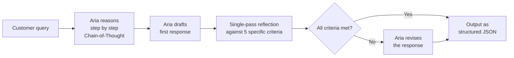

# Reflection and Self-Critique

---

## Learning Objectives

By the end of this topic, you should be able to:

- Explain what reflection prompting is and why asking a model to review its own output can improve quality
- Describe the difference between a single-pass and multi-pass reflection approach
- Identify which types of tasks benefit measurably from reflection and which do not
- Write an effective reflection prompt for a real AI-assisted task
- Recognise the limits of self-critique — what an AI can and cannot reliably catch in its own output

---

## Why Reflection Matters

You have now built a complete prompt engineering toolkit for ShopTech's Aria. She has a well-designed persona, few-shot examples, chain-of-thought reasoning for complex queries, and structured outputs feeding the backend systems.

But here is a question worth asking: what if Aria's first attempt at answering a complex query is good — but not quite right? What if the tone is slightly off, a policy detail is missing, or the refund calculation has a small error?

In a traditional software system, the code either works or it does not. You run the test, it passes or fails, you fix it. But with an AI, the output is probabilistic — each run might be slightly different. And unlike a test suite, you cannot always know in advance exactly what "correct" looks like.

**Reflection prompting** is the practice of asking the model to review and critique its own output before finalising it — catching its own errors, improving its reasoning, or strengthening its response. Think of it like asking someone to proofread their own work before submitting it. They will not catch everything — but they will catch more than if they submitted the first draft blind.

---

## What Is Reflection Prompting?

**Reflection prompting** is giving the model an instruction to evaluate its own just-generated response against a set of criteria — and then revise it if needed.

**Think of it like a professional editing pass.** A journalist writes a first draft of an article, then reads it again specifically looking for: Is every fact accurate? Is the headline clear? Is the tone right for the audience? Have I missed any important angle? That deliberate second reading — with specific things to look for — is reflection. The journalist is not just re-reading casually. They are applying a checklist.

Reflection prompting works the same way. You give the model a checklist — explicitly or implicitly — and ask it to apply that checklist to its own output.

**Without reflection — Aria's first attempt:**

```
Customer: "My headphones arrived damaged and I need a refund, but I 
paid half by voucher. Will I get all my money back?"

Aria (first attempt): "I'm sorry to hear your headphones arrived 
damaged. You are eligible for a full refund. Please share your 
order number and we'll get this sorted."
```

This sounds fine at a glance. But it is missing something important: the customer paid half by voucher. ShopTech policy is that voucher payments reinstate as store credit, not cash. Aria did not address this — and if the customer expects cash back for the full amount, they will be disappointed.

**With reflection — Aria reviews and corrects:**

```
Aria reviews her response:
- Did I acknowledge the damage? Yes.
- Did I confirm eligibility? Yes.
- Did I address the split payment? NO — I need to fix this.
- Is the tone right? Yes.

Aria's revised response: "I'm really sorry your headphones arrived 
damaged — that's not acceptable and we'll fix it. You are eligible 
for a full refund. Just to set expectations: the cash portion will 
refund to your original payment method, while the voucher portion 
will reinstate as store credit rather than cash — that's our 
standard policy for split payments. Could you share your order 
number so I can get this moving?"
```

The reflection caught the missing policy detail and produced a more complete, honest answer.

---

## Single-Pass vs Multi-Pass Reflection

### Single-Pass — One Review, One Revision

In a **single-pass** reflection, the model generates its first response, then reviews it once and produces a revised version.

**How to implement it — in the prompt:**

```
Step 1: Draft your response to the customer query.

Step 2: Review your draft against these criteria:
- Did you acknowledge the customer's issue with empathy?
- Did you confirm their eligibility clearly?
- Did you address all conditions in their query, including payment type?
- Is the response under 4 sentences?

Step 3: If anything is missing or could be clearer, rewrite the response. 
If everything checks out, output the draft as your final response.
```

**When to use single-pass:**
Single-pass reflection is appropriate for most production tasks. It adds one additional generation step — slightly more tokens, slightly more latency — but the quality improvement on complex queries is worth it.

**For ShopTech's most important query types — policy eligibility, refund calculations, warranty assessments — single-pass reflection is the standard recommended approach.**

---

### Multi-Pass — Multiple Rounds of Review

In a **multi-pass** reflection, the model generates, reflects, revises, then reflects again on the revised version — repeating this cycle multiple times.

**How it works:**

```
Round 1: Generate first draft → reflect → revise
Round 2: Review revised draft → reflect again → revise again
Round 3: Final check — output
```

**Think of it like the editing process at a publisher.** The author writes a chapter. An editor reviews and marks it up. The author revises. A copy editor does a second pass for grammar and consistency. A fact-checker does a third pass for accuracy. Each pass serves a different purpose and catches different things.

Multi-pass reflection applies the same logic: each round may focus on a different dimension — first pass for factual accuracy, second pass for tone, third pass for length.

**For ShopTech — a multi-pass example for a high-stakes warranty denial:**

```
Round 1 reflection criteria: Is the denial factually correct based 
on the warranty terms?

Round 2 reflection criteria: Is the tone empathetic and non-confrontational, 
given that this is a disappointing outcome for the customer?

Round 3 reflection criteria: Does the response offer a next step or 
alternative even though we cannot fulfil the warranty claim?
```

Each round catches something different. The final output is significantly stronger than the first draft — because it has been evaluated against three separate sets of criteria.

**When to use multi-pass:**
Multi-pass reflection is appropriate for high-stakes, high-sensitivity outputs where a single review is not sufficient:
- Formal complaint responses that will be reviewed by a legal team
- Warranty denial letters that must be accurate and compassionately worded
- Policy explanations that will be published in the help centre

**The trade-off:** multi-pass uses significantly more tokens and takes longer. For high-volume, time-sensitive queries, the latency cost may outweigh the quality benefit. Use it selectively.

---

## What Improves — and What Does Not

Reflection is powerful but not unlimited. Understanding where it helps and where it does not prevents you from relying on it for things it cannot actually fix.

### What Reflection Reliably Improves

**Completeness** — the most consistent improvement. Reflection catches missing conditions, overlooked details, and unanswered parts of a complex query. In the ShopTech example, Aria catching the missed split-payment policy is a completeness fix.

**Tone and empathy** — reflection can catch responses that are technically accurate but feel cold, robotic, or inappropriately casual for the situation. Asking the model "is this response appropriately empathetic given the customer's frustration?" reliably improves responses to upset or distressed customers.

**Format compliance** — if a response should be under 4 sentences and it came out as 7, reflection can catch and fix that. If a JSON block has a missing field, reflection can catch it.

**Internal consistency** — if the response says "you are eligible for a full refund" but then calculates a partial refund amount, reflection can catch and resolve the contradiction.

### What Reflection Does NOT Reliably Fix

**Factual hallucinations from training data** — if the model hallucinated a policy detail or a product specification it does not actually know, reflection will not reliably catch it. The model will often confirm its own hallucinated fact as correct because it has no external source to check against. This is the most critical limitation.

> **The key insight:** reflection helps the model catch errors in *reasoning* and *completeness* — but it cannot catch errors in *knowledge*. If Aria does not know the correct warranty terms, asking her to reflect on her warranty assessment will not reliably produce the correct answer. That requires grounding — connecting the AI to a verified source of truth, like a policy document — not reflection.

**Bias in the original prompt** — if the prompt itself contains a flawed assumption or a misleading framing, reflection over the output of that prompt will not correct the assumption. The model will evaluate its output against the flawed framing it was given.

**Novel edge cases** — reflection works well for criteria the model has seen frequently in training. For genuinely unusual or novel situations, the model may not know what "good" looks like — and its reflection criteria will not reliably catch the problem.

---

### Summary — What Reflection Helps and What It Does Not

| | Reflection helps | Reflection does not reliably help |
|---|---|---|
| **Completeness** | Catches missing conditions or unanswered parts | Cannot surface information it does not already have |
| **Tone** | Catches responses that are too cold, harsh, or casual | Cannot correct tone bias baked into the original persona |
| **Format** | Catches length violations, missing JSON fields, inconsistent structure | |
| **Internal consistency** | Catches contradictions within the response | Cannot catch contradictions with external ground truth |
| **Factual accuracy** | | Cannot reliably catch hallucinated facts — needs grounding |
| **Novel edge cases** | | Cannot reliably evaluate situations it has not seen |

---

## Writing an Effective Reflection Prompt

The quality of reflection depends entirely on the quality of the criteria you give the model to reflect against. Vague criteria produce vague reflection.

**Weak reflection prompt:**
```
Review your response and improve it if needed.
```
The model does not know what to look for. It will typically change minor phrasing and declare the response improved — whether or not it actually is.

**Strong reflection prompt:**
```
Review your response against these specific criteria:

1. Did you acknowledge the customer's specific issue — not a generic 
   apology?
2. Did you address every condition they mentioned — including payment 
   type, item count, and delivery status?
3. Is the refund policy for voucher payments stated correctly?
4. Is the response under 4 sentences?
5. Does the response end with a clear next action for the customer?

If any criterion is not met, rewrite the response. If all are met, 
output the response unchanged.
```

**The three rules for effective reflection criteria:**
1. **Be specific** — "is the tone right?" is weak. "Is the response empathetic given that the customer is distressed?" is specific
2. **Be checkable** — each criterion must be answerable as yes or no, not a matter of opinion
3. **Prioritise the most likely failure modes** — base your criteria on what commonly goes wrong in this type of response, not a generic checklist

---

## Putting It All Together — Reflection in the ShopTech System

For ShopTech's highest-stakes interactions — warranty denials, full refund eligibility for split payments, formal complaint responses — the complete pipeline now looks like this:



Chain-of-Thought ensures the reasoning is sound. Reflection ensures the output is complete and well-formed. Structured output ensures the backend system can act on it. All three techniques work together.

---

## Best Practices

- Always give the model specific, checkable criteria to reflect against — never just "review and improve"
- Base reflection criteria on the most common failure modes for that specific task type — not a generic quality checklist
- Use single-pass reflection for most production tasks. Reserve multi-pass for high-stakes, low-volume outputs
- Never rely on reflection alone to catch factual errors — use grounding (verified source documents) for factual accuracy
- Test your reflection prompt by deliberately introducing errors into a first draft and checking whether the reflection catches them

## Common Beginner Mistakes

- **Treating reflection as a hallucination fix** — asking the model to "check your facts" will not reliably catch hallucinations. The model has no external source to check against
- **Using vague reflection criteria** — "make sure it sounds good" gives the model nothing to evaluate against. Specify exactly what "good" means for this task
- **Applying multi-pass reflection to every task** — this adds significant latency and token cost. Use it only where the quality gain justifies the cost
- **Assuming reflection always improves output** — reflection on a well-formed first draft can introduce unnecessary changes. If the first draft passes all criteria, output it unchanged

---

## Key Takeaways

- **Reflection prompting** asks the model to review its own output against specific criteria before finalising — catching errors in completeness, tone, format, and internal consistency
- **Single-pass reflection** — one review, one revision — is appropriate for most production tasks
- **Multi-pass reflection** — multiple rounds of review, each against different criteria — is appropriate for high-stakes, low-volume outputs where each quality dimension matters independently
- Reflection reliably improves **completeness, tone, format compliance, and internal consistency**
- Reflection does **not** reliably catch **factual hallucinations** — the model cannot verify its own knowledge against an external source. Use grounding for factual accuracy
- Reflection criteria must be **specific and checkable** — vague criteria produce vague reflection
- In a full production pipeline, reflection works alongside Chain-of-Thought reasoning and structured outputs — not as a standalone technique

> **Interview tip:** If asked "how do you improve the reliability of AI-generated responses?" — mention reflection alongside grounding and structured outputs, but be precise about what each technique fixes. Reflection improves completeness, tone, and consistency. Grounding fixes factual accuracy. Structured outputs fix format reliability. Most candidates say "you can ask it to check its own work" without knowing the limits of that approach. You now know both when it works and when it does not.

---

## Reference Links

- 📎 [Anthropic Prompt Engineering — Iterative Refinement](https://docs.anthropic.com/en/docs/build-with-claude/prompt-engineering/overview) — official guidance on multi-step prompting and iterative improvement techniques
- 📎 [Reflexion — Language Agents with Verbal Reinforcement Learning (2023)](https://arxiv.org/abs/2303.11366) — the foundational research paper on AI self-reflection and its measurable impact on task accuracy
- 📎 [Google — Self-Refine: Iterative Refinement with Self-Feedback (2023)](https://arxiv.org/abs/2303.17651) — research showing how multi-pass self-critique improves output quality across diverse tasks
