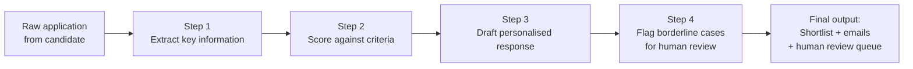

# Prompt Chaining and Multi-Turn Design

---

## Learning Objectives

By the end of this topic, you should be able to:

- Explain what prompt chaining is and why breaking a complex task into a sequence of prompts produces better results than one large prompt
- Design a prompt chain with clearly defined inputs, outputs, and handoffs between steps
- Explain what multi-turn design is and how it differs from a simple back-and-forth conversation
- Identify where in a chain a human checkpoint should sit
- Recognise when a task needs chaining and when a single prompt is sufficient

---

## Overview - Why Prompt Chaining Matters

Imagine you are the engineering lead at a mid-sized company. You receive 400 job applications every time you post a role. Reading every application manually is not feasible. Your team decides to build an AI-powered screening pipeline.

The instinct for most beginners is to write one large prompt that does everything at once:

> *"Read this application, extract the candidate's key skills and experience, score them out of 100 against our criteria, decide if they should be shortlisted, and if yes, draft a personalised interview invitation email."*

This sounds logical. But in practice, a single prompt doing all of this at once produces:
- Inconsistent scoring — the model's extraction and scoring influence each other unpredictably
- Unreliable emails — the draft is written before the scoring is stable
- No way to check the intermediate steps — if the final email is wrong, you cannot see where it went off track
- A fragile system — if any part of the task is slightly ambiguous, the whole output can fail

**Prompt chaining** solves this by breaking the task into a sequence of focused, single-purpose prompts — each one doing one thing well, passing its clean output to the next step.

---

## What Is Prompt Chaining?

**Prompt chaining** is the practice of connecting a sequence of AI calls where the output of one prompt becomes the input of the next — building toward a complex final result step by step.

**Think of it like an assembly line in a factory.** Each station on the line does one specific job. The welding station welds. The painting station paints. The inspection station checks. No station tries to do all three at once. The product moves from station to station, improving at each step, and the final product at the end of the line is the result of every station doing its job well.

Prompt chaining works the same way. Each prompt is one station. The output at the end of the chain is the result of every prompt doing its specific job cleanly.

---

## The Job Application Screening Pipeline

For the job screening system, the chain has four steps:



Each step receives the previous step's output as its input. Let us walk through each one.

---

### Step 1 — Extract Key Information

**What this prompt does:** reads the raw application and pulls out structured data — nothing more.

**Why a separate step:** if you ask the model to score and extract at the same time, the scoring influences what it notices during extraction. Separating them means the extraction is unbiased.

**The prompt:**
```
You are a recruitment data extraction assistant.

Read the following job application and extract ONLY the information 
below. Do not evaluate or score — just extract.

Output as JSON:
{
  "candidate_name": "",
  "years_of_experience": 0,
  "relevant_skills": [],
  "highest_qualification": "",
  "previous_companies": [],
  "career_gap_years": 0,
  "applied_role": ""
}

Application:
[RAW APPLICATION TEXT]
```

**Output from Step 1:**
```json
{
  "candidate_name": "Marcus Webb",
  "years_of_experience": 4,
  "relevant_skills": ["Python", "data pipelines", "SQL", "AWS"],
  "highest_qualification": "BSc Computer Science",
  "previous_companies": ["DataCo", "TechStart"],
  "career_gap_years": 0,
  "applied_role": "Senior Data Engineer"
}
```

Clean, structured, unbiased. This feeds directly into Step 2.

---

### Step 2 — Score Against Criteria

**What this prompt does:** takes the extracted data from Step 1 and applies the scoring rubric — nothing else.

**Why a separate step:** scoring requires the extracted data to be stable first. Doing it in one pass means the model might adjust its extraction to fit a score it has already decided on — a subtle but real reliability problem.

**The prompt:**
```
You are a recruitment scoring assistant.

Score the following candidate profile against our Senior Data Engineer 
criteria. Use the rubric below. Output only the score and a brief 
justification — do not draft any response to the candidate.

Scoring rubric:
- Years of experience (0-30 points): under 3 years = 10, 3-5 years = 20, 
  5+ years = 30
- Required skills match (0-40 points): 10 points per skill matched from 
  [Python, Spark, SQL, cloud platform]
- Qualification (0-20 points): relevant degree = 20, unrelated = 10
- Career continuity (0-10 points): no gaps = 10, gap under 2 years = 5, 
  gap over 2 years = 0

Output as JSON:
{
  "candidate_name": "",
  "total_score": 0,
  "score_breakdown": {},
  "shortlist_recommendation": "yes", "no", or "borderline"
}

Candidate profile:
[OUTPUT FROM STEP 1]
```

**Output from Step 2:**
```json
{
  "candidate_name": "Marcus Webb",
  "total_score": 80,
  "score_breakdown": {
    "experience": 20,
    "skills": 40,
    "qualification": 20,
    "continuity": 10
  },
  "shortlist_recommendation": "yes"
}
```

A clean score with a clear recommendation. This feeds into Step 3.

---

### Step 3 — Draft a Personalised Response

**What this prompt does:** uses the score and extracted profile to write a personalised email — either an interview invitation or a polite rejection.

**Why a separate step:** the email should reflect the scoring outcome. Writing it before scoring is stable means the email might not match the decision. Separating them ensures the email is always written after the decision is confirmed.

**The prompt:**
```
You are a recruitment communications assistant.

Using the candidate profile and score below, draft a personalised 
email response. 

If shortlist_recommendation is "yes": write a warm, specific 
interview invitation that references two of the candidate's actual 
skills from their profile.

If shortlist_recommendation is "no": write a polite, respectful 
rejection that does not mention the score and encourages future 
applications.

If shortlist_recommendation is "borderline": do not draft an email — 
output: "BORDERLINE — requires human review."

Candidate profile: [OUTPUT FROM STEP 1]
Scoring result: [OUTPUT FROM STEP 2]
```

**Output from Step 3 (for Marcus Webb, score 80, shortlisted):**
```
Subject: Interview Invitation — Senior Data Engineer at Talentify

Dear Marcus,

Thank you for applying for the Senior Data Engineer role at Talentify. 
We were impressed by your experience with Python data pipelines and 
your AWS background — both are central to the work our team does.

We would love to invite you for an interview. Please use the link 
below to book a 45-minute slot at a time that suits you.

[BOOKING LINK]

We look forward to speaking with you.

Best regards,
The Talentify Hiring Team
```

Personalised. References Marcus's actual skills. Written only after the score confirmed shortlisting. This feeds into Step 4.

---

### Step 4 — Flag Borderline Cases for Human Review

**What this prompt does:** checks whether the case needs human review and formats it for the review queue if so.

**Why a separate step:** the human review queue needs structured data — not a natural language summary. Keeping this as a separate step means the format can be adjusted without touching the scoring or email drafting steps.

**The prompt:**
```
You are a recruitment workflow assistant.

Check the scoring result below. 

If shortlist_recommendation is "borderline": output a structured 
review request in this format:
{
  "review_required": true,
  "candidate_name": "",
  "total_score": 0,
  "reason_for_review": "",
  "reviewer_action_required": "shortlist or reject"
}

If shortlist_recommendation is "yes" or "no": output:
{
  "review_required": false
}

Scoring result: [OUTPUT FROM STEP 2]
```

For a borderline candidate (score 55):
```json
{
  "review_required": true,
  "candidate_name": "Sarah Okafor",
  "total_score": 55,
  "reason_for_review": "Strong qualifications and skills match but 
  only 2 years experience — just below the 3-year threshold. Manual 
  review recommended to assess project complexity.",
  "reviewer_action_required": "shortlist or reject"
}
```

This goes directly into the human review queue — formatted, specific, actionable.

---

## What Is Multi-Turn Design?

Prompt chaining handles the automated pipeline. But what happens when a human recruiter wants to interact with the results?

**Multi-turn design** is the deliberate structuring of a conversation between a human and an AI so that each exchange builds meaningfully on the previous one — moving toward a decision or output through a series of back-and-forth turns.

**Think of it like a structured interview.** A good interviewer does not ask all their questions at once and wait for a long answer. They ask one question, listen to the response, probe on something specific, clarify an ambiguity, and gradually build a complete picture. Each turn informs the next.

Multi-turn design applies the same principle to AI conversations — each turn has a purpose, and the sequence of turns is designed to reach a conclusion that neither party could have reached in a single exchange.

---

### Multi-Turn Design for the Screening Pipeline

After the automated chain runs, a recruiter reviews the borderline cases. Instead of making a snap decision, they have a structured conversation with the AI:

**Turn 1 — Recruiter asks for context:**
```
Recruiter: "Sarah Okafor scored 55. Her experience is below threshold 
but the system flagged her for review. What specifically is strong 
about her profile that made this borderline rather than a rejection?"

AI: "Sarah's skills match is perfect — she has all four required 
technical skills: Python, Spark, SQL, and AWS. Her degree is directly 
relevant. The only shortfall is her 2 years of experience versus the 
3-year threshold. Given that her skills are a complete match, she may 
have compensated for fewer years with the depth and quality of her 
project work — something the scoring rubric cannot capture."
```

**Turn 2 — Recruiter digs into specifics:**
```
Recruiter: "What companies has she worked at and what roles?"

AI: "Sarah worked at CloudData as a Junior Data Engineer for 1.5 years 
and at FinanceAI as a Data Engineer for 6 months. Both are established 
companies in the data space. The FinanceAI role in particular suggests 
exposure to high-stakes, regulated data environments — which is relevant 
to our work."
```

**Turn 3 — Recruiter makes the call:**
```
Recruiter: "Given everything, should I shortlist her or reject?"

AI: "My recommendation is to shortlist. Her skills match is complete, 
her companies are credible, and the experience gap is marginal — 
6 months short of threshold. The risk of shortlisting is low; the 
risk of rejecting a fully technically-matched candidate for a 
6-month gap is higher."

Recruiter: "Agreed — shortlist her and send the interview invitation."
```

**What made this multi-turn design effective:**
- Each turn had a specific purpose — context, specifics, recommendation
- The AI built on its previous answers rather than starting fresh each time
- The recruiter moved from uncertainty to a confident, justified decision
- The final action (send interview invitation) was human-authorised — the AI recommended, the human decided

---

### The Key Difference — Chaining vs Multi-Turn

| | Prompt Chaining | Multi-Turn Design |
|---|---|---|
| **Who drives it** | The system — automated, no human in the loop per step | The human — each turn is a deliberate choice |
| **Purpose** | Transform a complex task into reliable sub-tasks | Build understanding and reach a decision through dialogue |
| **Structure** | Fixed sequence of prompts, each feeding the next | Flexible conversation, each turn shaped by the previous response |
| **When to use** | High-volume, repeatable, structured tasks | Low-volume, nuanced, judgment-requiring decisions |
| **Human checkpoint** | At defined points in the chain (e.g. Step 4 flag) | The human is the checkpoint — every turn is a human decision |

In the job screening system, both are needed:
- **Chaining** handles the 400 applications automatically — extract, score, draft, flag
- **Multi-turn** handles the 15 borderline cases that need a human conversation before a final decision

---

## Designing a Prompt Chain — Three Rules

**Rule 1 — One job per prompt**
Each prompt in the chain should do exactly one thing. If you find yourself writing "and then also..." in a prompt — split it into two prompts. The extract prompt only extracts. The scoring prompt only scores. The email prompt only drafts.

**Rule 2 — Clean, structured handoffs**
The output of each prompt must be in a format the next prompt can reliably read. This is why Step 1 outputs JSON — Step 2 can read a JSON object precisely. If Step 1 output natural language, Step 2 would have to parse it, which introduces unreliability.

**Rule 3 — Know where the human checkpoint sits**
In any chain that affects real people — hiring decisions, financial decisions, medical recommendations — there must be a human checkpoint before the final action is taken. In the screening pipeline, Step 4 is the checkpoint: the human reviews borderline cases before any invitation or rejection is sent.

---

## When to Chain and When Not To

| Task | Chain needed? | Why |
|---|---|---|
| "Summarise this application in 3 sentences" | No | Single, simple task |
| "Extract skills, score the candidate, write an email, flag for review" | Yes | Four distinct tasks with dependencies |
| "Answer a customer's question about our return policy" | No | Single-turn, single output |
| "Analyse 50 customer reviews, categorise themes, rank by frequency, draft a product improvement report" | Yes | Multiple distinct tasks, each needing the previous output |
| "Translate this paragraph into French" | No | Single task, single output |
| "Translate, check for cultural sensitivity, adjust if needed, format for publication" | Yes | Dependent tasks requiring sequential processing |

**The test:** does the task require the output of one step to be the verified, stable input for the next? If yes — chain. If no — single prompt.

---

## Best Practices

- Design the chain on paper before writing any prompts — map out each step, its input, its output, and what feeds into the next step
- Always use structured outputs (JSON or XML) at each handoff — natural language outputs between chain steps introduce parsing errors
- Test each step of the chain independently before testing the full chain — isolate where failures occur
- Place human checkpoints before any irreversible action — sending an email, updating a database, making a financial decision
- Keep each prompt as short as possible — the more you ask of a single prompt, the more likely it will trade off one part of the task against another

## Common Beginner Mistakes

- **Doing too much in one prompt** — the most common mistake. One prompt trying to extract, score, and draft simultaneously produces inconsistent results that are hard to debug
- **Passing natural language between steps** — always pass structured data. "The candidate has 4 years of experience and knows Python" is far less reliable as input to the next step than `{"years_of_experience": 4, "skills": ["Python"]}`
- **No human checkpoint for high-stakes decisions** — a chain that automatically emails shortlisted and rejected candidates without human review is not safe for production
- **Testing only the full chain** — if the chain fails, you cannot tell which step caused it. Always test each step in isolation first

---

## Key Takeaways

- **Prompt chaining** connects a sequence of focused AI calls where each output becomes the next input — producing reliable, verifiable results on complex multi-step tasks
- Each prompt in a chain should do exactly one job. "And then also..." is a signal to split into a new step
- Always use structured outputs at each handoff — JSON or XML between steps, not natural language
- **Multi-turn design** structures a human-AI conversation so each turn builds on the previous one — moving toward a decision through deliberate dialogue, not a single question and answer
- Chaining handles high-volume, automated, repeatable tasks. Multi-turn handles low-volume, nuanced, judgment-requiring decisions. Both are needed in production systems
- Always place a human checkpoint before any irreversible action in a chain — sending emails, updating records, financial decisions
- Test each chain step independently before testing the full chain

> **Interview tip:** If asked "how would you build a complex AI pipeline?" — describe prompt chaining with specific steps, structured handoffs between them, and a named human checkpoint before the final action. Most candidates describe a single large prompt. Describing a chain with clean handoffs and a human review step shows genuine production AI engineering thinking.

---

## Reference Links

- 📎 [Anthropic Prompt Engineering — Chaining Prompts](https://docs.anthropic.com/en/docs/build-with-claude/prompt-engineering/chain-prompts) — official guidance on designing prompt chains with Claude
- 📎 [LangChain Documentation](https://python.langchain.com/docs/get_started/introduction) — the most widely used framework for building prompt chains in production
- 📎 [OpenAI — Building Multi-Step AI Workflows](https://platform.openai.com/docs/guides/prompt-engineering) — practical guidance on chaining and multi-turn conversation design
