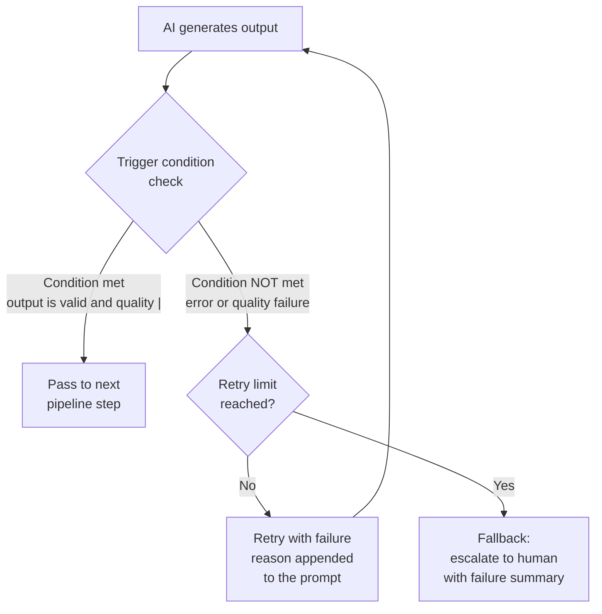

# Self-Critique and Retry Patterns

---

## Learning Objectives

By the end of this topic, you should be able to:

- Recall how self-critique works and connect it to automated retry systems
- Explain what a retry pattern is and why it is necessary in production AI pipelines
- Design a retry loop with a clear trigger condition, maximum retry limit, and fallback
- Differentiate between a quality-triggered retry and an error-triggered retry
- Identify when a retry loop should stop and hand off to a human

---

## Overview

In the previous topic you built a four-step job application screening pipeline — extract, score, draft, flag. Each step was a focused prompt passing clean structured output to the next. The pipeline worked well in ideal conditions.

But production systems do not run in ideal conditions. The model will occasionally output malformed JSON. A score breakdown will not add up correctly. An email draft will be generic when it should be personalised. When these failures happen at step 3 of a 400-application run, you cannot stop everything and fix it manually.

This topic gives you two tools for handling failures automatically. The first — **self-critique** — you already know. The model challenges its own output, identifies what is wrong, and revises. The second — **retry patterns** — is the engineering layer that makes self-critique work at scale: when a problem is identified, the system automatically tries again with the failure reason as a correction instruction, stops after a defined number of attempts, and escalates to a human if the problem persists.

Together, they turn a fragile pipeline that breaks on the first imperfect output into a resilient system that handles failures gracefully — and only surfaces genuinely difficult cases to a human reviewer.

---

## Where Self-Critique Fits In

In the previous module you learned that self-critique asks the AI to challenge its own answer — looking for false assumptions, missing conditions, and overconfident claims before finalising a response.

Applied to the job screening pipeline, self-critique would look like this:

- After **Step 1 extraction**, the model checks: "Did I extract all required fields? Are the data types correct — is years_of_experience a number or did I write it as text? Does anything I extracted contradict what the application actually says?"
- After **Step 2 scoring**, the model checks: "Did I apply every rubric condition correctly? Does my score breakdown actually add up to my total? Does my shortlist recommendation match the score I calculated?"
- After **Step 3 email drafting**, the model checks: "Does this email reference two specific skills from the candidate's profile? Is the tone appropriate? Have I made any promises — like a specific interview date — that the system cannot confirm?"

In a single-session interaction, a human reads the self-critique output and decides what to do next. But in a production pipeline handling 400 applications, that human decision step is not feasible at every stage. The system needs to handle it automatically.

This is where **retry patterns** come in. Self-critique tells the model what is wrong. The retry pattern tells the system what to do about it — automatically, at scale.

---

## What Is a Retry Pattern?

A **retry pattern** is an automated loop in which an AI call is made, its output is evaluated against a quality or correctness condition, and if the condition is not met, the call is made again — either with the same inputs or with modified instructions — until the condition is met or a maximum number of attempts is reached.

**Think of it like a quality control inspector at the end of a production line.** Every item coming off the line passes in front of the inspector. If it meets the quality standard, it moves to dispatch. If it does not, it goes back to the relevant station for rework. But the inspector does not keep sending a faulty item back forever — after a defined number of rework attempts, the item is pulled from the line entirely and flagged for a senior engineer to assess.

Retry patterns work exactly the same way:
- The AI produces an output
- An evaluator checks the output against a condition
- Pass → move to the next step
- Fail → retry, with the failure reason included so the model can correct it
- Too many failures → stop retrying and escalate to a human

---

## The Job Screening Pipeline — Where Retries Are Needed

Returning to the job application screening pipeline from the previous topic, three specific points in the chain are vulnerable to output failures:

**Step 1 — Extraction:** the model might output malformed JSON — a missing field, an incorrect data type, or a field that contradicts the application text.

**Step 2 — Scoring:** the model might produce a score that does not add up correctly — the breakdown totals do not match the total_score field — or the shortlist_recommendation does not match the score range.

**Step 3 — Email drafting:** the model might draft an email that does not reference the candidate's actual skills (as required by the system prompt), or that promises an interview date the system cannot honour.

Without retry patterns, any one of these failures breaks the pipeline and requires manual intervention. With retry patterns, the system catches and corrects them automatically.

---

## Two Types of Retry

### Type 1 — Error-Triggered Retry

An **error-triggered retry** fires when the output is technically invalid — the format is broken, required fields are missing, or the response cannot be parsed at all.

**For the screening pipeline — Step 1 extraction retry:**

```
Attempt 1:
Prompt: Extract candidate information as JSON.
Output: { "candidate_name": "Marcus Webb", "years_of_experience": "four" }

Evaluator check: Is years_of_experience an integer? NO — it is a string.
Error detected: wrong data type.

Retry trigger: re-send the prompt with the error appended.
```

**The retry prompt:**
```
Your previous extraction contained an error:
- years_of_experience must be an integer (a number), not a string. 
  You returned "four" — return 4.

Please re-extract the candidate information, correcting this error.

[SAME APPLICATION TEXT]
```

**Attempt 2 output:**
```json
{
  "candidate_name": "Marcus Webb",
  "years_of_experience": 4,
  ...
}
```

The error is corrected. The pipeline continues.

**Key design principle for error-triggered retries:** always tell the model exactly what was wrong and why. "Your output was invalid — try again" is less effective than "years_of_experience must be an integer — you returned a string."

---

### Type 2 — Quality-Triggered Retry

A **quality-triggered retry** fires when the output is technically valid — the format is correct — but the content does not meet a defined quality standard. This is where self-critique integrates directly into the retry pattern.

**For the screening pipeline — Step 3 email drafting retry:**

```
Attempt 1:
Email draft: "Dear Marcus, thank you for your application. We would 
like to invite you for an interview. Please book a slot using the 
link below."

Evaluator check — does the email reference two of the candidate's 
actual skills from their profile? NO — it is generic, no skills mentioned.

Quality condition not met.
```

**The retry prompt (self-critique + correction):**
```
Your previous email draft did not meet the required quality standard:
- The email must reference two of the candidate's actual skills from 
  their profile. Your draft was generic and mentioned no skills.

Candidate skills from profile: Python, data pipelines, SQL, AWS.

Please redraft the email, referencing at least two of these specific 
skills in a natural, personalised way.
```

**Attempt 2 output:**
```
Dear Marcus,

Thank you for applying for the Senior Data Engineer role. We were 
particularly impressed by your Python experience and your work 
building data pipelines — both are central to what our team does 
every day.

We would love to invite you for an interview...
```

Quality condition met. The pipeline continues.

**Key design principle for quality-triggered retries:** the quality condition must be specific and checkable — not "make it better" but "the email must reference two named skills from the candidate's profile." Vague conditions produce vague retries.

---

## Designing a Retry Loop — The Three Components

Every retry loop needs three things designed before it is built:

### Component 1 — The Trigger Condition

What exactly causes a retry? This must be unambiguous — the system needs to evaluate it programmatically, not by human judgment.

**Good trigger conditions for the screening pipeline:**
- `years_of_experience` is not an integer → error-triggered retry
- `total_score` does not equal the sum of `score_breakdown` values → error-triggered retry
- Email does not contain any of the candidate's listed skills → quality-triggered retry
- `shortlist_recommendation` is "yes" but `total_score` is below 40 → quality-triggered retry (internal contradiction)

**Weak trigger conditions:**
- "The response does not seem right" — too subjective, cannot be automated
- "The email is not good enough" — cannot be evaluated programmatically

### Component 2 — The Maximum Retry Limit

How many times will the system retry before giving up? This must be set explicitly — without a limit, a failing step will loop forever, consuming tokens, time, and money.

**For the screening pipeline:**

| Step | Max retries | Reasoning |
|---|---|---|
| Step 1 — Extraction | 3 | JSON format errors usually resolve in 1-2 retries. After 3, the application text itself may be unparseable. |
| Step 2 — Scoring | 2 | Arithmetic errors rarely persist beyond 1 retry. After 2, likely a prompt design issue. |
| Step 3 — Email draft | 2 | Personalisation failures usually resolve in 1 retry. After 2, escalate to human. |

**General rule:** set the retry limit low — usually 2 or 3. If a step consistently fails beyond 2 retries, the problem is almost certainly in the prompt design, the input data, or the model's capability for that task — not something more retries will fix.

### Component 3 — The Fallback

What happens when the maximum retry limit is reached and the condition is still not met? This must be designed explicitly — never leave it undefined.

**Three common fallbacks:**

**Fallback 1 — Escalate to human review:**
The item is flagged and added to a human review queue with the failure reason attached. The pipeline moves on to the next application.

```json
{
  "candidate_name": "Marcus Webb",
  "pipeline_status": "failed",
  "failed_step": "email_draft",
  "attempts_made": 2,
  "failure_reason": "Email did not reference candidate skills after 2 attempts",
  "action_required": "human_draft_required"
}
```

**Fallback 2 — Use a safe default:**
For non-critical steps, use a pre-written template instead of the AI draft. Less personalised — but reliable and never wrong.

**Fallback 3 — Skip and flag:**
Skip the failing step entirely and flag the application for complete manual processing.

**For the screening pipeline:** Fallback 1 — escalate to human — is the right choice. Sending a wrong email to a candidate is worse than having a human spend 2 minutes drafting it manually.

---

## The Complete Retry Loop — Visualised



Every retry includes the failure reason in the new prompt — not just "try again" but "this specific thing was wrong — correct it." This is the self-critique integrated into the retry loop: the evaluator's feedback becomes the model's correction instruction.

---

## Self-Critique Inside a Retry Loop

The most powerful version of a retry pattern combines automated evaluation with self-critique in a single loop:

**Step 1 — AI generates output**

**Step 2 — Automated evaluator checks objective conditions** (format, field types, internal consistency)

**Step 3 — If objective conditions pass, AI self-critiques** against quality criteria ("does this email reference specific skills?" "does this response address all the customer's conditions?")

**Step 4 — If self-critique identifies a problem, retry with the critique as the correction instruction**

**Step 5 — If retry limit reached, escalate**

This two-layer approach catches different types of problems:
- The automated evaluator catches structural and logical errors reliably
- Self-critique catches quality and completeness issues that require judgment

Neither layer catches everything — which is why the human fallback at the end of the loop is not optional.

---

## What Retries Fix — and What They Do Not

| | Retries reliably fix | Retries do not fix |
|---|---|---|
| **Format errors** | Wrong data type, missing JSON field, malformed structure | |
| **Internal inconsistency** | Score breakdown does not match total, recommendation contradicts score | |
| **Quality gaps** | Missing personalisation, incomplete conditions addressed | |
| **Knowledge gaps** | | Model does not know the correct policy — retrying with the same knowledge produces the same wrong answer |
| **Prompt design failures** | | If the prompt is fundamentally ambiguous, retrying will keep producing ambiguous outputs |
| **Novel edge cases** | | The model may consistently fail on an unusual input type — retrying will not resolve a capability limitation |

**The key insight:** retries fix output quality issues — things the model could have done correctly but did not on the first attempt. They do not fix knowledge gaps or prompt design failures. If a step consistently fails beyond 2 retries, investigate the prompt and the inputs — not the retry count.

---

## Best Practices

- Always define all three retry loop components before building: trigger condition, maximum retry limit, fallback
- Make trigger conditions specific and programmatically checkable — not judgments that require human interpretation
- Always include the failure reason in the retry prompt — "try again" is significantly less effective than "this specific condition was not met — correct it"
- Set retry limits low (2-3). Persistent failures beyond 3 attempts almost always indicate a prompt or input problem
- Design the fallback explicitly — never leave it undefined. Undefined fallbacks produce silent failures or infinite loops
- Test your retry logic by deliberately introducing the errors it is designed to catch — confirm it triggers correctly and recovers

## Common Beginner Mistakes

- **No retry limit** — a loop with no maximum will run indefinitely on a consistently failing step, consuming tokens and budget
- **Vague retry prompts** — "your output was wrong, try again" gives the model no information about what to correct. Always specify the exact failure
- **Retrying to fix knowledge gaps** — if the model hallucinates a policy detail, retrying will produce the same hallucination. The fix is grounding, not retrying
- **No fallback defined** — when the retry limit is reached, the system needs a clear next action. "Escalate to human" must be designed in, not assumed

---

## Key Takeaways

- **Self-critique** identifies what is wrong with an output. **Retry patterns** are the engineering logic that automatically acts on that identification
- A retry loop has three required components: a trigger condition, a maximum retry limit, and a fallback
- **Error-triggered retries** fire when the output format is invalid — missing fields, wrong data types, broken structure
- **Quality-triggered retries** fire when the output is structurally valid but does not meet a defined content standard — missing personalisation, unanswered conditions, internal contradictions
- Always include the failure reason in the retry prompt — the correction is most effective when the model knows exactly what was wrong
- Set retry limits low — usually 2 or 3. Persistent failures beyond that indicate a prompt or input problem, not a retry count problem
- Retries fix output quality issues. They do not fix knowledge gaps, prompt design failures, or capability limitations

> **Interview tip:** If asked "how do you handle failures in a production AI pipeline?" — describe the retry pattern with all three components: a specific trigger condition, a low retry limit, and an explicit fallback to human review. Then distinguish between error-triggered retries (format failures) and quality-triggered retries (content failures), and explain that persistent failures beyond the retry limit indicate a prompt design problem, not a retry count problem. This shows genuine production engineering thinking.

---

## Reference Links

- 📎 [Anthropic — Error Handling and Retries](https://docs.anthropic.com/en/api/errors) — official documentation on handling API errors and implementing retry logic with Claude
- 📎 [LangChain — Retry and Fallback Patterns](https://python.langchain.com/docs/guides/fallbacks) — practical implementation of retry and fallback patterns in AI pipelines
- 📎 [Microsoft Azure — Retry Pattern (Cloud Design Patterns)](https://learn.microsoft.com/en-us/azure/architecture/patterns/retry) — foundational engineering reference for retry pattern design across software systems
