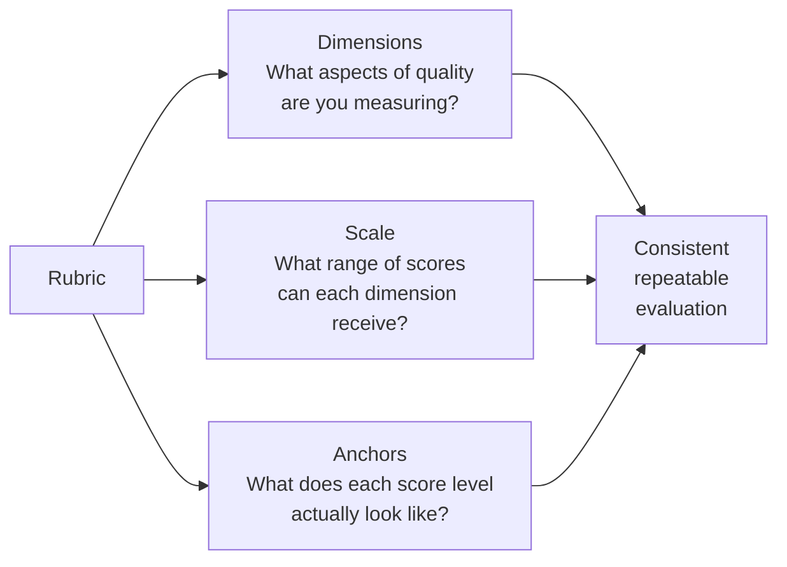

# Rubric Design — Dimensions, Scales, and Anchors

---

## Learning Objectives

By the end of this topic, you should be able to:

- Explain what a rubric is and why evaluation without one produces inconsistent results
- Break a quality judgment into measurable dimensions
- Design a rating scale that is appropriate for a given evaluation task
- Write anchor descriptions that make each scale point unambiguous
- Identify common rubric design mistakes and explain how they cause unreliable evaluation

---

## Overview

You now have a golden dataset of 25 product descriptions — each paired with a verified correct reference. The next question is: how do you score the AI's output against that reference?

You could ask a reviewer to read each description and give it a score out of 5. But here is the problem — if you ask two different people to score the same description, they will almost certainly give different scores. One person thinks a 3 means "good enough." Another thinks a 3 means "average." Neither is wrong — they just have different internal definitions of what each number means.

Now multiply that across 25 descriptions and two reviewers. You end up with two sets of scores that do not agree — and no way to know whose judgment is more reliable.

A **rubric** solves this problem. It is a written scoring guide that defines exactly what quality means for this specific task — broken into specific dimensions, with a clear scale, and anchor descriptions that tell every reviewer exactly what a 1 looks like, what a 2 looks like, what a 3 looks like. Everyone uses the same guide. The scores become consistent and comparable.

Without a rubric, your evaluation depends on who does the reviewing. With a rubric, it depends on the evidence.

---

## What Is a Rubric? — The Three Parts

A rubric has three parts that work together. Think of it like a scorecard a judge uses at a competition — not just one overall impression, but specific categories, a defined scoring range, and a description of what earns each score.

**Part 1 — Dimensions:** the specific aspects of quality you are measuring. A product description is not just "good" or "bad" overall — it can be accurate but boring, or persuasive but factually wrong. Splitting quality into dimensions means you can see exactly where the AI is doing well and where it is failing.

**Part 2 — Scale:** the range of scores each dimension can receive. Is it 1-3? 1-4? 1-5? The choice affects how easy it is to score and how much agreement you get between reviewers.

**Part 3 — Anchors:** written descriptions of what each score level actually looks like. This is the most important part. Without anchors, two reviewers will still disagree — because "3 out of 4" means something different to each of them.



---

## Part 1 — Dimensions

### What Is a Dimension?

A dimension is one specific aspect of quality that you measure separately from all the others.

**Think of it like a school report card.** A teacher does not give a student one overall score for "how good they are at school." They give separate scores for Maths, English, Science, and PE — because a student can be excellent at Maths and struggle with English. One overall score would hide that distinction.

Dimensions do the same thing for AI output evaluation. They prevent one strong area from hiding a weak one.

### Finding the Right Dimensions — Start with Failure Modes

The easiest way to identify dimensions is to ask: **what are the specific ways this AI output can go wrong?**

For the product description tool:
- It can get the specifications wrong — wrong Bluetooth version, wrong battery life
- It can use the wrong tone — too casual for a premium brand, too formal for a youth product
- It can fail to give the customer a reason to buy — listing features without explaining why they matter
- It can sound identical to every other product — no reason to choose this one over a competitor

Each failure mode becomes a dimension:

| Failure mode | Dimension name | What it measures |
|---|---|---|
| Wrong specifications | **Factual accuracy** | Are all specifications and claims correct and verifiable? |
| Wrong tone | **Brand tone** | Does the language match the brand's positioning and target audience? |
| No reason to buy | **Persuasiveness** | Does the description give the customer a clear benefit? |
| Sounds generic | **Differentiation** | Does it distinguish this product from similar ones? |

### Rules for Good Dimensions

**Rule 1 — Each dimension must measure something different**

If two dimensions almost always get the same score — a description that scores high on one always scores high on the other — they are measuring the same thing. Merge them.

*Example of overlap:* "Clarity" and "Readability" both measure how easy the text is to understand. One of them should be removed.

*Example of genuine separation:* "Factual accuracy" and "Persuasiveness" can move independently. A description can be 100% accurate but completely boring. Or it can be very persuasive but contain a wrong specification. These are different problems — they should be separate dimensions.

**Rule 2 — Each dimension must be something you can observe directly**

You should be able to point to something specific in the output and say "this is why I scored it this way."

*Not observable:* "Does this feel premium?" — this is a feeling, not an observation.

*Observable:* "Does the vocabulary match the premium tier word list?" — you can check this against a written reference.

**Rule 3 — Keep it to four dimensions or fewer**

More than four dimensions makes the rubric slow and hard to apply consistently. A reviewer scoring six or seven dimensions per output will start rushing — and rushing reduces consistency.

**Rule 4 — Name each dimension precisely**

The name itself should tell the reviewer what to look for.

*Too vague:* "Quality" — quality of what?

*Precise:* "Factual accuracy" — the reviewer immediately knows to check whether the specifications are correct.

---

## Part 2 — Choosing the Scale

### What Is a Scale?

The scale is the range of scores a reviewer can give for each dimension. The three most common options are 1-3, 1-4, and 1-5.

**Think of it like a grading system.** Some schools use A/B/C/D/F. Some use 1-10. Some use Pass/Fail. Each system makes different trade-offs between simplicity and nuance.

**1-3 scale:** fast and simple. Good for high-volume evaluation where speed matters. The trade-off is less nuance — there is only one "middle" option.

```
1 = Does not meet standard
2 = Meets standard with some issues
3 = Meets standard fully
```

**1-4 scale:** no neutral middle. A reviewer must decide whether the output is above or below acceptable — they cannot sit on the fence. This reduces the tendency to give everything a "3 out of 5" regardless of quality.

```
1 = Clearly below standard
2 = Below standard but has some acceptable elements
3 = Above standard with minor issues
4 = Fully meets or exceeds standard
```

**1-5 scale:** the most granular. Allows more nuance between levels — but also produces more disagreement between reviewers, because the difference between a 3 and a 4 becomes harder to define precisely.

**For the product description tool — use a 1-4 scale.** It forces the reviewer to make a clear decision, reduces fence-sitting, and is granular enough to distinguish between "needs improvement" and "ready to publish."

### One Scale for All Dimensions

Use the same scale for every dimension in the rubric. If some dimensions use 1-3 and others use 1-5, the scores cannot be meaningfully compared or combined.

---

## Part 3 — Writing Anchor Descriptions

### What Is an Anchor?

An anchor is a written description of what a specific score level looks like for a specific dimension. It is the most important part of the rubric — and the most commonly skipped.

**Think of it like a driving test marking sheet.** The examiner does not decide whether a manoeuvre was "good" or "bad" based on their own judgment. They have a written guide that says exactly what constitutes a pass and what constitutes a fail for each manoeuvre — parallel parking, emergency stop, lane changing. The guide ensures every examiner marks the same behaviour the same way.

Anchors do the same thing for AI evaluation. They ensure every reviewer scores the same output the same way.

### Poor Anchors vs Strong Anchors

**Poor anchors — too vague:**

| Score | Anchor for Factual Accuracy |
|---|---|
| 4 | Excellent — all facts are correct |
| 3 | Good — mostly correct with minor issues |
| 2 | Average — some errors present |
| 1 | Poor — many errors |

These look like anchors but they are not. "Excellent" and "good" are judgments, not descriptions. A reviewer reading these has no more information than before. Two reviewers will still disagree on what "minor issues" means.

**Strong anchors — specific and observable:**

The key rule: **an anchor must describe what the output contains, not how good it feels.**

---

### Full Anchor Set for the Product Description Tool

**Dimension 1 — Factual Accuracy**

*What it measures:* are the specifications and claims in the description correct and verifiable against the product specification sheet?

| Score | What this score looks like |
|---|---|
| **4** | Every specification matches the product sheet exactly. No claim is made that cannot be confirmed. Battery life, connectivity standard, processor model, storage — all correct. Example: a speaker listed as Bluetooth 5.2 is described as Bluetooth 5.2, not 5.0 or "latest Bluetooth." |
| **3** | All critical specifications are correct. One minor detail is slightly imprecise — for example, battery life is described as "up to 24 hours" when the spec sheet says "up to 25 hours" — but not misleadingly wrong. |
| **2** | One critical specification is wrong or misleading. Example: a laptop with integrated graphics is described as having "dedicated graphics." A customer buying based on this would be misled. |
| **1** | Two or more critical specifications are wrong, or a single claim is so misleading that a customer would likely buy a product that does not meet their needs. |

---

**Dimension 2 — Brand Tone**

*What it measures:* does the language, vocabulary, and sentence structure match the company's brand positioning for this product tier?

| Score | What this score looks like |
|---|---|
| **4** | Language consistently matches the brand tier. A premium product uses measured, confident vocabulary. A youth-oriented budget product uses energetic, accessible language. A reviewer familiar with the brand would not flag any phrase as off-brand. Example: "Precision-engineered for the discerning listener" for a premium headphone. |
| **3** | Tone is mostly correct. One or two phrases feel slightly off — a premium description that uses one casual phrase, or a budget description with one overly formal sentence — but the overall impression is right. |
| **2** | Tone is noticeably inconsistent. A premium product sounds generic and mass-market. A budget product is described with luxury language that does not match its price point. A brand manager reviewing this would flag it for revision. |
| **1** | Tone is completely wrong throughout. The description reads as if it belongs to a different brand or a different product tier entirely. |

---

**Dimension 3 — Persuasiveness**

*What it measures:* does the description give a customer a clear, specific reason to choose this product — not just a list of features?

| Score | What this score looks like |
|---|---|
| **4** | At least two specific benefits are stated clearly. The value proposition is in the first two sentences. A customer finishes reading and knows exactly what problem this product solves for them. Example: "Whether you're on a 10-hour flight or a 45-minute commute, the 30-hour battery and class-leading noise cancellation mean you arrive refreshed." |
| **3** | At least one clear benefit is stated. The value proposition is present but a customer needs to read the full description to find it — it is not immediately obvious. |
| **2** | The description lists features but does not translate them into benefits. Example: "This laptop has 16GB RAM, a 512GB SSD, and a 13-inch display." The customer knows what it has — they do not know why they should want it. |
| **1** | No benefit is stated. The description is a list of specifications with no explanation of why they matter to the customer. |

---

**Dimension 4 — Differentiation**

*What it measures:* does the description make clear why this product is worth choosing over similar alternatives?

| Score | What this score looks like |
|---|---|
| **4** | At least one feature or benefit is highlighted that specifically sets this product apart from similar ones in the category. A customer comparing two options would find this description more useful than a generic one. Example: "Unlike most wireless earbuds in this price range, the X3 Pro includes a dedicated ambient mode that lets you hear your environment without removing them." |
| **3** | Some differentiation is present but it is implied rather than stated directly. The description hints at what makes the product different without saying it explicitly. |
| **2** | The description could apply equally to two or three competing products. Nothing in it helps a customer choose between this product and a similar alternative. |
| **1** | Swapping the product name with a competitor's would produce a coherent description for that competitor. The description is entirely category-generic. |

---

## Step 4 — Setting the Pass/Fail Threshold

Once the rubric is built, you need a threshold — the minimum score a description must achieve to pass evaluation.

**Option 1 — Per-dimension minimum (recommended):**
Set a minimum score for each dimension separately. An output passes only if it meets the minimum on every dimension.

```
Factual accuracy:  minimum 3 out of 4  ← critical, no averaging allowed
Brand tone:        minimum 3 out of 4
Persuasiveness:    minimum 2 out of 4
Differentiation:   minimum 2 out of 4
```

**Why this matters:** a description that scores 4/4/4/1 has an average of 3.25 — which sounds like a pass. But a score of 1 on differentiation means the description is indistinguishable from a competitor's. That is a real failure, not an acceptable trade-off. Per-dimension minimums prevent a strong score in one area from hiding a serious weakness in another.

**Option 2 — Total score threshold:**
Add all dimension scores and set a minimum total. Simpler to calculate, but allows critical failures to be masked by high scores elsewhere. Not recommended for the product description tool.

---

## Complete Rubric — Product Description Tool

| Dimension | Scale | Minimum to pass | What it measures |
|---|---|---|---|
| Factual accuracy | 1–4 | 3 | All specifications correct and verifiable |
| Brand tone | 1–4 | 3 | Language matches brand tier guidelines |
| Persuasiveness | 1–4 | 2 | Clear customer benefit stated |
| Differentiation | 1–4 | 2 | Product distinguished from competitors |

A description passes if it scores at least 3 on factual accuracy, at least 3 on brand tone, at least 2 on persuasiveness, and at least 2 on differentiation. If any dimension is below its minimum — the description fails, regardless of how well it scores on the others.

---

## Best Practices

- Write the rubric before running any evaluations — never design it after seeing the outputs
- Test the rubric on five items with two reviewers before finalising it — if they consistently disagree on a dimension, the anchors need to be more specific
- Keep anchors to two or three sentences — longer anchors slow the review process and reviewers stop reading them carefully
- Review the rubric whenever the brand guidelines or product catalogue changes significantly

## Common Beginner Mistakes

- **Anchors that use the word being defined** — "a 4 is an excellent description" defines excellent with excellent. The anchor must describe what the output contains
- **Dimensions that overlap** — "clarity" and "readability" measure the same thing. Merge overlapping dimensions
- **Too many dimensions** — five or more slows evaluation and reduces consistency. Look for overlaps to merge
- **Using an average score as the threshold** — a critical dimension failure can be masked by high scores elsewhere. Use per-dimension minimums for dimensions that matter most

---

## Key Takeaways

- A rubric has three parts: **dimensions** (what to measure), a **scale** (range of scores), and **anchors** (what each score level looks like in practice)
- Identify dimensions by asking: what are the specific ways this output can go wrong? Each failure mode becomes a dimension
- Dimensions must be independent, observable, precisely named, and four or fewer
- The **1-4 scale** prevents fence-sitting — reviewers must decide whether the output is above or below acceptable
- **Anchors** are the most important part — they describe what the output contains, not how good it feels
- Set **per-dimension minimums** rather than an average threshold — a critical failure must not be hidden by high scores elsewhere
- Write the rubric before seeing any AI outputs

> **Interview tip:** If asked "how would you evaluate the quality of AI-generated text?" — describe the rubric approach. Name two or three dimensions for the task, explain why you chose a 1-4 scale over 1-5, and describe what makes a strong anchor. Most candidates say "I would check if it sounds right." Describing dimensions, a scale, and observable anchors shows you can turn subjective quality into measurable, repeatable evidence.

---

## Reference Links

- 📎 [Anthropic — Model Evaluation and Rubric Design](https://docs.anthropic.com/en/docs/build-with-claude/evaluate-outputs) — official guidance on designing evaluation criteria for AI outputs
- 📎 [Google — Human Evaluation of Generative AI](https://ai.google/responsibility/responsible-ai-practices/) — practical guidance on rubric-based human evaluation at scale
- 📎 [NIST AI Risk Management Framework — Measure Function](https://www.nist.gov/itl/ai-risk-management-framework) — official framework for structured AI quality measurement
