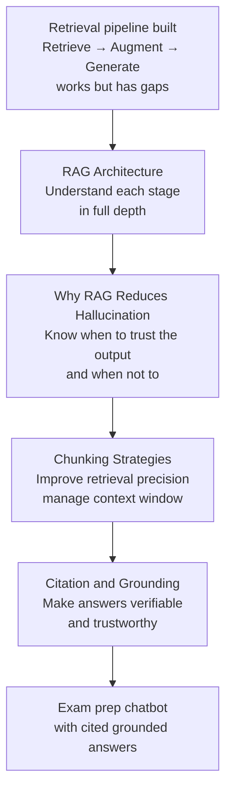

# RAG Fundamentals

## How We Got Here

The previous module built the technical foundation for an AI-powered exam prep chatbot:

- A REST call that sends a student's question to the Anthropic API and gets a generated answer
- A retry wrapper that keeps the chatbot running when rate limits are hit
- An embedding model that converts text into vectors capturing meaning
- A ChromaDB index that stores lecture notes and retrieves the most relevant ones for any question

Put together, the pipeline works like this: a student asks a question, ChromaDB retrieves the three most relevant lecture notes, those notes are passed to the Anthropic API as context, and Claude generates an answer.

That is already useful. But there are three problems it does not solve:

**Problem 1 — The answer can still be wrong.**
Even with relevant notes in the context, an LLM can generate statements that go beyond what the notes say — adding details from its general training that may not match the course. This is called **hallucination**. A student acting on a hallucinated answer could revise the wrong thing before an exam.

**Problem 2 — The student cannot verify the answer.**
The chatbot says "gradient descent adjusts parameters by computing the gradient of the loss function." Is that from the lecture notes, or did the model add it? The student has no way to check. A trustworthy answer should tell the student exactly which note it came from.

**Problem 3 — The retrieved chunks may not be the right size.**
In the previous module, each document was stored as one piece — a whole lecture note as one vector. A long lecture note on backpropagation might contain sections on the chain rule, gradient flow, and vanishing gradients. If a student asks only about vanishing gradients, the whole note is retrieved — and most of it is not relevant. The context is diluted.

This module addresses all three. It covers the RAG architecture in full, explains why RAG reduces hallucination (and where it still fails), teaches chunking strategies that make retrieval more precise, and shows how to ground and cite answers so students can trust what the chatbot tells them.

---

## What RAG Is — The Full Picture

You saw RAG introduced briefly in the previous module. Here is the complete picture.

**RAG stands for Retrieval-Augmented Generation.** It is a pattern for building AI systems that answer questions using a specific knowledge base — rather than relying only on what the LLM learned during training.

Think of it like a closed-book exam versus an open-book exam.

In a **closed-book exam**, the student answers entirely from memory. They might misremember a formula, confuse two concepts, or confidently write something incorrect because they are not allowed to check. This is how a plain LLM works — it answers from training data, which can be wrong, outdated, or unrelated to your specific course.

In an **open-book exam**, the student has the textbook. Before answering, they find the relevant page, read it, and base their answer on what is written there. If they quote the textbook, the examiner can verify it. This is how RAG works — before generating an answer, the system finds the relevant documents and grounds the answer in them.

RAG has three stages:

**Retrieve** — find the documents most relevant to the question. This is what ChromaDB does — comparing the question's vector against all stored document vectors and returning the closest matches.

**Augment** — add the retrieved documents to the prompt as context. The LLM does not just see the question — it sees the question plus the relevant lecture notes.

**Generate** — the LLM writes the answer using the retrieved context. Because the answer is based on specific documents, it is more accurate and can be traced back to its source.

```text
Student question
        ↓
RETRIEVE
ChromaDB finds the 3 most relevant
lecture note chunks for this question
        ↓
AUGMENT
Retrieved chunks added to the prompt:
"Answer using these notes: [ln_001] [ln_002] [ln_003]
Question: What is gradient descent?"
        ↓
GENERATE
Anthropic API generates an answer
grounded in the retrieved notes
        ↓
Student gets a cited, verifiable answer:
"According to your lecture notes on gradient descent (ln_001),
gradient descent minimises the loss function by..."
```

---

## The Four Topics — What Each One Covers

**RAG Architecture — Retrieve, Augment, Generate**
The three stages in full detail. What happens at each step, what can go wrong at each step, and how the exam prep chatbot implements each one. This file establishes the mental model that the rest of the module builds on.

**Why RAG Reduces Hallucination — and Where It Does Not**
Hallucination is one of the most discussed problems in AI. RAG reduces it — but not completely. This file explains what hallucination is, why RAG helps, and the specific situations where a RAG system can still produce wrong answers. Every developer building with LLMs needs to understand this.

**Chunking Strategies — Recall vs Precision**
A long document stored as one vector is a blunt instrument. Chunking breaks documents into smaller pieces so retrieval is more precise. This file covers fixed-size chunking, overlap, semantic chunking, and the trade-off between recall (finding everything relevant) and precision (finding only what is relevant). Context window management is also covered here — because retrieved chunks must fit within the LLM's token limit.

**Citation and Grounding**
A RAG answer is only trustworthy if the student can verify it. This file covers how to include source citations in generated answers, what grounding means, and how to check that an answer actually traces back to the retrieved documents.

---

## The Exam Prep Chatbot — Extended

The same exam prep chatbot built in the APIs and Embeddings module is extended throughout this module. By the end, it will:

- Chunk lecture notes into smaller, more precise pieces before embedding
- Retrieve the most relevant chunks — not whole documents
- Generate an answer that cites the specific chunk it drew from
- Include a verification step that checks whether the answer is grounded in the retrieved content

**What an answer looks like after this module:**

```text
Student: "What is the role of the learning rate in gradient descent?"

Chatbot: "The learning rate controls the size of each parameter update
step during gradient descent. A learning rate that is too high causes
the algorithm to overshoot the minimum — the loss bounces around
instead of converging. A learning rate that is too low causes very
slow convergence, making training unnecessarily long.

Source: Lecture note ln_001 — Gradient Descent and Loss Minimisation"
```

The student now knows exactly where the answer came from and can verify it against their own notes.

---

## How the Four Files Connect



Each file builds on the previous one. The architecture file gives the mental model. The hallucination file shows what can go wrong. The chunking file improves retrieval quality. The citation file makes the output trustworthy.

---

## Reference Links

- 📎 [Anthropic — Retrieval-Augmented Generation Guide](https://docs.anthropic.com/en/docs/build-with-claude/retrieval-augmented-generation)
- 📎 [LangChain — RAG Conceptual Guide](https://python.langchain.com/docs/concepts/rag/)
- 📎 [Real Python — Building a RAG Application](https://realpython.com/chromadb-vector-database/)
- 📎 [Pinecone — What is RAG?](https://www.pinecone.io/learn/retrieval-augmented-generation/)
