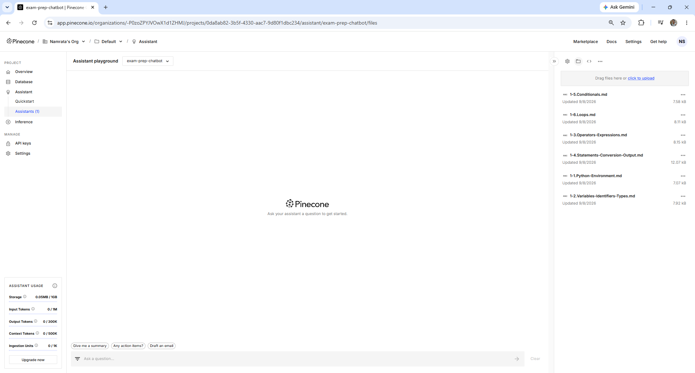
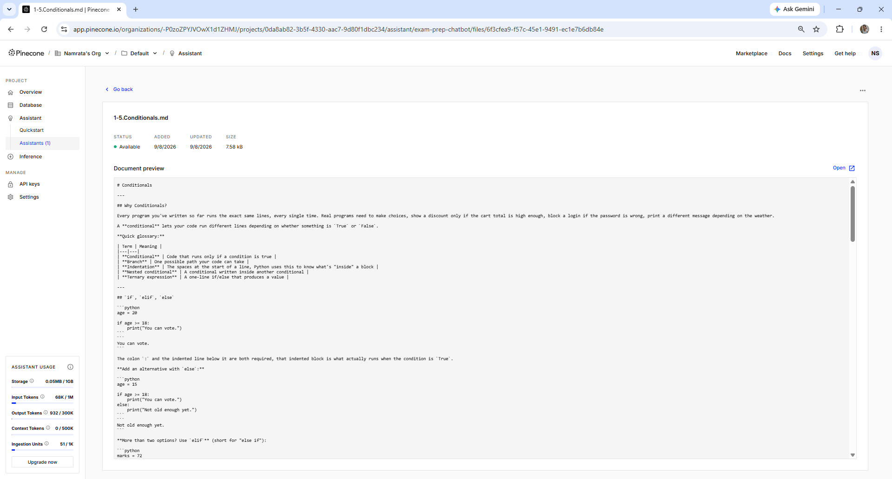

# Chunking Strategies — Recall and Precision

---

## Learning Objectives

By the end of this topic, you should be able to:

- Explain what chunking is and why it improves retrieval quality over whole-document storage
- Describe the three chunking strategies and explain when to use each one
- Explain the recall vs precision trade-off and choose an appropriate chunk size for a given task
- Apply overlap to prevent context loss at chunk boundaries
- Evaluate which chunking strategy is appropriate for the exam prep chatbot's lecture notes

---

## Overview

The RAG Architecture topic built the Retrieve → Augment → Generate pipeline in Pinecone Assistant. The Why RAG Reduces Hallucination topic explained that even with retrieved notes, the model can still produce wrong answers — especially when the retrieved context is too broad and the model fills gaps between unrelated sections.

Both problems trace back to one root cause: **how documents are stored before retrieval begins.**

The retrieval stage returns the most similar documents to a student's question. But similarity depends entirely on what is stored. When an entire lecture note is stored as one embedding vector, the vector represents the average meaning of the whole document — not any specific concept within it.

A lecture note on backpropagation might cover the chain rule, gradient flow, vanishing gradients, and weight initialisation — all in one document. When a student asks specifically about vanishing gradients, the whole note is retrieved. The retrieval was technically correct — the note does contain content about vanishing gradients — but most of the retrieved text is noise. The answer gets diluted by irrelevant content, and the model may hallucinate by filling gaps between the relevant and irrelevant sections.

**Chunking** is the practice of splitting documents into smaller, focused pieces before embedding them. Each chunk covers one idea. Retrieval then returns the specific chunk that matches the question — not the whole document.

This sounds simple, but chunking has a fundamental trade-off. Chunks that are too small are precise but lose context. Chunks that are too large contain too much noise. Getting the right size — and handling boundaries correctly — is what this topic covers.

**Quick glossary:**

| Term | Meaning |
|---|---|
| **Chunk** | A piece of a document — smaller than the whole, larger than a sentence |
| **Chunk size** | How many characters or tokens each chunk contains |
| **Overlap** | Characters shared between adjacent chunks to prevent losing context at boundaries |
| **Recall** | Finding all relevant chunks — not missing anything important |
| **Precision** | Finding only relevant chunks — not returning noise |
| **Stride** | How far to advance before starting the next chunk (chunk size minus overlap) |

---

## Why Whole Documents Fail at Retrieval

Before showing how to chunk, it is worth being precise about why whole-document storage causes problems.

When a document is embedded as one vector, that vector is an average of all the meanings in the document. The more topics the document covers, the less precisely it represents any single one of them.

```text
Lecture note on backpropagation — whole document embedding:

Topics covered: chain rule, gradient flow, vanishing gradients,
weight initialisation, batch normalisation

Embedding vector: represents the average of all five topics

Student asks: "Why do gradients vanish in deep networks?"

Retrieved: the whole backpropagation note
Relevant content: 20% (just the vanishing gradients section)
Noise: 80% (everything else in the note)
```

The model receives a prompt where 80% of the context is irrelevant. It must identify the useful 20% and answer from it. This increases the chance of hallucination — the model may blend content from different sections of the note in ways that produce incorrect statements.

With chunking:

```text
Chunk 1 — chain rule and gradient computation (embedding 1)
Chunk 2 — gradient flow through layers (embedding 2)
Chunk 3 — vanishing gradients in deep networks (embedding 3)
Chunk 4 — weight initialisation strategies (embedding 4)

Student asks: "Why do gradients vanish in deep networks?"

Retrieved: Chunk 3
Relevant content: ~90%
Noise: ~10%
```

The model receives a focused context. The answer is more precise and less likely to drift.

Here is what the Pinecone files panel looks like after uploading lecture notes — each file stored as one whole document before chunking:



---

## Strategy 1 — Fixed-Size Chunking

The simplest approach: split the document every N characters, regardless of where sentences or paragraphs end.

Pinecone Assistant uses fixed-size chunking when you select the **Fixed size** option during upload. You can observe the result by clicking any uploaded file and viewing the chunks it created — you may notice some chunks ending mid-sentence.

Here is what fixed-size chunking produces on a sample lecture note at 200 characters per chunk:

**Output**

```text
Chunk 1 (200 chars):
Gradient descent is an optimisation algorithm used to minimise the loss
function during training. It works by computing the gradient of the loss
with respect to each parameter and moving in the d

Chunk 2 (200 chars):
irection that reduces the loss. The size of each step is controlled by
the learning rate.

A high learning rate causes the algorithm to overshoot the minimum. The
loss bounces around rathe

Chunk 3 (200 chars):
r than converging. A low learning rate causes very slow convergence —
the algorithm takes many small steps toward the minimum, which can make
training impractically long.

The vanishing grad
```

The problem is visible immediately. Chunk 1 ends mid-word — "moving in the d" — and Chunk 2 starts with "irection". The sentence is broken across two chunks. If Chunk 1 is retrieved without Chunk 2, the answer is incomplete.

Fixed-size chunking is fast and simple. It is appropriate when:
- Documents are very uniform in structure
- Exact boundaries do not matter for meaning — log files, numeric data
- Speed is more important than retrieval quality

For lecture notes — where sentences and paragraphs carry complete ideas — it is too blunt.

---

## Strategy 2 — Sentence-Aware Chunking

Split at natural language boundaries — sentences or paragraphs — so each chunk contains complete, coherent text.

Pinecone Assistant uses sentence-aware chunking by default when you select **Automatic** during upload. This is why the chunks you see after uploading end at natural sentence boundaries rather than at a fixed character count.

Here is what sentence-aware chunking produces on the same lecture note at 300 characters per chunk:

**Output**

```text
Chunk 1 (297 chars):
Gradient descent is an optimisation algorithm used to minimise the loss
function during training. It works by computing the gradient of the loss
with respect to each parameter and moving in the direction that reduces
the loss. The size of each step is controlled by the learning rate.

Chunk 2 (291 chars):
A high learning rate causes the algorithm to overshoot the minimum. The
loss bounces around rather than converging. A low learning rate causes
very slow convergence — the algorithm takes many small steps toward the
minimum, which can make training impractically long.

Chunk 3 (130 chars):
The vanishing gradient problem occurs in deep networks when gradients
become very small as they are propagated backward through many layers.
This prevents early layers from learning effectively.
```

Every chunk now ends at a sentence boundary. No sentence is split across chunks. Each chunk contains a coherent, complete set of ideas.

Sentence-aware chunking is the right default for lecture notes and structured text. Use it unless there is a specific reason to use a different strategy.

---

## Strategy 2b — Paragraph-Based Chunking

When documents are already structured into clear paragraphs — as most lecture notes are — splitting at paragraph boundaries is simpler and often more natural than splitting by sentence count. Each paragraph typically covers one complete idea.

Pinecone Assistant applies paragraph-aware splitting automatically when your document has clear paragraph breaks. Upload a well-structured PDF with distinct paragraphs and click on the file to see how each paragraph becomes its own chunk.

**Output**

```text
Chunk 1 (297 chars):
Gradient descent is an optimisation algorithm used to minimise the loss
function during training. It works by computing the gradient of the loss
with respect to each parameter and moving in the direction that reduces
the loss. The size of each step is controlled by the learning rate.

Chunk 2 (281 chars):
A high learning rate causes the algorithm to overshoot the minimum. The
loss bounces around rather than converging. A low learning rate causes
very slow convergence — the algorithm takes many small steps toward the
minimum, which can make training impractically long.

Chunk 3 (130 chars):
The vanishing gradient problem occurs in deep networks when gradients
become very small as they are propagated backward through many layers.
This prevents early layers from learning effectively.
```

Paragraph chunking respects the document's own structure — the author already decided where one idea ends and the next begins. It is the simplest strategy that produces coherent chunks and is a practical first choice when documents are well-structured.

### Handling Very Short Chunks

After any chunking strategy runs, some chunks may be too short to be useful. A chunk containing only "See the previous section." or a heading like "3.2 Learning Rate" has no retrievable meaning on its own.

Pinecone Assistant filters out very short chunks automatically during indexing. If you see a chunk that is too short to be meaningful when you click a file, it means Pinecone merged it with an adjacent chunk.

Any chunk below 50 characters is merged with its neighbour rather than stored as a standalone embedding. A 30-character chunk produces a low-quality embedding that will not retrieve reliably.

Sentence-aware chunking solves the broken-sentence problem. But it introduces a new one: **boundary loss**.

Consider a student asking: *"How does the learning rate affect convergence speed?"*

The answer to this question spans two chunks:
- Chunk 1 ends with "The size of each step is controlled by the learning rate"
- Chunk 2 begins with "A high learning rate causes overshooting"

If retrieval returns only Chunk 2, it has the detail — but it is missing the setup sentence from Chunk 1 that explains *what* the learning rate is. The answer will be technically correct but miss context.

**Overlap** solves this by repeating a portion of each chunk at the start of the next chunk. The transition between chunks now exists in both:

```text
Without overlap:

Chunk 1: "...controlled by the learning rate."
Chunk 2: "A high learning rate causes overshooting..."

With overlap (100 characters):

Chunk 1: "...controlled by the learning rate."
Chunk 2: "the learning rate. A high learning rate causes overshooting..."
           ↑ repeated from end of Chunk 1
```

Now if Chunk 2 is retrieved, it includes the context needed to understand the connection.

Overlap means each chunk shares some content with the chunk before it. If Chunk 1 ends with "controlled by the learning rate" and Chunk 2 starts with "the learning rate. A high learning rate causes..." — the repeated sentence is the overlap. It ensures that a question about the connection between learning rate and convergence finds the right context regardless of which chunk is retrieved.

**Output**

```text
Number of chunks: 3

Chunk 1 (400 chars):
Gradient descent is an optimisation algorithm used to minimise the loss
function during training. It works by computing the gradient...

Chunk 2 (400 chars):
controlled by the learning rate.

A high learning rate causes the algorithm to overshoot the minimum...

Chunk 3 (296 chars):
which can make training impractically long.

The vanishing gradient problem occurs in deep networks...
```

Chunk 2 begins with "controlled by the learning rate" — a sentence fragment repeated from Chunk 1. This overlap ensures that any question about the relationship between learning rate and convergence will find the right context regardless of which chunk is retrieved.

**The trade-off:** overlap increases the total number of chunks stored in Pinecone and increases the total tokens in the context when multiple overlapping chunks are retrieved. For the exam prep chatbot, an overlap of 50–100 characters on 300–500 character chunks is a practical starting point.

---

## The Recall vs Precision Trade-off

Every chunking decision involves a fundamental trade-off between two properties:

**Recall** — the ability to find all content relevant to a question. High recall means nothing important is missed. Low recall means relevant information exists in the knowledge base but is not retrieved.

**Precision** — the ability to return only relevant content. High precision means the retrieved chunks are mostly relevant. Low precision means retrieved chunks are diluted with noise.

Chunk size directly affects this trade-off:

| Chunk size | Effect on recall | Effect on precision | Risk |
|---|---|---|---|
| Very small (50–100 chars) | Low — a concept split across many tiny chunks may not all be retrieved | High — each chunk covers only one idea | Missing context; answer is incomplete |
| Small (200–300 chars) | Medium | High | Occasional boundary loss — overlap helps |
| Medium (400–600 chars) | High | Medium | Some noise in context |
| Large (800–1200 chars) | Very high — whole ideas are within one chunk | Low — chunk covers many topics | Context dilution; hallucination risk increases |

**For the exam prep chatbot:**
- Lecture notes: 300–500 characters with 100-character overlap — focused concepts, moderate length
- Past exam papers: 200–300 characters — questions are already short and focused
- Model answers: 400–600 characters — answers need enough context to be coherent

There is no universally correct chunk size. The right size depends on the content structure and the nature of the questions being asked. Test with real questions and real documents, measure retrieval quality, and adjust.

---

## Chunking and Context Window Management

When multiple chunks are retrieved and combined as context, the total tokens must fit within Claude's context window. Chunk size directly affects how many chunks can fit.

A rough rule of thumb: with Pinecone Assistant's default chunk size, retrieving 3 to 5 chunks per question keeps the context focused without overwhelming the model. Pinecone retrieves 3 chunks by default — this is the **Top K** setting visible in the assistant configuration.

With 400-character chunks, approximately 8 to 12 chunks of that size can fit comfortably alongside the system instructions and the student's question.

This means: smaller chunks allow more chunks to be retrieved and combined. Larger chunks allow fewer. If the question requires synthesising information from many parts of the knowledge base, smaller chunks with higher retrieval count may perform better than fewer large chunks.

---

## How Pinecone Assistant Handles Chunking

When you upload a file to Pinecone Assistant, chunking happens automatically. Here is what Pinecone does behind the scenes — and how to work with it:

**What Pinecone does automatically:**
- Reads your uploaded PDF or text file
- Splits it into chunks using sentence-aware boundaries
- Embeds each chunk as a separate vector
- Stores each chunk with its source file name as metadata

**What you see in Pinecone:**
After uploading, click on any file name in the files panel. You will see the document preview showing exactly how Pinecone read and stored your file — the full content is visible and searchable as one indexed document. This is the Retrieve stage made visible before any question is asked.



Notice what this screen shows:
- **Status: Available** — the file has been processed and is ready to search
- **Document preview** — the full content of the file as Pinecone read it
- Pinecone has indexed this document and will retrieve the most relevant sections when a student asks a question — the retrieval happens at search time, not at upload time

**The source file name is the citation:**
When Pinecone retrieves a chunk and Claude cites it in the answer as `[Source 1]`, clicking that citation shows you the exact chunk and which file it came from. This maps directly to the `source_id` metadata concept — Pinecone handles it automatically without any code.

**If retrieval feels too broad or too narrow:**
- Answers contain too much irrelevant content → chunks are too large. Try splitting your document into smaller, more focused files before uploading — one topic per file
- Answers miss important details → the question may be too vague. Ask a more specific question that matches the language in your notes
- Wrong section retrieved → the document structure may be unclear. Add clear headings to your notes before uploading — Pinecone uses headings as natural chunk boundaries


## Best Practices

- Always use sentence-aware or paragraph-aware chunking for natural language documents — fixed-size chunking breaks sentences and reduces retrieval quality
- Add overlap of at least one sentence between adjacent chunks — prevents losing context at boundaries
- Store the original document ID as metadata on every chunk — citation requires knowing which document the chunk came from
- Test chunking with real questions before committing to a strategy — measure whether the right chunks are being retrieved for typical student questions
- Adjust chunk size based on the content type — short focused chunks for Q&A content, longer chunks for explanatory prose

## Common Beginner Mistakes

- **Using fixed-size chunking for natural language** — breaks sentences mid-word and reduces the coherence of retrieved content
- **No overlap between chunks** — a question that spans a chunk boundary retrieves only half the relevant content
- **Chunk size too small** — tiny chunks lack context. A chunk containing only "A high learning rate causes overshooting" without the surrounding explanation is not useful on its own
- **Chunk size too large** — very large chunks dilute retrieval precision. The whole-document problem returns in a smaller form
- **Not storing source document ID as metadata** — when chunks are retrieved, the citation must reference the original document, not an internal chunk identifier

---

## Key Takeaways

- **Chunking** splits documents into smaller pieces before embedding — each chunk covers one focused idea rather than an entire document
- **Fixed-size chunking** splits at character boundaries — simple but breaks sentences and reduces coherence
- **Sentence-aware chunking** splits at natural language boundaries — preserves complete ideas and is the right default for lecture notes
- **Overlap** repeats content between adjacent chunks — prevents losing context at boundaries and improves retrieval for questions that span chunk boundaries
- The **recall vs precision trade-off**: small chunks are precise but may miss context; large chunks recall more but dilute relevance
- For the exam prep chatbot: 300–500 character chunks with 1-sentence overlap is a practical starting point for lecture notes
- Always store the original document ID as chunk metadata — it is essential for citation

> **Interview tip:** If asked "how would you chunk documents for a RAG system?" — explain why whole-document storage fails, describe sentence-aware chunking as the default, explain overlap and why it matters, and name the recall vs precision trade-off. Then say you would test chunk sizes with real questions and measure retrieval quality before deploying. Most candidates say "split into chunks of 512 tokens" without explaining the trade-off or the testing approach — showing you think empirically about chunking sets you apart.

---

## Reference Links

- 📎 [LangChain — Text Splitters](https://python.langchain.com/docs/concepts/text_splitters/)
- 📎 [Anthropic — RAG and Chunking](https://docs.anthropic.com/en/docs/build-with-claude/retrieval-augmented-generation)
- 📎 [Pinecone — Chunking Strategies Guide](https://www.pinecone.io/learn/chunking-strategies/)
- 📎 [Pinecone Assistant — Upload Files](https://docs.pinecone.io/guides/assistant/upload-files)
