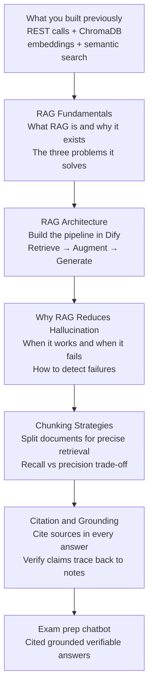

# RAG Fundamentals

---

## Learning Objectives

By the end of this topic, you should be able to:

- Explain clearly what you built in the previous two modules and what is still missing
- Define RAG in plain English using the open-book exam analogy
- Describe the three stages — Retrieve, Augment, Generate — and what each one does
- Explain the three problems RAG solves that a plain LLM cannot
- Understand why Dify is used to build the RAG pipeline in this module

---

## Where You Are Coming From

In the previous two modules you built two things:

**The Automation Toolkit** — a Python pipeline that reads CSV, Excel, and PDF files from a folder, cleans the data, and writes a formatted report. This pipeline worked entirely with local files. Everything stayed on your machine.

**APIs, Embeddings, and Semantic Search** — you learned how to call the Anthropic API to generate answers, how to convert text into embedding vectors using `sentence-transformers`, and how to store and search those vectors in ChromaDB. By the end of the lab, you could:
- Take 50+ documents, embed them, and store them in ChromaDB
- Ask a question, find the most similar documents using semantic search
- Send those documents to Claude and get a generated answer

That pipeline looked like this:

```text
Your lecture notes (50+ documents)
        ↓
sentence-transformers — converts each note to a vector
        ↓
ChromaDB — stores all vectors
        ↓
Student question → converted to a vector → ChromaDB finds closest notes
        ↓
Claude API — receives the question + closest notes → generates an answer
```

**This works. But it has three problems you have not solved yet.**

The answer might contain things that were never in your lecture notes. There is no way for the student to check where the answer came from. And because whole lecture notes are stored as one vector, a question about one concept pulls in an entire document — most of which is not relevant.

This module fixes all three. It is called **RAG — Retrieval-Augmented Generation** — and it is the pattern that makes the pipeline trustworthy rather than just functional.

---

## Why Dify From This Module Onwards

In the previous modules you wrote Python code to call APIs, embed documents, and search ChromaDB. That code showed you exactly what was happening at each step — which was the goal.

From this module onwards, you will build the same pipeline using **Dify** — a free visual tool where you connect blocks instead of writing code. Here is why this switch makes sense now:

**You already understand what is happening under the hood.** You know what an API call does. You know what embedding means. You know what ChromaDB stores. Dify does all of those same things — you can now see the architecture clearly without getting distracted by syntax.

**RAG requires assembling many components together.** The more complex the pipeline becomes — retrieval + chunking + citation + verification — the harder it is to track in code. Dify lets you see all the components and their connections at once on a visual canvas.

**The labs in this module require testing and breaking the pipeline.** Dify makes it easy to change one setting — chunk size, number of results, temperature — and immediately see how the output changes. In code, each change requires re-running the script.

> **Important:** the Python code you wrote in the previous modules is still the foundation. Dify is not replacing it — it is assembling the same components visually. If you open the Dify source code, it runs the same `sentence-transformers`, `chromadb`, and API calls you already know.

---

## What RAG Is — In Plain English

**RAG** stands for **Retrieval-Augmented Generation**.

Think of it like an open-book exam. In a closed-book exam, a student answers entirely from memory. They might misremember a formula, confuse two concepts, or confidently write something incorrect — and they would never know. In an open-book exam, the student finds the relevant page in their textbook, reads it, and bases their answer on what is written there. The examiner can verify the answer against the same page.

A plain LLM is the closed-book student — it answers from training data, which can be wrong, outdated, or simply not specific to your course. RAG is the open-book approach — before generating an answer, the system finds the relevant documents and grounds the answer in them.

The three words in RAG describe exactly what happens:

**Retrieve** — find the documents most relevant to the question. ChromaDB compares the student's question vector against all stored lecture note vectors and returns the closest matches.

**Augment** — add the retrieved documents to the prompt. The model does not just see the question — it sees the question plus the specific sections of the lecture notes most likely to contain the answer.

To make this concrete — here is what the full augmented prompt looks like before it is sent to the model:

```text
SYSTEM INSTRUCTION:
You are an exam preparation assistant. Answer using only the
lecture notes provided. Cite source IDs in square brackets.

RETRIEVED CONTEXT:
[ln_001] Gradient descent minimises the loss function by adjusting
parameters iteratively in the direction of steepest descent.

[ln_003] The learning rate controls the size of each parameter update
step. A high learning rate causes overshooting. A low learning rate
causes slow convergence.

STUDENT QUESTION:
What is the role of the learning rate in gradient descent?
```

The word "augmented" simply means the original prompt — system instruction plus question — has been extended with the retrieved documents. The model receives all three parts together as one input.

**Generate** — the model writes the answer using the retrieved context and cites where each claim came from.

---

## The Three Problems RAG Solves

### Problem 1 — Hallucination

A plain LLM generates text by predicting the most likely next word. When it does not know something, it does not say "I do not know." It generates plausible-sounding text that may be factually wrong. This is **hallucination**.

**What this looks like in the exam prep chatbot without RAG:**

```text
Student: "What is the learning rate in gradient descent?"

Chatbot: "The learning rate is typically set to 0.001 for most neural
networks. It was first introduced by Robbins and Monro in 1951 and
is also known as the step size parameter in stochastic optimisation."
```

Some of this is true in general. None of it is from the student's lecture notes. The student might revise based on this and find different terminology in their actual exam.

**How RAG reduces it:** the retrieved lecture notes are in the context and the system prompt tells the model to use only those notes. The model is constrained to what is right there.

### Problem 2 — No Grounding

Even when a plain LLM gives a correct answer, the student has no way to verify it. A fact that is generally true in the field might be explained differently in their specific course. Without grounding, the student cannot check.

**How RAG fixes it:** because the retrieved documents are included in the prompt and the model is instructed to cite sources, every claim maps to a specific document. The student sees `[ln_001]` next to a statement and knows which lecture note to verify it against.

**What the answer looks like with RAG:**

```text
Student: "What is the learning rate in gradient descent?"

Chatbot: "The learning rate controls the size of each parameter update
step during gradient descent [ln_003]. A high learning rate causes the
algorithm to overshoot the minimum [ln_003]. A low learning rate
causes very slow convergence [ln_003].

Sources: ln_003 — Gradient Descent and Learning Rate (lecture note)"
```

Every claim has a source. The student can open `ln_003` and verify each statement directly.

### Problem 3 — Coarse Retrieval

When a whole lecture note is stored as one vector, that vector represents the average meaning of the entire document. A note on backpropagation covers the chain rule, gradient flow, vanishing gradients, and weight initialisation — all as one vector. If a student asks about vanishing gradients, the whole note is retrieved — most of it irrelevant.

**How RAG addresses it:** chunking breaks documents into smaller, focused pieces before embedding. Each chunk covers one idea. The Chunking Strategies topic covers this in depth.

---

## How the Pipeline Changes With RAG

Here is the pipeline you built in the previous module — and what changes with RAG:

```text
WITHOUT RAG (what you built previously):

Lecture notes → embed whole documents → store in ChromaDB
Student question → find 3 most similar documents → send to Claude
Claude answers from notes + its general training knowledge
No way to check where the answer came from

WITH RAG (what this module builds):

Lecture notes → CHUNK into smaller pieces → embed each chunk
Student question → find 3 most similar CHUNKS → send to Claude
Claude answers ONLY from the retrieved chunks
Every claim has a source ID — student can verify
```

The retrieval and generation steps are the same. What changes is:
- Documents are chunked before embedding — retrieval is more precise
- The system prompt constrains Claude to only use the retrieved content
- Claude cites which chunk each claim came from

---

## RAG vs Fine-Tuning

A common question: why not just train the model on the lecture notes so it already knows them?

**Fine-tuning** means continuing a model's training on a specific dataset. It is expensive (thousands of dollars of compute), takes hours or days, and must be repeated every time the notes change. Most importantly, it does not prevent hallucination — the knowledge is baked into weights but the model can still drift.

| | RAG | Fine-tuning |
|---|---|---|
| **Cost** | Free — update ChromaDB with new documents | Expensive — retrain the model |
| **Update speed** | Seconds — add new chunks to the index | Hours or days |
| **Hallucination** | Reduced — correct text explicitly in context | Still possible |
| **Citation** | Natural — source IDs from retrieved chunks | Very difficult |
| **Best for** | Course notes, policies, documents that change | Teaching a new writing style or domain vocabulary |

For the exam prep chatbot, RAG is the right choice.

---

## When RAG Is Not the Right Choice

- **Knowledge base is very small** — if you have 5 short documents, pass all of them as context every time. Retrieval adds complexity without benefit.
- **Knowledge changes every few minutes** — live data streams are too fast to keep a vector index fresh. RAG works best for knowledge updated periodically.
- **Exact keyword search is needed** — if a student types "question 4b from 2024 paper", semantic search may return thematically related content, not the exact question. A keyword search is more reliable here.
- **Answer requires many documents simultaneously** — if the question needs 20 specific documents in a specific order, top-k retrieval may not surface all of them.

---

## What This Module Builds

By the end of the five topics in this module, the exam prep chatbot will:

1. Chunk lecture notes into focused 400-character pieces before embedding
2. Retrieve the most relevant chunks — not whole documents — for each question
3. Generate answers that cite the specific chunk each claim came from
4. Verify that the cited sources actually support the claims
5. Return a clear message when the notes do not contain the answer

**What a student will see:**

```text
Student: "What is the role of the learning rate in gradient descent?"

Chatbot: "The learning rate controls the size of each parameter
update step during gradient descent [ln_003]. A high learning rate
causes overshooting — the loss bounces around rather than converging
[ln_003]. A low learning rate causes very slow convergence [ma_001].

---
Sources:
- [ln_003] Gradient Descent and Learning Rate (lecture note)
- [ma_001] 2024 Data Science Model Answers (model answer)"
```

---

## How This Module Uses Dify

Each topic in this module has two parts:

**The concept** — explained in plain English with diagrams and examples. This is what you are reading now.

**The implementation** — built in Dify. You will follow step-by-step instructions with screenshots showing exactly what to click. By the end of each topic you will have a working, testable chatbot.

The RAG Architecture topic is the first implementation topic. It walks through building the complete Retrieve → Augment → Generate pipeline in Dify from scratch.

---

## How the Four Topics Connect



---

## Best Practices

- Always test the pipeline with a question that has no relevant match — verify it returns a clear message instead of hallucinating
- Keep the system prompt explicit: "answer using only the provided lecture notes" is more effective than a general instruction
- Verify citations — the model cites sources but may cite the wrong one. The Citation and Grounding topic covers how to check this
- Start with Dify's default chunk size and adjust based on how well retrieval is working

## Common Beginner Mistakes

- **Assuming RAG eliminates hallucination** — it reduces it significantly but the model can still drift beyond the retrieved context. The Why RAG Reduces Hallucination topic covers the specific failure cases
- **Passing all documents as context without retrieval** — this works for tiny knowledge bases but fails once documents exceed the context window
- **Trusting citations without verification** — the model cites sources but citation accuracy is not guaranteed. Always verify

---

## Key Takeaways

- RAG stands for Retrieval-Augmented Generation — it grounds AI answers in specific retrieved documents rather than general training data
- The three stages: **Retrieve** (find relevant chunks), **Augment** (add them to the prompt), **Generate** (write a cited answer)
- RAG solves three problems: hallucination, no grounding, and coarse retrieval
- RAG reduces hallucination but does not eliminate it — the next topics cover where it still fails
- Dify is used from this module onwards because the pipeline is complex enough that a visual tool helps you see the architecture and test it interactively
- The Python code from the previous modules is still the foundation — Dify runs the same components visually

> **Interview tip:** If asked "what is RAG and why would you use it?" — describe the three stages, explain that a plain LLM answers from training data which can be wrong, and explain that RAG grounds answers in specific documents that can be verified. Name the three problems it solves: hallucination reduction, grounding, and retrieval precision. Most candidates describe RAG as "adding documents to the prompt" — naming all three problems shows you understand why the pattern exists.

---

## Reference Links

- 📎 [Anthropic — Retrieval-Augmented Generation Guide](https://docs.anthropic.com/en/docs/build-with-claude/retrieval-augmented-generation)
- 📎 [Dify — Knowledge Base Documentation](https://docs.dify.ai/guides/knowledge-base)
- 📎 [LangChain — RAG Conceptual Guide](https://python.langchain.com/docs/concepts/rag/)
- 📎 [Pinecone — What is RAG?](https://www.pinecone.io/learn/retrieval-augmented-generation/)

---

## Image Guidelines

The following images are needed for this file. All should be taken from Dify Cloud at **cloud.dify.ai** after signing up free.

| Image file | Where to take it | What to show |
|---|---|---|
| `images/rag_01_pipeline_without.png` | Draw in Excalidraw or take from Dify | Simple diagram showing the previous module's pipeline — documents → embed → ChromaDB → question → answer. No citations shown. |
| `images/rag_02_pipeline_with.png` | Draw in Excalidraw or take from Dify | Same pipeline but with chunking step added, citations shown in the answer, and sources section at the bottom |
| `images/rag_03_dify_knowledge.png` | Dify Cloud → Knowledge tab | The Knowledge section showing an uploaded document being processed — chunks visible |
| `images/rag_04_cited_answer.png` | Dify Cloud → Chat preview | A student question with the cited answer showing `[Source 1]` and a Sources section at the bottom |

Save all images in an `images/` folder in the same location as this file. Once saved they will display automatically.
